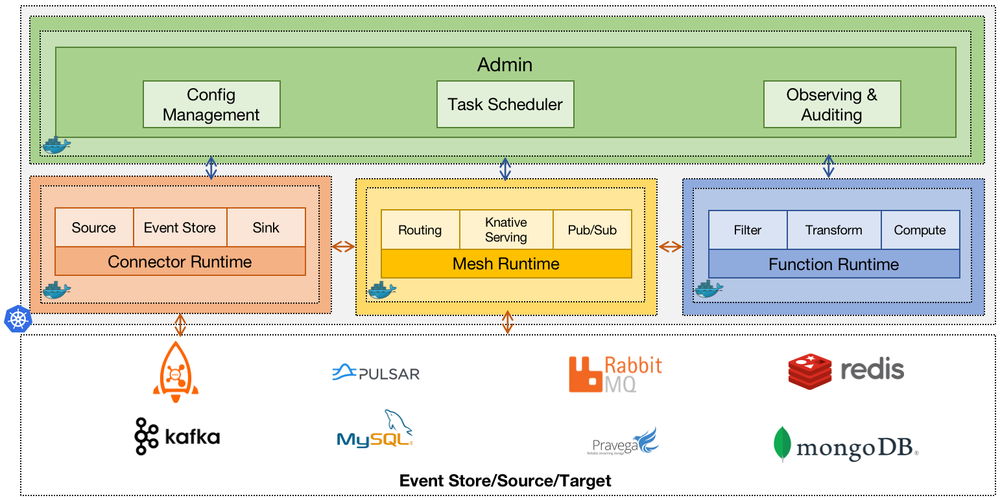
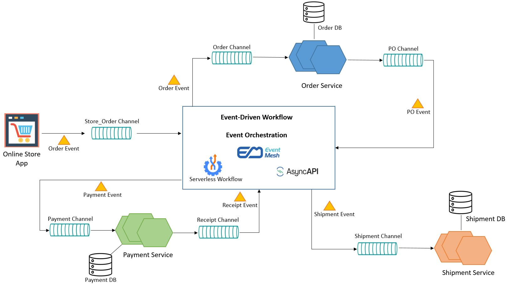

# Apache EventMesh

Apache EventMesh 是一个动态的云原生事件驱动架构基础设施，用于分离应用程序和后端中间件层，它支持广泛的用例，包括复杂的混合云、使用了不同技术栈的分布式架构。

## 特性
- **通信协议**：EventMesh 可以使用 TCP、HTTP 或 gRPC 与客户端通信。
- **CloudEvents**: EventMesh 支持 CloudEvents 规范作为事件的格式。CloudEvents 是一种描述事件数据的公共格式的规范，用于在服务、平台和系统之间提供互操作性。
- **Schema 注册**: EventMesh 实现了 schema 注册，该 schema 注册可以接收并存储来自客户端的模式，并提供其他客户端检索模式的接口。
- **可观察性**: EventMesh 暴露了一系列 metrics，例如 HTTP 协议的平均延迟和传递消息数。这些 metrics 可以使用 Prometheus 或 OpenTelemetry 收集和分析。
- **事件工作流程编排**：EventMesh Workflow 可以接收事件，并根据工作流定义和当前工作流状态决定触发哪个命令。工作流定义可以使用 Serverless Workflow DSL 编写。

## 组件
Apache EventMesh 由多个组件组成，这些组件集成了不同的中间件和消息协议，以增强应用程序运行时的功能。
- **eventmesh-runtime**：中间件，在生产者和消费者之间传输事件，支持云原生应用程序和微服务。
- **eventmesh-sdk-java**：支持 HTTP，TCP 和 gRPC 协议的 Java SDK。
- **eventmesh-connector-plugin**：插件集合，连接中间件，例如 Apache Kafka，Apache RocketMQ，Apache Pulsar 和 Redis。
- **eventmesh-registry-plugin**：插件集合，集成服务注册表，例如 Nacos 和 etcd。
- **eventmesh-security-plugin**：插件集合，实现安全机制，例如 ACL（访问控制列表），身份验证和授权。
- **eventmesh-protocol-plugin**：插件集合，实现消息协议，例如 CloudEvents 和 MQTT。
- **eventmesh-admin**：控制面板，管理客户端，主题和订阅。

## EventMesh Runtime
EventMesh Runtime 是 EventMesh 集群中有状态的 Mesh 节点，负责 Source Connector 与 Sink Connector 之间的事件传输，并可以使用 Event Store 作为事件的存储队列。

## EventMesh 工作流

### 业务场景
图中你正在构建一个简单的电商订单管理系统，系统能够接收和调配新的订单，调配流程需要处理所有的订单创建，付款处理以及发货处理。

为了实现高可用和高性能，你可以使用事件驱动架构（EDA）构建微服务应用去处理商店前端，订单管理，支付处理和发货管理。你可以在云上部署整个系统。要处理高并发，你可以利用消息系统缓冲，并扩展多个微服务实例。架构类似于：

当每个微服务都在自己的事件通道上运行时，EventMesh 在执行事件编排方面发挥着至关重要的作用。

我们使用 CNCF Serverless 工作流 来描述此事件工作流编排。

### CNCF Serverless 工作流
CNCF Serverless 工作流定义了一个厂商中立、开源和完全社区驱动的生态系统，用于定义和运行针对 Serverless 技术领域的基于 DSL 的工作流。

Serverless 工作流定义了一种领域特定语言（DSL）来描述有状态和无状态的基于工作流的 serverless 函数和微服务编排。

详见 [官方 github](https://github.com/serverlessworkflow/specification)

### EventMesh 工作流
我们利用 Serverless 工作流 DSL 来描述 EventMesh 工作流。根据其规范，工作流由一系列用于描述控制流逻辑的工作流状态组成。目前，我们仅支持与事件相关的工作流状态。

工作流状态可以包含通用的操作，或在工作流执行期间应调用的服务/函数。这些操作可以引用可复用的函数定义（应如何调用这些函数/服务），还可以引用触发基于事件的服务调用的事件，以及要等待的事件，这些事件表示这种基于事件的服务调用完成。

在 EDA 解决方案中，我们通常使用 AsyncAPI 定义事件驱动的微服务。Serverless 工作流“函数”定义支持使用 AsyncAPI 定义调用语义。

