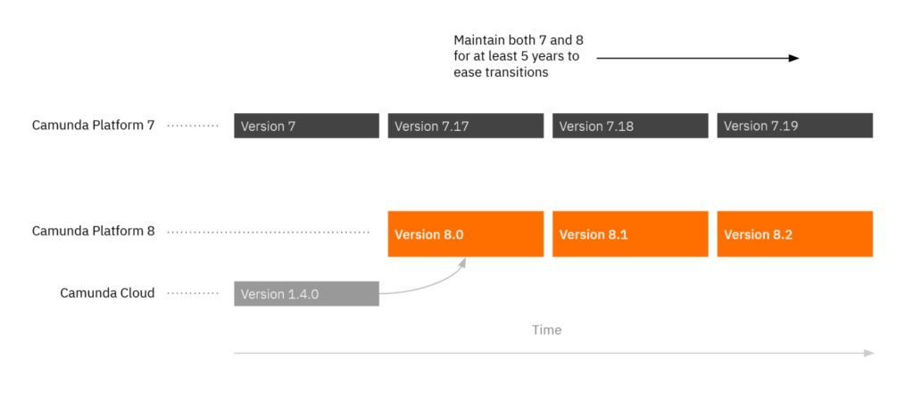
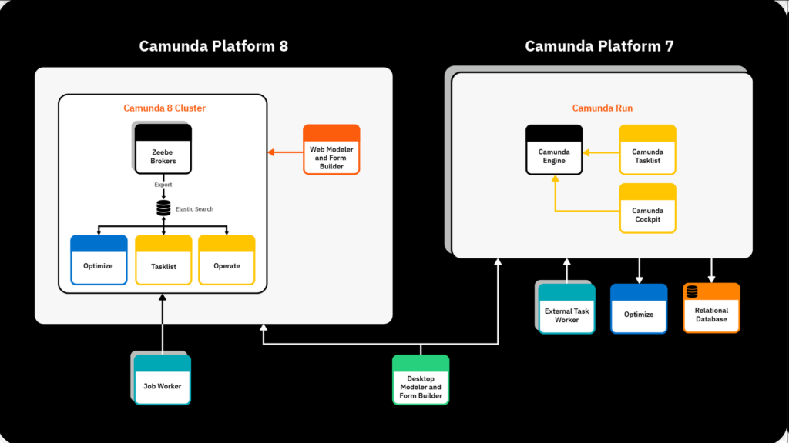
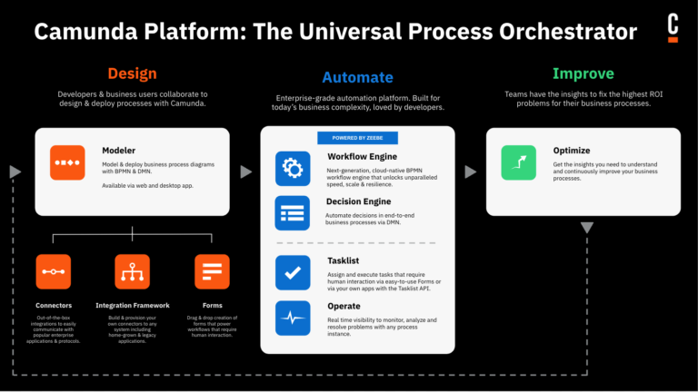
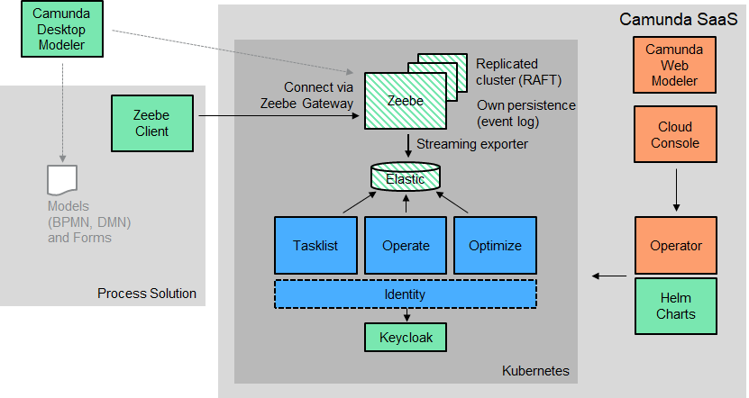

# Camunda 8

Camunda Platform 8于2022年4月12日发布，其核心引擎就是Zeebe，Camunda公司还有传统的开源工作流引擎Camunda Platform 7，是唯一一家同时开源2种工作流引擎的公司。

在国外自从Camunda BPM 7.0.0推出后，很多客户陆续从Activit迁移到Camunda BPM。

**Camunda Platform 7与8的异同**：  

**Camunda Platform 8 产品**：  

**Camunda Platform 8开源**：  

- **绿色**：开源许可证Open source license
- **绿色条纹**：源可用许可证Source-available license
- **蓝色**：免费用于非生产用途,投入生产需要通过企业订阅
- **橙色**：仅在Camunda8 - SaaS中可用

**使用源代码可用软件的生产路径**：  

1. **任务列表**:  
您将需要基于使用订阅 Zeebe 的工作人员来实现自己的任务管理解决方案，这也意味着您必须构建自己的持久性以允许任务查询，因为任务列表 API 是任务列表组件的一部分，不能免费用于生产。
2. **流程操作**:
您可以在 Elastic 中访问数据（有关详细信息，请查看 Elastic 导出器），利用指标，或构建自己的导出器以将其推送到一些方便的数据存储组件。导出器还可以即时筛选或预处理数据。值得注意的是，支持历史记录 API 的操作数据预处理逻辑是操作的一部分，不能免费用于生产。为了影响流程实例（如取消它们），您可以使用现有的 Zeebe API，该 API 也作为命令行工具 zbctl 公开。这种灵活性允许您将功能挂接到自己的前端。
3. **流程优化**:
它非常深入到基于流程的分析中，这很难自己构建。如果无法使用优化，则最接近优化的方法可能是添加自己的导出器，将数据推送到现有的通用 BI（商业智能）、DWH（数据仓库）或数据湖解决方案。

