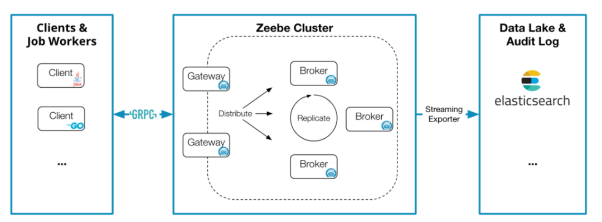

# Zeebe

Zeebe是一个用于微服务编排的开源工作流引擎。它基于BPMN2.0可定义图形化工作流 ，可使用Docker和Kubernetes进行部署，可构建来自Apache Kafka和其他消息传递平台的事件的工作流，可水平扩展处理非常高的吞吐量，可以导出用于监视和分析的工作流数据，具有很好容错能力，可无缝伸缩以处理不断增长的事务量。

## Zeebe 核心特性

Zeebe 是专为微服务编排设计的免费开源的工作流引擎，它提供了：
- **可见性(visibility)**：Zeebe 提供能力展示出企业工作流运行状态，包括当前运行中的工作流数量、平均耗时、工作流当前的故障和错误等；
- **可工作流编排(workflow orchestration)**：基于工作流的当前状态，Zeebe 以事件的形式发布指令(command)，这些指令可以被一个或多个微服务消费，确保工作流任务可以按预先的定义流转；
- **可监控超时(monitoring for timeouts)或其他流程错误**：同时提供能力配置错误处理方式，比如有状态的重试或者升级给运维团队手动处理，确保工作流总是能按计划完成。

Zeebe 设计之初，就考虑了超大规模的微服务编排问题。为了应对超大规模，Zeebe 支持：
- **横向扩容(horizontal scalability)**：Zeebe 支持横向扩容并且不依赖外部的数据库，相反的，Zeebe 直接把数据写到所部署节点的文件系统里，然后在集群内分布式的计算处理，实现高吞吐；
- **容错(fault tolerance)**：通过简单配置化的副本机制，确保 Zeebe 能从软硬件故障中快速恢复，并且不会有数据丢失；
- **消息驱动架构(message-driven architecture)**：所有工作流相关事件被写到只追加写的日志(append-only log)里；
- **发布-订阅交互模式(publish-subscribe interaction model)**：可以保证连接到 Zeebe 的微服务根据实际的处理能力，自主的消费事件执行任务，同时提供平滑流量和背压的机制；
- **BPMN2.0 标准(Visual workflows modeled in ISO-standard BPMN 2.0)**：保证开发和业务能够使用相同的语言协作设计工作流；
- **语言无关的客户端模型(language-agnostic client model)**：可以使用任何编程语言构建 Zeebe 客户端。

## Zeebe 架构

Zeebe 架构主要包含 4 大组件：
### Client
客户端向 Zeebe 发送指令：
- 发布工作流(deploy workflows)
- 执行业务逻辑(carry out business logic)
- 创建工作流实例(start workflow instances)
- 发布消息(publish messages)
- 激活任务(activate jobs)
- 完成任务(complete jobs)
- 失败任务(fail jobs)
- 处理运维问题(handle operational issues)
- 更新实例流程变量(update workflow instance variables)
- 解决异常(resolve incidents)

客户端程序可以完全独立于 Zeebe 扩缩容，Zeebe brokers 不执行任何业务逻辑。客户端是嵌入到应用程序(执行业务逻辑的微服务)的库，用于跟 Zeebe 集群连接通信。客户端通过基于 HTTP/2 协议的 gRPC 与 Zeebe gateway 连接。

Zeebe 官方提供了 Java 和 Go 客户端。社区提供了 C#，Ruby，JavaScript 客户端实现。gRPC 协议很方便生成其他语言的客户端。

Client 中，执行单独任务的单元叫 JobWorker。

### Gateway
Gateway 作为 Zeebe 集群的入口，转发请求到 brokers。Gateway 是无状态(stateless)无会话(sessionless)的，可以按需增加节点，以负载均衡及高可用。

### Broker
Broker 是分布式的流程引擎，维护运行中流程实例的状态。Brokers 可以分区以实现横向扩容、副本以实现容错。通常情况下，Zeebe 集群都不止一个节点。

需要重点强调的是，broker 不包含任何业务逻辑，它只负责：
- 处理客户端发送的指令
- 存储和管理运行中流程实例的状态
- 分配任务给 job workers

Brokes 形成一个对等网络(peer-to-peer)，这样集群不会有单点故障。集群中所有节点都承担相同的职责，所以一个节点不可用后，节点的任务会被透明的重新分配到网络中其他节点。

### Exporter
Exporter 系统提供 Zeebe 内状态变化的事件流。这些事件流数据有很多潜在用处，包括但不限于：
- 监控当前运行流程实例的状态
- 分析历史的工作流数据以做审计或 BI
- 跟踪 Zeebe 抛出的异常(incident)

Exporter 提供了简洁的 API，可以流式导出数据到任何存储系统。Zeebe 官方提供开箱即用的 Elasticsearch exporter，社区也提供了其他 Exporters。