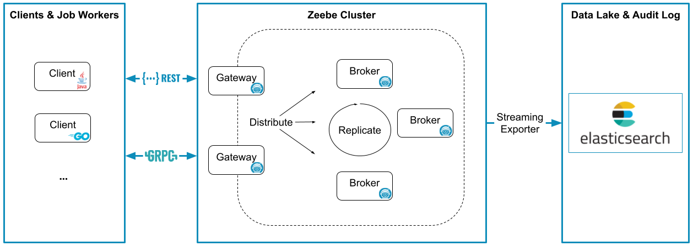

# Zeebe

Zeebe是一个用于微服务编排的开源工作流引擎。它基于BPMN2.0可定义图形化工作流 ，可使用Docker和Kubernetes进行部署，可构建来自Apache Kafka和其他消息传递平台的事件的工作流，可水平扩展处理非常高的吞吐量，可以导出用于监视和分析的工作流数据，具有很好容错能力，可无缝伸缩以处理不断增长的事务量。

## Zeebe 核心特性

Zeebe 是专为微服务编排设计的免费开源的工作流引擎，它提供了：
- **可见性(visibility)**：Zeebe 提供能力展示出企业工作流运行状态，包括当前运行中的工作流数量、平均耗时、工作流当前的故障和错误等；
- **可工作流编排(workflow orchestration)**：基于工作流的当前状态，Zeebe 以事件的形式发布指令(command)，这些指令可以被一个或多个微服务消费，确保工作流任务可以按预先的定义流转；
- **可监控超时(monitoring for timeouts)或其他流程错误**：同时提供能力配置错误处理方式，比如有状态的重试或者升级给运维团队手动处理，确保工作流总是能按计划完成。

Zeebe 设计之初，就考虑了超大规模的微服务编排问题。为了应对超大规模，Zeebe 支持：
- **横向扩容(horizontal scalability)**：Zeebe 支持横向扩容并且不依赖外部的数据库，相反的，Zeebe 直接把数据写到所部署节点的文件系统里，然后在集群内分布式的计算处理，实现高吞吐；
- **容错(fault tolerance)**：通过简单配置化的副本机制，确保 Zeebe 能从软硬件故障中快速恢复，并且不会有数据丢失；
- **消息驱动架构(message-driven architecture)**：所有工作流相关事件被写到只追加写的日志(append-only log)里；
- **发布-订阅交互模式(publish-subscribe interaction model)**：可以保证连接到 Zeebe 的微服务根据实际的处理能力，自主的消费事件执行任务，同时提供平滑流量和背压的机制；
- **BPMN2.0 标准(Visual workflows modeled in ISO-standard BPMN 2.0)**：保证开发和业务能够使用相同的语言协作设计工作流；
- **语言无关的客户端模型(language-agnostic client model)**：可以使用任何编程语言构建 Zeebe 客户端。

## Zeebe 架构

Zeebe 架构主要包含 4 大组件：
### Client
客户端向 Zeebe 发送指令：
- 发布流程(deploy workflows)
- 执行业务逻辑(carry out business logic)
  - 启动工作流实例(start workflow instances)
  - 发布消息(publish messages)
  - 激活作业(activate jobs)
  - 完成作业(complete jobs)
  - 失败作业(fail jobs)
- 处理运维问题(handle operational issues)
  - 更新实例流程变量(update workflow instance variables)
  - 解决异常(resolve incidents)

客户端程序可以完全独立于 Zeebe 扩缩容，Zeebe brokers 不执行任何业务逻辑。

客户端是嵌入到应用程序(执行业务逻辑的微服务)的库，用于跟 Zeebe 集群连接通信。

客户端通过 REST 和gRPC的混合连接到 Zeebe 网关。虽然 REST 可以通过任何 HTTP 版本提供，但 API 的 gRPC 部分需要基于 HTTP/2 的传输。要了解有关如何在 Zeebe 中使用 REST 的更多信息，请查看[Zeebe API (REST)](https://docs.camunda.io/docs/apis-tools/zeebe-api-rest/zeebe-api-rest-overview/)。要了解有关 Zeebe 中 gRPC 的更多信息，请查看[Zeebe API (gRPC)](https://docs.camunda.io/docs/apis-tools/zeebe-api/overview/)。

Zeebe 项目包括官方支持的 Java 和 Go 客户端。社区客户端已使用其他语言创建，包括 C#、Ruby 和 JavaScript。借助 gRPC 的代码生成器和 OpenAPI 规范，可以使用多种不同的编程语言生成客户端。

#### Job workers
作业工作者是一个 Zeebe 客户端，它使用客户端 API 首先激活作业，并在完成后完成或失败该作业。

### Gateway
网关作为 Zeebe 集群的单一入口点，并将请求转发给代理。

网关是无状态和无会话的，并且可以根据需要添加网关以实现负载平衡和高可用性。

### Broker
Zeebe 代理是跟踪活动流程实例状态的分布式工作流引擎。

Brokers 可以进行分区以实现水平扩展，并进行复制以实现容错。Zeebe 部署通常由多个代理组成。

需要注意的是，代理中不存在任何应用程序业务逻辑。它的唯一职责是：
- 处理客户端发送的命令
- 存储和管理活动流程实例的状态
- 分配工作给 Job workers

Brokes 构成一个对等网络(peer-to-peer)，这样集群不会有单点故障。集群中所有节点都承担相同的职责，所以一个节点不可用后，节点的任务会被透明的重新分配到网络中其他节点。

### Exporter
Exporter 系统提供 Zeebe 内状态变化的事件流。这些事件流数据有很多潜在用处，包括但不限于：
- 监控正在运行的流程实例的当前状态
- 分析历史过程数据以供审计、BI 等使用。
- 跟踪 Zeebe 抛出的异常(incident)

Exporter 提供了简洁的 API，可以流式导出数据到任何存储系统。Zeebe 官方提供开箱即用的 Elasticsearch exporter，社区也提供了其他 Exporters。