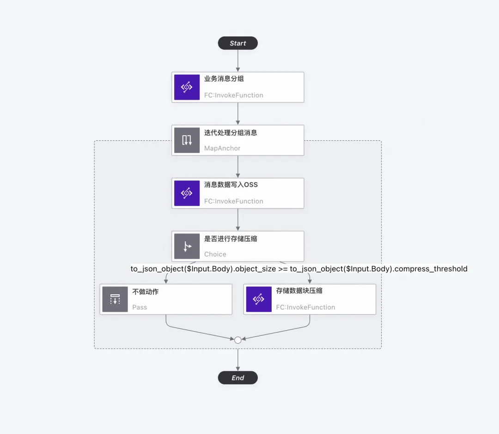

# 阿里 云工作流 CloudFlow

云工作流（CloudFlow）是一个用来协调多个分布式任务执行的全托管云服务。

在云工作流中，您可以用顺序、分支、并行等方式来编排分布式任务，云工作流会按照设定好的步骤可靠地协调任务执行，跟踪每个任务的状态转换，并在必要时执行您定义的重试逻辑，以确保工作流顺利完成。云工作流通过提供日志记录和审计来监视工作流的执行，方便您轻松地诊断和调试应用。云工作流简化了开发和运行业务流程所需要的任务协调、状态管理以及错误处理等繁琐工作，让您聚焦业务逻辑开发。

下图描述了云工作流如何协调分布式任务，这些任务可以是函数、已集成云服务API、运行在虚拟机或容器上的程序。

## 产品优势
- **协调分布式组件**  
云工作流能够编排不同基础架构、不同网络、不同语言编写的应用，抹平混合云、专有云过渡到公共云或者从单体架构演进到微服务架构的落差。
- **减少流程代码量**  
云工作流提供了丰富的控制逻辑，例如顺序、选择、并行等，让您以更少的代码实现复杂的业务逻辑。
- **提高应用容错性**  
云工作流为您管理流程状态，内置检查点和回放能力，以确保您的应用程序按照预期逐步执行。错误重试和捕获可以让您灵活地处理错误。
- **Serverless**  
云工作流根据实际执行步骤转换个数收费，执行结束不再收费。云工作流自动扩展让您免于管理硬件预算和扩展。

## 功能特性
- **服务编排能力**  
云工作流可以帮助您将流程逻辑与任务执行分开，节省编写编排代码的时间。例如图片经过人脸识别函数后，根据人脸位置剪裁图像，最后发送消息通知您，云工作流提供了一个Serverless的解决方案，降低了您的编排运维成本。
- **协调分布式组件**  
云工作流能够协调在不同基础架构上、不同网络内，以不同语言编写的应用。应用不管是从私有云/专有云平滑过渡到混合云或公共云，或者从单体架构演进到微服务架构，云工作流都能发挥协调作用。
- **内置错误处理**  
通过内置错误重试和捕获能力，您可以自动重试失败或超时的任务，对不同类型错误做出不同响应，并定义回退逻辑。
- **可视化监控**  
云工作流提供可视化界面来定义工作流和查看执行状态。状态包括输入和输出等。方便您快速识别故障位置，并快速排除故障问题。
- **支持长时间运行流程**  
云工作流可以跟踪整个流程，持续长时间执行确保流程执行完成。有些流程可能要执行几个小时、几天、甚至几个月。例如运维相关的Pipeline和邮件推广流程。
- **流程状态管理**  
云工作流会管理流程执行中的所有状态，包括跟踪它所处的执行步骤，以及存储在步骤之间的数据传递。您无需自己管理流程状态，也不必将复杂的状态管理构建到任务中。

## 工作流简介
工作流流程（Flow）定义了业务逻辑描述以及流程执行所需要的通用信息，例如一个订单管理流程可能包含创建订单、处理支付、预留库存、配送商品和通知等。在创建流程（Flow）后，您可以多次执行流程，通常每次执行（Execution）有不同的输入。例如您每次下单会执行一次订单管理流程，执行的输入是订单信息。

云工作流提供了丰富的控制原语让您描述业务逻辑，例如您可以串行执行任务、并行执行任务、有选择的执行某些任务以及针对一组数据并行执行一系列任务。

### 如何使用工作流
- **工作流定义**  
使用工作流，首先需要创建一个工作流定义。工作流定义可以使用阿里云控制台、SDK和阿里云CLI工具等方式进行创建和管理。关于工作流定义的更多信息，请参见流程定义介绍。

- **工作流调用**  
创建工作流定义后，您可以使用阿里云控制台、SDK和阿里云CLI工具等方式触发一次具体的流程执行。当工作流启动时，工作流会自动按照定义的顺序和规则执行任务，并以JSON格式输出任务的执行结果。

### 标准工作流和快速工作流

云工作流支持创建标准和快速两种模式的工作流。

#### 基本概念
- **标准模式**：适用于传统意义上的离线业务流程编排执行场景，具备执行步骤状态的持久化存储，支持运行长时间的工作流执行状态流转。
- **快速模式**：适用于常见的在线业务流程编排和准实时业务流程编排场景，例如微服务API编排、胶水层API编排、流式数据处理等低延迟和大负载业务场景。

#### 工作流模式对比

| 执行指标项     | 标准模式                                                                                      | 快速模式                        |
|-----------|-------------------------------------------------------------------------------------------|-----------------------------|
| 最长执行时长    | 1 年                                                                                       | 5 分钟                        |
| 流程启动速率    | 100 QPS                                                                                   | 默认为1000 QPS。                |
| 并行执行数     | 10000                                                                                     | 默认为10000。                   |
| 执行历史及可观测性 | 支持查询、列举等API操作，系统记录所有执行信息。                                                                 | 计划支持SLS查询，当前公测期仅支持API查询。    |
| 执行语义      | 异步执行，遵循至少执行一次（At least once）语义，数据不会丢失，但是在特殊条件下可能会导致数据被重复处理。                               | 同步执行，系统错误会默认重试，可根据需求在客户端重试。 |
| 服务集成      | 支持所有集成方式。                                                                                 | 支持所有集成方式。具体信息，请参见集成简介。      |
| 集成模式      | 支持如下三种集成模式。 - RequestComplete - WaitForCustomCallback - WaitForSystemCallback | 仅支持RequestComplete模式。       |

### 流程定义语言FDL（Flow Definition Language）
一种基于 JSON 的结构化语言，用于定义状态机（一个状态集合），可以执行工作（Task状态），确定哪些状态转换为下一个状态，在出错的情况下停止执行（Fail状态）等等。

### 云工作流集成模式
使用云工作流集成其他云服务，您可以使用以下三种集成模式：

- **请求响应（RequestComplete）**  
当您在任务类型的状态中指定调用服务，默认集成模式为请求响应模式。
- **等待系统回调（WaitForSystemCallback）**  
通过指定等待系统回调（WaitForSystemCallback）任务模式，可以等待任务执行完成后再进入下一个状态。
- **等待用户自定义回调（WaitForCustomCallback）**  
又称为携带任务令牌的回调，提供一种暂停工作流，并根据集成服务内部自定义逻辑控制工作流执行的方式。

## 应用案例

### 多媒体处理案例

**场景描述**：使用云工作流可以帮助您将多个任务，如转码，截帧，人脸识别，语音识别，审核上传等，编排成一个完整的处理流程，通过函数计算提交媒体处理（IMM）任务（或自建处理器），产出一个符合业务需求的输出。各任务的执行错误异常可以被可靠的重试，大大提升多媒体任务处理吞吐量。

### 数据分组处理

**场景描述**：云工作流可以对数据进行分组自定义处理，比如，在消息分组函数中可以按照消息中某个字段根据业务语义进行分类；分组消息存储，并行迭代处理多个业务分组消息， 将属于同一个业务分组的消息写入到一个 OSS 对象中；分组消息压缩，对于每一个迭代，当该业务分组的消息通过追加完成写入之后，进入到数据对象的压缩环境，会根据用户设定的阈值决定是否进行压缩。

### 事务型业务流程编排
复杂的业务场景如电商网站、酒店和机票预定等应用通常要访问多个远程服务，并且对操作事务性语义（即所有步骤全部成功或全部失败，不存在中间状态）有较高要求。在流量较小、数据存储集中的应用中，事务性可以通过关系型数据库提供的ACID特性满足。然而在大流量场景下，为了高可用和可扩展性，业务通常选择向微服务的分布式架构方向演进。在这样的架构中提供多步骤事务性的保证通常需要引入队列和数据库来持久化消息以及展现流程状态，这类系统的开发和运维会给业务方带来额外的成本和负担。使用云工作流可以提供长流程分布式事务保证，帮助您聚焦于自身业务逻辑。

### 基因数据处理
云工作流可以将多个批量计算分布式作业串联或并行编排，可靠地支持执行时间长、并发量大的大规模计算。如基因数据分析中将基因序列对齐，将所有染色体并行做变异分析，最终将各染色体数据聚合产出结果。云工作流根据指定的依赖关系提交不同CPU、内存、带宽规格的批量计算作业，提升执行可靠性，提高资源利用率，优化成本。

### 自动化运维
自动化运维面临着步骤繁琐、时间长短不一、单机脚本可靠性低、依赖复杂等常见的挑战，另外进度无法可视化。云工作流+函数计算的流程可以很好地应对这些挑战。例如自动化部署软件，从构建Docker容器、上传容器镜像，开始并追踪各节点下拉镜像并启动新版本镜像的容器，每一步函数产生的日志会被保存到日志服务可供查询分享。基于云工作流的自动化工具比单机运维脚本具有高可用、自带的错误处理机制和进度图形化的特点。