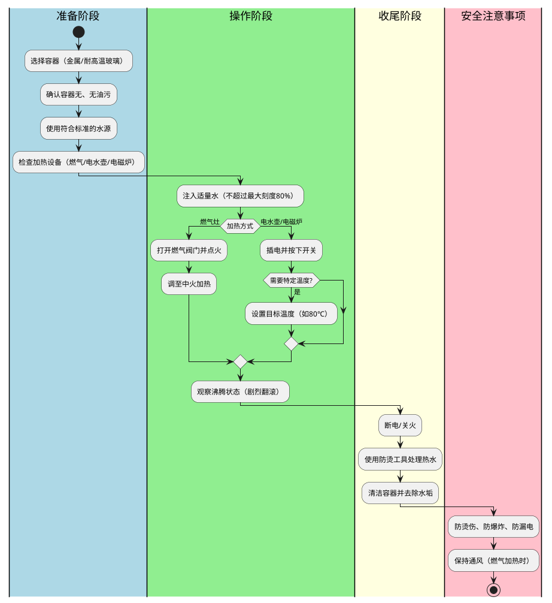

#  工作流

> 工作流（Workflow）是组织或系统中为完成特定任务或目标而设计的一系列有序、可重复的活动或步骤的集合，其核心在于通过标准化流程优化资源分配、提升效率并确保结果一致性

## 定义

为什么说是业务的结构化与标准化，让我们来看一个业务场景"把大象放进冰箱"试着进行标准化和结构化

  
🔍 问题一分几步？

1. 打开冰箱门 
2. 把大象放进去 
3. 关上冰箱门

  
🔍 问题二谁做？

1. 张三——>打开冰箱门
2. 李四——>把大象放进去
3. 王二麻子——>关上冰箱门

工作流的定义:
1. **业务视角**  
   工作流是组织运营的“操作手册”，明确任务分工、执行顺序和交付标准。  
   **业务的结构化与标准化**

2. **技术视角**  
   工作流是计算机支持的流程自动化技术，通过定义任务、规则、角色和条件，将业务逻辑转化为可执行的流程模型。  
   **流程引擎**:驱动业务流程自动化的核心技术组件，它通过解析和执行流程定义（如BPMN标准），协调多系统交互，实现跨部门、跨系统的业务流转自动化。

实际业务会更为复杂以下是烧水流程的标准化步骤，包含准备、操作、收尾和安全注意事项的完整逻辑

   
