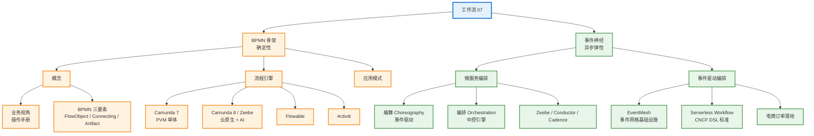

# 07 工作流

> 最后更新: 2026-06-14
> ⬅️ [返回 note 顶层](../README.md)

工作流（Workflow）是组织或系统中为完成特定业务目标而设计的有序、可重复活动的集合。本章讲透 **BPMN 流程引擎**（Camunda 7/8/Zeebe / Flowable / Activiti）和 **事件驱动编排**（Apache EventMesh / Serverless Workflow）两条主线，并明确二者的**互补关系**：

> **BPMN = 流程骨架（确定性、可审计）**
> **事件驱动 = 协作神经（异步、弹性、解耦）**

---

## 🎯 一句话定位

**工作流 = 把业务流程抽象为可执行的协作模型**——用 **BPMN 流程引擎**管"做什么 + 何时做 + 谁做"的确定性骨架，用 **事件驱动**管"跨系统如何异步协作"的弹性神经。

---

## 📚 章节导航（2 主线 + 8 文件）

| 主线 | 文件 | 核心内容 |
|:----|:----|:---------|
| **0 概念** | [define/README.md](define/README.md) | 业务/技术视角、BPMN 2.0 三要素、请假审批实例 |
| **1 流程引擎** | [process-engine/README.md](process-engine/README.md) | 4 阶段工作原理、5 里程碑、3 大引擎对比、5 维度选型决策树 |
| ├ Camunda 7 | [process-engine/camunda/camunda-7/README.md](process-engine/camunda/camunda-7/README.md) | SpringBoot 集成、bpmn-js 集成、5 大任务节点类型 |
| ├ Camunda 8 | [process-engine/camunda/camunda-8/README.md](process-engine/camunda/camunda-8/README.md) | 云原生 + 10K+ 实例/秒、8.5+ AI Agent Sub-process |
| └ Zeebe 内核 | [process-engine/camunda/camunda-8/zeebe/README.md](process-engine/camunda/camunda-8/zeebe/README.md) | Client / Gateway / Broker / Exporter 4 大组件 |
| **2 协作神经** | [workflow-and-microservice-orchestration/README.md](workflow-and-microservice-orchestration/README.md) | 编舞 vs 编排、Zeebe/Conductor/Cadence 三大编排引擎 |
| **3 事件驱动** | [apache-eventmesh/README.md](apache-eventmesh/README.md) | Serverless Workflow 标准、EventMesh 组件、电商订单落地 |
| **4 应用模式** | [examples/](examples/)（可选）| 真实项目案例（待补充）|

---

## 🧭 知识地图

```mermaid
graph TB
    W[工作流 07]

    W --> S[BPMN 骨架<br/>确定性]
    W --> N[事件神经<br/>异步弹性]

    S --> C[概念]
    S --> E[流程引擎]
    S --> A[应用模式]

    C --> C1[业务视角<br/>操作手册]
    C --> C2[BPMN 三要素<br/>FlowObject / Connecting / Artifact]

    E --> E1[Camunda 7<br/>PVM 单体]
    E --> E2[Camunda 8 / Zeebe<br/>云原生 + AI]
    E --> E3[Flowable]
    E --> E4[Activiti]

    N --> O[微服务编排]
    N --> I[事件驱动编排]

    O --> O1[编舞 Choreography<br/>事件驱动]
    O --> O2[编排 Orchestration<br/>中控引擎]
    O --> O3[Zeebe / Conductor / Cadence]

    I --> I1[EventMesh<br/>事件网格基础设施]
    I --> I2[Serverless Workflow<br/>CNCF DSL 标准]
    I --> I3[电商订单落地]

    classDef root fill:#e3f2fd,stroke:#1976d2,stroke-width:3px
    classDef skeleton fill:#fff3e0,stroke:#f57c00,stroke-width:2px
    classDef nerve fill:#e8f5e9,stroke:#388e3c,stroke-width:2px
    class W root
    class S,C,E,A,C1,C2,E1,E2,E3,E4 skeleton
    class N,O,I,O1,O2,O3,I1,I2,I3 nerve
```

---

## ⚡ 核心概念速查

| 概念 | 一句话定义 | 章节 |
|------|----------|:----:|
| **工作流** | 为完成业务目标而抽象的一系列步骤及步骤间的协作关系 | [0 概念](define/README.md) |
| **BPMN 2.0** | OMG 制定的业务流程建模与执行国际标准（XML + 图形化） | [0 概念](define/README.md) |
| **流程引擎** | 解析和执行流程定义、协调多系统交互的核心组件 | [1 流程引擎](process-engine/README.md) |
| **PVM** | jBPM 3+ 引入的流程虚拟机，Camunda 7 仍基于此架构 | [1 流程引擎](process-engine/README.md) |
| **Camunda 7** | 经典 Java 嵌入式引擎，适合传统企业 + Spring 生态 | [Camunda 7](process-engine/camunda/camunda-7/README.md) |
| **Camunda 8 / Zeebe** | 云原生分布式引擎，10K+ 实例/秒，依赖 ES + Raft | [Camunda 8](process-engine/camunda/camunda-8/README.md) |
| **微服务编排** | 中控引擎协调多服务调用，处理重试/超时/状态 | [2 协作神经](workflow-and-microservice-orchestration/README.md) |
| **微服务编舞** | 服务间通过事件消息协作（去中心化） | [2 协作神经](workflow-and-microservice-orchestration/README.md) |
| **事件驱动** | 跨系统通过事件消息异步协作（云原生时代的主流） | [3 事件驱动](apache-eventmesh/README.md) |
| **EventMesh** | 事件网格基础设施，连接 Producer/Consumer 与中间件 | [3 事件驱动](apache-eventmesh/README.md) |
| **Serverless Workflow** | CNCF 厂商中立的 DSL 规范，事件驱动 + 工作流融合 | [3 事件驱动](apache-eventmesh/README.md) |
| **CloudEvents** | CNCF 事件格式标准，跨云跨引擎可移植 | [3 事件驱动](apache-eventmesh/README.md) |

---

## 🤔 思考

1. **工作流 ≠ OA 审批流**：广义的「工作流」覆盖所有业务协作（订单/构建/部署），不仅是人事审批。
2. **BPMN vs 自研 DSL？** BPMN 是国际标准、跨团队跨组织可移植；Serverless Workflow 试图在 YAML/DAG 与 BPMN 之间取平衡，适合云原生场景。
3. **Camunda 7 vs 8 怎么选？** 7 稳定 + 生态成熟（Spring/Java 单体）；8 云原生 + 高吞吐（10K+ 实例/秒）+ AI 原生。
4. **编舞 vs 编排怎么选？** 编舞灵活但难调试、难监控；编排可控但单点依赖重。中小流量用编舞，大流量/强一致用编排。
5. **为什么 Zeebe 要造一个新轮子？** 传统引擎 jar 嵌入 + DB 中心化架构无法适应分布式微服务；Zeebe 用 Raft + ES + 分区扩展。
6. **BPMN 和事件驱动是替代还是互补？** **互补**——BPMN 管"流程骨架"（确定性、可审计），事件驱动管"协作神经"（异步、弹性、解耦）。生产中常组合使用：BPMN 关键决策点 + 事件驱动跨服务协作。
7. **EventMesh vs 消息队列？** MQ 是「管道」；EventMesh 是「管道 + Schema 注册 + 工作流编排 + 多协议接入」的中间层。多数项目用 Kafka 足够；需要跨协议 + Schema 管理时才上 EventMesh。

---

## 相关章节

- ⬅️ [返回 note 顶层](../README.md)
- [03 数据层/分布式事务](../06.spring/03-data/transaction/distributed/) — Saga/TCC 同样是「分布式协作」模式
- [04 系统设计/02 分布式](../04.system-design/02-distributed/) — CAP/共识算法理论基础
- [04 系统设计/06 幂等](../04.system-design/06-idempotency/README.md) — 事件驱动必配的幂等设计
- [06 Spring/05 Spring Cloud](../06.spring/05-spring-cloud/) — 微服务治理与流程引擎互补

---

> 🚀 从 [工作流定义](define/README.md) 开始理解概念 → [流程引擎](process-engine/README.md) 掌握 BPMN → [事件驱动](apache-eventmesh/README.md) 了解云原生时代扩展。
