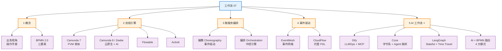

# 07 工作流

> 最后更新: 2026-06-14
> ⬅️ [返回 note 顶层](../README.md)

工作流（Workflow）是组织或系统中为完成特定任务而设计的有序、可重复活动的集合。本章从**概念定义**出发，覆盖 **BPMN 流程引擎**（Camunda/Flowable/Activiti）、**工作流与微服务编排**的协同模式、**Apache EventMesh / 阿里云工作流**等事件驱动编排基础设施，以及 2025-2026 年兴起的 **AI 工作流**（Dify/Coze/LangGraph + AI + BPMN 融合）。

---

## 🎯 一句话定位

**工作流 = 把业务流程抽象为可执行的协作模型**——从 BPMN 流程图标准化，到 Camunda/Zeebe/EventMesh 工程化，再到 Dify/Coze/LangGraph 的 AI 编排，覆盖「确定性合规」+「灵活推理」全谱系。

---

## 📚 章节导航（5 主线）

| 主线 | 文件 | 核心内容 |
|:----|:----|:---------|
| **0 行业与历史** | ~~[industry-and-trends.md](industry-and-trends.md)~~ ⚠️ 已废弃 | 内容并入「流程引擎」选型决策树 |
| **1 概念** | [define/README.md](define/README.md) | 业务/技术视角、BPMN 2.0 三要素、请假审批实例 |
| **2 流程引擎** | [process-engine/README.md](process-engine/README.md) | BPMN 工作原理、5 里程碑、3 大引擎对比、选型决策树 |
| ├ Camunda 7 | [process-engine/camunda/camunda-7/README.md](process-engine/camunda/camunda-7/README.md) | SpringBoot 集成、bpmn-js 集成、5 大任务节点 |
| ├ Camunda 8 | [process-engine/camunda/camunda-8/README.md](process-engine/camunda/camunda-8/README.md) | 云原生 + 8.5+ AI Agent Sub-process、fromAi() FEEL |
| └ Zeebe 内核 | [process-engine/camunda/camunda-8/zeebe/README.md](process-engine/camunda/camunda-8/zeebe/README.md) | Client / Gateway / Broker / Exporter 4 大组件 |
| **3 微服务编排** | [workflow-and-microservice-orchestration/README.md](workflow-and-microservice-orchestration/README.md) | 编舞 vs 编排、Zeebe/Conductor/Cadence 对比 |
| **4 事件驱动编排** | [apache-eventmesh/README.md](apache-eventmesh/README.md) | 云原生事件驱动基础设施、Serverless Workflow |
| └ 阿里 CloudFlow | [apache-eventmesh/cloud-flow/README.md](apache-eventmesh/cloud-flow/README.md) | 全托管任务协调服务、FDL、5 大应用案例 |
| **5 AI 工作流** ⭐ | [ai-workflow/README.md](ai-workflow/README.md) | 6 大平台对比、决策树、5 问思考 |
| ├ Dify | [ai-workflow/dify.md](ai-workflow/dify.md) | LLMOps + DSL YAML + MCP 双向集成 |
| ├ Coze（扣子） | [ai-workflow/coze.md](ai-workflow/coze.md) | 字节系 + Agent 联邦 + Claude Code 接入 |
| ├ LangGraph | [ai-workflow/langgraph.md](ai-workflow/langgraph.md) | StateGraph + Checkpoint + Time Travel + HITL |
| └ AI + BPMN 融合 | [ai-workflow/bpmn-ai-integration.md](ai-workflow/bpmn-ai-integration.md) | 4 大融合模式 + 3 真实案例 + 5 步落地 |

---

## 🧭 知识地图

```mermaid
graph TB
    W[工作流 07]

    W --> C[1 概念]
    W --> E[2 流程引擎]
    W --> O[3 微服务编排]
    W --> I[4 事件驱动]
    W --> A[5 AI 工作流 ⭐]

    C --> C1[业务视角<br/>操作手册]
    C --> C2[BPMN 2.0<br/>三要素]

    E --> E1[Camunda 7<br/>PVM 单体]
    E --> E2[Camunda 8 / Zeebe<br/>云原生 + AI]
    E --> E3[Flowable]
    E --> E4[Activiti]

    O --> O1[编舞 Choreography<br/>事件驱动]
    O --> O2[编排 Orchestration<br/>中控引擎]

    I --> I1[EventMesh<br/>事件网格]
    I --> I2[CloudFlow<br/>托管 FDL]

    A --> A1[Dify<br/>LLMOps + MCP]
    A --> A2[Coze<br/>字节系 + Agent 联邦]
    A --> A3[LangGraph<br/>Stateful + Time Travel]
    A --> A4[AI + BPMN 融合<br/>4 大模式]

    classDef root fill:#e3f2fd,stroke:#1976d2,stroke-width:2px
    classDef main fill:#fff3e0,stroke:#f57c00,stroke-width:2px
    classDef leaf fill:#f3e5f5,stroke:#7b1fa2
    class W root
    class C,E,O,I,A main
    class C1,C2,E1,E2,E3,E4,O1,O2,I1,I2,A1,A2,A3,A4 leaf
```

---

## ⚡ 核心概念速查

| 概念 | 一句话定义 | 章节 |
|------|----------|:----:|
| **工作流** | 为完成业务目标而抽象的一系列步骤及步骤间的协作关系 | [1 概念](define/README.md) |
| **BPMN 2.0** | OMG 制定的业务流程建模与执行国际标准（XML + 图形化） | [1 概念](define/README.md) |
| **流程引擎** | 解析和执行流程定义、协调多系统交互的核心组件 | [2 流程引擎](process-engine/README.md) |
| **PVM** | jBPM 3+ 引入的流程虚拟机，Camunda 7 仍基于此架构 | [2 流程引擎](process-engine/README.md) |
| **Camunda 7** | 经典 Java 嵌入式引擎，适合传统企业 + Spring 生态 | [Camunda 7](process-engine/camunda/camunda-7/README.md) |
| **Camunda 8 / Zeebe** | 云原生分布式引擎，10K+ 实例/秒，依赖 ES + Raft | [Camunda 8](process-engine/camunda/camunda-8/README.md) |
| **微服务编排** | 中控引擎协调多服务调用，处理重试/超时/状态 | [3 编排](workflow-and-microservice-orchestration/README.md) |
| **微服务编舞** | 服务间通过事件消息协作（去中心化） | [3 编排](workflow-and-microservice-orchestration/README.md) |
| **EventMesh** | 事件网格基础设施，连接 Producer/Consumer 与中间件 | [4 EventMesh](apache-eventmesh/README.md) |
| **CloudFlow / FDL** | 阿里云托管工作流服务，自有流程定义语言 | [4 CloudFlow](apache-eventmesh/cloud-flow/README.md) |
| **Serverless Workflow** | CNCF 厂商中立的 DSL 规范 | [4 EventMesh](apache-eventmesh/README.md) |
| **Dify** | 国内最主流 LLMOps 平台，DSL YAML + 13+ 节点 + MCP | [5 Dify](ai-workflow/dify.md) |
| **Coze（扣子）** | 字节系 AI Agent 平台，飞书/抖音/豆包生态深绑定 | [5 Coze](ai-workflow/coze.md) |
| **LangGraph** | LangChain 团队代码优先 Agent 框架，StateGraph + Time Travel | [5 LangGraph](ai-workflow/langgraph.md) |
| **MCP 协议** | 2024+ LLM 工具调用事实标准，Anthropic 开源 | [5 Dify](ai-workflow/dify.md) |
| **AI Agent Sub-process** | Camunda 8.5+ Ad-hoc Sub-process + LLM 工具调用 | [5 融合](ai-workflow/bpmn-ai-integration.md) |
| **HITL 人在回路** | 关键决策由人工审核的 AI + BPMN 融合模式 | [5 融合](ai-workflow/bpmn-ai-integration.md) |

---

## 🤔 思考

1. **工作流 ≠ OA 审批流**：广义的「工作流」覆盖所有业务协作（订单/构建/部署），不仅是人事审批。
2. **BPMN vs 自研 DSL？** BPMN 是国际标准、跨团队跨组织可移植；自研 DSL 灵活但生态差。Serverless Workflow 试图在两者间取平衡。
3. **Camunda 7 vs 8 怎么选？** 7 稳定 + 生态成熟（Spring/Java 单体）；8 云原生 + 高吞吐（10K+ 实例/秒）+ AI 原生。
4. **编舞 vs 编排怎么选？** 编舞灵活但难调试、难监控；编排可控但单点依赖重。中小流量用编舞，大流量/强一致用编排。
5. **为什么 Zeebe 要造一个新轮子？** 传统引擎 jar 嵌入 + DB 中心化架构无法适应分布式微服务；Zeebe 用 Raft + ES + 分区扩展。
6. **EventMesh vs 消息队列？** MQ 是「管道」；EventMesh 是「管道 + Schema 注册 + 工作流编排 + 多协议接入」的中间层。
7. **AI 工作流会取代传统 BPMN 吗？** 不会。**AI 提供灵活推理，BPMN 提供确定性骨架**，两者互补而非替代。详见 [AI + BPMN 融合](ai-workflow/bpmn-ai-integration.md) 的 4 大模式。

---

## 相关章节

- ⬅️ [返回 note 顶层](../README.md)
- [03 数据层/分布式事务](../06.spring/03-data/transaction/distributed/) — Saga/TCC 同样是「分布式协作」模式
- [04 系统设计/02 分布式](../04.system-design/02-distributed/) — CAP/共识算法理论基础
- [06 Spring/05 Spring Cloud](../06.spring/05-spring-cloud/) — 微服务治理与流程引擎互补
- [11 AI 知识体系](../11.ai/README.md) — AI 工作流的上层 AI 概念基础

---

> 🚀 从 [工作流定义](define/README.md) 开始理解概念，再深入 [流程引擎](process-engine/README.md) 掌握 BPMN，最后到 [AI 工作流](ai-workflow/README.md) 了解 2026 年新形态。
