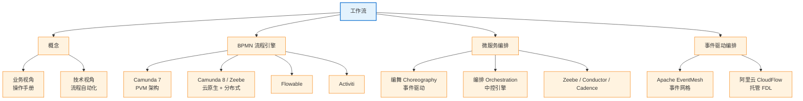

# 07 工作流

> 最后更新: 2026-06-14
> ⬅️ [返回 note 顶层](../README.md)

工作流（Workflow）是组织或系统中为完成特定任务而设计的有序、可重复活动的集合。本章从**概念定义**出发，覆盖 **BPMN 流程引擎**（Camunda/Flowable/Activiti）、**工作流与微服务编排**的协同模式、以及 **Apache EventMesh / 阿里云工作流**等事件驱动编排基础设施。

---

## 🎯 一句话定位

**工作流 = 把业务流程抽象为可执行的协作模型**——从「把大象放进冰箱」的分步拆解，到 BPMN 流程图的标准化定义，再到 Camunda/Zeebe/EventMesh 的工程化实现，覆盖从概念到落地的完整链路。

---

## 📚 章节导航

| 主题 | 文件 | 核心内容 |
|:----|:----|:---------|
| **行业应用与发展趋势** | [industry-and-trends.md](industry-and-trends.md) | 流程引擎的技术架构、行业实践、挑战、趋势、选型 |
| **工作流定义** | [define/README.md](define/README.md) | 业务/技术视角的定义、烧水流程标准化示例 |
| **流程引擎** | [process-engine/README.md](process-engine/README.md) | BPMN 工作原理、引擎发展史、Camunda/Flowable/Activiti 对比 |
| **├ Camunda 7** | [process-engine/camunda/camunda-7/README.md](process-engine/camunda/camunda-7/README.md) | SpringBoot 集成 / Swagger / bpmn-js / 任务节点 |
| **├ Camunda 8** | [process-engine/camunda/camunda-8/README.md](process-engine/camunda/camunda-8/README.md) | 云原生架构、性能突破、与 Camunda 7 关键差异 |
| **└ Zeebe** | [process-engine/camunda/camunda-8/zeebe/README.md](process-engine/camunda/camunda-8/zeebe/README.md) | 微服务编排引擎、Client/Gateway/Broker/Exporter 架构 |
| **工作流引擎与微服务编排** | [workflow-and-microservice-orchestration/README.md](workflow-and-microservice-orchestration/README.md) | 编舞 vs 编排、Zeebe/Conductor/Cadence 对比 |
| **Apache EventMesh** | [apache-eventmesh/README.md](apache-eventmesh/README.md) | 云原生事件驱动基础设施、组件、Runtime、Serverless Workflow |
| **阿里云工作流（CloudFlow）** | [apache-eventmesh/cloud-flow/README.md](apache-eventmesh/cloud-flow/README.md) | 全托管任务协调服务、FDL、5 大应用案例 |

---

## 🧭 知识地图

```mermaid
graph TB
    W[工作流]

    W --> C[概念]
    W --> E[BPMN 流程引擎]
    W --> O[微服务编排]
    W --> I[事件驱动编排]

    C --> C1[业务视角<br/>操作手册]
    C --> C2[技术视角<br/>流程自动化]

    E --> E1[Camunda 7<br/>PVM 架构]
    E --> E2[Camunda 8 / Zeebe<br/>云原生 + 分布式]
    E --> E3[Flowable]
    E --> E4[Activiti]

    O --> O1[编舞 Choreography<br/>事件驱动]
    O --> O2[编排 Orchestration<br/>中控引擎]
    O --> O3[Zeebe / Conductor / Cadence]

    I --> I1[Apache EventMesh<br/>事件网格]
    I --> I2[阿里云 CloudFlow<br/>托管 FDL]

    classDef root fill:#e3f2fd,stroke:#1976d2,stroke-width:2px
    classDef leaf fill:#fff3e0,stroke:#f57c00
    class W root
    class C,E,O,I,C1,C2,E1,E2,E3,E4,O1,O2,O3,I1,I2 leaf
```

---

## ⚡ 核心概念速查

| 概念 | 一句话定义 | 章节 |
|------|----------|:----:|
| **工作流** | 为完成业务目标而抽象的一系列步骤及步骤间的协作关系 | [定义](define/README.md) |
| **BPMN 2.0** | OMG 制定的业务流程建模与执行国际标准（XML + 图形化） | [流程引擎](process-engine/README.md) |
| **流程引擎** | 解析和执行流程定义、协调多系统交互的核心组件 | [流程引擎](process-engine/README.md) |
| **PVM** | jBPM 3+ 引入的流程虚拟机，Camunda 7 仍基于此架构 | [流程引擎](process-engine/README.md) |
| **Camunda 7** | 经典 Java 嵌入式引擎，适合传统企业 + Spring 生态 | [Camunda 7](process-engine/camunda/camunda-7/README.md) |
| **Camunda 8 / Zeebe** | 云原生分布式引擎，10,000+ 实例/秒，依赖 ES + Raft | [Camunda 8](process-engine/camunda/camunda-8/README.md) |
| **微服务编排** | 中控引擎协调多服务调用，处理重试/超时/状态 | [编排](workflow-and-microservice-orchestration/README.md) |
| **微服务编舞** | 服务间通过事件消息协作（去中心化） | [编排](workflow-and-microservice-orchestration/README.md) |
| **EventMesh** | 事件网格基础设施，连接 Producer/Consumer 与中间件 | [EventMesh](apache-eventmesh/README.md) |
| **CloudFlow / FDL** | 阿里云托管工作流服务，自有流程定义语言 | [CloudFlow](apache-eventmesh/cloud-flow/README.md) |
| **Serverless Workflow** | CNCF 厂商中立的 DSL 规范 | [EventMesh](apache-eventmesh/README.md) |

---

## 🤔 思考

1. **工作流 ≠ OA 审批流**：广义的「工作流」覆盖所有业务协作（订单/构建/部署），不仅是人事审批。
2. **BPMN vs 自研 DSL？** BPMN 是国际标准、跨团队跨组织可移植；自研 DSL 灵活但生态差。
3. **Camunda 7 vs 8 怎么选？** 7 稳定 + 生态成熟（Spring/Java 单体）；8 云原生 + 高吞吐（10K+ 实例/秒）。
4. **编舞 vs 编排怎么选？** 编舞灵活但难调试、难监控；编排可控但单点依赖重。中小流量用编舞，大流量/强一致用编排。
5. **为什么 Zeebe 要造一个新轮子？** 传统引擎 jar 嵌入 + DB 中心化架构无法适应分布式微服务；Zeebe 用 Raft + ES + 分区扩展。
6. **EventMesh vs 消息队列？** MQ 是「管道」；EventMesh 是「管道 + Schema 注册 + 工作流编排 + 多协议接入」的中间层。

---

## 相关章节

- ⬅️ [返回 note 顶层](../README.md)
- [03 数据层/分布式事务](../06.spring/03-data/transaction/distributed/) — Saga/TCC 同样是「分布式协作」模式
- [04 系统设计/05 分布式](../04.system-design/02-distributed/) — CAP/共识算法理论基础
- [06 Spring/05 Spring Cloud](../06.spring/05-spring-cloud/) — 微服务治理与流程引擎互补

---

> 🚀 从 [工作流定义](define/README.md) 开始理解概念，再深入 [流程引擎](process-engine/README.md) 掌握 BPMN。
