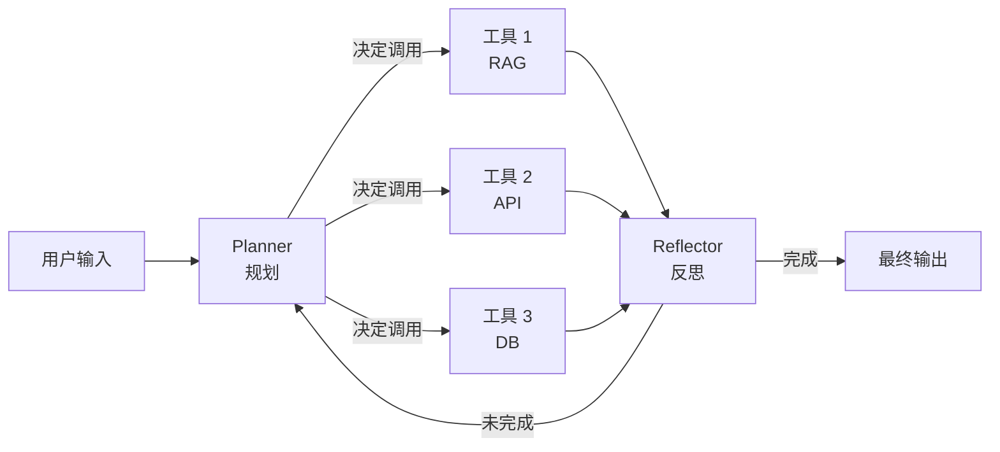
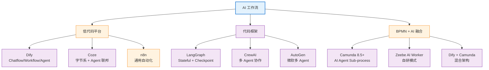

# AI 工作流

> 最后更新: 2026-06-14
> ⬅️ [返回 07 工作流](../README.md) | [工作流定义](../define/README.md) | [流程引擎](../process-engine/README.md) | [Dify](dify.md) | [Coze](coze.md) | [LangGraph](langgraph.md) | [AI + BPMN 融合](bpmn-ai-integration.md)

## 🎯 一句话定位

**AI 工作流 = LLM 推理 + 工具调用 + 状态机/DAG 编排**——把"大模型 + 业务系统"固化为可观测、可调试、可审计的执行图，是 2025-2026 年企业 AI 落地的核心载体。

---

## 一、什么是 AI 工作流？

### 1.1 与传统工作流的本质区别

| 维度 | **传统 BPMN 工作流** | **AI 工作流** |
|------|---------------------|--------------|
| **核心节点** | Service Task / User Task | LLM 节点 / Agent 节点 / 工具调用 |
| **决策逻辑** | 网关 + FEEL 表达式（确定性） | LLM 推理 + 工具编排（概率性）|
| **状态管理** | 关系型 DB 强事务 | 向量库 + 短期记忆 + Checkpoint |
| **可观测性** | 历史表 + 操作面板 | Token 消耗 + Trace + 评估 |
| **失败处理** | 补偿 / 重试 | 反思 / 自纠错 / 人工接管 |
| **可审计** | 流程实例 ID + 变量快照 | Prompt + Response + 工具日志 |

### 1.2 核心抽象



**三个关键概念**：

- **Planner（规划器）**：LLM 决定下一步做什么
- **Tool（工具）**：被 LLM 调用的确定性函数（搜索/计算/DB）
- **Reflector（反思器）**：判断是否完成 / 是否需要重试

---

## 二、6 大主流平台对比

| 平台 | **定位** | **形态** | **协议** | **AI 原生** | **开源** | **企业级** |
|------|---------|---------|---------|:-----------:|:--------:|:----------:|
| **Dify** | LLM 应用开发平台（Chatflow / Workflow / Agent）| 低代码 + DSL YAML | MCP / OpenAI API | ⭐⭐⭐⭐ | ✅ AGPL | ⭐⭐⭐⭐ |
| **Coze（扣子）** | 字节系 AI Agent 平台 | 低代码 + 表单 | MCP / OpenAI API | ⭐⭐⭐⭐ | ❌ 闭源 | ⭐⭐⭐ |
| **n8n** | 工作流自动化（IFTTT 升级版）| 低代码 + 节点 | REST / Webhook | ⭐⭐ | ✅ 公平代码 | ⭐⭐⭐ |
| **LangGraph** | LangChain 团队代码优先 Agent 框架 | Python/JS 代码 | OpenAI / Anthropic | ⭐⭐⭐⭐⭐ | ✅ MIT | ⭐⭐⭐ |
| **CrewAI** | 多 Agent 协作框架 | Python 代码 | OpenAI / Anthropic | ⭐⭐⭐⭐⭐ | ✅ MIT | ⭐⭐ |
| **Camunda 8 AI** | 8.5+ 原生 AI Agent Sub-process | BPMN 图形化 | fromAi() FEEL | ⭐⭐⭐ | ✅ 社区版 | ⭐⭐⭐⭐⭐ |

---

## 三、知识地图



---

## 四、选型决策树

```
Q1: 业务需要"图形化可审计 + 合规"？
├── 是 → Camunda 8.5+ AI Agent Sub-process → [AI + BPMN 融合](bpmn-ai-integration.md)
└── 否 → 继续

Q2: 团队是产品/业务运营出身，零开发能力？
├── 是 → Coze（国内 + 字节生态）或 Dify（国内/国际 + 较强）
└── 否 → 继续

Q3: 需要"复杂多步推理 + 长期记忆 + 状态回溯"？
├── 是 → LangGraph（代码优先 + StateGraph + Time Travel）
└── 否 → 继续

Q4: 需要"多个专业 Agent 角色协作"（研究员/工程师/审稿人）？
├── 是 → CrewAI（角色化多 Agent） 或 LangGraph Supervisor
└── 否 → 继续

Q5: 已有 RPA / IFTTT 存量，想加入 LLM 节点？
├── 是 → n8n（低代码 + 400+ 集成）
└── 否 → 回到 Q1
```

---

## 五、典型用例

| 用例 | 推荐平台 | 理由 |
|------|---------|------|
| **客服 + 工单** | Dify / Coze | RAG + 工具调用 + 飞书/钉钉集成 |
| **文档问答 / 知识库** | Dify + LangGraph | Dify 强在 RAG，LangGraph 强在多步推理 |
| **研究助手 / 数据分析** | LangGraph | 时间旅行 + 状态可重放 |
| **多 Agent 团队（产品/开发/QA）** | CrewAI / LangGraph Swarm | 角色化协作 |
| **跨境电商订单履约** | Camunda 8 AI | 10K+ 并发 + 合规审计 |
| **企业内部审批 + AI 辅助** | Camunda 8 AI + Dify | BPMN 骨架 + Dify 推理节点 |

---

## 🤔 思考

1. **AI 工作流能完全替代传统 BPMN 吗？** 不能。BPMN 提供**确定性、合规、可审计**的骨架，AI 提供**灵活推理、概率决策**的能力；两者互补而非替代。详见 [AI + BPMN 融合](bpmn-ai-integration.md)。
2. **Dify vs LangGraph 怎么选？** Dify 强在**业务人员低代码 + RAG 快速上线**；LangGraph 强在**工程师代码灵活 + 复杂推理**。多数企业项目用 Dify 跑 80% 标准化场景，LangGraph 跑 20% 复杂 Agent。
3. **CrewAI 和 LangGraph 哪个更主流？** 2026 年 LangGraph 在工业界更主流（StateGraph + Checkpoint + Time Travel 杀手锏），CrewAI 在研究/咨询类项目流行。两者**可混合使用**。
4. **AI 工作流的最大风险是什么？** 概率性失败——LLM 输出不确定、工具调用幻觉、成本爆炸。需要**评估体系**（离线 + 在线）+ **降级策略**（人工接管 / fallback 答案）。
5. **MCP 协议为什么重要？** 2025 年 MCP（Model Context Protocol）成为 LLM 工具调用的事实标准；选型时优先看 MCP 支持度（Anthropic 开源、OpenAI 已支持）。详见 [Dify](dify.md) 的 MCP 双向集成部分。

---

## 相关章节

- ⬅️ [返回 07 工作流](../README.md)
- [工作流定义](../define/README.md) — BPMN 三要素（理解 AI 工作流的对照基础）
- [流程引擎](../process-engine/README.md) — Camunda 7/8 引擎（AI 节点的下层载体）
- [Dify](dify.md) — 2025-2026 国内最主流的 LLM 应用开发平台
- [Coze（扣子）](coze.md) — 字节系 AI Agent 平台，国内生态最深
- [LangGraph](langgraph.md) — 代码优先的多 Agent 框架，工业界主流
- [AI + BPMN 融合](bpmn-ai-integration.md) — Camunda 8.5+ 原生 AI 集成模式
