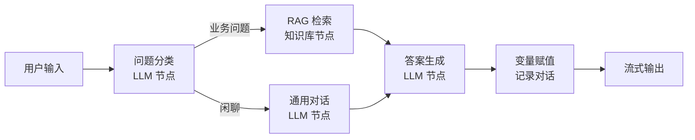
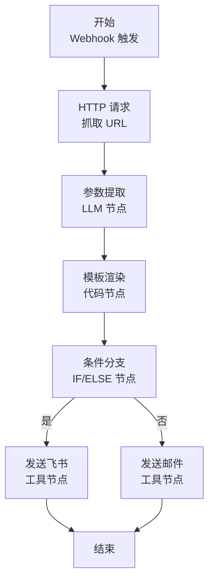
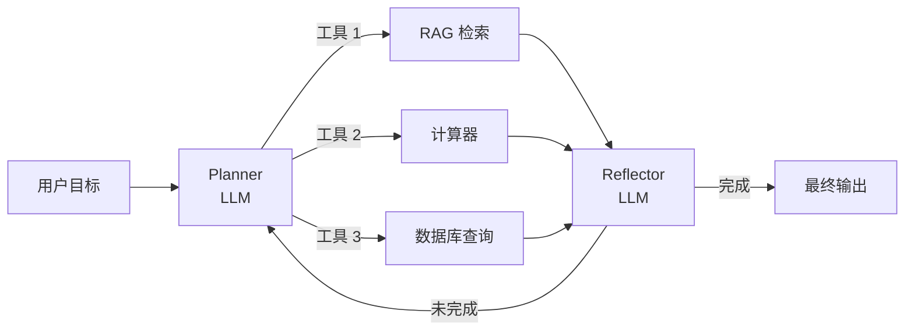
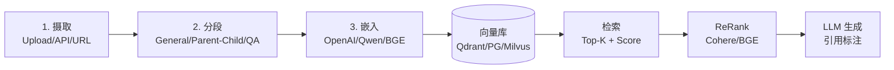

# Dify

> 最后更新: 2026-06-14
> ⬅️ [返回 AI 工作流](README.md) | [Coze](coze.md) | [LangGraph](langgraph.md) | [AI + BPMN 融合](bpmn-ai-integration.md) | [07 工作流](../README.md)

## 🎯 一句话定位

**Dify = LLMOps 平台 + Chatflow/Workflow/Agent 三模式 + DSL YAML + 13+ 节点 + MCP 双向集成**——2025-2026 年国内最主流的 LLM 应用开发平台，让产品和运营能用可视化方式搭建生产级 AI 应用。

---

## 一、解决什么问题？

| 痛点 | Dify 解法 |
|------|----------|
| **Prompt 散落各处** | Prompt 模板 + 版本管理 + 变量插值 |
| **RAG 管道难维护** | 知识库 / 摄取 / 分段 / 检索 / ReRank 全套 UI |
| **多步推理难调试** | 13+ 节点 + DSL 导出 + 单步运行追踪 |
| **LLM 切换成本高** | 统一 OpenAI 兼容 API（GPT / Claude / Gemini / Qwen / DeepSeek / GLM）|
| **业务系统集成难** | 内置 HTTP / 飞书 / 钉钉 / 企微 / 数据库 工具节点 |
| **2025+ LLM 工具调用协议分裂** | v1.9.2+ 原生 MCP Server + MCP Client 双向 |

---

## 二、三大应用模式

### 2.1 Chatflow（对话流）

**场景**：客服、知识库问答、AI 助手——有上下文的多轮对话。



### 2.2 Workflow（工作流）

**场景**：自动化任务、内容生成、批处理——单次执行不依赖对话历史。



### 2.3 Agent（智能体）

**场景**：复杂决策、多步工具调用、ReAct 推理。



---

## 三、DSL YAML 格式

Dify 工作流可导出为 **DSL YAML**，纳入 Git 版本控制：

```yaml
app:
  name: customer-service-bot
  mode: chatflow
  version: 1.0.0
workflow:
  nodes:
    - id: start
      type: start
      data: {}
    - id: classify
      type: llm
      data:
        model: gpt-4o
        prompt: "将用户问题分类：业务/闲聊/投诉"
        variables:
          - query
    - id: rag
      type: knowledge-retrieval
      data:
        dataset_id: kb_product_manual
        top_k: 5
        score_threshold: 0.7
    - id: answer
      type: llm
      data:
        model: gpt-4o
        prompt: "基于检索内容回答用户问题"
  edges:
    - source: start → target: classify
    - source: classify → target: rag (condition: 业务)
    - source: rag → target: answer
```

**核心优势**：

- **可版本控制**：DSL YAML 入 Git
- **CI/CD 友好**：Dify CLI 可一键部署
- **可视化编辑 + 代码审查**并存

---

## 四、13+ 节点类型

| 类别 | 节点 | 用途 |
|------|------|------|
| **基础** | 开始 / 结束 | 流程入口 / 出口 |
| **AI** | LLM 节点 | 单次 LLM 调用 |
| | Agent 节点 | ReAct 推理 + 工具调用 |
| **RAG** | 知识库检索 | 向量召回 + 关键词 |
| | 问题优化 | Query 改写 / HyDE |
| **逻辑** | IF/ELSE | 条件分支 |
| | 循环 | 批处理 |
| | 变量赋值 | 状态管理 |
| **集成** | HTTP 请求 | 调外部 API |
| | 代码执行 | Python/JS 沙箱 |
| | 工具调用 | 飞书 / 钉钉 / 企微 / Slack / Discord / 数据库 |
| **高级** | 子流程 | DSL 嵌套 |
| | MCP Server | v1.9.2+ 把当前 App 暴露为 MCP 服务 |
| | MCP Client | v1.9.2+ 消费外部 MCP 服务 |

---

## 五、RAG 管道 4 阶段



**关键参数**：

- `top_k: 5` —— 召回数量
- `score_threshold: 0.7` —— 相似度阈值（< 阈值丢弃）
- `rerank_enable: true` —— 是否 ReRank（精度↑延迟↑）
- `chunk_size: 1000 / overlap: 200` —— 切片粒度

---

## 六、MCP 双向集成（v1.9.2+）

**Model Context Protocol**（MCP，Anthropic 2024 开源）成为 LLM 工具调用的事实标准。

### 6.1 Dify 作为 MCP Server

把 Dify 工作流**暴露**为 MCP 工具，被 Claude Desktop / Cursor / 任意 MCP 客户端消费：

```json
{
  "mcpServers": {
    "dify-customer-service": {
      "url": "https://api.dify.ai/mcp/server/your-app-id",
      "transport": "streamable-http"
    }
  }
}
```

### 6.2 Dify 作为 MCP Client

在 Dify Agent 节点中**消费**外部 MCP 服务（数据库、GitHub、Slack 等）：

```yaml
nodes:
  - id: mcp-client
    type: mcp
    data:
      server_url: https://mcp.example.com/github
      tools:
        - create_issue
        - search_repos
```

**价值**：Dify 工作流可**作为 Claude Code 的工具**，Claude Code 可**作为 Dify Agent 的工具**——生态互通。

---

## 七、Dify vs 传统 BPMN 引擎 8 维对比

| 维度 | **Dify** | **传统 BPMN（Camunda 7）** |
|------|---------|---------------------------|
| **核心抽象** | LLM 节点 + 工具调用 | Service Task / User Task |
| **决策方式** | LLM 推理（概率） | 网关 + FEEL（确定性）|
| **状态管理** | 短期记忆 + Checkpoint | 关系型 DB 强事务 |
| **可视化** | 拖拽 + 实时预览 | BPMN 2.0 图形化 |
| **审计** | Trace + Token 消耗 | 流程实例 + 历史表 |
| **强治理** | ⚠️ 弱 | ✅ 强（SOX/HIPAA）|
| **学习成本** | 低（业务可上手）| 中（需懂 BPMN）|
| **生产部署** | 1-3 天 MVP | 1-3 个月集成 |

---

## 八、Dify vs LangChain/LangGraph 5 维对比

| 维度 | **Dify** | **LangGraph** |
|------|---------|--------------|
| **形态** | 低代码 + DSL YAML | Python/JS 代码 |
| **上手成本** | 1 天 | 1-2 周 |
| **可定制** | 中（受节点类型约束）| 极高（任何代码）|
| **可观测** | 内置 UI（日志/Token/Trace）| 需接 LangSmith |
| **RAG 能力** | 内置完整管道 | 需组装 LangChain |

**最佳实践**：80% 标准化场景用 **Dify** 快速上线；20% 复杂推理用 **LangGraph** 自研；两者可通过 **MCP 互通**。

---

## 九、典型用例

| 场景 | 节点组合 | 优势 |
|------|---------|------|
| **客服 + 工单** | LLM + 知识库 + HTTP（工单系统）+ 飞书/钉钉 | 多轮对话 + 系统集成 |
| **文档 Q&A** | 知识库 + 问题优化 + LLM + ReRank | 高精度 RAG |
| **AI Agent** | Agent 节点 + 工具调用 + 反思 | 多步推理 |
| **内容生成** | Workflow + HTTP + 模板渲染 | 批处理 |
| **MCP 互操作** | MCP Server / Client | 跨平台工具互通 |
| **企业内部 AI 助手** | 知识库 + LLM + SSO 集成 | 数据安全 + 权限 |

---

## 十、部署选项

| 方案 | 适用 | 特点 |
|------|------|------|
| **Dify Cloud（官方）** | 中小企业 / 快速验证 | 免运维、按量计费 |
| **Dify Community（自托管）** | 私有化 / 国产化 | AGPL 协议、需自维护 |
| **Dify Enterprise（商业版）** | 大型企业 | SLA + SSO + 审计 + RBAC |

**自托管最低配置**：2 核 4G 单机可跑 Demo；生产建议 4 核 8G + 独立 PG + Qdrant + Redis。

---

## 十一、2025-2026 重要更新

| 版本 | 特性 | 影响 |
|------|------|------|
| **v1.0.0 (2024-12)** | 商业版 + Enterprise 矩阵 | 国产化大客户入场 |
| **v1.5.0 (2025-04)** | Agent 节点 + 工作流编排 | 复杂推理进入主线 |
| **v1.7.0 (2025-08)** | 工作流可观测性三件套（Trace + Token + 成本）| 企业生产可用 |
| **v1.9.2 (2025-12)** | **MCP 双向集成**（Server + Client）| LLM 工具调用协议标准化 |
| **v1.10.0 (2026-Q1)** | 银行业合规认证包 + 国产 LLM 深度适配 | 金融/政务落地加速 |

---

## 🤔 思考

1. **Dify 是 BPMN 的替代品吗？** 不是。两者解决不同问题——Dify 强在 LLM 推理 + 业务快速试错；BPMN 强在确定性事务 + 合规审计。生产中常**组合使用**：BPMN 跑确定性骨架，Dify 跑 LLM 节点（通过 [AI + BPMN 融合](bpmn-ai-integration.md) 模式 C）。
2. **Dify 的最大风险？** 三件事：**LLM 成本爆炸**（需设置 Token 上限）、**幻觉答案**（需评估 + 人工接管 fallback）、**数据外泄**（敏感知识库需本地化 + 加密）。
3. **DSL YAML 入 Git 是必需的吗？** 是的。生产项目 DSL 必须入 Git，配合 CI/CD（`dify-cli deploy`）实现版本回滚 + A/B 测试。
4. **MCP 协议会不会取代 OpenAI Function Calling？** MCP 是**协议层**，Function Calling 是**API 层**。MCP 之上可以用 Function Calling，也可以用 Tool Use（Anthropic）。**MCP 是更上层的抽象**，2 年内将成主流。
5. **Dify 适合 100% 的 AI 项目吗？** 不。**标准化 RAG + Chatbot** 用 Dify 最划算；**复杂多 Agent 协作 / 长期记忆 / 状态回溯** 用 LangGraph 更合适。

---

## 相关章节

- ⬅️ [返回 AI 工作流](README.md) — 6 大平台对比与决策树
- [07 工作流](../README.md) — 章节根目录
- [Coze（扣子）](coze.md) — 字节系国内最强生态
- [LangGraph](langgraph.md) — 代码优先复杂 Agent 框架
- [AI + BPMN 融合](bpmn-ai-integration.md) — Dify + Camunda 8 混合架构
