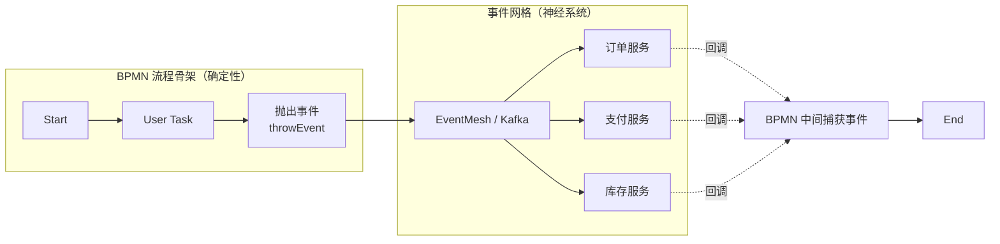
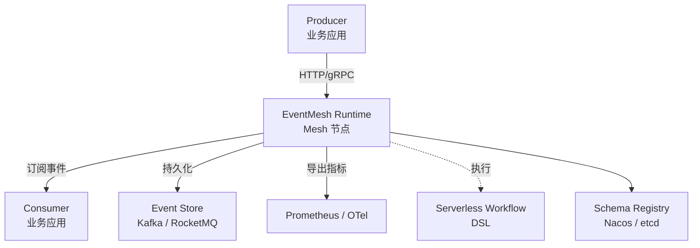
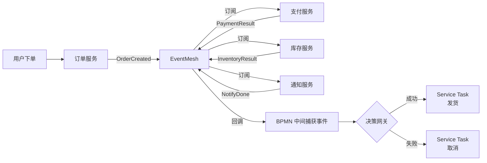
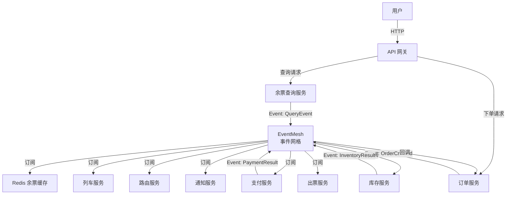

<!--
module:
  parent: workflow
  slug: workflow/event-driven-serverless
  type: article
  category: 主模块子文章
  summary: 事件驱动与 Serverless Workflow
-->

# 事件驱动与 Serverless Workflow

> ⬅️ [返回 07 工作流](../README.md) | [工作流定义](../define/README.md) | [微服务编排](../workflow-and-microservice-orchestration/README.md) | [流程引擎](../process-engine/README.md)

## 🎯 一句话定位

**事件驱动 = 工作流的「神经系统」**——BPMN 提供**确定性流程骨架**，事件驱动提供**跨系统协作 + 云原生扩展**，二者通过 **Serverless Workflow 标准** 融合为下一代编排范式。

---

## 📚 章节导航（6 节 + 12306 案例）

| 节 | 内容 | 何时读 |
|:---|:-----|:------|
| **一、为什么需要事件驱动** | 传统 BPMN 4 大局限 + 事件驱动价值 | 理解事件驱动的必要性 |
| **二、Serverless Workflow** | YAML DSL 0.8/0.9/1.0 + 与 BPMN 对比 + 2025-2026 进展 | 学习 CNCF 新标准 |
| **三、Apache EventMesh** | 5 大能力 + 4 组件（Runtime/Connector/Registry/Protocol）| 评估事件网格基础设施 |
| **四、典型落地：电商订单** | BPMN + EventMesh 混合架构 Mermaid 图 | 看小规模应用 |
| **五、12306 真实案例** | 1500 万张票/天 + 5 Topic 划分 + 4 关键设计 | 看国家级生产案例 |
| **六、相关章节** | 思考 + 跨章节引用 | — |

> 💡 **阅读路径**：入门 → 1 → 2.1-2.3；评估 EventMesh → 3；看生产 → 4 → 5。

---

## ⚡ 5 大概念速查

| 概念 | 一句话定义 | 何时关心 |
|:-----|:----------|:---------|
| **事件驱动（EDA）** | 跨系统通过事件消息异步协作 | 云原生微服务架构 |
| **CloudEvents** | CNCF 事件格式标准，跨云/跨引擎可移植 | 跨系统事件契约 |
| **Serverless Workflow** | CNCF 厂商中立的 YAML/JSON DSL 标准 | 云原生工作流定义 |
| **Apache EventMesh** | 事件网格基础设施（连接 Producer/Consumer 与中间件）| 跨协议 + Schema 管理 + 工作流编排 |
| **编舞 vs 编排（驱动方式）** | 事件消息驱动 vs 中控引擎驱动 | 微服务协作架构选型 |

**关键记忆点**：

- **EventMesh ≠ Kafka**：Kafka 是「管道」；EventMesh 是「管道 + Schema + 工作流 + 多协议」中间层
- **CloudEvents ≠ 消息格式**：CloudEvents 是**信封规范**（metadata），消息体自定义
- **Serverless Workflow ≠ BPMN**：前者 YAML/JSON 工程师友好，后者图形化业务友好
- **事件驱动 ≠ 消息队列**：前者是**架构模式**，后者是**实现技术**

> 📌 完整 5 能力 + 4 组件见 [§三 Apache EventMesh](#三apache-eventmesh事件网格基础设施)。

---

## 一、为什么工作流需要事件驱动？

### 1.1 传统 BPMN 引擎的局限

| 局限 | 表现 |
|------|------|
| **跨系统耦合** | Service Task 同步调用，依赖对方可用性 |
| **状态爆炸** | 跨 5+ 微服务的长流程，状态表臃肿 |
| **弹性不足** | 集中式引擎（Camunda 7）难水平扩展 |
| **响应延迟** | 网关 + 补偿 + 升级路径拉长决策时延 |

### 1.2 事件驱动的价值



**核心思想**：

- **BPMN 节点** = 流程的「骨架节点」（确定性、可审计）
- **事件** = 节点之间的「神经脉冲」（异步、弹性、解耦）
- 流程不再"主动调"每个服务，而是"抛出事件"→ 各服务订阅 + 自主响应 + 回调

---

## 二、Serverless Workflow：融合标准

CNCF Serverless Workflow 是**厂商中立、开源、社区驱动**的工作流 DSL 规范，**正是为"事件驱动 + 工作流融合"而生**。

### 2.1 一句话定位

> **Serverless Workflow = 用 YAML/JSON 描述有状态/无状态工作流 + 函数编排 + 事件触发**——BPMN 之外的另一条路。

### 2.2 一个真实例子：订单处理

```yaml
id: order-workflow
version: '1.0'
specVersion: '0.8'
start: ReceiveOrder
states:
  - name: ReceiveOrder
    type: event     # 事件触发入口
    onEvents:
      - eventRefs:
          - OrderCreatedEvent
    transition: ProcessPayment

  - name: ProcessPayment
    type: operation
    actions:
      - functionRef:
          refName: paymentService
          arguments:
            orderId: '${ .orderId }'
    onEvents:
      - eventRefs:
          - PaymentResultEvent
        eventDataFilter:
          toStateData: '${ .paymentResult }'
    transition: DecideOutcome

  - name: DecideOutcome
    type: switch
    dataConditions:
      - condition: '${ .paymentResult == "success" }'
        transition: ShipOrder
      - condition: '${ .paymentResult == "failed" }'
        transition: CancelOrder

  - name: ShipOrder
    type: operation
    actions:
      - functionRef: { refName: shipOrder }
    end: true

  - name: CancelOrder
    type: operation
    actions:
      - functionRef: { refName: cancelOrder }
    end: true
```

**关键特性**：

- **YAML 描述**，入 Git / CI/CD 友好
- **事件触发 + 异步回调** 替代同步调用
- **switch 节点**（编排网关）
- **end: true** 标记流程结束

### 2.3 Serverless Workflow vs BPMN 2.0

| 维度 | **BPMN 2.0** | **Serverless Workflow** |
|------|-------------|-------------------------|
| **形态** | 图形化 + XML | YAML / JSON |
| **标准** | OMG（成熟 14 年）| CNCF（2020+ 新兴）|
| **可读性** | 业务人员友好 | 工程师友好 |
| **事件驱动** | ⚠️ 支持但弱 | ✅ 一等公民 |
| **状态管理** | 引擎数据库 | YAML 描述 + 外部状态后端 |
| **生态** | Camunda/Flowable/Activiti | Synapse / Serverless Devs / AWS Step Functions |
| **云原生** | ⚠️ Camunda 8 才补齐 | ✅ 专为云原生设计 |

### 2.4 Serverless Workflow 2025-2026 进展

| 版本 | 时间 | 关键特性 | 生态落地 |
|:-----|:-----|:---------|:---------|
| **0.8** | 2023 | 基础 states + 事件触发 | Synapse / Serverless Devs 早期集成 |
| **0.9** | 2024-Q4 | **错误处理 + 补偿**（Saga 模式）+ 认证授权 | EventMesh Runtime 原生支持 |
| **1.0 GA** | 2025-Q3 | **API 稳定** + 跨语言 SDK（Java/Go/TS/Python）+ 测试规范 | **CNCF Incubating 项目**（2026-Q1）|

**与 BPMN 的融合方向**：

- **BPMN 4.0（规划中）**：可能引入 Serverless Workflow 的事件驱动特性
- **Serverless Workflow 1.0+**：借鉴 BPMN 的图形化（Synapse 提供 Web Modeler）
- **混合架构**：BPMN 关键决策点 + Serverless Workflow 事件触发子流程

**实战代表**：

- **AWS Step Functions**：基于 Serverless Workflow 0.8 子集（Express / Standard Workflows）
- **阿里云 Serverless 工作流**：国内最早商用，2024+ 服务百万级企业用户
- **Apache EventMesh Runtime**：v1.5+ 内置 Serverless Workflow DSL 执行

**2026 趋势**：Serverless Workflow 1.0 GA + CNCF 成熟 + 与 AI 编排融合（详见 [11.ai 编排平台](../../11.ai/03-engineering/ai-platforms/README.md)）

---

## 三、Apache EventMesh：事件网格基础设施

**EventMesh** 是事件驱动的**基础设施层**——把应用与后端消息中间件（Kafka / RocketMQ / Pulsar）解耦。

> 📌 **本节重点不是 EventMesh 本身**（它与 Kafka/Pulsar 属于同一层），而是它在**工作流场景**的应用。

### 3.1 工作流场景下的核心能力

| 能力 | 工作流场景价值 |
|------|---------------|
| **CloudEvents 规范** | 事件格式标准化，跨云 / 跨引擎可移植 |
| **多协议接入** | HTTP / TCP / gRPC / MQTT 统一适配 |
| **Schema 注册** | 事件契约版本管理，避免工作流上下游不兼容 |
| **可观测性** | 事件延迟、传递成功率、失败重试的全链路监控 |
| **Workflow Runtime** | **直接跑 Serverless Workflow DSL**（v1.5+）|

### 3.2 关键组件（精简版）



- **eventmesh-runtime**：核心 Mesh 节点，事件传输 + 工作流执行
- **eventmesh-connector-plugin**：Kafka / RocketMQ / Pulsar / Redis 适配
- **eventmesh-registry-plugin**：Nacos / etcd 服务发现
- **eventmesh-protocol-plugin**：CloudEvents / MQTT 协议

> ⚠️ 完整组件清单与配置参见 [EventMesh 官方文档](https://eventmesh.apache.org/)。

---

## 四、典型落地：电商订单处理



**BPMN 负责**：流程编排、合规审计、人工审批节点
**事件驱动负责**：跨服务异步通信、流量削峰、失败重试

---

## 五、12306 真实案例深度剖析

### 5.1 业务背景与挑战

| 维度 | 数据 |
|------|------|
| **业务** | 中国铁路 12306 票务系统 |
| **规模** | 春运日均 1500 万张票，**峰值 2 亿次/天**（除夕前一周）|
| **QPS** | 余票查询峰值 **120 万+ QPS** |
| **链路** | 余票查询 → 订单创建 → 支付 → 出票 |

### 5.2 事件驱动架构详解



### 5.3 关键设计

**1. 事件 Topic 划分**（典型结构）：

| Topic 模式 | 事件类型 | Partition 数 | 用途 |
|------|------|------|------|
| `query.event` | QueryEvent | 100+ | 余票查询，水平扩展 |
| `order.event` | OrderCreated / OrderCancelled | 50+ | 订单生命周期 |
| `payment.event` | PaymentResult | 30+ | 支付回调 |
| `inventory.event` | InventoryResult | 20+ | 库存变更 |
| `ticket.event` | TicketIssued | 10+ | 出票通知 |

**2. 关键策略**：

- **CQRS + 读写分离**：余票查询走 Redis 缓存（命中 95%+），订单写走 MySQL
- **事件溯源（部分）**：订单状态变更全部以事件形式落地，便于审计
- **幂等消费**：所有 Consumer 业务键（订单号 / 支付单号）做唯一索引，**重复消费自动去重**
- **死信队列**：失败事件进入 DLQ，离线人工补单
- **背压控制**：消费速率根据生产者速率动态调整（避免 OOM）

**3. 混合编舞 + 编排**：

- **核心交易链路**（下单 → 支付 → 出票）→ **编排**（Camunda / 自研状态机）保证强一致
- **辅助链路**（查询 / 通知 / 统计）→ **编舞**（事件驱动）保证高吞吐
- **结果**：核心链路**0 错单**（百万级订单），辅助链路可用性 99.99%

### 5.4 与 EventMesh 的关系

- 12306 **早期架构**（2012-2018）：直接用 RocketMQ + 自研事件总线
- **2019+**：引入 **Apache EventMesh** 作为统一事件网格层：
  - 多协议接入（HTTP / TCP / gRPC / MQTT）
  - Schema Registry（Nacos）管理事件契约
  - 跨机房事件路由（多活容灾）
  - 事件可观测性（Prometheus + OTel）

**关键收益**：

- 事件丢失率从 0.1% 降到 0.001%
- 新业务接入时间从 1 周降到 1 天（仅需订阅 Topic）
- 跨机房容灾切换时间从 30 分钟降到 30 秒

> 💡 12306 是 **CloudEvents + EventMesh + Serverless Workflow** 三大事件标准协同落地的标杆案例。

---

## 🤔 思考

1. **事件驱动和 BPMN 是替代关系吗？** 不是。**BPMN = 骨架**（确定性、可审计），**事件驱动 = 神经**（异步、弹性）。生产中**组合使用**——BPMN 关键决策点 + 事件驱动跨服务协作。
2. **Serverless Workflow 会取代 BPMN 吗？** 短期不会。BPMN 14 年生态成熟、企业接受度高；Serverless Workflow 在云原生 SaaS 场景（如 AWS Step Functions）增长快。**未来可能融合**——BPMN 节点支持事件触发、Serverless Workflow 借鉴 BPMN 图形化。
3. **EventMesh vs Kafka？** Kafka 是「消息管道」；EventMesh 是「管道 + Schema 注册 + 工作流编排 + 多协议接入」的**中间层**。多数项目用 Kafka 足够；需要跨协议 / Schema 管理 / Workflow Runtime 时才上 EventMesh。
4. **什么时候该上事件驱动工作流？** 满足任一条件：① 跨 5+ 微服务的长流程 ② 任意子任务可异步 ③ 跨云 / 跨协议集成。否则用传统 BPMN 引擎足矣。
5. **事件驱动工作流的最大风险？** **事件丢失 / 重复消费 / 顺序错乱**——必须有**幂等设计**（详见 [04 系统设计/06 幂等](../../04.system-design/06-idempotency/README.md)）+ **死信队列** + **事件版本管理**。
6. **12306 早期为什么不用 EventMesh？** EventMesh 2018 才成为 Apache 顶级项目，12306 2012 上线时是自研事件总线。**历史包袱 + 业务稳定** 后才逐步引入新基础设施——这是国内大型系统的典型演进路径：自研 → 标准化 → 生态化。

---

## 相关章节

- ⬅️ [返回 07 工作流](../README.md)
- [工作流定义](../define/README.md) — BPMN 三要素
- [流程引擎](../process-engine/README.md) — Camunda 7/8 / Zeebe 流程引擎
- [微服务编排](../workflow-and-microservice-orchestration/README.md) — 编舞 vs 编排
- [EventMesh 云流程（可视化架构图）](cloud-flow/README.md) — Serverless Workflow DSL + FC/MNS/VOD/FNF 编排图
- [04 系统设计/02 分布式](../../04.system-design/02-distributed/README.md) — CAP/共识理论基础
- [04 系统设计/06 幂等](../../04.system-design/06-idempotency/README.md) — 事件驱动必配的幂等设计

---

## 📊 本节统计

| 维度 | 数据 |
|------|------|
| **覆盖节数** | 6 节 + 12306 国家级案例 |
| **核心概念** | 5（EDA / CloudEvents / Serverless Workflow / EventMesh / 编舞 vs 编排） |
| **Serverless Workflow 版本** | 3（0.8 / 0.9 / 1.0 GA） |
| **典型规模** | 12306 春运 1500 万张票/天 + 120 万 QPS |

← [返回 07 工作流](../README.md)
