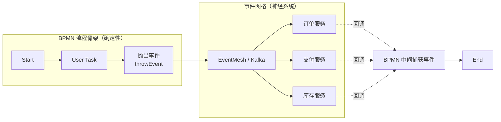
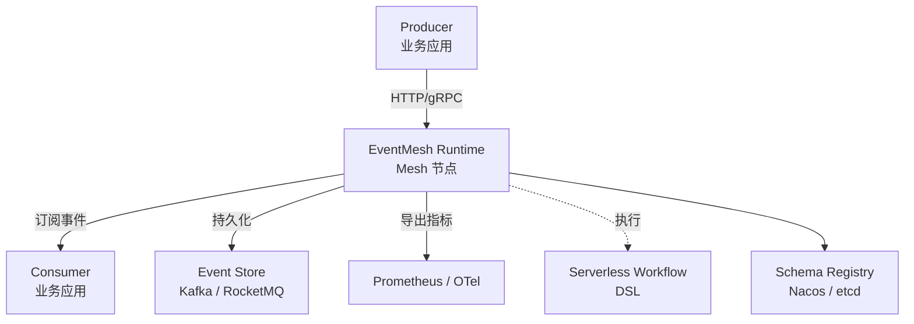
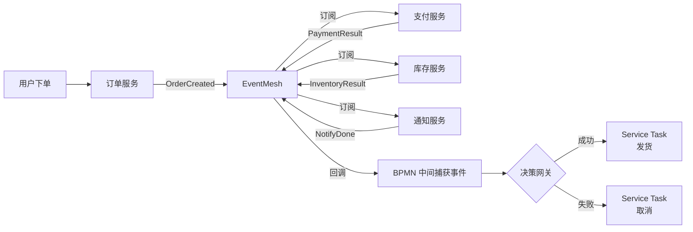

# 事件驱动与 Serverless Workflow

> 最后更新: 2026-06-14
> ⬅️ [返回 07 工作流](../README.md) | [工作流定义](../define/README.md) | [微服务编排](../workflow-and-microservice-orchestration/README.md) | [流程引擎](../process-engine/README.md)

## 🎯 一句话定位

**事件驱动 = 工作流的「神经系统」**——BPMN 提供**确定性流程骨架**，事件驱动提供**跨系统协作 + 云原生扩展**，二者通过 **Serverless Workflow 标准** 融合为下一代编排范式。

---

## 一、为什么工作流需要事件驱动？

### 1.1 传统 BPMN 引擎的局限

| 局限 | 表现 |
|------|------|
| **跨系统耦合** | Service Task 同步调用，依赖对方可用性 |
| **状态爆炸** | 跨 5+ 微服务的长流程，状态表臃肿 |
| **弹性不足** | 集中式引擎（Camunda 7）难水平扩展 |
| **响应延迟** | 网关 + 补偿 + 升级路径拉长决策时延 |

### 1.2 事件驱动的价值



**核心思想**：

- **BPMN 节点** = 流程的「骨架节点」（确定性、可审计）
- **事件** = 节点之间的「神经脉冲」（异步、弹性、解耦）
- 流程不再"主动调"每个服务，而是"抛出事件"→ 各服务订阅 + 自主响应 + 回调

---

## 二、Serverless Workflow：融合标准

CNCF Serverless Workflow 是**厂商中立、开源、社区驱动**的工作流 DSL 规范，**正是为"事件驱动 + 工作流融合"而生**。

### 2.1 一句话定位

> **Serverless Workflow = 用 YAML/JSON 描述有状态/无状态工作流 + 函数编排 + 事件触发**——BPMN 之外的另一条路。

### 2.2 一个真实例子：订单处理

```yaml
id: order-workflow
version: '1.0'
specVersion: '0.8'
start: ReceiveOrder
states:
  - name: ReceiveOrder
    type: event     # 事件触发入口
    onEvents:
      - eventRefs:
          - OrderCreatedEvent
    transition: ProcessPayment

  - name: ProcessPayment
    type: operation
    actions:
      - functionRef:
          refName: paymentService
          arguments:
            orderId: '${ .orderId }'
    onEvents:
      - eventRefs:
          - PaymentResultEvent
        eventDataFilter:
          toStateData: '${ .paymentResult }'
    transition: DecideOutcome

  - name: DecideOutcome
    type: switch
    dataConditions:
      - condition: '${ .paymentResult == "success" }'
        transition: ShipOrder
      - condition: '${ .paymentResult == "failed" }'
        transition: CancelOrder

  - name: ShipOrder
    type: operation
    actions:
      - functionRef: { refName: shipOrder }
    end: true

  - name: CancelOrder
    type: operation
    actions:
      - functionRef: { refName: cancelOrder }
    end: true
```

**关键特性**：

- **YAML 描述**，入 Git / CI/CD 友好
- **事件触发 + 异步回调** 替代同步调用
- **switch 节点**（编排网关）
- **end: true** 标记流程结束

### 2.3 Serverless Workflow vs BPMN 2.0

| 维度 | **BPMN 2.0** | **Serverless Workflow** |
|------|-------------|-------------------------|
| **形态** | 图形化 + XML | YAML / JSON |
| **标准** | OMG（成熟 14 年）| CNCF（2020+ 新兴）|
| **可读性** | 业务人员友好 | 工程师友好 |
| **事件驱动** | ⚠️ 支持但弱 | ✅ 一等公民 |
| **状态管理** | 引擎数据库 | YAML 描述 + 外部状态后端 |
| **生态** | Camunda/Flowable/Activiti | Synapse / Serverless Devs / AWS Step Functions |
| **云原生** | ⚠️ Camunda 8 才补齐 | ✅ 专为云原生设计 |

---

## 三、Apache EventMesh：事件网格基础设施

**EventMesh** 是事件驱动的**基础设施层**——把应用与后端消息中间件（Kafka / RocketMQ / Pulsar）解耦。

> 📌 **本节重点不是 EventMesh 本身**（它与 Kafka/Pulsar 属于同一层），而是它在**工作流场景**的应用。

### 3.1 工作流场景下的核心能力

| 能力 | 工作流场景价值 |
|------|---------------|
| **CloudEvents 规范** | 事件格式标准化，跨云 / 跨引擎可移植 |
| **多协议接入** | HTTP / TCP / gRPC / MQTT 统一适配 |
| **Schema 注册** | 事件契约版本管理，避免工作流上下游不兼容 |
| **可观测性** | 事件延迟、传递成功率、失败重试的全链路监控 |
| **Workflow Runtime** | **直接跑 Serverless Workflow DSL**（v1.5+）|

### 3.2 关键组件（精简版）



- **eventmesh-runtime**：核心 Mesh 节点，事件传输 + 工作流执行
- **eventmesh-connector-plugin**：Kafka / RocketMQ / Pulsar / Redis 适配
- **eventmesh-registry-plugin**：Nacos / etcd 服务发现
- **eventmesh-protocol-plugin**：CloudEvents / MQTT 协议

> ⚠️ 完整组件清单与配置参见 [EventMesh 官方文档](https://eventmesh.apache.org/)。

---

## 四、典型落地：电商订单处理



**BPMN 负责**：流程编排、合规审计、人工审批节点
**事件驱动负责**：跨服务异步通信、流量削峰、失败重试

---

## 🤔 思考

1. **事件驱动和 BPMN 是替代关系吗？** 不是。**BPMN = 骨架**（确定性、可审计），**事件驱动 = 神经**（异步、弹性）。生产中**组合使用**——BPMN 关键决策点 + 事件驱动跨服务协作。
2. **Serverless Workflow 会取代 BPMN 吗？** 短期不会。BPMN 14 年生态成熟、企业接受度高；Serverless Workflow 在云原生 SaaS 场景（如 AWS Step Functions）增长快。**未来可能融合**——BPMN 节点支持事件触发、Serverless Workflow 借鉴 BPMN 图形化。
3. **EventMesh vs Kafka？** Kafka 是「消息管道」；EventMesh 是「管道 + Schema 注册 + 工作流编排 + 多协议接入」的**中间层**。多数项目用 Kafka 足够；需要跨协议 / Schema 管理 / Workflow Runtime 时才上 EventMesh。
4. **什么时候该上事件驱动工作流？** 满足任一条件：① 跨 5+ 微服务的长流程 ② 任意子任务可异步 ③ 跨云 / 跨协议集成。否则用传统 BPMN 引擎足矣。
5. **事件驱动工作流的最大风险？** **事件丢失 / 重复消费 / 顺序错乱**——必须有**幂等设计**（详见 [04 系统设计/06 幂等](../04.system-design/06-idempotency/README.md)）+ **死信队列** + **事件版本管理**。

---

## 相关章节

- ⬅️ [返回 07 工作流](../README.md)
- [工作流定义](../define/README.md) — BPMN 三要素
- [流程引擎](../process-engine/README.md) — Camunda 7/8 / Zeebe 流程引擎
- [微服务编排](../workflow-and-microservice-orchestration/README.md) — 编舞 vs 编排
- [04 系统设计/02 分布式](../04.system-design/02-distributed/README.md) — CAP/共识理论基础
- [04 系统设计/06 幂等](../04.system-design/06-idempotency/README.md) — 事件驱动必配的幂等设计
