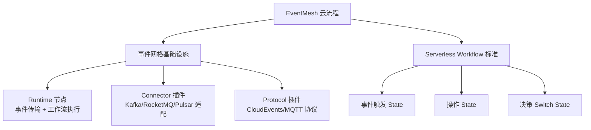
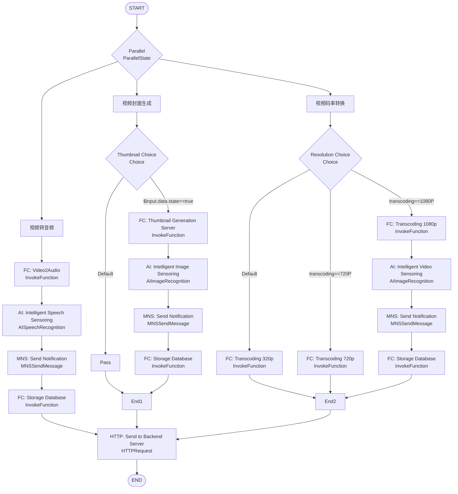
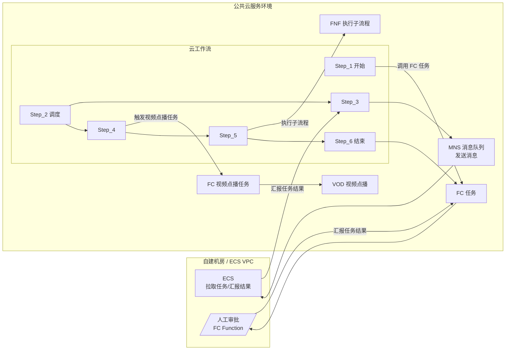

<!--
module:
  parent: workflow
  slug: workflow/eventmesh-cloud-flow
  type: article
  category: 主模块子文章
  summary: EventMesh 云流程
-->

# EventMesh 云流程

> Apache EventMesh 在工作流/云流程场景的架构图与可视化资料

---

## 🎯 一句话定位

**EventMesh 云流程 = Serverless Workflow DSL + 阿里云 FC/MNS/VOD/FNF 编排**——可视化展示 EventMesh Runtime 在云原生视频处理场景的标准架构与最佳实践。

| 序号 | 主题 | 核心内容 |
|------|------|---------|
| 1 | [EventMesh 云流程架构图](#1-eventmesh-云流程架构图) | Parallel + 视频转音频/封面生成/码率转换 三分支 |
| 2 | [事件网格与业务流程集成图](#2-事件网格与业务流程集成图) | 云工作流 + FC/MNS/ECS/VOD/FNF 编排 |
| 3 | [Serverless Workflow DSL 执行流程图](#3-serverless-workflow-dsl-执行流程图) | 业务消息分组 + OSS 写入 + 压缩分支 |


---

## 知识脉络



## 阅读说明

本目录存放 **Apache EventMesh 在云流程场景的可视化架构图**，配套内容见：

- 理论 + 实战：[`事件驱动与 Serverless Workflow`](../README.md)
- 12306 案例：同上文 §五 含 EventMesh 架构图

## 核心概念

| 概念 | 一句话定义 |
|------|----------|
| **EventMesh** | 事件网格基础设施，连接 Producer/Consumer 与后端消息中间件 |
| **CloudEvents** | CNCF 事件格式标准，跨云/跨引擎可移植 |
| **Serverless Workflow** | CNCF YAML/JSON DSL 标准，事件驱动 + 函数编排 |
| **Runtime** | EventMesh 核心 Mesh 节点，事件传输 + Serverless Workflow DSL 执行 |

---

## 1. EventMesh 云流程架构图

Parallel 编排器触发 3 条并行分支：视频转音频 / 视频封面生成 / 视频码率转换，最终汇聚到 HTTP 后端。



## 2. 事件网格与业务流程集成图

云工作流与 EventMesh 集成，自建机房/ECS VPC 通过 MNS 拉取任务，公共云 FC 调用 VOD/FNF 等服务。



## 3. Serverless Workflow DSL 执行流程图

业务消息分组后写入 OSS，根据数据大小决策是否压缩。


---

## 4. Serverless Workflow DSL 最小示例

CNCF Serverless Workflow DSL 用 YAML 描述上图"分组 → OSS → 选择压缩"的逻辑。

```yaml
# workflow.yaml —— CNCF Serverless Workflow 0.8 语法片段
id: message-archive-flow
version: '1.0'
specVersion: '0.8'
name: Message Archive Workflow
start: GroupMessages
states:
  # 1) 按业务字段把消息分组
  - name: GroupMessages
    type: operation
    actions:
      - functionRef:
          refName: groupMessages      # EventMesh Function Connector
          arguments:
            groupBy: '${ .businessKey }'
    transition: WriteOSS

  # 2) 写入 OSS
  - name: WriteOSS
    type: operation
    actions:
      - functionRef:
          refName: putObject          # 阿里云 OSS Connector
          arguments:
            bucket: '${ .bucket }'
            key: '${ .objectKey }'
    transition: DecideCompress

  # 3) 根据 object_size 决定是否压缩（对应 Choice 节点）
  - name: DecideCompress
    type: switch
    dataConditions:
      - condition: '${ .object_size >= 1048576 }'   # 1 MiB 阈值
        transition: Compress
    defaultCondition:
      transition: End
  - name: Compress
    type: operation
    actions:
      - functionRef:
          refName: gzipAndUpload
    end: true
```

> 💡 EventMesh Runtime 通过 `WorkflowResource` 接口加载该 DSL，再由内置的 CloudEvents 总线驱动 State 之间的跳转。

---

## 5. EventMesh Runtime 启动与部署

```bash
# 1. 下载发行版（替换为当前最新版本）
wget https://archive.apache.org/dist/eventmesh/1.10.0/apache-eventmesh-1.10.0-bin.tar.gz
tar -xzf apache-eventmesh-1.10.0-bin.tar.gz && cd apache-eventmesh-1.10.0

# 2. 启动 Runtime（前台运行，便于观察日志）
bin/eventmesh-start.sh -m runtime

# 3. 加载 Serverless Workflow DSL（HTTP 推送至 Admin API）
curl -X POST http://127.0.0.1:10106/workflow \
     -H "Content-Type: application/yaml" \
     --data-binary @workflow.yaml

# 4. 校验流程已注册
curl http://127.0.0.1:10106/workflow/list | jq '.data[].name'
# 期望输出："message-archive-flow"
```

> 部署模式参考：独立 JVM 进程 / Kubernetes Deployment / Docker Compose 三种均可，区别在于 Connector 注册方式与外部中间件（Kafka/RocketMQ）的网络打通方式。

---

## 6. 同类方案横向对比

| 维度 | Apache EventMesh | Knative Eventing | OpenFunction |
|------|------------------|------------------|--------------|
| **定位** | 事件网格 + Serverless Workflow DSL | Kubernetes 原生事件驱动 | FaaS + 函数编排 |
| **事件标准** | CloudEvents 1.0 | CloudEvents 1.0 | CloudEvents 1.0 |
| **协议插件** | HTTP / MQTT / gRPC / TCP | HTTP / Kafka | HTTP / Kafka / Dapr |
| **Workflow 标准** | CNCF Serverless Workflow DSL | 自定义 Sequence / Parallel | 自定义 Workflow CRD + Dapr |
| **运行依赖** | RocketMQ / Kafka / Pulsar | Kubernetes + Broker | Kubernetes + KubeVirt/OpenFunction |
| **典型场景** | 跨云事件桥接 + 视频/数据编排 | K8s 应用事件触发 | 云原生函数 + 弹性伸缩 |
| **运维门槛** | 中（独立 Runtime）| 低（K8s 原生）| 中（依赖 Dapr / K8s）|
| **生态** | Apache TLP / 阿里云深度集成 | CNCF Graduated | CNCF Sandbox |

> ✅ EventMesh 在"跨云 + 标准 DSL"上更强；Knative Eventing 偏 K8s 内部触发；OpenFunction 更像函数即服务 + 编排。

---

## 相关章节

- 上游：[`事件驱动与 Serverless Workflow`](../README.md) — BPMN + 事件驱动融合
- 上游：[`07 工作流`](../../../README.md) — 工作流顶层
- 关联：[`微服务编排`](../../workflow-and-microservice-orchestration/README.md) — 编舞 vs 编排
- 关联：[`流程引擎`](../../process-engine/README.md) — Camunda 7/8 / Zeebe

---

## 📊 本节统计

| 维度 | 数据 |
|------|------|
| **覆盖图表** | 3 张 Mermaid（云流程架构 / 事件网格集成 / DSL 执行） |
| **核心组件** | EventMesh Runtime + FC / MNS / VOD / FNF |
| **架构模式** | Parallel 并行 + Choice 分支 + Map 迭代 |
| **配套文档** | [事件驱动与 Serverless Workflow](../README.md) |

> 提示：本目录以 Mermaid 图表为主，建议结合 [事件驱动 README](../README.md) 的 §三 Apache EventMesh 与 §五 12306 案例一起阅读

← [返回 07 工作流](../../README.md)
