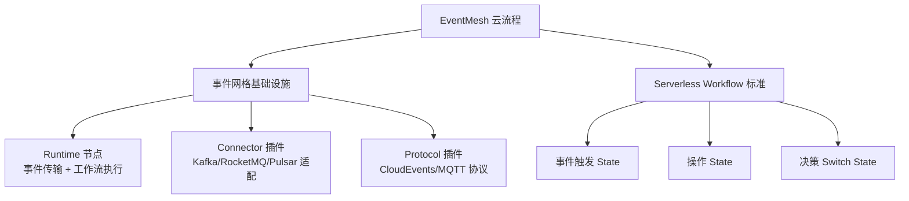
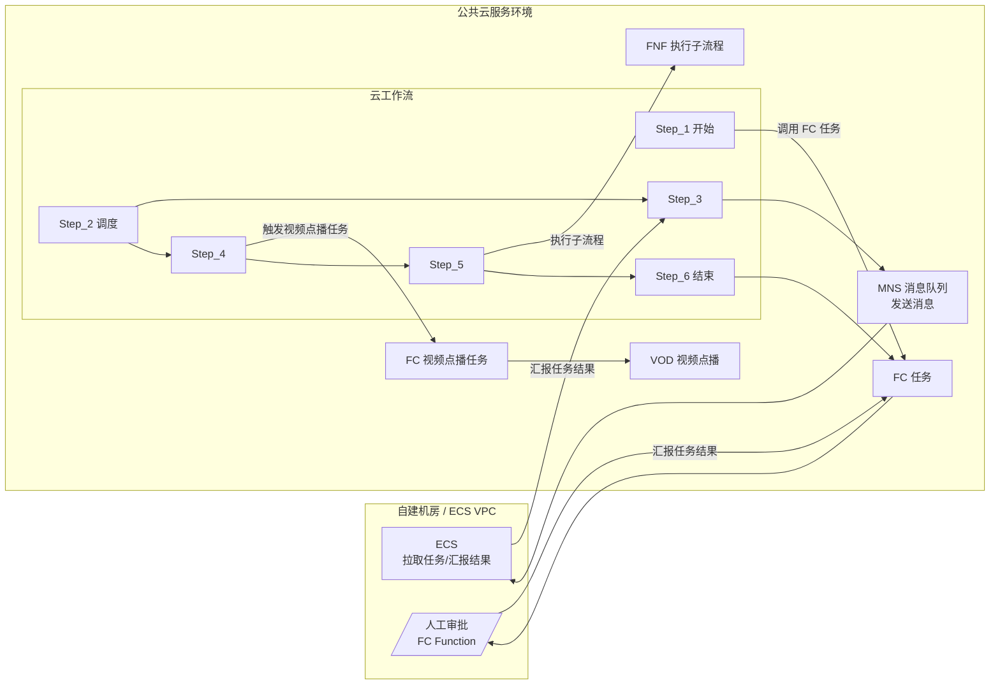
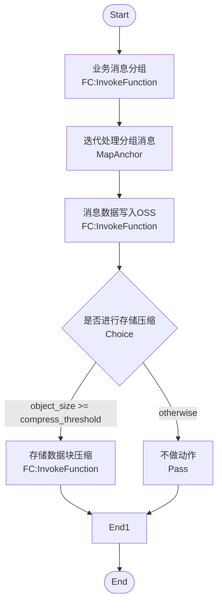

<!--
module:
  parent: workflow
  slug: workflow/eventmesh-cloud-flow
  type: article
  category: 主模块子文章
  summary: EventMesh 云流程
-->

# EventMesh 云流程

> Apache EventMesh 在工作流/云流程场景的架构图与可视化资料

---
## 引言：架构困境

EventMesh 云流程 的关键不是'选型'——是**选完之后怎么在 5 个 trade-off 里活下来**。

本篇用'决策困境'切入，比较几种主流路径并讲清取舍。

---

## 导航

| 序号 | 主题 | 核心内容 |
|------|------|---------|
| 1 | [EventMesh 云流程架构图](#1-eventmesh-云流程架构图) | Parallel + 视频转音频/封面生成/码率转换 三分支 |

| 2 | [事件网格与业务流程集成图](#2-事件网格与业务流程集成图) | 云工作流 + FC/MNS/ECS/VOD/FNF 编排 |

| 3 | [Serverless Workflow DSL 执行流程图](#3-serverless-workflow-dsl-执行流程图) | 业务消息分组 + OSS 写入 + 压缩分支 |

---

## 知识脉络

## 阅读说明

本目录存放 **Apache EventMesh 在云流程场景的可视化架构图**，配套内容见：

- 理论 + 实战：[`事件驱动与 Serverless Workflow`](../README.md)
- 12306 案例：同上文 §五 含 EventMesh 架构图

## 核心概念

| 概念 | 一句话定义 |
|------|----------|
| **EventMesh** | 事件网格基础设施，连接 Producer/Consumer 与后端消息中间件 |
| **CloudEvents** | CNCF 事件格式标准，跨云/跨引擎可移植 |
| **Serverless Workflow** | CNCF YAML/JSON DSL 标准，事件驱动 + 函数编排 |
| **Runtime** | EventMesh 核心 Mesh 节点，事件传输 + Serverless Workflow DSL 执行 |

---

## 1. EventMesh 云流程架构图

Parallel 编排器触发 3 条并行分支：视频转音频 / 视频封面生成 / 视频码率转换，最终汇聚到 HTTP 后端。

## 2. 事件网格与业务流程集成图

云工作流与 EventMesh 集成，自建机房/ECS VPC 通过 MNS 拉取任务，公共云 FC 调用 VOD/FNF 等服务。

## 3. Serverless Workflow DSL 执行流程图

业务消息分组后写入 OSS，根据数据大小决策是否压缩。

---

## 相关章节

- 上游：[`事件驱动与 Serverless Workflow`](../README.md) — BPMN + 事件驱动融合
- 上游：[`07 工作流`](../../README.md) — 工作流顶层
- 关联：[`微服务编排`](../../workflow-and-microservice-orchestration/README.md) — 编舞 vs 编排
- 关联：[`流程引擎`](../../process-engine/README.md) — Camunda 7/8 / Zeebe

---

> 提示：本目录以 Mermaid 图表为主，建议结合 [事件驱动 README](../README.md) 的 §三 Apache EventMesh 与 §五 12306 案例一起阅读
