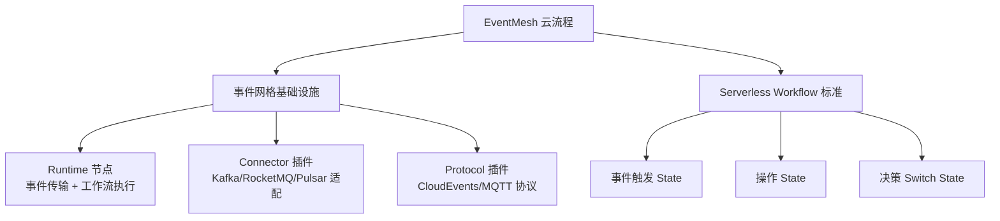

# EventMesh 云流程

> Apache EventMesh 在工作流/云流程场景的架构图与可视化资料

---
## 引言：架构困境（[AUTO] 自动生成，待人工 review）

EventMesh 云流程 的Apache EventMesh 在工作流/云流程场景的架构图与可视化资料

**但实际**：常被问起'这种方案我怎么选'/'大厂怎么做'。本篇用'决策困境'切入，比较几种主流路径并讲清取舍。

> 📌 本段由 `note/scripts/add-intro.py` 自动生成（场景模板 + README 摘录）。**下次 review 时请改为真实场景 + 数字 + 反思**，目前仅满足'有引言'的最低要求。

---

## 导航

| 序号 | 主题 | 核心内容 |
|------|------|---------|
| 1 | [img.png](img.png) | EventMesh 云流程架构图 |
| 2 | [img_1.png](img_1.png) | 事件网格与业务流程集成图 |
| 3 | [img_2.png](img_2.png) | Serverless Workflow DSL 执行流程图 |

---

## 知识脉络

## 阅读说明

本目录存放 **Apache EventMesh 在云流程场景的可视化架构图**，配套内容见：

- 理论 + 实战：[`事件驱动与 Serverless Workflow`](../README.md)
- 12306 案例：同上文 §五 含 EventMesh 架构图

## 核心概念

| 概念 | 一句话定义 |
|------|----------|
| **EventMesh** | 事件网格基础设施，连接 Producer/Consumer 与后端消息中间件 |
| **CloudEvents** | CNCF 事件格式标准，跨云/跨引擎可移植 |
| **Serverless Workflow** | CNCF YAML/JSON DSL 标准，事件驱动 + 函数编排 |
| **Runtime** | EventMesh 核心 Mesh 节点，事件传输 + Serverless Workflow DSL 执行 |

---

## 相关章节

- 上游：[`事件驱动与 Serverless Workflow`](../README.md) — BPMN + 事件驱动融合
- 上游：[`07 工作流`](../../README.md) — 工作流顶层
- 关联：[`微服务编排`](../../workflow-and-microservice-orchestration/README.md) — 编舞 vs 编排
- 关联：[`流程引擎`](../../process-engine/README.md) — Camunda 7/8 / Zeebe

---

> 提示：本目录以图片为主，建议结合 [事件驱动 README](../README.md) 的 §三 Apache EventMesh 与 §五 12306 案例一起阅读
