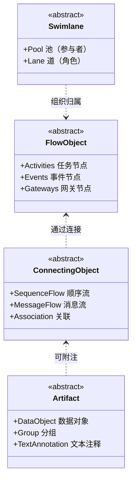
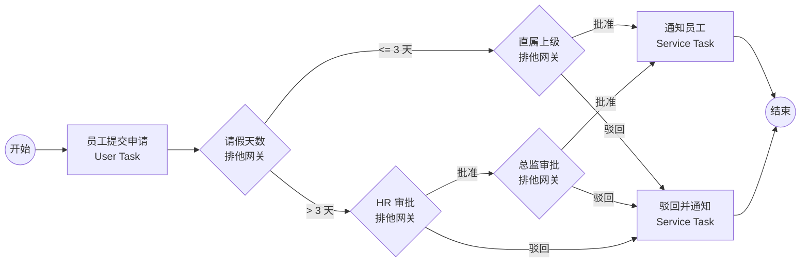

# 工作流定义

> 最后更新: 2026-06-14
> ⬅️ [返回 07 工作流](README.md) | [流程引擎](process-engine/README.md) | [微服务编排](workflow-and-microservice-orchestration/README.md)

工作流（Workflow）是组织或系统中为完成特定业务目标而设计的有序、可重复活动的集合。本节从**概念**出发，区分**业务视角**与**技术视角**，并以 BPMN 2.0 标准为锚点建立统一定义。

---

## 🎯 一句话定位

**工作流 = 业务目标 → 步骤分解 → 协作规则**——把"业务做事过程"固化为可被任何人/系统复用的流程模型。

---

## 📚 章节导航（5 节 + 3 案例）

| 节 | 内容 | 何时读 |
|:---|:-----|:------|
| **一、双视角定义** | 业务视角（操作手册）vs 技术视角（流程自动化）| 第一次理解"工作流"概念 |
| **二、BPMN 2.0 三要素** | FlowObject / ConnectingObject / Artifact / Swimlane + classDiagram | 学习 BPMN 建模基础 |
| **三、真实例子：请假审批** | Mermaid flowchart + 5 元素对应 | 看完整 BPMN 流程图样例 |
| **四、相关概念辨析** | 业务过程 / 定义 / 实例 / 任务 / 变量 / 编排 | 区分易混淆概念 |
| **五、真实落地案例** | 银行对公开户 / 餐饮供应商 / 医院检验 | 看企业级 BPMN 应用 |

> 💡 **阅读路径**：第一次接触 → 1 → 2 → 3；概念辨析 → 4；想看真实项目 → 5。

---

## 一、双视角定义

### 1.1 业务视角

工作流是组织运营的"操作手册"，明确**任务分工、执行顺序、交付标准**。核心价值：

- **结构化**：把模糊的"做事过程"拆成可枚举的步骤
- **标准化**：跨团队、跨时间产生一致结果
- **可审计**：每一步可追溯到具体的人/时间/结果

### 1.2 技术视角

工作流是计算机支持的**流程自动化技术**——通过定义任务、规则、角色、条件，把业务逻辑转化为可执行的**流程模型**。核心组件：

- **流程定义（Process Definition）**：BPMN 2.0 标准的 XML / 图形化描述
- **流程引擎（Process Engine）**：解析并执行流程定义的核心组件
- **流程实例（Process Instance）**：一次具体的执行（订单审批 #20240615001）
- **任务（Task）**：实例中需要人工/系统完成的一个动作

> 📌 **流程引擎** ≠ **工作流**。工作流是概念，引擎是实现技术。

---

## 二、BPMN 2.0 三要素

BPMN（Business Process Model and Notation）是 OMG 制定的**业务流程建模国际标准**，2.0 版（2011）支持 XML 格式的可执行模型。

| 类别 | 元素 | 作用 |
|------|------|------|
| **FlowObject 流程对象** | Activity（Task/Sub-Process/CallActivity）| 要执行的工作 |
| | Event（Start/Intermediate/End）| 触发起止/中间事件 |
| | Gateway（Exclusive/Parallel/Inclusive/Event-based）| 路由决策 |
| **ConnectingObject 连接对象** | Sequence Flow | 同泳道内的执行顺序 |
| | Message Flow | 跨泳道/跨系统的消息 |
| **Artifact 制品** | Data Object | 流程读写的数据 |
| | Group | 视觉分组（不影响执行）|
| **Swimlane 泳道** | Pool / Lane | 责任人与组织归属 |

---

## 三、一个真实例子：请假审批

**BPMN 元素对应**：

- **Start Event** → 流程入口
- **User Task** × 3 → 员工/上级/HR/总监 的人工动作
- **Exclusive Gateway** × 3 → 排他分支（≤3 天 vs >3 天；批准 vs 驳回）
- **Service Task** × 2 → 系统自动通知
- **End Event** → 流程结束

---

## 四、相关概念辨析

| 概念 | 与工作流的关系 |
|------|---------------|
| **业务流程（Business Process）** | 工作流的上位概念，包含人/系统/规则 |
| **流程定义（Process Definition）** | 工作流的**静态蓝图**（BPMN XML）|
| **流程实例（Process Instance）** | 工作流的**动态执行**（一次具体审批）|
| **任务（Task）** | 流程实例中**最小执行单元** |
| **流程变量（Process Variable）** | 任务间传递的业务数据 |
| **编排（Orchestration）** | 微服务/系统层面的工作流（见 [03 编排](../workflow-and-microservice-orchestration/README.md)）|

---

## 五、真实落地案例

### 案例 1：某城商银行对公开户流程

| 维度 | 数据 |
|------|------|
| **业务** | 企业对公账户开立（尽调 + 审批 + 监管报备）|
| **规模** | 月均 5000+ 户 |
| **流程** | 客户提交 → 反洗钱尽调 → 客户经理审核 → 风险经理复核 → 主管审批 → 央行报备 → 账户激活 |
| **BPMN 价值** | 8 节点流程 + 4 个排他网关（条件路由） + 2 个人工子流程 + 监管报备 Service Task |
| **效果** | 开户时效 7 天 → 2 天，监管报备 0 遗漏 |

**为什么用 BPMN 建模？**

- 业务人员可参与流程图设计（图形化）
- 监管报备节点必须 100% 留痕（BPMN 历史表）
- 流程变更不需改代码（替换 BPMN 文件即可部署）

### 案例 2：某连锁餐饮集团供应商准入

| 维度 | 数据 |
|------|------|
| **业务** | 200+ 门店的食材供应商资质审核 |
| **规模** | 年均 300+ 供应商准入申请 |
| **流程** | 申请提交 → 资质收集（营业执照 / 食品流通证 / 检测报告）→ AI 智能审核（OCR + 规则校验）→ 现场考察 → 总部终审 |
| **BPMN 价值** | 并行网关（多资质并行收集）+ 包容网关（多类目供应商） + 边界事件（30 天未提交自动取消）|
| **效果** | 准入周期 60 天 → 21 天，AI 拦截资质问题 95% |

### 案例 3：某医院检验报告审批

| 维度 | 数据 |
|------|------|
| **业务** | 检验科危急值报告的双人复核 + 主治医生确认 |
| **规模** | 日均 3000+ 报告 |
| **流程** | 检验师出具 → 高级检验师复核 → 危急值告警 → 主治医生确认 → 患者通知 |
| **BPMN 价值** | 多实例任务（每个危急值触发独立审批）+ User Task 表单（医生签字） + Service Task（调短信 API 通知患者）|
| **效果** | 危急值响应时间 30 分钟 → 5 分钟，零漏报 |

> 💡 三个案例代表 **金融强治理 / 商业标准化 / 医疗高时效** 三种典型工作流场景，覆盖 BPMN 22 元素中的大部分（事件/网关/子流程/边界事件）。

---

## 🤔 思考

1. **工作流 vs OA 审批？** 广义的"工作流"覆盖所有协作（订单/部署/构建），不限于人事审批。
2. **为什么需要 BPMN 2.0 标准？** 跨组织、跨厂商、跨语言的可移植性；模型即文档；图形即代码。
3. **流程定义 vs 流程实例？** 定义是模板（Java class），实例是对象（Java instance）。同一份定义可创建 N 个实例并行执行。
4. **BPMN 网关和 if-else 的区别？** 网关是**流程图上的显式分支节点**，可被引擎解析、可被运维审计；if-else 隐藏在代码里。
5. **工作流和微服务编排的关系？** 见 [03 编排](../workflow-and-microservice-orchestration/README.md)——本质相同（任务+协作），但运行环境和约束不同。
6. **业务人员真的能参与 BPMN 设计吗？** 多数企业**初期失败**——BPMN 22 元素对业务人员过载。**实战做法**：业务人员设计**主干**（3-5 个核心节点），IT 补充**细节**（网关条件、异常处理、表单字段）；用**简单流程图工具**（ProcessOn / Lucidchart）画草图，再用 Camunda Modeler 细化。

---

## 相关章节

- ⬅️ [返回 07 工作流](README.md)
- [流程引擎](../process-engine/README.md) — BPMN 引擎工作原理、发展史、选型
- [工作流引擎与微服务编排](../workflow-and-microservice-orchestration/README.md) — 流程引擎在微服务场景的演化
- [事件驱动与 Serverless Workflow](../apache-eventmesh/README.md) — 事件驱动作为工作流的神经系统
- [04 系统设计/02 分布式](../../04.system-design/02-distributed/README.md) — 分布式系统的协作模式
