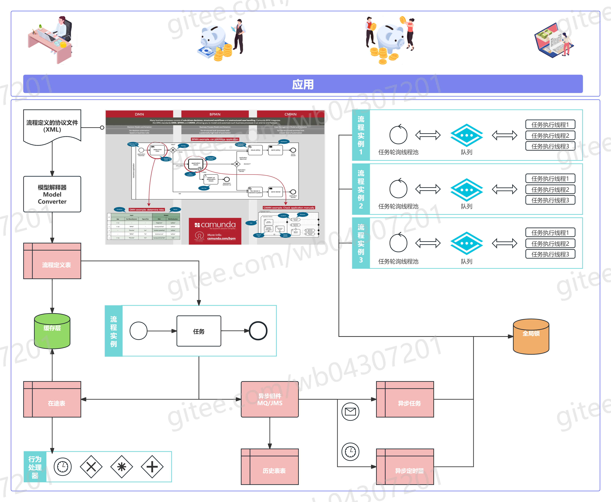

#  流程引擎

## 流程引擎工作原理

## 流程引擎发展历史

#### 选型建议：技术、生态与商业需求平衡
1. **性能与稳定性优先**：Camunda在压力测试中表现优异，适合高并发、复杂流程场景。
2. **动态流程需求**：Flowable支持原生BPMN与复杂迁移，适合需要灵活调整流程的企业。
3. **低代码/快速开发**：Activiti 5/6与Flowable提供基础建模工具，但用户体验需优化；Camunda的Modeler设计器更友好。
4. **长期维护与生态**：Camunda保持活跃迭代，Flowable商业版功能丰富，Activiti需谨慎评估版本兼容性。
