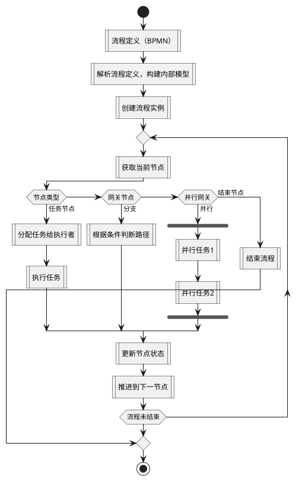

#  流程引擎

## 工作原理
### 工作原理核心环节
1. **流程定义与解析**
    - **建模**：使用BPMN 2.0标准定义流程，包含开始/结束节点、任务节点（用户/系统）、网关（排他/并行/事件）、事件触发器等元素。
    - **解析**：引擎解析BPMN文件，构建内部状态机模型，识别节点依赖关系、条件分支规则及事件触发逻辑。

2. **流程实例化与执行**
    - **实例创建**：基于流程定义创建具体实例，分配唯一ID，初始化流程变量（如业务数据、系统参数）。
    - **执行引擎驱动**：核心引擎（如Camunda PVM）按流程定义顺序推进，通过任务调度器分配任务。例如：
        - **任务分配**：支持用户/组任务、动态表达式分配、委托任务及事件钩子。
        - **路由控制**：根据网关条件（如排他网关分支选择、并行网关同步）决定流程走向，支持循环、子流程调用。
    - **状态管理**：采用状态机模型跟踪节点状态（就绪/执行中/完成），确保状态转换合法性（如任务完成后自动推进至下一节点）。

3. **任务管理与协同**
    - **任务分发**：根据流程定义和当前活动状态，将任务分配给执行者（人工/系统）。
    - **协同控制**：通过任务依赖关系和流程定义协调多执行者间的执行顺序与并发关系，支持上下文数据传递与规则映射。

4. **异常处理与回滚**
    - **异常捕获**：引擎自动检测任务超时、资源不足等异常，触发回滚或重试机制。
    - **回滚策略**：将流程回退至上一安全节点，避免级联失败，并记录异常信息供后续分析。

### PlantUML可视化示例
以下PlantUML活动图展示流程引擎核心执行流程：

**图示说明**：
- **开始/结束**：流程起始与终止节点。
- **循环执行**：重复获取当前节点并处理，直至流程结束。
- **条件分支**：根据节点类型（任务/网关/结束）执行不同逻辑：
    - **任务节点**：分配任务并执行。
    - **网关节点**：处理分支判断或并行任务。
    - **结束节点**：终止流程实例。
- **状态管理**：每个步骤后更新节点状态并推进流程。

## 发展历史
### 起源与早期探索（2000-2009年）
- **jBPM的诞生**：2002年Tom Baeyens发起jBPM项目，2003年发布1.0版本，2004年加入JBoss成为企业中间件核心组件，支持jPDL（工作流定义语言）。2005年jBPM3引入PVM（流程虚拟机），扩展业务功能并整合Hibernate持久化机制，奠定工作流引擎核心架构基础。
- **BPMN标准化启动**：2002年OMG（对象管理组织）制定BPMN 1.0标准，首次统一业务流程建模符号体系；2004年发布BPMN 1.1完善生命周期管理；2011年BPMN 2.0正式发布，支持XML格式执行与图形化建模，成为行业通用标准。

### 分裂与架构革新（2010-2016年）
- **Activiti崛起**：2010年Tom Baeyens离开JBoss后，基于jBPM4开发Activiti5，采用Apache协议并支持BPMN 2.0，成为开源BPM引擎标杆。
- **分支与竞争**：2011年jBPM5由Red Hat主导重构，整合Drools规则引擎；2013年Camunda从Activiti分拆，强化企业级功能（如Camunda Modeler）；2016年Activiti核心团队成立Flowable，2017年Flowable 6.0发布，支持原生BPMN、CMMN（案例管理）及NoSQL数据源，成为微服务架构首选。

### 标准化与生态扩展（2017-2020年）
- **BPMN 2.0深化应用**：企业广泛采用BPMN 2.0标准，实现跨系统流程互操作。Camunda推出Optimize分析工具，Flowable集成DMN（决策模型）支持复杂规则自动化。
- **低代码平台兴起**：米软科技、明道云、蓝凌等平台通过可视化拖拽界面降低开发门槛。例如，米软科技AI流程引擎自动生成标准化流程模板，错误率降低80%；蓝凌采用数字孪生技术预演流程，提升政企客户适配性。
- **云原生架构适配**：Flowable支持Kubernetes集群部署，单机可处理百万级流程实例；Camunda与Spring Boot深度集成，满足微服务架构需求。

### 智能化与行业深化（2021年至今）
- **AI融合趋势**：AI驱动智能流程路由（如自动审批）、流程挖掘与优化。例如，结合机器学习实现动态流程调整，通过RPA（机器人流程自动化）提升端到端自动化水平。
- **低代码+行业垂直化**：米软科技在医疗、金融领域构建行业知识库，内置3000+合规规则引擎；明道云通过开放API市场吸引500+行业插件，支持跨系统流程编排。
- **云原生与Serverless**：Flowable企业版支持Serverless架构，减少数据库负载；Camunda推出Cloud原生版本，适配AWS、Azure等云平台，实现弹性扩缩容。

### 关键技术演进脉络
- **核心架构**：从jBPM的PVM到Activiti的BPMN引擎，再到Flowable的动态过程迁移，引擎逐步支持复杂业务逻辑与多租户架构。
- **标准演进**：BPMN从1.0到2.0，完成从建模到执行的闭环；CMMN、DMN补充案例管理与决策自动化能力。
- **生态扩展**：从单一工作流引擎演变为包含建模工具（如Camunda Modeler）、监控分析（如Camunda Optimize）、低代码平台的完整BPM生态。

## 主流流程引擎
### 开源阵营
1. **Camunda**
    - **核心优势**：全功能支持BPMN 2.0、CMMN、DMN标准，性能稳定且扩展性强。Camunda 7.18版本保留PVM架构，支持复杂流程编排与多版本实例迁移；Camunda 8转向云原生架构（Zeebe引擎），适配微服务场景。
    - **适用场景**：大型企业复杂业务流程、跨系统集成、金融高频交易（如银行信贷审批）。

2. **Flowable**
    - **核心优势**：基于Activiti 6衍生，开源版支持BPMN/CMMN/DMN引擎，商业版提供低代码平台（如Flowable Work）与企业级功能（如高可用、自动化模型）。
    - **适用场景**：中大型企业全生命周期流程管理、低代码快速开发、与Spring生态集成。

3. **Activiti**
    - **版本选择**：Activiti 5/6已停止维护，Activiti 7（云原生）需谨慎选型；推荐关注社区活跃度高的分支（如Flowable）。
    - **适用场景**：轻量级审批流、Java/Spring项目嵌入。

4. **新兴轻量级引擎**
    - **LiteFlow**：国产轻量级引擎，支持XML/JSON/YML规则编排，自带IDEA插件，适合电商订单计算、复杂业务逻辑拆分。
    - **jBPM/Bonita**：jBPM 7+转向Drools Flow，适合Red Hat生态；Bonita提供可视化UI，适合高交互场景。

### 商业阵营
1. **泛微e-workflow**
    - **核心亮点**：全链路智能流程管理，支持“设计-执行-优化”三端一体化。内置AI引擎实时监测300+流程指标，自动生成优化方案；融合电子签章、数字身份认证，适配金融、医疗等高敏行业。
    - **标杆案例**：某省级政务平台实现2000+流程线上化，审批时效提升67%。

2. **用友BIP/钉钉宜搭**
    - **用友BIP**：多租户架构支持集团级流程管控，财务协同领域表现突出。
    - **钉钉宜搭**：200+行业模板库，30分钟上线标准流程（如报销），整合RPA与AI，适合中小企业快速搭建。

3. **国际厂商与垂直领域专家**
    - **Ultimus**：全生命周期流程管理，支持流程挖掘与决策自动化。
    - **FlowPortal**：基于.NET技术，低代码开发模式，适合技术集成需求高的中大型企业。
    - **奥哲·H3BPM**：面向专业开发者，支持微服务架构与多租户模式，适配中国式流程管理。

### 技术趋势：智能、集成、低代码
- **AI驱动**：流程挖掘、智能决策、瓶颈自动识别（如某银行信贷审批效率提升150%）。
- **集成能力**：与ERP/CRM/档案系统深度集成，支持国产数据库（达梦/金仓）与国密算法，满足信创要求。
- **低代码/无代码**：通过可视化设计器（如泛微、Flowable）快速搭建流程，降低开发门槛。
- **云原生与分布式**：Camunda 8、Activiti Cloud支持K8s部署，适配高并发场景（如金融高频交易）。

### 选型建议
- **中小企业**：优先选择开箱即用、模板丰富的商业引擎（如钉钉宜搭、泛微），或轻量级开源引擎（如Activiti 5）。
- **大型企业/复杂场景**：推荐Camunda 7（稳定）、Flowable（扩展性强）或商业全链路方案（如泛微、用友BIP）。
- **特定需求**：金融行业关注分布式引擎（如普元Primeton BPM）；政务/医疗需适配信创与安全标准。
