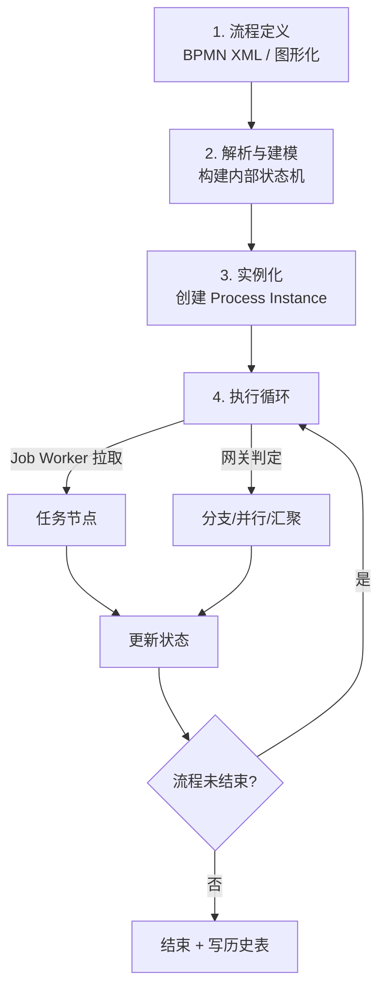
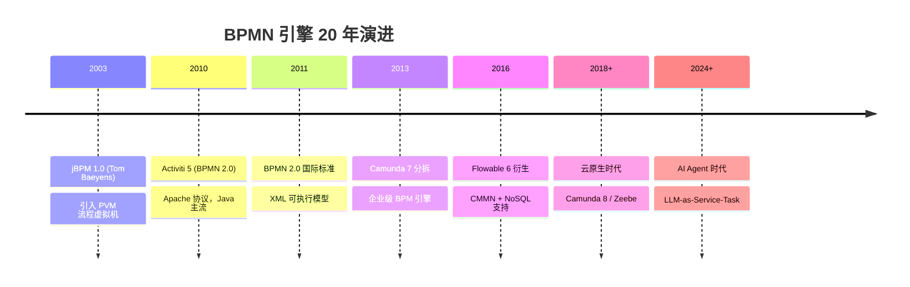

# 流程引擎

> 最后更新: 2026-06-14
> ⬅️ [返回 07 工作流](README.md) | [定义](define/README.md) | [Camunda 7](process-engine/camunda/camunda-7/README.md) | [Camunda 8](process-engine/camunda/camunda-8/README.md) | [微服务编排](workflow-and-microservice-orchestration/README.md)

流程引擎是**解析并执行 BPMN 流程定义**的核心组件，把"图形化流程图"转化为可运行、可监控、可审计的业务执行。本节讲清**工作原理 → 发展史 → 主流引擎 → 选型**。

---

## 🎯 一句话定位

**流程引擎 = BPMN 文件 + Job Executor + 持久化历史表**——读懂 BPMN，驱动任务流转，记录每一步状态。

---

## 一、工作原理（4 阶段）


```mermaid
flowchart TB
    A[1. 流程定义<br/>BPMN XML / 图形化] --> B[2. 解析与建模<br/>构建内部状态机]
    B --> C[3. 实例化<br/>创建 Process Instance]
    C --> D[4. 执行循环]
    D -->|Job Worker 拉取| E[任务节点]
    D -->|网关判定| F[分支/并行/汇聚]
    E --> G[更新状态]
    F --> G
    G --> H{流程未结束?}
    H -->|是| D
    H -->|否| I[结束 + 写历史表]
```

| 阶段 | 关键动作 | 引擎实现 |
|------|---------|---------|
| **1. 流程定义** | 用 BPMN 2.0 XML 描述流程图 | Camunda Modeler / bpmn-js / Flowable Designer |
| **2. 解析建模** | XML → 内部 PVM/StateMachine 模型 | 引擎启动时一次性加载到内存 |
| **3. 实例化** | 分配唯一 InstanceKey，初始化变量 | 写 ACT_RU_EXECUTION / Zeebe PROCESS 表 |
| **4. 执行循环** | Job Executor 拉取待办任务，调用 Worker | 轮询/事件驱动 + 持久化 + 历史归档 |

---

## 二、发展史：5 个里程碑


```mermaid
timeline
    title BPMN 引擎 20 年演进
    2003 : jBPM 1.0 (Tom Baeyens)
         : 引入 PVM 流程虚拟机
    2010 : Activiti 5 (BPMN 2.0)
         : Apache 协议，Java 主流
    2011 : BPMN 2.0 国际标准
         : XML 可执行模型
    2013 : Camunda 7 分拆
         : 企业级 BPM 引擎
    2016 : Flowable 6 衍生
         : CMMN + NoSQL 支持
    2018+ : 云原生时代
         : Camunda 8 / Zeebe
    2024+ : AI Agent 时代
         : LLM-as-Service-Task
```

| 里程碑 | 时间 | 影响 |
|--------|------|------|
| **jBPM 诞生 + PVM** | 2003-2005 | 流程虚拟机（Process Virtual Machine）抽象奠定引擎架构基础 |
| **BPMN 2.0 国际标准** | 2011 | OMG 标准 XML + 图形化，跨厂商可移植性 |
| **Activiti 5 开源** | 2010 | Apache 协议 + BPMN 2.0，Java 生态主流选择 |
| **Camunda 分拆 + Flowable 衍生** | 2013 / 2016 | 社区分裂，企业级 vs 通用两条路线 |
| **云原生 + AI 集成** | 2018+ (Camunda 8/Zeebe) → 2024+ (AI Agent Sub-process) | 分布式架构 + LLM-native 节点 |

---

## 三、主流引擎对比（3 大引擎）

| 维度 | **Camunda 7 / 8** | **Flowable** | **Activiti** |
|------|-------------------|--------------|--------------|
| **架构** | 7 = 嵌入式 Java；8 = 分布式 Zeebe | 嵌入式 Java + CMMN | 嵌入式 Java |
| **标准** | BPMN 2.0 + CMMN + DMN | BPMN 2.0 + CMMN + DMN | BPMN 2.0 |
| **部署** | 7 单体；8 K8s | K8s / Docker | 单体为主 |
| **性能** | 8 = 10K+ 实例/秒（Raft + ES） | 中等（K8s 百万级） | 中等 |
| **AI 集成** | 8.5+ AI Agent Sub-process 原生 | 通过 Service Task 包装 | 需自研 |
| **社区活跃度** | ⭐⭐⭐⭐⭐ | ⭐⭐⭐ | ⭐⭐（5/6 已 EOL）|
| **商业版** | Camunda Cloud / Enterprise | Flowable Work | Alfresco Process Services |
| **国内案例** | 银行/保险/制造业广泛 | 部分央企 | 存量项目为主 |

**简化决策**：

- **要稳定 + 生态成熟 + 中文社区**：Camunda 7
- **要云原生 + 高吞吐 + AI 原生**：Camunda 8
- **要 CMMN + 案例管理 + DMN 决策**：Flowable
- **存量 Spring 项目嵌入**：Activiti 5/7（注意 EOL 风险）

---

## 四、选型决策树

```
Q1: 业务规则是否需要强治理/SOX/HIPAA 合规？
├── 是 → Camunda 7/8 或 Flowable（流程实例可审计）
└── 否 → 继续

Q2: 是否需要 LLM/Agent 决策？
├── 是 → Camunda 8（AI Agent Sub-process）→ [05 AI 工作流](../ai-workflow/bpmn-ai-integration.md)
└── 否 → 继续

Q3: 是否需要云原生 / 高吞吐 / 水平扩展？
├── 是 → Camunda 8 (Zeebe) / Flowable
└── 否 → 继续

Q4: 是否要纯低代码，业务人员配置？
├── 是 → Flowable Work / 钉钉宜搭（注意：后者非 BPMN 标准）
└── 否 → Camunda 7 / Flowable OSS

Q5: 国产化 / 信创要求？
├── 是 → 达梦/金仓/麒麟适配的 Camunda 7 或泛微 e-workflow
└── 否 → Camunda / Flowable
```

---

## 五、新兴 / 垂直引擎

| 引擎 | 定位 | 适用 |
|------|------|------|
| **LiteFlow** | 国产轻量级，XML/JSON/YML 规则编排 | 电商订单计算、复杂业务逻辑拆分 |
| **jBPM 7+** | Red Hat 生态，Drools Flow 整合 | 已用 Red Hat 中间件的团队 |
| **Bonita** | 可视化 UI 强 | 高交互场景、运维人员配置 |
| **泛微 e-workflow** | 国产 OA + 流程引擎一体化 | 政府/国企信创 |
| **钉钉宜搭** | 阿里低代码，30 分钟上线 | 中小企业简单审批（**非标准 BPMN**） |

---

## 🤔 思考

1. **为什么 Camunda 8 要重写 Zeebe 而不是演进 Camunda 7？** 7 依赖关系型 DB + 嵌入式架构，扩展性受限；Zeebe 用 Raft + 追加日志 + ES 解决水平扩展。
2. **Flowable vs Camunda 怎么选？** 核心差异在商业策略——Camunda 强在企业版 + Optimize 分析；Flowable 强在 CMMN 案例管理 + 商业版（Flowable Work）。
3. **BPMN 引擎能否直接编排微服务？** 见 [03 编排](../workflow-and-microservice-orchestration/README.md)——传统 BPMN 适合"人 + 系统"长流程；微服务编排用 Zeebe/Conductor/Cadence 更合适。
4. **AI 时代还需要 BPMN 引擎吗？** 仍然需要——BPMN 提供**确定性、合规、可审计**的骨架，AI Agent 作为节点嵌入。见 [AI + BPMN 融合](../ai-workflow/bpmn-ai-integration.md)。

---

## 相关章节

- ⬅️ [返回 07 工作流](README.md)
- [工作流定义](define/README.md) — 业务/技术视角的工作流概念 + BPMN 三要素
- [Camunda 7 实战](process-engine/camunda/camunda-7/README.md) — SpringBoot 集成 Camunda 7 全流程
- [Camunda 8 / Zeebe](process-engine/camunda/camunda-8/README.md) — 云原生分布式引擎 + AI Agent Sub-process
- [工作流引擎与微服务编排](workflow-and-microservice-orchestration/README.md) — 流程引擎在微服务场景的演化
- [AI + BPMN 融合](ai-workflow/bpmn-ai-integration.md) — 2025-2026 LLM-native 集成模式
