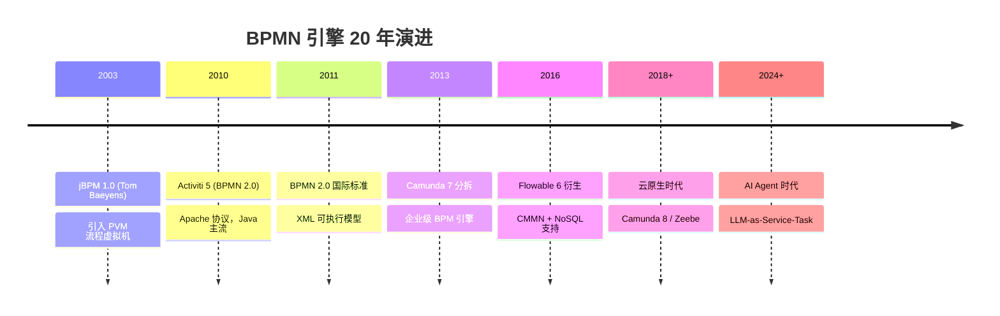

<!--
module:
  parent: workflow
  slug: workflow/process-engine
  type: article
  category: 主模块子文章
  summary: 流程引擎
-->

# 流程引擎

> 最后更新: 2026-06-14
> ⬅️ [返回 07 工作流](README.md) | [定义](../../README.md) | [Camunda 7](../../README.md) | [Camunda 8](../../README.md) | [微服务编排](../../README.md)

流程引擎是**解析并执行 BPMN 流程定义**的核心组件，把"图形化流程图"转化为可运行、可监控、可审计的业务执行。本节讲清**工作原理 → 发展史 → 主流引擎 → 选型**。

---
## 引言：架构困境

流程引擎 的关键不是'选型'——是**选完之后怎么在 5 个 trade-off 里活下来**。

本篇用'决策困境'切入，比较几种主流路径并讲清取舍。

---

## 🎯 一句话定位

**流程引擎 = BPMN 文件 + Job Executor + 持久化历史表**——读懂 BPMN，驱动任务流转，记录每一步状态。

---

## 📚 章节导航（6 节 + 4 实战文件）

| 节 | 内容 | 何时读 |
|:---|:-----|:------|
| **一、工作原理** | 4 阶段：定义 → 解析 → 实例化 → 执行循环 | 理解引擎如何工作 |
| **二、发展史** | 5 里程碑：jBPM 2003 → BPMN 2.0 2011 → Activiti → Camunda → Zeebe → AI | 了解技术演进 |
| **三、3 大引擎对比** | Camunda / Flowable / Activiti 9 维对比 | 评估主流引擎 |
| **四、选型决策树** | 5 维度 Q&A（合规/AI/吞吐/低代码/国产化）| 第一次选型 |
| **五、新兴/垂直引擎** | LiteFlow / jBPM / Bonita / 泛微 / 钉钉宜搭 | 评估长尾选项 |
| **六、2025-2026 趋势** | 5 引擎演进 + 3 宏观趋势 + 国内 4 类企业选型 | 跟进最新发展 |
| **实战文件** | [Camunda 7](camunda/camunda-7/) / [Camunda 8](camunda/camunda-8/) / [Zeebe](camunda/camunda-8/zeebe/) | 落地参考 |

> 💡 **阅读路径**：入门 → 1 → 2 → 3 → 4；评估选型 → 4 → 6；准备实战 → 4 → Camunda 7/8/Zeebe 实战文件。

---

## ⚡ 4 引擎 + 4 概念速查

### 主流引擎

| 引擎 | 架构 | 一句话定义 | 何时选 |
|:-----|:-----|:----------|:------|
| **Camunda 7** | 嵌入式 Java + 关系型 DB | 经典 PVM 引擎，企业级生产事实标准 | 强治理 + 国产化 + 存量维护 |
| **Camunda 8 / Zeebe** | 分布式 + 追加日志 + ES | 云原生 + AI 原生，10K+ 实例/秒 | 新项目默认 / 高吞吐 / AI 集成 |
| **Flowable** | 嵌入式 Java + CMMN/DMN | 案例管理 + 决策表强 | 需要 CMMN 案例管理 |
| **Activiti** | 嵌入式 Java | 历史悠久的 BPMN 引擎 | 存量项目（5/6 已 EOL）|

### 核心概念

| 概念 | 一句话定义 | 何时关心 |
|:-----|:----------|:---------|
| **BPMN 2.0** | OMG 业务流程建模国际标准 | 所有流程引擎都遵循 |
| **PVM** | 流程虚拟机（jBPM 引入）| Camunda 7 架构基础 |
| **CMMN** | 案例管理与建模规范 | Flowable 支持 |
| **DMN** | 决策模型与符号 | 业务规则决策表 |

> 📌 完整对比表见 [§三 3 大引擎对比](#三主流引擎对比3-大引擎)；详细特性见 [Camunda 7](camunda/camunda-7/) / [Camunda 8](camunda/camunda-8/) / [Zeebe](camunda/camunda-8/zeebe/)。

---

## 一、工作原理（4 阶段）

```mermaid
flowchart TB
    A["1️⃣ 流程定义<br/>BPMN XML / 图形化"] --> B["2️⃣ 解析与建模<br/>构建内部状态机"]
    B --> C["3️⃣ 实例化<br/>创建 Process Instance"]
    C --> D["4️⃣ 执行循环"]

    D -->|"Job Worker 拉取"| E["任务节点<br/>User / Service / Send"]
    D -->|"网关判定"| F["分支/并行/汇聚<br/>Exclusive / Parallel"]

    E --> G["更新状态<br/>持久化 + 历史"]
    F --> G

    G --> H{"流程未结束?"}
    H -->|"是"| D
    H -->|"否"| I["结束 + 写历史表<br/>act_hi_*"]

    classDef stage fill:#e3f2fd,stroke:#1976d2,stroke-width:2px
    classDef loop fill:#fff3e0,stroke:#f57c00,stroke-width:2px
    classDef end fill:#e8f5e9,stroke:#388e3c,stroke-width:2px
    class A,B,C,D stage
    class E,F,G,H loop
    class I end
```

| 阶段 | 关键动作 | 引擎实现 |
|------|---------|---------|
| **1. 流程定义** | 用 BPMN 2.0 XML 描述流程图 | Camunda Modeler / bpmn-js / Flowable Designer |
| **2. 解析建模** | XML → 内部 PVM/StateMachine 模型 | 引擎启动时一次性加载到内存 |
| **3. 实例化** | 分配唯一 InstanceKey，初始化变量 | 写 ACT_RU_EXECUTION / Zeebe PROCESS 表 |
| **4. 执行循环** | Job Executor 拉取待办任务，调用 Worker | 轮询/事件驱动 + 持久化 + 历史归档 |

---

## 二、发展史：5 个里程碑


```mermaid
timeline
    title BPMN 引擎 20 年演进
    2003 : jBPM 1.0 (Tom Baeyens)
         : 引入 PVM 流程虚拟机
    2010 : Activiti 5 (BPMN 2.0)
         : Apache 协议，Java 主流
    2011 : BPMN 2.0 国际标准
         : XML 可执行模型
    2013 : Camunda 7 分拆
         : 企业级 BPM 引擎
    2016 : Flowable 6 衍生
         : CMMN + NoSQL 支持
    2018+ : 云原生时代
         : Camunda 8 / Zeebe
    2024+ : AI Agent 时代
         : LLM-as-Service-Task
```

| 里程碑 | 时间 | 影响 |
|--------|------|------|
| **jBPM 诞生 + PVM** | 2003-2005 | 流程虚拟机（Process Virtual Machine）抽象奠定引擎架构基础 |
| **BPMN 2.0 国际标准** | 2011 | OMG 标准 XML + 图形化，跨厂商可移植性 |
| **Activiti 5 开源** | 2010 | Apache 协议 + BPMN 2.0，Java 生态主流选择 |
| **Camunda 分拆 + Flowable 衍生** | 2013 / 2016 | 社区分裂，企业级 vs 通用两条路线 |
| **云原生 + AI 集成** | 2018+ (Camunda 8/Zeebe) → 2024+ (AI Agent Sub-process) | 分布式架构 + LLM-native 节点 |

---

## 三、主流引擎对比（3 大引擎）

| 维度 | **Camunda 7 / 8** | **Flowable** | **Activiti** |
|------|-------------------|--------------|--------------|
| **架构** | 7 = 嵌入式 Java；8 = 分布式 Zeebe | 嵌入式 Java + CMMN | 嵌入式 Java |
| **标准** | BPMN 2.0 + CMMN + DMN | BPMN 2.0 + CMMN + DMN | BPMN 2.0 |
| **部署** | 7 单体；8 K8s | K8s / Docker | 单体为主 |
| **性能** | 8 = 10K+ 实例/秒（Raft + ES） | 中等（K8s 百万级） | 中等 |
| **AI 集成** | 8.5+ AI Agent Sub-process 原生 | 通过 Service Task 包装 | 需自研 |
| **社区活跃度** | ⭐⭐⭐⭐⭐ | ⭐⭐⭐ | ⭐⭐（5/6 已 EOL）|
| **商业版** | Camunda Cloud / Enterprise | Flowable Work | Alfresco Process Services |
| **国内案例** | 银行/保险/制造业广泛 | 部分央企 | 存量项目为主 |

**简化决策**：

- **要稳定 + 生态成熟 + 中文社区**：Camunda 7
- **要云原生 + 高吞吐 + AI 原生**：Camunda 8
- **要 CMMN + 案例管理 + DMN 决策**：Flowable
- **存量 Spring 项目嵌入**：Activiti 5/7（注意 EOL 风险）

---

## 四、选型决策树

```
Q1: 业务规则是否需要强治理/SOX/HIPAA 合规？
├── 是 → Camunda 7/8 或 Flowable（流程实例可审计）
└── 否 → 继续

Q2: 是否需要 LLM/Agent 决策？
├── 是 → Camunda 8（8.5+ AI Agent Sub-process）+ 自研 Zeebe AI Worker 包装 LLM
└── 否 → 继续

Q3: 是否需要云原生 / 高吞吐 / 水平扩展？
├── 是 → Camunda 8 (Zeebe) / Flowable
└── 否 → 继续

Q4: 是否要纯低代码，业务人员配置？
├── 是 → Flowable Work / 钉钉宜搭（注意：后者非 BPMN 标准）
└── 否 → Camunda 7 / Flowable OSS

Q5: 国产化 / 信创要求？
├── 是 → 达梦/金仓/麒麟适配的 Camunda 7 或泛微 e-workflow
└── 否 → Camunda / Flowable
```

---

## 五、新兴 / 垂直引擎

| 引擎 | 定位 | 适用 |
|------|------|------|
| **LiteFlow** | 国产轻量级，XML/JSON/YML 规则编排 | 电商订单计算、复杂业务逻辑拆分 |
| **jBPM 7+** | Red Hat 生态，Drools Flow 整合 | 已用 Red Hat 中间件的团队 |
| **Bonita** | 可视化 UI 强 | 高交互场景、运维人员配置 |
| **泛微 e-workflow** | 国产 OA + 流程引擎一体化 | 政府/国企信创 |
| **钉钉宜搭** | 阿里低代码，30 分钟上线 | 中小企业简单审批（**非标准 BPMN**） |

---

## 六、2025-2026 流程引擎新趋势

| 引擎 | 关键演进 | 影响 |
|:-----|:---------|:-----|
| **Camunda 7** | v7.21 LTS（2024）+ 维护期延长到 2028+ | 存量企业可安心使用，**不再新增大特性** |
| **Camunda 8** | 8.5 AI Agent → 8.7 表单生成器 → 8.8 协同编辑 | 业务 + IT 协同设计，AI 原生加速 |
| **Flowable** | 7.x 引入 **AI 任务节点** + 国产化适配 | 与 Camunda 8.5 正面竞争 |
| **Activiti** | v7 已 EOL，社区转 Cloud | 存量项目应规划迁移 |
| **Zeebe（独立）** | 1.x 社区版仍维护 | Camunda 主导，企业用户用 Camunda 8 |

**3 大宏观趋势**：

1. **AI 原生化**：所有引擎都在加 LLM 节点（Camunda 8.5+ AI Agent / Flowable 7 AI Task / Zeebe AI Worker）
2. **云原生 + 多区域**：K8s + 跨地域灾备（Camunda 8.6+ Identity Federation）成为大客户入场券
3. **业务可读 vs 工程师灵活**：BPMN（Camunda/Zeebe）vs 代码 DSL（Temporal）长期共存

**国内观察**：

- **银行/政务**：Camunda 7 仍是首选（国产化 + 监管成熟）
- **互联网中大厂**：Camunda 8 / Zeebe（云原生 + AI 集成）
- **SaaS / 跨境电商**：Zeebe + LangGraph / Dify 混合架构
- **AI 创业公司**：Dify / Coze（快速上线） + 复杂场景 LangGraph

**选型一句话**：

> 2026 年新项目默认选 **Camunda 8 / Zeebe**（除非强治理 / 国产化约束 Camunda 7）；AI 节点用 **fromAi() / 自研 Zeebe AI Worker**；复杂 Agent 编排用 **LangGraph**（详见 [BPMN+AI 融合](../../11.ai/04-architecture/bpmn-ai-integration.md)）。

---

## 🤔 思考

1. **为什么 Camunda 8 要重写 Zeebe 而不是演进 Camunda 7？** 7 依赖关系型 DB + 嵌入式架构，扩展性受限；Zeebe 用 Raft + 追加日志 + ES 解决水平扩展。
2. **Flowable vs Camunda 怎么选？** 核心差异在商业策略——Camunda 强在企业版 + Optimize 分析；Flowable 强在 CMMN 案例管理 + 商业版（Flowable Work）。
3. **BPMN 引擎能否直接编排微服务？** 见 [03 编排](../workflow-and-microservice-orchestration/README.md)——传统 BPMN 适合"人 + 系统"长流程；微服务编排用 Zeebe/Conductor/Cadence 更合适。
4. **AI 时代还需要 BPMN 引擎吗？** 仍然需要——BPMN 提供**确定性、合规、可审计**的骨架；如需 AI 节点，可在 Camunda 8.5+ 中用 AI Agent Sub-process（[Camunda 8](../../README.md)），或在 Zeebe Job Worker 中包装自研 LLM 调用（[Zeebe](../../README.md)）。
5. **2026 年选 BPMN 引擎的默认值？** **Camunda 8 / Zeebe**。**Camunda 7** 仅在 ① 强治理（银行/政务）② 国产化（麒麟/达梦）③ 存量维护 三个场景下选。**Flowable** 仅在需要 CMMN 案例管理时选。**Activiti** 新项目不选。

---

## 相关章节

- ⬅️ [返回 07 工作流](README.md)
- [工作流定义](../../README.md) — 业务/技术视角的工作流概念 + BPMN 三要素
- [Camunda 7 实战](../../README.md) — SpringBoot 集成 Camunda 7 全流程
- [Camunda 8 / Zeebe](../../README.md) — 云原生分布式引擎 + AI Agent Sub-process
- [工作流引擎与微服务编排](../../README.md) — 流程引擎在微服务场景的演化
- [事件驱动与 Serverless Workflow](../apache-eventmesh/README.md) — 事件驱动作为工作流的神经系统
