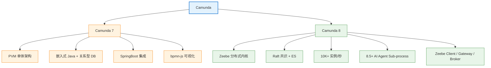

# Camunda 引擎

> Camunda 7 与 Camunda 8 (Zeebe) 两大版本的导航与对比

---
## 引言：反直觉代码

Camunda 引擎 的关键不是语法——是**看起来对**的代码背后那些'踩坑点'。

本篇用 3 个反直觉片段切入，把面试/生产中常被问起、但一深入就漏馅的点摆出来。

---

## 导航

| 序号 | 主题 | 核心内容 |
|------|------|---------|
| 1 | [camunda-7/](camunda-7/README.md) | SpringBoot 集成、bpmn-js 集成、5 大任务节点类型、PVM 单体架构 |
| 2 | [camunda-8/](camunda-8/README.md) | 云原生 + 10K+ 实例/秒、8.5+ AI Agent Sub-process、Zeebe 内核 |

---

## 知识脉络

---

## 7 vs 8 快速对比

| 维度 | Camunda 7 | Camunda 8 |
|------|-----------|-----------|
| **架构** | PVM 单体（嵌入式）| Zeebe 分布式（K8s）|
| **存储** | 关系型 DB（MySQL/Oracle）| 追加日志 + Elasticsearch |
| **扩展** | 垂直扩展 | 水平扩展（分区 + Raft）|
| **吞吐** | ~数百实例/秒 | 10K+ 实例/秒 |
| **AI 集成** | 需自研 | 8.5+ AI Agent Sub-process |
| **部署** | jar 嵌入 / 独立部署 | Docker / K8s |
| **适用** | 银行/政务/国产化/存量 | 新项目/云原生/高吞吐 |

---

## 选型一句话

> **Camunda 7**：强治理 + 国产化（信创）+ 存量项目  
> **Camunda 8**：云原生 + 高吞吐 + AI 集成（新项目默认）

---

## 相关章节

- 上游：[`流程引擎`](../README.md) — 4 阶段工作原理、3 大引擎对比、5 维选型决策树
- 上游：[`07 工作流`](../../README.md) — BPMN 骨架 + 事件神经
- 关联：[`Zeebe 内核`](camunda-8/zeebe/README.md) — Camunda 8 底层架构
- 关联：[`事件驱动`](../../apache-eventmesh/README.md) — Serverless Workflow 与 EventMesh
- 关联：[`微服务编排`](../../workflow-and-microservice-orchestration/README.md) — 编舞 vs 编排

---

> 建议路径：先读 [流程引擎 README](../README.md) 理解工作原理 → 根据选型决定看 7 或 8 → 深入对应子目录
