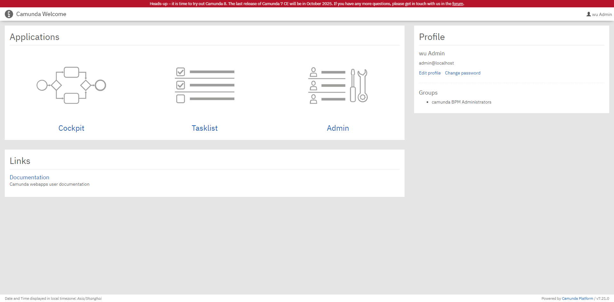

<!--
module:
  parent: workflow
  slug: workflow/camunda-7
  type: article
  category: 主模块子文章
  summary: Camunda 7
-->

# Camunda 7

> 最后更新: 2026-06-14
> ⬅️ [返回 07 工作流](../../../README.md) | [流程引擎](../../README.md) | [Camunda 8](../camunda-8/README.md) | [Zeebe](../camunda-8/zeebe/README.md) | [工作流定义](../../../define/README.md)

## 🎯 一句话定位

**Camunda 7 = BPMN 2.0 嵌入式 Java 引擎 + SpringBoot 集成 + bpmn-js 可视化建模**——经典单体架构，企业级生产环境的事实标准（v7.21+）。

---
## 引言：反直觉代码

Camunda 7 的关键不是语法——是**看起来对**的代码背后那些'踩坑点'。

本篇用 3 个反直觉片段切入，把面试/生产中常被问起、但一深入就漏馅的点摆出来。

---

## 📚 章节导航（4 节 + 决策表）

| 节 | 内容 | 何时读 |
|:---|:-----|:------|
| **一、SpringBoot 集成** | Maven 依赖 + h2 配置 + Swagger + bpmn-js 前端 | 第一次搭 Camunda 7 项目 |
| **二、Task 节点用途** | 5 任务节点（User/Manual/Service/Send/Receive）对比 | 设计流程时选节点 |
| **三、对比与演进** | Camunda 7 vs 8 决策表 | 评估是否迁移到 8 |
| **四、真实案例** | 银行业 50 万件/年信贷审批 | 看生产落地参考 |

> 💡 **新项目建议**：直接 [Camunda 8 / Zeebe](../camunda-8/README.md)——除非强治理 + 国产化约束（Camunda 7 仍是首选）。

---

## ⚡ 5 任务节点速查

| 节点 | 触发者 | 阻塞？ | 一句话定义 | 典型场景 |
|:-----|:-----|:-----|:----------|:---------|
| **User Task** | 人工（指派用户/组）| ✅ | **引擎可追踪**的人工待办 | 审批 / 审核 / 表单收集 |
| **Manual Task** | 人工（外部触发）| ✅ | **引擎不可见**的人工介入 | 流程外临时操作 |
| **Service Task** | 系统（JavaDelegate）| ✅ | **同步执行**业务逻辑 | 调 HTTP / 业务计算 / 邮件 |
| **Send Task** | 系统（Connector）| ❌ | **发送即返回**的异步通知 | 发邮件 / 触发外部流程 |
| **Receive Task** | 外部系统消息 | ✅ | **等待回调**的握手节点 | 等待支付结果 / 物流签收 |

**关键记忆点**：

- **User vs Manual**：User 在待办列表，Manual 不在
- **Service vs Send**：Service 同步阻塞，Send 异步不阻塞
- **Receive**：唯一"反向等待"的节点，外部驱动流程前进

> 📌 完整节点用途 + 选型口诀见 [§三 5 任务节点对比表](#三5-任务节点对比表)（本文下方）。

---

## 一、SpringBoot 集成 Camunda 7

### （一）从 Maven 集成 Camunda 7 到 SpringBoot

**1. 创建 SpringBoot 项目**（包含 Mybatis 和 h2 数据库驱动）

**2. 添加依赖**

```xml
    <dependency>
        <groupId>org.camunda.bpm.springboot</groupId>
        <artifactId>camunda-bpm-spring-boot-starter</artifactId>
        <version>7.21.0</version>
    </dependency>
    <dependency>
        <groupId>org.camunda.bpm.springboot</groupId>
        <artifactId>camunda-bpm-spring-boot-starter-rest</artifactId>
        <version>7.21.0</version>
    </dependency>
    <dependency>
        <groupId>org.camunda.bpm.springboot</groupId>
        <artifactId>camunda-bpm-spring-boot-starter-webapp</artifactId>
        <version>7.21.0</version>
    </dependency>
```

**3. 添加配置**

```yaml
# camunda登录信息配置
camunda.bpm:
  admin-user:
    id: admin  #???
    password: 123456  #??
    firstName: wu
  filter:
    create: All tasks

# h2连接信息
spring:
  datasource:
    url: jdbc:h2:file:./data/demo;AUTO_SERVER=TRUE
    username: sa
    password:
    driverClassName: org.h2.Driver
```

**4. 启动**

启动时生成 Camunda 7 数据库表结构：

| 模块      | 表明                | 说明                                                     |
|---------|-------------------|--------------------------------------------------------|
| ACT_ID_ |                   | 用户模块                                                   |
| ACT_HI_ |                   | 流程历史记录                                                 |
| ACT_HI_ | act_hi_actinst    | 执行的活动历史                                                |
| ACT_HI_ | act_hi_taskinst   | 执行任务历史                                                 |
| ACT_HI_ | act_hi_procinst   | 执行流程实例历史                                               |
| ACT_HI_ | act_hi_varinst    | 流程变量历史表                                                |
| ACT_RE  |                   | 流程资源存储                                                 |
| ACT_RE  | act_re_procdef    | 流程定义存储                                                 |
| ACT_RE  | act_re_deployment | 自动部署，springboot每次启动都会重新部署，生成记录                         |
| ACT_RU_ |                   | 流程运行时表数据，流程结束后会删除                                      |
| ACT_RU  | act_ru_execution  | 运行时流程实例                                                |
| ACT_RU  | act_ru_task       | 运行时的任务                                                 |
| ACT_RU  | act_ru_variable   | 运行时的流程变量                                               |
| ACT_GE_ |                   | 流程通用数据                                                 |
| ACT_GE_ | act_ge_bytearray  | 每次部署的文件2进制数据，所以如果文件修改后，重启也没用，因为重新生成了记录，需要清掉数据库，或者这个表记录 |

启动时 [控制台](http://localhost:8080/) 界面  



### （二）集成 Camunda 7 Swagger 到项目

**1. 添加 Camunda 7 的 Swagger**

添加仓库：

```xml
    <repositories>
        <repository>
            <id>camunda</id>
            <name>camunda</name>
            <url>https://artifacts.camunda.com/artifactory/public/</url>
        </repository>
    </repositories>
```

添加依赖：

```xml
        <dependency>
            <groupId>org.camunda.bpm.run</groupId>
            <artifactId>camunda-bpm-run-modules-swaggerui</artifactId>
            <version>${camunda7.version}</version>
        </dependency>
```

访问 [Swagger](http://localhost:8080/swaggerui/)  


### （三）集成 bpmn 设计到项目

**1. 创建 ui 以及编译前端插件**

创建 vite + react 前端项目 ui。

**2. 后端添加前端编译插件**

```xml
<plugin>
    <groupId>com.github.eirslett</groupId>
    <artifactId>frontend-maven-plugin</artifactId>
    <configuration>
        <workingDirectory>./ui</workingDirectory>
    </configuration>
    <executions>
        <execution>
            <id>install node and yarn</id>
            <goals>
                <goal>install-node-and-yarn</goal>
            </goals>
            <configuration>
                <nodeVersion>v18.20.4</nodeVersion>
                <yarnVersion>v1.22.19</yarnVersion>
            </configuration>
        </execution>
        <execution>
            <id>yarn install</id>
            <goals>
                <goal>yarn</goal>
            </goals>
            <phase>generate-resources</phase>
            <configuration>
                <arguments>install</arguments>
            </configuration>
        </execution>
        <execution>
            <id>yarn build</id>
            <goals>
                <goal>yarn</goal>
            </goals>
            <phase>generate-resources</phase>
            <configuration>
                <arguments>build</arguments>
            </configuration>
        </execution>
    </executions>
</plugin>
```

修改 `vite.config.js` 调整编译输出位置：

```javascript
import {defineConfig} from 'vite'
import react from '@vitejs/plugin-react'

// https://vitejs.dev/config/
export default defineConfig({
    plugins: [react()],
    build: {
        outDir: '../target/classes/META-INF/resources',
    },
})
```

`mvn install` 后启动项目：  


**3. 添加 less**

```shell
yarn add less --dev
```

修改 `vite.config.js` 添加 less：

```javascript
import { defineConfig } from 'vite'
import react from '@vitejs/plugin-react'

// https://vitejs.dev/config/
export default defineConfig({
  plugins: [react()],
  build: {
    outDir: '../target/classes/META-INF/resources',
  },
  css: {
    preprocessorOptions: {
      less: {
        javascriptEnabled: true, // 支持内联 JavaScript
        modifyVars: { // 更改主题
        }
      }
    }
  }
})
```

**4. 增加 bpmn.js**

```shell
yarn add bpmn-js bpmn-js-properties-panel @bpmn-io/properties-panel camunda-bpmn-moddle
```

添加自定义的国际化 i18n：

```javascript
// translations.jsx（节选）
export default {
    "Ad-hoc": "临时",
    "Add lane above": "在上方添加泳道",
    "Append end event": "追加结束事件",
    "Append gateway": "追加网关",
    "Append task": "追加任务",
    "Call activity": "调用活动",
    "Create end event": "创建结束事件",
    "Create start event": "创建开始事件",
    "Delete": "删除",
    "End event": "结束事件",
    "User Task": "用户任务",
    "Service Task": "服务任务",
    "Business rule task": "业务规则任务",
    "Process": "流程",
    "Name": "名称",
    // ... 100+ 词条（工具栏/节点/属性面板）
};
```

> 📌 **完整 i18n 字典**含 100+ 词条，与 bpmn-js 官方英文资源一一对应。**生产项目建议直接引入 [bpmn-js-i18n-zh](https://github.com/ajaxlinux123/bpmn-js-i18n-zh) 现成库**。

```javascript
// customTranslate.jsx

import translations from './translations';

export default function customTranslate(template, replacements) {
    replacements = replacements || {};

    // Translate
    template = translations[template] || template;

    // Replace
    return template.replace(/{([^}]+)}/g, function(_, key) {
        return replacements[key] || '{' + key + '}';
    });
}
```

添加编辑器 CustomModeler 并使用国际化进行汉化：

```javascript
// Camunda7Modeler/index.jsx

import {useEffect, useState} from "react";
import css from './index.module.less'
import BpmnModeler from 'camunda-bpmn-js/lib/camunda-platform/Modeler';
import 'camunda-bpmn-js/dist/assets/camunda-platform-modeler.css';
import customTranslate from '../i18n/customTranslate/customTranslate.jsx';


const Camunda7Modeler = () => {

    const [modelerInstance, setModelerInstance] = useState({})

    useEffect(() => {
        const customTranslateModule = {
            translate: ['value', customTranslate]
        };

        const modeler = new BpmnModeler({
            container: '#js-canvas',
            keyboard: {
                bindTo: window
            },
            propertiesPanel: {
                parent: '#js-properties-panel'
            },
            additionalModules: [
                customTranslateModule
            ],
        });

        // 注册bpmn实例
        const instance = {
            modeler: modeler,
            modeling: modeler.get("modeling"),
            moddle: modeler.get("moddle"),
            eventBus: modeler.get("eventBus"),
            bpmnFactory: modeler.get("bpmnFactory"),
            elementRegistry: modeler.get("elementRegistry"),
            replace: modeler.get("replace"),
            selection: modeler.get("selection"),
        };

        setModelerInstance(instance)

        // 通过 importXML 加载 BPMN XML（典型示例：开始事件 → 任务 → 排他网关）
        const sampleXml = "<?xml version="1.0" encoding="UTF-8"?><definitions xmlns="http://www.omg.org/spec/BPMN/20100524/MODEL">...完整 40 行示例 XML（bpmn.io 默认）...</definitions>";
        modeler.importXML(sampleXml);

        modeler.get('canvas').zoom('fit-viewport');
    }, []);

    return (
        <div className={css.customModeler}>
            <div id="js-canvas" className={css.jsCanvas}></div>
            <div id="js-properties-panel" className={css.jsPropertiesPanel}></div>
            <button onClick={async () => {
                const xml = await modelerInstance.modeler.saveXML({format: true})
                console.log(xml)
            }}>printxml</button>
        </div>
    )
}

export default Camunda7Modeler;
```


## 二、Task 节点用途

### （一）User Task（用户任务）

Camunda 中的 User Task 用于在流程中定义人工任务，需要一个人来执行该任务并提供相关信息。通常，User Task 在业务流程中用于需要人类干预的步骤，例如审核、审批、调查等。

**User Task 具有以下特性**：

1. 指派任务给具体的用户或用户组。
2. 指定任务的截止日期。
3. 定义任务表单以收集用户输入。
4. 提供一些其他配置选项，例如对任务完成后的后续步骤进行处理等。

### （二）Manual Task（手动任务）

Camunda 的 Manual Task 用于在流程中暂停执行，直到人工干预完成某个任务。与 User Task 不同，Manual Task 没有分配给特定用户或用户组，而是需要手动启动并指定下一步流程。

**Manual Task 可以用于以下场景**：

1. **等待人工干预**：当流程需要人工干预才能继续时，Manual Task 可以暂停流程执行，直到干预完成。例如，审核或批准某些事情。
2. **等待外部系统**：当流程需要等待外部系统或服务完成某些任务时，Manual Task 可以作为一个占位符，直到外部系统或服务完成任务并向 Camunda 发送信号。

与 User Task 不同，Manual Task 不需要在 Camunda 表单设计器中定义任务表单。相反，Manual Task 只是一个简单的暂停节点，直到流程执行到 Manual Task 时才需要人工干预。

### （三）Service Task（服务任务）

在 Camunda 中，Service Task 是一种用于执行特定业务逻辑的节点。Service Task 节点可以执行各种类型的操作，例如计算、数据转换、数据格式化等，这些操作通常需要使用编程语言来实现。

**Service Task 节点与其他类型的任务节点（例如用户任务节点、脚本任务节点、外部任务节点等）相比，具有以下特点**：

1. Service Task 节点执行的业务逻辑是预定义的，不需要人工干预。
2. Service Task 节点可以使用各种编程语言实现，例如 Java、JavaScript、Python 等。
3. Service Task 节点可以访问 Camunda 引擎中的各种服务和功能，例如历史记录、流程变量等。
4. Service Task 节点可以与其他类型的任务节点组合使用，以实现更为复杂的业务逻辑。

在 Camunda 中，Service Task 节点通常用于执行不需要与外部系统进行交互的业务逻辑。例如，计算员工薪水、格式化日期、解析 XML 等任务都可以使用 Service Task 节点来实现。由于 Service Task 节点可以使用多种编程语言实现，因此可以轻松地扩展和修改节点的功能，以满足不同的业务需求。

### （四）Send Task（发送任务）

Camunda 的 Send Task 用于向外部系统或服务发送消息。消息可以是同步或异步的，可以发送到队列、主题或其他类型的消息中间件。Send Task 通常用于将消息发送到外部系统，而无需等待响应或结果。相反，它只是向外部系统发出信号，通知其执行某些操作或启动某个过程。

**Send Task 可以用于以下场景**：

1. **启动外部流程**：Send Task 可以向外部系统发送消息，以启动一个过程或任务。例如，发送一封电子邮件通知用户审核流程已经启动。
2. **异步消息提升效率**：当流程需要等待某个操作完成时，Send Task 可用于向外部系统发送异步消息，以便流程可以继续执行。例如，在订单流程中，当订单被创建时，可以使用 Send Task 向库存管理系统发送异步消息，以更新库存。

### （五）Receive Task（接收任务）

Camunda 的 Receive Task 用于在流程中等待外部系统或服务发送消息。当接收到消息后，Receive Task 将流程继续执行。Receive Task 通常用于与 Send Task 配合使用，以便流程可以在发送和接收消息之间进行交互。

**Receive Task 可以用于以下场景**：

1. **等待外部消息**：当流程需要等待某个操作完成时，Receive Task 可以用于等待外部系统发送消息，以便订单流程可以继续执行。例如，在订单流程中，当库存管理系统更新库存后，可以使用 Receive Task 等待外部系统发送消息。
2. **等待用户输入**：Receive Task 还可以用于等待用户输入或操作以继续流程。例如，在审批流程中，可以使用 Receive Task 等待用户批准或拒绝请求。

---

## 三、5 任务节点对比表

| 节点 | 触发者 | 阻塞？ | 适用场景 | 关键配置 |
|:-----|:-----|:-----|:-----|:-----|
| **User Task** | 人工（指派用户/组）| ✅ 直到完成 | 审批 / 审核 / 表单收集 | assignee / candidateGroups / formKey |
| **Manual Task** | 人工（外部触发）| ✅ 暂停 | 流程外的人工介入 | 走流程图，无表单 |
| **Service Task** | 系统（JavaDelegate / Expression）| ✅ 同步阻塞 | 调业务逻辑 / HTTP / 邮件 | class / expression / delegateExpression |
| **Send Task** | 系统（Connector）| ❌ 发送即返回 | 异步通知 / 触发外部流程 | type (http/email/kafka) |
| **Receive Task** | 外部系统消息 | ✅ 等待回调 | 等待外部任务完成 | messageRef / signalRef |

**选型口诀**：

- **需要人填表 + 待办追踪** → User Task（90% 场景）
- **流程外介入 / 临时插入** → Manual Task（少见）
- **同步业务逻辑 / 调 HTTP** → Service Task（核心）
- **异步通知 / 触发外部** → Send Task（解耦）
- **等待回调 / 多系统握手** → Receive Task（编排场景）

---

## 四、Camunda 7 真实落地案例

### 案例：某股份制银行住房按揭审批

| 维度 | 数据 |
|------|------|
| **业务** | 个人住房按揭贷款审批 |
| **规模** | 年度 50 万+ 申请 |
| **技术栈** | Spring Boot + Camunda 7.20 + Oracle + 国产化（麒麟 OS / 达梦 DB）|
| **节点数** | 30+ 审批节点（客户经理 → 风控 → 主管 → 终审 → 合规）|
| **关键设计** | 流程实例 100% 留痕（银保监要求），Service Task 调 8 个外部系统（征信 / 房产估值 / 税务）|
| **效果** | 审批时效 5 天 → 1.5 天，违规率 ↓ 80% |

**为什么选 Camunda 7 而非 8？**

- 强治理 + 单库事务：ACID 满足监管要求
- 国产化适配：麒麟 / 达梦 7 案例多，8 还在补
- 工程师熟悉度：团队 5 年 Camunda 7 积累
- 业务可读：业务人员可参与流程图设计（BPMN 优势）

> 参考对比表：[流程引擎](../../README.md) §三 3 大引擎 | [Camunda 7 vs 8 决策矩阵](../camunda-8/README.md#四决策矩阵camunda-7-vs-8)

---

## 🤔 思考

1. **Camunda 7 仍是企业生产首选吗？** 截至 2026 年，Camunda 7 仍维护中（v7.21+），存量企业（银行/保险/制造业）的 PVM 架构 + 单库事务模型符合强治理场景；新项目建议直接 Camunda 8。
2. **为什么 bpmn-js 集成要拆 React 微前端？** bpmn-js 是大块前端库（150KB+），与业务系统耦合会导致打包体积膨胀；用 `frontend-maven-plugin` + vite 编译到 `META-INF/resources`，是 SpringBoot 集成外部前端的轻量模式。
3. **User Task vs Manual Task 的本质区别？** User Task 强调**指派 + 表单 + 截止日期**（机器可追踪）；Manual Task 强调**人工触发**（无表单、待办里看不到）。多数企业审批用 User Task。
4. **act_hi_* 与 act_ru_* 的关系？** `act_ru_*`（Runtime）流程结束后**会清空**；`act_hi_*`（History）永久归档用于审计/报表。这套双表是 Camunda 7 的设计核心。
5. **Send Task vs Service Task？** Send Task 发送即忘（fire-and-forget）；Service Task 是同步执行业务逻辑（也可以通过 Connector 调用外部系统）。简单通知用 Send Task，需要返回值用 Service Task。
6. **新项目能直接选 Camunda 7 吗？** 除非强治理 + 国产化约束，否则**不推荐**——Camunda 8 在 K8s/AI/性能上都已超越，迁移成本会越来越高。Camunda 7 适合"**已有 + 维护**"而非"**新建 + 上云**"。

---

## 相关章节

- ⬅️ [返回 07 工作流](../../../README.md)
- [工作流定义](../../../define/README.md) — 工作流的基础概念与 BPMN 三要素
- [流程引擎](../../README.md) — Camunda 7 在主流引擎中的定位
- [Camunda 8 / Zeebe](../camunda-8/README.md) — Camunda 7 的云原生继任者
- [Zeebe](../camunda-8/zeebe/README.md) — Camunda 8 内核引擎详解
- [事件驱动与 Serverless Workflow](../../../apache-eventmesh/README.md) — 事件驱动作为工作流的神经系统
