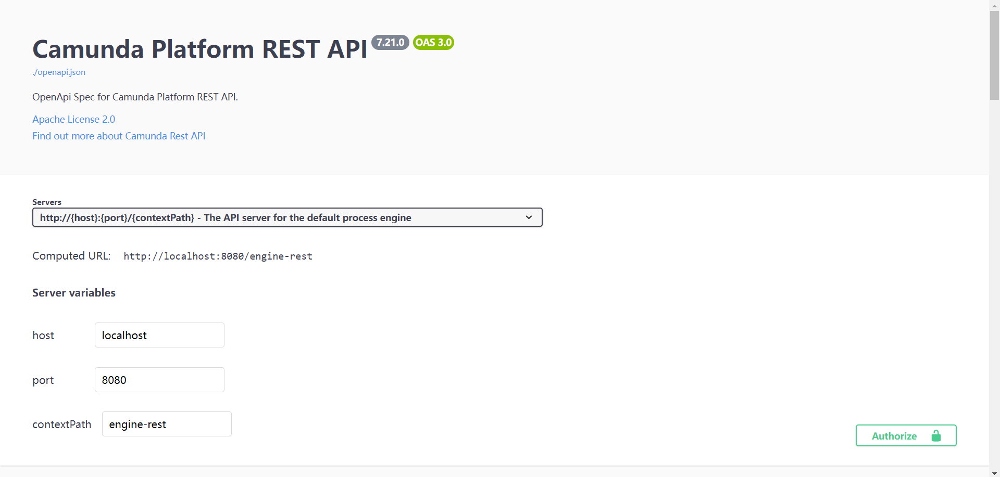
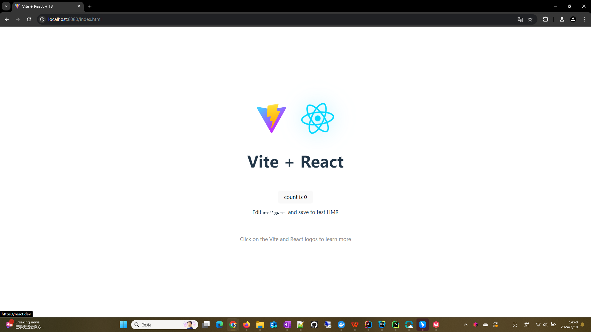
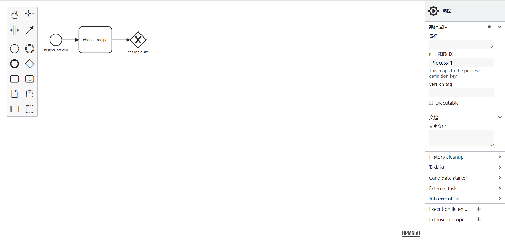

# Camunda 7

> 最后更新: 2026-06-14
> ⬅️ [返回 07 工作流](../../../README.md) | [流程引擎](../../README.md) | [Camunda 8](../camunda-8/README.md) | [Zeebe](../camunda-8/zeebe/README.md) | [工作流定义](../../../define/README.md)

## 🎯 一句话定位

**Camunda 7 = BPMN 2.0 嵌入式 Java 引擎 + SpringBoot 集成 + bpmn-js 可视化建模**——经典单体架构，企业级生产环境的事实标准（v7.21+）。

## 一、SpringBoot 集成 Camunda 7

### （一）从 Maven 集成 Camunda 7 到 SpringBoot

**1. 创建 SpringBoot 项目**（包含 Mybatis 和 h2 数据库驱动）

**2. 添加依赖**

```xml
    <dependency>
        <groupId>org.camunda.bpm.springboot</groupId>
        <artifactId>camunda-bpm-spring-boot-starter</artifactId>
        <version>7.21.0</version>
    </dependency>
    <dependency>
        <groupId>org.camunda.bpm.springboot</groupId>
        <artifactId>camunda-bpm-spring-boot-starter-rest</artifactId>
        <version>7.21.0</version>
    </dependency>
    <dependency>
        <groupId>org.camunda.bpm.springboot</groupId>
        <artifactId>camunda-bpm-spring-boot-starter-webapp</artifactId>
        <version>7.21.0</version>
    </dependency>
```

**3. 添加配置**

```yaml
# camunda登录信息配置
camunda.bpm:
  admin-user:
    id: admin  #???
    password: 123456  #??
    firstName: wu
  filter:
    create: All tasks

# h2连接信息
spring:
  datasource:
    url: jdbc:h2:file:./data/demo;AUTO_SERVER=TRUE
    username: sa
    password:
    driverClassName: org.h2.Driver
```

**4. 启动**

启动时生成 Camunda 7 数据库表结构：

| 模块      | 表明                | 说明                                                     |
|---------|-------------------|--------------------------------------------------------|
| ACT_ID_ |                   | 用户模块                                                   |
| ACT_HI_ |                   | 流程历史记录                                                 |
| ACT_HI_ | act_hi_actinst    | 执行的活动历史                                                |
| ACT_HI_ | act_hi_taskinst   | 执行任务历史                                                 |
| ACT_HI_ | act_hi_procinst   | 执行流程实例历史                                               |
| ACT_HI_ | act_hi_varinst    | 流程变量历史表                                                |
| ACT_RE  |                   | 流程资源存储                                                 |
| ACT_RE  | act_re_procdef    | 流程定义存储                                                 |
| ACT_RE  | act_re_deployment | 自动部署，springboot每次启动都会重新部署，生成记录                         |
| ACT_RU_ |                   | 流程运行时表数据，流程结束后会删除                                      |
| ACT_RU  | act_ru_execution  | 运行时流程实例                                                |
| ACT_RU  | act_ru_task       | 运行时的任务                                                 |
| ACT_RU  | act_ru_variable   | 运行时的流程变量                                               |
| ACT_GE_ |                   | 流程通用数据                                                 |
| ACT_GE_ | act_ge_bytearray  | 每次部署的文件2进制数据，所以如果文件修改后，重启也没用，因为重新生成了记录，需要清掉数据库，或者这个表记录 |

启动时 [控制台](http://localhost:8080/) 界面  


### （二）集成 Camunda 7 Swagger 到项目

**1. 添加 Camunda 7 的 Swagger**

添加仓库：

```xml
    <repositories>
        <repository>
            <id>camunda</id>
            <name>camunda</name>
            <url>https://artifacts.camunda.com/artifactory/public/</url>
        </repository>
    </repositories>
```

添加依赖：

```xml
        <dependency>
            <groupId>org.camunda.bpm.run</groupId>
            <artifactId>camunda-bpm-run-modules-swaggerui</artifactId>
            <version>${camunda7.version}</version>
        </dependency>
```

访问 [Swagger](http://localhost:8080/swaggerui/)  


### （三）集成 bpmn 设计到项目

**1. 创建 ui 以及编译前端插件**

创建 vite + react 前端项目 ui。

**2. 后端添加前端编译插件**

```xml
<plugin>
    <groupId>com.github.eirslett</groupId>
    <artifactId>frontend-maven-plugin</artifactId>
    <configuration>
        <workingDirectory>./ui</workingDirectory>
    </configuration>
    <executions>
        <execution>
            <id>install node and yarn</id>
            <goals>
                <goal>install-node-and-yarn</goal>
            </goals>
            <configuration>
                <nodeVersion>v18.20.4</nodeVersion>
                <yarnVersion>v1.22.19</yarnVersion>
            </configuration>
        </execution>
        <execution>
            <id>yarn install</id>
            <goals>
                <goal>yarn</goal>
            </goals>
            <phase>generate-resources</phase>
            <configuration>
                <arguments>install</arguments>
            </configuration>
        </execution>
        <execution>
            <id>yarn build</id>
            <goals>
                <goal>yarn</goal>
            </goals>
            <phase>generate-resources</phase>
            <configuration>
                <arguments>build</arguments>
            </configuration>
        </execution>
    </executions>
</plugin>
```

修改 `vite.config.js` 调整编译输出位置：

```javascript
import {defineConfig} from 'vite'
import react from '@vitejs/plugin-react'

// https://vitejs.dev/config/
export default defineConfig({
    plugins: [react()],
    build: {
        outDir: '../target/classes/META-INF/resources',
    },
})
```

`mvn install` 后启动项目：  


**3. 添加 less**

```shell
yarn add less --dev
```

修改 `vite.config.js` 添加 less：

```javascript
import { defineConfig } from 'vite'
import react from '@vitejs/plugin-react'

// https://vitejs.dev/config/
export default defineConfig({
  plugins: [react()],
  build: {
    outDir: '../target/classes/META-INF/resources',
  },
  css: {
    preprocessorOptions: {
      less: {
        javascriptEnabled: true, // 支持内联 JavaScript
        modifyVars: { // 更改主题
        }
      }
    }
  }
})
```

**4. 增加 bpmn.js**

```shell
yarn add bpmn-js bpmn-js-properties-panel @bpmn-io/properties-panel camunda-bpmn-moddle
```

添加自定义的国际化 i18n：

```javascript
// translations.jsx

export default {
    "Activate create/remove space tool": "激活创建/移除空间工具",
    "Activate global connect tool": "激活全局连接工具",
    "Activate hand tool": "激活手动工具",
    "Activate lasso tool": "激活套索工具",
    "Ad-hoc": "临时",
    "Add lane above": "在上方添加泳道",
    "Add lane below": "在下方添加泳道",
    "Add text annotation": "添加文本注释",
    "Align elements": "对齐元素",
    "Align elements bottom": "元素底部对齐",
    "Align elements center": "元素居中对齐",
    "Align elements left": "元素左对齐",
    "Align elements middle": "元素中间对齐",
    "Align elements right": "元素右对齐",
    "Align elements top": "元素顶部对齐",
    "Append compensation activity": "追加补偿活动",
    "Append conditional intermediate catch event": "追加条件中间捕获事件",
    "Append end event": "追加结束事件",
    "Append gateway": "追加网关",
    "Append intermediate/boundary event": "追加中间/边界事件",
    "Append message intermediate catch event": "追加消息中间捕获事件",
    "Append receive task": "追加接收任务",
    "Append signal intermediate catch event": "追加信号中间捕获事件",
    "Append task": "追加任务",
    "Append timer intermediate catch event": "追加定时器中间捕获事件",
    "Call activity": "调用活动",
    "Cancel boundary event": "取消边界事件",
    "Cancel end event": "取消结束事件",
    "Change element": "改变元素",
    "Collection": "集合",
    "Compensation boundary event": "补偿边界事件",
    "Compensation end event": "补偿结束事件",
    "Compensation intermediate throw event": "补偿中间抛出事件",
    "Compensation start event": "补偿开始事件",
    "Complex gateway": "复杂网关",
    "Conditional boundary event": "条件边界事件",
    "Conditional boundary event (non-interrupting)": "条件边界事件（非中断）",
    "Conditional flow": "条件流",
    "Conditional intermediate catch event": "条件中间捕获事件",
    "Conditional start event": "条件开始事件",
    "Conditional start event (non-interrupting)": "条件开始事件（非中断）",
    "Connect to other element": "连接到其他元素",
    "Connect using association": "使用关联连接",
    "Connect using data input association": "使用数据输入关联连接",
    "Create data object reference": "创建数据对象引用",
    "Create data store reference": "创建数据存储引用",
    "Create end event": "创建结束事件",
    "Create expanded sub-process": "创建扩展子流程",
    "Create gateway": "创建网关",
    "Create group": "创建组",
    "Create intermediate/boundary event": "创建中间/边界事件",
    "Create pool/participant": "创建池/参与者",
    "Create start event": "创建开始事件",
    "Create task": "创建任务",
    "Data object reference": "数据对象引用",
    "Data store reference": "创建数据存储引用",
    "Default flow": "默认流",
    "Delete": "删除",
    "Distribute elements horizontally": "水平分布元素",
    "Distribute elements vertically": "垂直分布元素",
    "Divide into three lanes": "分成三条泳道",
    "Divide into two lanes": "分成两条泳道",
    "Empty pool/participant": "空的池/参与者",
    "Empty pool/participant (removes content)": "空的池/参与者（删除内容）",
    "End event": "结束事件",
    "Error boundary event": "错误边界事件",
    "Error end event": "错误结束事件",
    "Error start event": "错误开始事件",
    "Escalation boundary event": "升级边界事件",

    "Process": "流程",
    "Name": "名称",
    "Value": "值",
    "ID": "唯一标识(ID)",
    "General": "基础属性",
    "Documentation": "文档",
    "Element documentation": "元素文档",

    "Create": "创建",
    "Priority": "优先级",
    "Job execution": "作业执行器",
    "Execution listeners": "执行器监听",
    "Event type": "事件类型",
    "start": "开始",
    "end": "结束",
    "Listener type": "监听类型",
    "Java class": "Java类",
    "Expression": "表达式",
    "Delegate expression": "委托表达式",
    "Script": "脚本",
    "Format": "格式",
    "<none>": "<无>",
    "Field injection": "字段注入",
    "Type": "类型",
    "String": "字符串",
    "Extension properties": "扩展属性",

    "Create element":"创建元素",
    "Gateways":"网关s",

    "Tasks":"任务s",
    "Task":"任务",
    "User Task":"用户任务",
    "Service Task":"服务任务",
    "Business rule task": "业务规则任务",
    "Script Task":"脚本任务",

    "Sub-processes":"子流程s",

    "Events":"事件s",
};
```

```javascript
// customTranslate.jsx

import translations from './translations';

export default function customTranslate(template, replacements) {
    replacements = replacements || {};

    // Translate
    template = translations[template] || template;

    // Replace
    return template.replace(/{([^}]+)}/g, function(_, key) {
        return replacements[key] || '{' + key + '}';
    });
}
```

添加编辑器 CustomModeler 并使用国际化进行汉化：

```javascript
// Camunda7Modeler/index.jsx

import {useEffect, useState} from "react";
import css from './index.module.less'
import BpmnModeler from 'camunda-bpmn-js/lib/camunda-platform/Modeler';
import 'camunda-bpmn-js/dist/assets/camunda-platform-modeler.css';
import customTranslate from '../i18n/customTranslate/customTranslate.jsx';


const Camunda7Modeler = () => {

    const [modelerInstance, setModelerInstance] = useState({})

    useEffect(() => {
        const customTranslateModule = {
            translate: ['value', customTranslate]
        };

        const modeler = new BpmnModeler({
            container: '#js-canvas',
            keyboard: {
                bindTo: window
            },
            propertiesPanel: {
                parent: '#js-properties-panel'
            },
            additionalModules: [
                customTranslateModule
            ],
        });

        // 注册bpmn实例
        const instance = {
            modeler: modeler,
            modeling: modeler.get("modeling"),
            moddle: modeler.get("moddle"),
            eventBus: modeler.get("eventBus"),
            bpmnFactory: modeler.get("bpmnFactory"),
            elementRegistry: modeler.get("elementRegistry"),
            replace: modeler.get("replace"),
            selection: modeler.get("selection"),
        };

        setModelerInstance(instance)

        modeler.importXML('<?xml version="1.0" encoding="UTF-8"?>\n' +
            '<definitions xmlns="http://www.omg.org/spec/BPMN/20100524/MODEL" xmlns:bpmndi="http://www.omg.org/spec/BPMN/20100524/DI" xmlns:omgdi="http://www.omg.org/spec/DD/20100524/DI" xmlns:omgdc="http://www.omg.org/spec/DD/20100524/DC" xmlns:xsi="http://www.w3.org/2001/XMLSchema-instance" id="sid-38422fae-e03e-43a3-bef4-bd33b32041b2" targetNamespace="http://bpmn.io/bpmn" exporter="bpmn-js (https://demo.bpmn.io)" exporterVersion="16.3.0">\n' +
            '  <process id="Process_1" isExecutable="false">\n' +
            '    <startEvent id="StartEvent_1y45yut" name="hunger noticed">\n' +
            '      <outgoing>SequenceFlow_0h21x7r</outgoing>\n' +
            '    </startEvent>\n' +
            '    <task id="Task_1hcentk" name="choose recipe">\n' +
            '      <incoming>SequenceFlow_0h21x7r</incoming>\n' +
            '      <outgoing>SequenceFlow_0wnb4ke</outgoing>\n' +
            '    </task>\n' +
            '    <sequenceFlow id="SequenceFlow_0h21x7r" sourceRef="StartEvent_1y45yut" targetRef="Task_1hcentk" />\n' +
            '    <exclusiveGateway id="ExclusiveGateway_15hu1pt" name="desired dish?">\n' +
            '      <incoming>SequenceFlow_0wnb4ke</incoming>\n' +
            '    </exclusiveGateway>\n' +
            '    <sequenceFlow id="SequenceFlow_0wnb4ke" sourceRef="Task_1hcentk" targetRef="ExclusiveGateway_15hu1pt" />\n' +
            '  </process>\n' +
            '  <bpmndi:BPMNDiagram id="BpmnDiagram_1">\n' +
            '    <bpmndi:BPMNPlane id="BPMNPlane_1" bpmnElement="Process_1">\n' +
            '      <bpmndi:BPMNShape id="StartEvent_1y45yut_di" bpmnElement="StartEvent_1y45yut">\n' +
            '        <omgdc:Bounds x="152" y="102" width="36" height="36" />\n' +
            '        <bpmndi:BPMNLabel>\n' +
            '          <omgdc:Bounds x="134" y="145" width="73" height="14" />\n' +
            '        </bpmndi:BPMNLabel>\n' +
            '      </bpmndi:BPMNShape>\n' +
            '      <bpmndi:BPMNShape id="Task_1hcentk_di" bpmnElement="Task_1hcentk">\n' +
            '        <omgdc:Bounds x="240" y="80" width="100" height="80" />\n' +
            '      </bpmndi:BPMNShape>\n' +
            '      <bpmndi:BPMNShape id="ExclusiveGateway_15hu1pt_di" bpmnElement="ExclusiveGateway_15hu1pt" isMarkerVisible="true">\n' +
            '        <omgdc:Bounds x="395" y="95" width="50" height="50" />\n' +
            '        <bpmndi:BPMNLabel>\n' +
            '          <omgdc:Bounds x="388" y="152" width="65" height="14" />\n' +
            '        </bpmndi:BPMNLabel>\n' +
            '      </bpmndi:BPMNShape>\n' +
            '      <bpmndi:BPMNEdge id="SequenceFlow_0h21x7r_di" bpmnElement="SequenceFlow_0h21x7r">\n' +
            '        <omgdi:waypoint x="188" y="120" />\n' +
            '        <omgdi:waypoint x="240" y="120" />\n' +
            '      </bpmndi:BPMNEdge>\n' +
            '      <bpmndi:BPMNEdge id="SequenceFlow_0wnb4ke_di" bpmnElement="SequenceFlow_0wnb4ke">\n' +
            '        <omgdi:waypoint x="340" y="120" />\n' +
            '        <omgdi:waypoint x="395" y="120" />\n' +
            '      </bpmndi:BPMNEdge>\n' +
            '    </bpmndi:BPMNPlane>\n' +
            '  </bpmndi:BPMNDiagram>\n' +
            '</definitions>');

        modeler.get('canvas').zoom('fit-viewport');
    }, []);

    return (
        <div className={css.customModeler}>
            <div id="js-canvas" className={css.jsCanvas}></div>
            <div id="js-properties-panel" className={css.jsPropertiesPanel}></div>
            <button onClick={async () => {
                const xml = await modelerInstance.modeler.saveXML({format: true})
                console.log(xml)
            }}>printxml</button>
        </div>
    )
}

export default Camunda7Modeler;
```



## 二、Task 节点用途

### （一）User Task（用户任务）

Camunda 中的 User Task 用于在流程中定义人工任务，需要一个人来执行该任务并提供相关信息。通常，User Task 在业务流程中用于需要人类干预的步骤，例如审核、审批、调查等。

**User Task 具有以下特性**：

1. 指派任务给具体的用户或用户组。
2. 指定任务的截止日期。
3. 定义任务表单以收集用户输入。
4. 提供一些其他配置选项，例如对任务完成后的后续步骤进行处理等。

### （二）Manual Task（手动任务）

Camunda 的 Manual Task 用于在流程中暂停执行，直到人工干预完成某个任务。与 User Task 不同，Manual Task 没有分配给特定用户或用户组，而是需要手动启动并指定下一步流程。

**Manual Task 可以用于以下场景**：

1. **等待人工干预**：当流程需要人工干预才能继续时，Manual Task 可以暂停流程执行，直到干预完成。例如，审核或批准某些事情。
2. **等待外部系统**：当流程需要等待外部系统或服务完成某些任务时，Manual Task 可以作为一个占位符，直到外部系统或服务完成任务并向 Camunda 发送信号。

与 User Task 不同，Manual Task 不需要在 Camunda 表单设计器中定义任务表单。相反，Manual Task 只是一个简单的暂停节点，直到流程执行到 Manual Task 时才需要人工干预。

### （三）Service Task（服务任务）

在 Camunda 中，Service Task 是一种用于执行特定业务逻辑的节点。Service Task 节点可以执行各种类型的操作，例如计算、数据转换、数据格式化等，这些操作通常需要使用编程语言来实现。

**Service Task 节点与其他类型的任务节点（例如用户任务节点、脚本任务节点、外部任务节点等）相比，具有以下特点**：

1. Service Task 节点执行的业务逻辑是预定义的，不需要人工干预。
2. Service Task 节点可以使用各种编程语言实现，例如 Java、JavaScript、Python 等。
3. Service Task 节点可以访问 Camunda 引擎中的各种服务和功能，例如历史记录、流程变量等。
4. Service Task 节点可以与其他类型的任务节点组合使用，以实现更为复杂的业务逻辑。

在 Camunda 中，Service Task 节点通常用于执行不需要与外部系统进行交互的业务逻辑。例如，计算员工薪水、格式化日期、解析 XML 等任务都可以使用 Service Task 节点来实现。由于 Service Task 节点可以使用多种编程语言实现，因此可以轻松地扩展和修改节点的功能，以满足不同的业务需求。

### （四）Send Task（发送任务）

Camunda 的 Send Task 用于向外部系统或服务发送消息。消息可以是同步或异步的，可以发送到队列、主题或其他类型的消息中间件。Send Task 通常用于将消息发送到外部系统，而无需等待响应或结果。相反，它只是向外部系统发出信号，通知其执行某些操作或启动某个过程。

**Send Task 可以用于以下场景**：

1. **启动外部流程**：Send Task 可以向外部系统发送消息，以启动一个过程或任务。例如，发送一封电子邮件通知用户审核流程已经启动。
2. **异步消息提升效率**：当流程需要等待某个操作完成时，Send Task 可用于向外部系统发送异步消息，以便流程可以继续执行。例如，在订单流程中，当订单被创建时，可以使用 Send Task 向库存管理系统发送异步消息，以更新库存。

### （五）Receive Task（接收任务）

Camunda 的 Receive Task 用于在流程中等待外部系统或服务发送消息。当接收到消息后，Receive Task 将流程继续执行。Receive Task 通常用于与 Send Task 配合使用，以便流程可以在发送和接收消息之间进行交互。

**Receive Task 可以用于以下场景**：

1. **等待外部消息**：当流程需要等待某个操作完成时，Receive Task 可以用于等待外部系统发送消息，以便订单流程可以继续执行。例如，在订单流程中，当库存管理系统更新库存后，可以使用 Receive Task 等待外部系统发送消息。
2. **等待用户输入**：Receive Task 还可以用于等待用户输入或操作以继续流程。例如，在审批流程中，可以使用 Receive Task 等待用户批准或拒绝请求。

---

## 🤔 思考

1. **Camunda 7 仍是企业生产首选吗？** 截至 2026 年，Camunda 7 仍维护中（v7.21+），存量企业（银行/保险/制造业）的 PVM 架构 + 单库事务模型符合强治理场景；新项目建议直接 Camunda 8。
2. **为什么 bpmn-js 集成要拆 React 微前端？** bpmn-js 是大块前端库（150KB+），与业务系统耦合会导致打包体积膨胀；用 `frontend-maven-plugin` + vite 编译到 `META-INF/resources`，是 SpringBoot 集成外部前端的轻量模式。
3. **User Task vs Manual Task 的本质区别？** User Task 强调**指派 + 表单 + 截止日期**（机器可追踪）；Manual Task 强调**人工触发**（无表单、待办里看不到）。多数企业审批用 User Task。
4. **act_hi_* 与 act_ru_* 的关系？** `act_ru_*`（Runtime）流程结束后**会清空**；`act_hi_*`（History）永久归档用于审计/报表。这套双表是 Camunda 7 的设计核心。
5. **Send Task vs Service Task？** Send Task 发送即忘（fire-and-forget）；Service Task 是同步执行业务逻辑（也可以通过 Connector 调用外部系统）。简单通知用 Send Task，需要返回值用 Service Task。

---

## 相关章节

- ⬅️ [返回 07 工作流](../../../README.md)
- [工作流定义](../../../define/README.md) — 工作流的基础概念与 BPMN 三要素
- [流程引擎](../../README.md) — Camunda 7 在主流引擎中的定位
- [Camunda 8 / Zeebe](../camunda-8/README.md) — Camunda 7 的云原生继任者
- [Zeebe](../camunda-8/zeebe/README.md) — Camunda 8 内核引擎详解
- [AI + BPMN 融合](../../../ai-workflow/bpmn-ai-integration.md) — Camunda 8.5+ AI Agent Sub-process（v7 暂不支持原生 AI）
