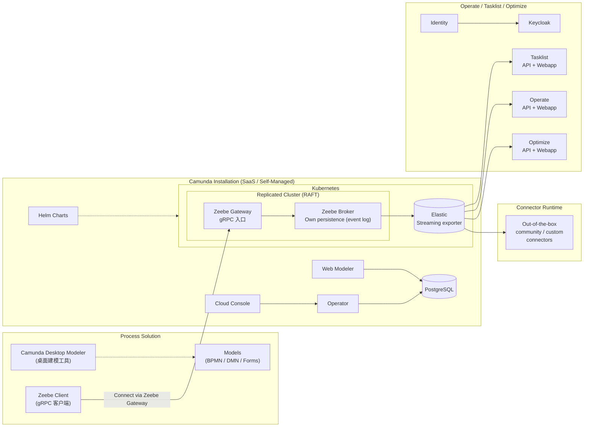
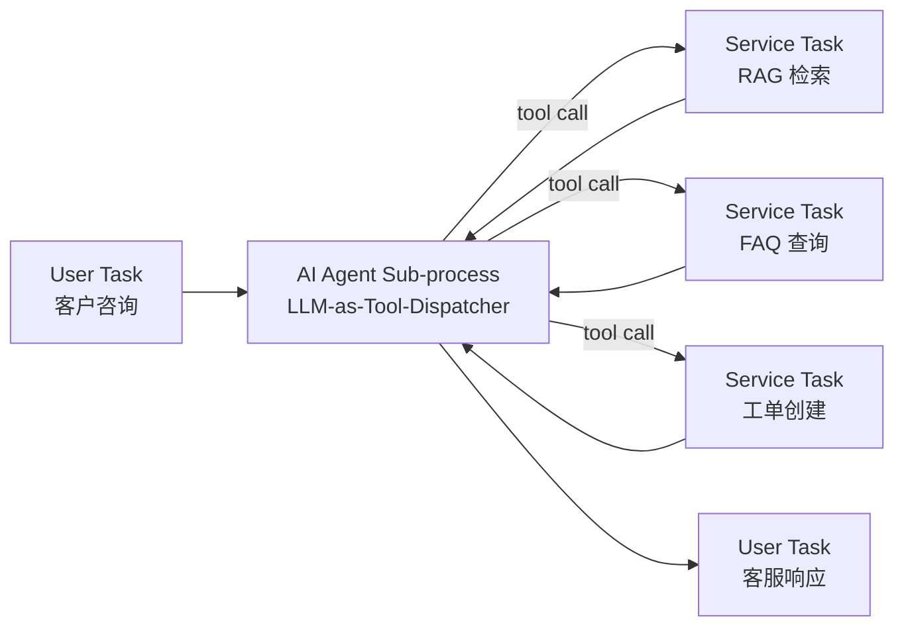

<!--
module:
  parent: workflow
  slug: workflow/camunda-8
  type: article
  category: 主模块子文章
  summary: Camunda 8
-->

# Camunda 8

> ⬅️ [返回 07 工作流](../../../README.md) | [流程引擎](../../README.md) | [Camunda 7](../camunda-7/README.md) | [Zeebe](zeebe/README.md) | [事件驱动](../../../apache-eventmesh/README.md)

## 🎯 一句话定位

**Camunda 8 = Zeebe 分布式流处理引擎 + 云原生 K8s 部署 + 8.5+ 原生 AI Agent 集成**——把 BPMN 引擎从「数据库中心」重构为「追加日志 + Raft + Elasticsearch」，10,000+ 实例/秒，2026 年企业级 BPMN + AI 的事实标准。

---

## 📚 章节导航（5 节 + 1 实战案例）

| 节 | 内容 | 何时读 |
|:---|:-----|:------|
| **一、核心架构** | Zeebe + ES + Raft + 10K+/秒突破 | 评估能否替换 Camunda 7 |
| **二、与 Camunda 7 差异** | 部署 / 存储 / 扩展 / AI / 商业模型 | 旧项目迁移评估 |
| **三、8.5+ AI Agent Sub-process** | fromAi() FEEL + Ad-hoc Sub-process | 集成 LLM 到流程 |
| **四、决策矩阵** | Camunda 7 vs 8 9 维场景对比 | 选型决策 |
| **五、典型落地** | 跨境电商 10K+/秒 | 看生产案例 |
| **六、2025-2026 进展** | 8.7/8.8 新特性 + AI 路线 | 跟进趋势 |

---

## ⚡ 4 架构层 + 4 AI 特性速查

### 架构层

| 层级 | 组件 | 一句话定义 | 何时关心 |
|:-----|:-----|:----------|:---------|
| **数据层** | 追加日志 + ES Exporter | 状态写在磁盘，查询走 ES | 容量规划 / 历史数据归档 |
| **共识层** | Raft（多 Broker）| 分布式状态一致性 | 集群部署 / 故障恢复 |
| **执行层** | Zeebe Broker + Gateway | 解析 BPMN + 分发 Job | 性能调优 / 水平扩展 |
| **UI 层** | Operate + Tasklist + Optimize | 流程监控 + 人工待办 + 分析 | 运维 / 用户体验 |

### AI 特性（8.5+）

| 特性 | 一句话定义 | 实战场景 |
|:-----|:----------|:---------|
| **AI Agent Sub-process** | Ad-hoc Sub-process + LLM 工具调用 | 多步推理 + 工具组合 |
| **fromAi() FEEL** | 流程变量映射中调 LLM | 单步分类 / 提取 |
| **Ad-hoc Sub-process** | 无顺序流，LLM 自决顺序 | 灵活 Agent 编排 |
| **Agent Context** | LLM 可访问流程变量 + RAG 结果 | 上下文感知推理 |

> 📌 完整架构 + 4 融合模式见 [BPMN+AI 融合](../../../../11.ai/04-architecture/bpmn-ai-integration.md)。

---

## 一、核心架构与性能突破

- **Zeebe 引擎**：采用分布式流处理架构，替代 Camunda 7 的 Java 嵌入式引擎。通过 Kafka-like 的追加日志和 Raft 共识协议实现高吞吐量（单集群可处理 **10,000+ 流程实例/秒**），支持水平扩展，无需传统关系型数据库，依赖 Elasticsearch 进行数据查询与历史分析。
- **云原生设计**：基于 Kubernetes 部署，支持弹性伸缩、异地容灾和多租户管理。通过租户标识符实现多租户隔离，而非 Camunda 7 的"单租户单引擎"模式。
- **API 与协议**：提供 gRPC/REST API，支持多语言客户端（如 Java、Go、Node.js），替代 Camunda 7 的 Java/REST API。连接器生态更丰富，内置 HTTP、SOAP 等基础连接器，并支持自定义扩展。

---

## 二、与 Camunda 7 的关键差异

| 维度 | **Camunda 7** | **Camunda 8** |
|------|---------------|---------------|
| **部署模式** | 本地/私有化部署，依赖关系型数据库 | SaaS（Camunda 托管）或 Self-Managed（K8s/Docker）|
| **数据存储** | 流程变量与状态存储在数据库 | 事件流存储在磁盘，通过 Exporter 导出至 Elasticsearch |
| **扩展性** | 受数据库性能限制，横向扩展能力有限 | 线性水平扩展，添加 Broker 节点即可提升吞吐量 |
| **事务与一致性** | 支持 ACID 事务，依赖数据库锁机制 | 基于追加日志和单写入器设计，避免锁竞争，更适合高并发场景 |
| **BPMN 支持** | 完整支持 BPMN 2.0 规范 | 优化执行语义以适应云环境，部分图元需改造 |
| **AI 集成** | 需自研 Service Task 包装 LLM | 8.5+ 原生 AI Agent Sub-process、fromAi() FEEL |
| **商业模型** | 社区版功能丰富，企业版提供高级功能 | 开源组件较少，大部分功能需商业授权（如 Operate、Tasklist）|

### 开源协议图谱

**Camunda Platform 8 开源**：  


```mermaid
flowchart LR
    subgraph ProcessSolution["Process Solution"]
        Modeler["Camunda Desktop Modeler<br/>(桌面建模工具)"]
        Models["Models<br/>(BPMN / DMN / Forms)"]
        Client["Zeebe Client<br/>(gRPC 客户端)"]
        Modeler -.-> Models
    end

    subgraph K8s["Kubernetes"]
        subgraph Cluster["Replicated Cluster (RAFT)"]
            Gateway["Zeebe Gateway<br/>gRPC 入口"]
            Broker["Zeebe Broker<br/>Own persistence (event log)"]
            Gateway --> Broker
        end
        Elastic[("Elastic<br/>Streaming exporter")]
        Broker --> Elastic
    end

    subgraph Install["Camunda Installation (SaaS / Self-Managed)"]
        WebModeler["Web Modeler"]
        CloudConsole["Cloud Console"]
        Postgres[("PostgreSQL")]
        Operator["Operator"]
        Helm["Helm Charts"]
        WebModeler --> Postgres
        CloudConsole --> Operator
        Operator --> Postgres
        Helm -.-> K8s
    end

    subgraph Apps["Operate / Tasklist / Optimize"]
        Tasklist["Tasklist<br/>API + Webapp"]
        Operate["Operate<br/>API + Webapp"]
        Optimize["Optimize<br/>API + Webapp"]
        Identity["Identity"]
        Keycloak["Keycloak"]
        Identity --> Keycloak
    end

    subgraph Connectors["Connector Runtime"]
        Conn["Out-of-the-box<br/>community / custom<br/>connectors"]
    end

    Client -->|Connect via Zeebe Gateway| Gateway
    Elastic --> Tasklist
    Elastic --> Operate
    Elastic --> Optimize
    Elastic --> Conn
```


- **绿色**：开源许可证（可以在生产环境中免费使用它们。Camunda 提供商业支持，但不是强制性的）。
- **绿色条纹**：源代码可用的许可证（对于大多数人来说，这与开源许可证没有真正的区别）。
- **蓝色**：此软件可用，但仅在 Camunda 自我管理免费版许可下免费用于非生产用途（例如开发、测试）。如果您想将这些组件投入生产，则需要使用他们的 SaaS 服务或购买 Camunda 自我管理企业版许可证。
- **红色**：目前仅在 Camunda 8 的 SaaS 产品中可用，无法自行管理运行。注意：这可能会发生变化，红色组件应随着时间的推移变成蓝色。
- **灰色**：在供应商各自的许可下免费提供，也可用于生产用途。

Zeebe 的核心引擎（Broker/Gateway）使用 Zeebe Community License 1.1，客户端和部分工具采用 Apache License 2.0。Zeebe Community License 的限制：该协议允许修改和商业使用，但禁止提供商业工作流服务（如 SaaS），除非获得 Camunda 的商业许可。这与 MIT 类似，但有特定限制。

**免费使用源代码构建生产环境路径**：  

```mermaid
flowchart LR
    subgraph ProcessSolution["Process Solution"]
        Modeler["Camunda Desktop Modeler"]
        Models["Models<br/>(BPMN / DMN / Forms)"]
        Client["Zeebe Client<br/>(gRPC 客户端)"]
        Modeler -.-> Models
    end

    subgraph K8s["Kubernetes (Self-Managed Free)"]
        subgraph Cluster["Replicated Cluster (RAFT)"]
            Gateway["Zeebe Gateway"]
            Broker["Zeebe Broker<br/>Own persistence (event log)"]
            Gateway --> Broker
        end
        Elastic[("Elastic<br/>Streaming exporter")]
        Broker --> Elastic
        Helm["Helm Charts<br/>(开源 Apache 2.0)"]
        Helm -.-> K8s
    end

    Client -->|Connect via Zeebe Gateway| Gateway

    subgraph SelfBuilt["自研免费路径"]
        CustomTasklist["自研 Tasklist<br/>订阅 Zeebe Jobs"]
        CustomExporter["自研 Exporter<br/>→ BI / DWH / Data Lake"]
    end
    Elastic --> CustomTasklist
    Elastic --> CustomExporter
```


即仅用**绿色**和**绿色条纹**构建生产环境。

**必需替换的组件**：

1. **任务列表**：需要基于使用订阅 Zeebe 的消费者来实现自己的任务管理解决方案，构建自己的持久化以允许任务查询。
2. **流程操作**：构建自己的 exporter 以将其推送到一些方便的数据存储组件，并进行即时筛选或预处理数据，并使用现有的 Zeebe API 去操作流程实例。
3. **流程优化**：通过自研的 exporter 将数据推送到现有的通用 BI（商业智能）、DWH（数据仓库）或数据湖，通过流程数据分析优化流程。

---

## 三、8.5+ AI Agent Sub-process 模式

Camunda 8.5（2024）起引入**AI Agent Sub-process**——把 LLM 工具调用作为一等公民 BPMN 节点。

### 3.1 模式 A：Ad-hoc Sub-process + LLM 工具


```mermaid
flowchart LR
    User[User Task<br/>客户咨询] --> Agent[AI Agent Sub-process<br/>LLM-as-Tool-Dispatcher]
    Agent -->|tool call| Search[Service Task<br/>RAG 检索]
    Agent -->|tool call| FAQ[Service Task<br/>FAQ 查询]
    Agent -->|tool call| Ticket[Service Task<br/>工单创建]
    Search --> Agent
    FAQ --> Agent
    Ticket --> Agent
    Agent --> Response[User Task<br/>客服响应]
```

**关键设计**：

- **Ad-hoc Sub-process** 没有顺序流，节点由 LLM 决定调用顺序
- 每个工具（Service Task）通过 `zeebe:TaskDefinition` 暴露 LLM 工具签名
- 引擎收集工具结果回传 LLM，循环直到 LLM 返回 final answer

### 3.2 核心 FEEL 表达式

```feel
// 上下文：流程变量 customerQuery = "我上个月买的空调没收到"
// 在 Service Task 输入映射中
{
  query: customerQuery,
  context: fromAi("提取客户提到的产品关键词"),
  priority: fromAi("判断优先级（高/中/低）", { allowedValues: ["高", "中", "低"] })
}
```

**`fromAi()` 三参数签名**：

- `prompt: string` —— 必填，告诉 LLM 做什么
- `options?: { allowedValues, format, schema }` —— 约束输出
- `context?: string | object` —— 附加上下文（流程变量 / RAG 结果）

### 3.3 模式 B：自研 Zeebe AI Worker

当 8.5 原生特性不够用时，可自研 Job Worker 直接消费 LLM：

```java
@ZeebeWorker(type = "ai-llm-worker")
public void handle(final JobClient client, final ActivatedJob job) {
    Map<String, Object> vars = job.getVariablesAsMap();
    String prompt = (String) vars.get("prompt");

    String result = openAiClient.complete(prompt, LlmModel.GPT_4O);

    client.newCompleteCommand(job.getKey())
          .variables(Map.of("aiResult", result))
          .send()
          .join();
}
```

**适用场景**：

- 8.5 之前的版本
- 需要接入私有 LLM（Qwen / DeepSeek / GLM）
- 需要 Agent 框架（LangGraph / CrewAI）参与复杂推理

---

## 四、决策矩阵：Camunda 7 vs 8

| 场景 | **Camunda 7** | **Camunda 8** |
|------|:---:|:---:|
| **强事务 / ACID / 关系型 DB 强依赖** | ✅ | ⚠️ 需设计补偿 |
| **单库 100+ 实例/秒** | ✅ | ✅ |
| **10K+ 实例/秒** | ❌ | ✅ |
| **Spring Boot 嵌入式集成** | ✅ | ⚠️ 需 gRPC 客户端 |
| **K8s 水平扩展** | ⚠️ 受限 | ✅ |
| **AI / LLM 原生集成** | ❌ 需自研 | ✅ 8.5+ AI Agent |
| **国内信创（麒麟/达梦）** | ✅ 案例多 | ⚠️ 案例少 |
| **社区版生产可用** | ✅ | ⚠️ Operate/Tasklist 需企业版 |
| **学习曲线** | 平缓（Java 嵌入式） | 较陡（gRPC + K8s）|

**选型口诀**：

- 传统企业 + 强治理 + 国产化 → **Camunda 7**
- 云原生 + 高吞吐 + AI 原生 → **Camunda 8**
- 混部：Camunda 7 跑传统审批，Camunda 8 跑 AI 决策

---

## 五、典型落地场景

| 场景 | Camunda 8 优势 |
|------|---------------|
| **跨境电商订单履约** | 10K+ 并发实例、跨系统编排 |
| **AI 客服 + 工单** | AI Agent Sub-process、fromAi() |
| **金融信贷审批** | 分布式 K8s 部署、Zeebe 横向扩展 |
| **保险理赔自动化** | LLM 解析非结构化材料 → BPMN 决策 |
| **物联网事件流** | Event-driven Gateway + 追加日志 |

---

## 六、2025-2026 进展

| 版本 / 时间 | 关键特性 | 实战影响 |
|------|------|------|
| **8.5（2024-10）** | **AI Agent Sub-process** + `fromAi()` FEEL + Connector 模板市场 | 流程可原生调用 LLM，BPMN 与 AI 一等公民融合 |
| **8.6（2025-04）** | Multi-region 灾备 + Identity Federation（OIDC SSO）| 跨国企业多区域部署落地 |
| **8.7（2025-10）** | Tasklist 表单生成器（无需 Zeebe 表单）+ Outbound Connector 2.0 | 业务人员可自助配置人工待办 |
| **8.8（2026-Q2）** | Web Modeler 协同编辑（多人并发）+ Process Optimization 自动化 | 业务 + IT 协同设计流程 |

**路线图（官方公开）**：

- **2026-H2**：原生小模型集成（Phi-3 / Qwen2.5-7B），降低 AI 节点成本
- **2027+**：**AI-native BPMN** —— 流程定义可用自然语言生成，AI 实时优化流程

**对比 AI 平台**（与 [11.ai 编排平台](../../../../11.ai/03-engineering/ai-platforms/README.md) 互补）：

| 场景 | Camunda 8 + AI | Dify / Coze / LangGraph |
|------|----------------|-------------------------|
| 强治理 + 合规 | ✅（流程实例 100% 留痕）| ⚠️（审计弱）|
| 业务可读 | ✅（BPMN 图形化）| ⚠️（DSL 工程师向）|
| 快速试错 | ⚠️（需建模）| ✅（分钟级）|
| 状态可回放 | ⚠️（Operate 视图）| ✅（LangGraph Time Travel）|

**选型口诀**：

- **金融/医疗/政务强治理** → Camunda 8 + AI Agent Sub-process
- **C 端快速试错** → Dify / Coze
- **复杂多步推理** → LangGraph
- **混合** → Camunda 8 流程骨架 + LangGraph 复杂 Agent（详见 [BPMN+AI 融合](../../../../11.ai/04-architecture/bpmn-ai-integration.md)）

---

## 🤔 思考

1. **为什么 Camunda 8 不向后兼容 Camunda 7？** 数据库中心 vs 日志中心的架构分歧太大。7 强在事务完整性，8 强在水平扩展；强行兼容两边都不讨好。
2. **AI Agent Sub-process 是不是 LangGraph 的 BPMN 翻版？** 形态相似（都是图状编排），但 Camunda 强调**确定性骨架 + 可审计 + 合规**；LangGraph 强调**代码灵活性 + Python 原生**。生产落地用 Camunda 8.5+，原型探索用 LangGraph。
3. **社区版 vs 企业版怎么选？** 商业产品的核心价值在 Operate（运维面板）+ Tasklist（人工待办）+ Optimize（流程分析）。如果只跑引擎 + 自研 UI，社区版够用。
4. **Zeebe 的 Raft 复制为什么不用 Kafka？** Zeebe 早期版本用过 Kafka 作为日志后端，但 Raft 共识 + 内置日志的耦合度更高、延迟更低；Kafka 适合跨系统消息总线，Zeebe 适合单工作流引擎内部。
5. **Camunda 8 + 自研 LLM 怎么集成？** 两种方式：① Camunda 8.5+ 用 AI Agent Sub-process + fromAi() FEEL 表达式（见 [Camunda 8](#三85-ai-agent-sub-process-模式) §三）；② 在 Zeebe Job Worker 中包装 LLM 客户端（见 [Zeebe](zeebe/README.md) §🤔 思考）。BPMN 管确定性骨架，LLM 管推理节点，互为补充。
6. **Camunda 8 vs Temporal 怎么选？** Temporal 的 async/await 模型对工程师更友好（写代码像写同步程序），Cadence 在 Uber 跑了 7 年验证过 PB 级流量。**Camunda 8 强在 BPMN 业务可读 + 合规**，Temporal 强在代码灵活 + 长期状态。**大型组织选 Camunda 8，初创/强工程团队选 Temporal**。

---

## 相关章节

- ⬅️ [返回 07 工作流](../../../README.md)
- [工作流定义](../../../define/README.md) — BPMN 三要素
- [流程引擎](../../README.md) — Camunda 8 在主流引擎中的定位
- [Camunda 7 实战](../camunda-7/README.md) — 上一代引擎的 SpringBoot 集成
- [Zeebe](zeebe/README.md) — Camunda 8 内核引擎详解
- [事件驱动与 Serverless Workflow](../../../apache-eventmesh/README.md) — 事件驱动作为工作流的神经系统

---

## 📊 本节统计

| 维度 | 数据 |
|------|------|
| **覆盖节数** | 6 节（架构 / 差异 / AI / 决策 / 案例 / 进展） |
| **架构层** | 4（数据 / 共识 / 执行 / UI） |
| **AI 特性** | 4（AI Agent Sub-process / fromAi() / Ad-hoc / Agent Context） |
| **决策维度** | 9（事务 / 吞吐 / 部署 / AI / 信创 等） |

← [返回 07 工作流](../../../README.md)
