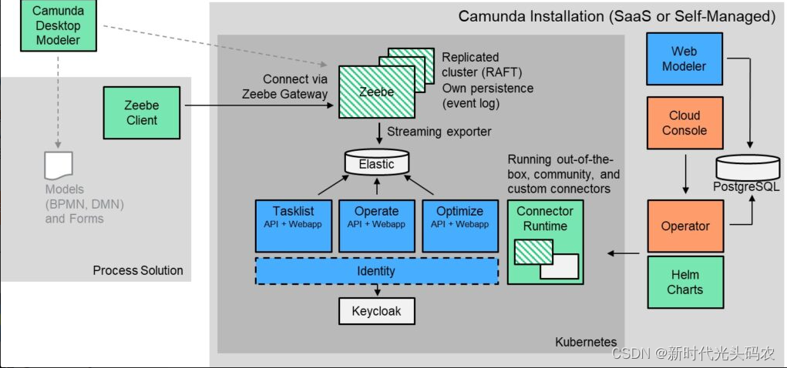

# Camunda 8

## 核心架构与性能突破
- **Zeebe引擎**：采用分布式流处理架构，替代Camunda 7的Java嵌入式引擎。通过Kafka-like的追加日志和Raft共识协议实现高吞吐量（单集群可处理**10,000+流程实例/秒**），支持水平扩展，无需传统关系型数据库，依赖Elasticsearch进行数据查询与历史分析。
- **云原生设计**：基于Kubernetes部署，支持弹性伸缩、异地容灾和多租户管理。通过租户标识符实现多租户隔离，而非Camunda 7的“单租户单引擎”模式。
- **API与协议**：提供gRPC/REST API，支持多语言客户端（如Java、Go、Node.js），替代Camunda 7的Java/REST API。连接器生态更丰富，内置HTTP、SOAP等基础连接器，并支持自定义扩展。

## 与Camunda 7的关键差异
| **维度**     | **Camunda 7**     | **Camunda 8**                                   |
|------------|-------------------|-------------------------------------------------|
| **部署模式**   | 本地/私有化部署，依赖关系型数据库 | SaaS（Camunda托管）或Self-Managed（Kubernetes/Docker） |
| **数据存储**   | 流程变量与状态存储在数据库     | 事件流存储在磁盘，通过Exporter导出至Elasticsearch             |
| **扩展性**    | 受数据库性能限制，横向扩展能力有限 | 线性水平扩展，添加Broker节点即可提升吞吐量                        |
| **事务与一致性** | 支持ACID事务，依赖数据库锁机制 | 基于追加日志和单写入器设计，避免锁竞争，更适合高并发场景                    |
| **BPMN支持** | 完整支持BPMN 2.0规范    | 优化执行语义以适应云环境，部分图元需改造                            |
| **商业模型**   | 社区版功能丰富，企业版提供高级功能 | 开源组件较少，大部分功能需商业授权（如Operate、Tasklist）            |

**Camunda Platform 8开源**：  

**绿色**：开源许可证（可以在生产环境中免费使用它们。Camunda提供商业支持，但不是强制性的）。
**绿色条纹**：源代码可用的许可证（对于大多数人来说，这与开源许可证没有真正的区别）。
**蓝色**：此软件可用，但仅在 Camunda 自我管理免费版许可下免费用于非生产用途（例如开发、测试）。如果您想将这些组件投入生产，则需要使用他们的SaaS服务或购买Camunda自我管理企业版许可证。
**红色**：目前仅在 Camunda 8 的 SaaS 产品中可用，无法自行管理运行。注意：这可能会发生变化，红色组件应随着时间的推移变成蓝色。
**灰**色：在供应商各自的许可下免费提供，也可用于生产用途。

**免费使用源代码构建生产环境路径**：  

即仅用**绿色**和**绿色条纹**构建生产环境

必需替换的组件
1. **任务列表**：需要基于使用订阅 Zeebe 的消费者来实现自己的任务管理解决方案，构建自己的持久化以允许任务查询。
2. **流程操作**：构建自己的expoter以将其推送到一些方便的数据存储组件，并进行即时筛选或预处理数据，并使用现有的 Zeebe API去操作流程实例。
3. **流程优化**：通过自研的expoter将数据推送到现有的通用 BI（商业智能）、DWH（数据仓库）或数据湖，通过流程数据分析优化流程。

