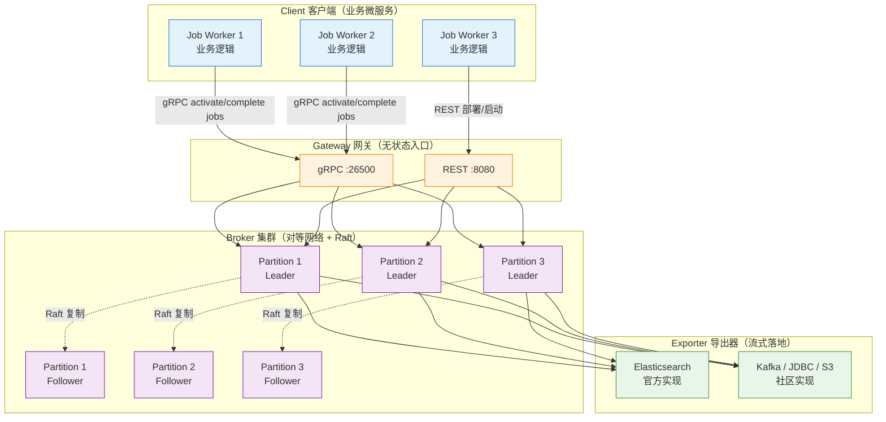

# Zeebe

> 最后更新: 2026-06-14
> ⬅️ [返回 07 工作流](../../../README.md) | [流程引擎](../../README.md) | [Camunda 8](../README.md) | [微服务编排](../../../workflow-and-microservice-orchestration/README.md) | [AI + BPMN 融合](../../../ai-workflow/bpmn-ai-integration.md)

## 🎯 一句话定位

**Zeebe = BPMN 2.0 引擎内核 + 事件驱动架构（EDA）+ Raft 共识 + 水平扩展**——Camunda 8 的分布式流处理引擎底座，单集群 10K+ 流程实例/秒。

---

Zeebe 是一个用于微服务编排的开源工作流引擎。它基于 BPMN 2.0 可定义图形化工作流，可使用 Docker 和 Kubernetes 进行部署，可构建来自 Apache Kafka 和其他消息传递平台的事件的工作流，可水平扩展处理非常高的吞吐量，可以导出用于监视和分析的工作流数据，具有很好容错能力，可无缝伸缩以处理不断增长的事务量。

更简要解释和概述，Zeebe 是为在 BPMN 流程引擎基础上加入了 EDA（事件驱动架构）的特性。

## 一、Zeebe 核心特性

Zeebe 是专为微服务编排设计的免费开源的工作流引擎，它提供了：

- **可见性（Visibility）**：Zeebe 提供能力展示出企业工作流运行状态，包括当前运行中的工作流数量、平均耗时、工作流当前的故障和错误等；
- **工作流编排（Workflow Orchestration）**：基于工作流的当前状态，Zeebe 以事件的形式发布指令（command），这些指令可以被一个或多个微服务消费，确保工作流任务可以按预先的定义流转；
- **监控超时与错误处理（Monitoring for Timeouts）**：提供能力配置错误处理方式，比如有状态的重试或者升级给运维团队手动处理，确保工作流总是能按计划完成。

Zeebe 设计之初，就考虑了超大规模的微服务编排问题。为了应对超大规模，Zeebe 支持：

- **横向扩容（Horizontal Scalability）**：Zeebe 支持横向扩容并且不依赖外部的数据库，相反的，Zeebe 直接把数据写到所部署节点的文件系统里，然后在集群内分布式的计算处理，实现高吞吐；
- **容错（Fault Tolerance）**：通过简单配置化的副本机制，确保 Zeebe 能从软硬件故障中快速恢复，并且不会有数据丢失；
- **消息驱动架构（Message-Driven Architecture）**：所有工作流相关事件被写到只追加写的日志（append-only log）里；
- **发布-订阅交互模式（Publish-Subscribe Interaction Model）**：可以保证连接到 Zeebe 的微服务根据实际的处理能力，自主的消费事件执行任务，同时提供平滑流量和背压的机制；
- **BPMN 2.0 标准**：保证开发和业务能够使用相同的语言协作设计工作流；
- **语言无关的客户端模型（Language-Agnostic Client Model）**：可以使用任何编程语言构建 Zeebe 客户端。

## 二、Zeebe 架构

### 架构总览图

### 4 大组件详解

#### （一）Client 客户端

客户端向 Zeebe 发送指令：

- **发布流程**（deploy workflows）
- **执行业务逻辑**（carry out business logic）
  - 启动工作流实例（start workflow instances）
  - 发布消息（publish messages）
  - 激活作业（activate jobs）
  - 完成作业（complete jobs）
  - 失败作业（fail jobs）
- **处理运维问题**（handle operational issues）
  - 更新实例流程变量（update workflow instance variables）
  - 解决异常（resolve incidents）

客户端程序可以完全独立于 Zeebe 扩缩容，Zeebe brokers 不执行任何业务逻辑。客户端是嵌入到应用程序（执行业务逻辑的微服务）的库，用于跟 Zeebe 集群连接通信。

客户端通过 REST 和 gRPC 的混合连接到 Zeebe 网关。虽然 REST 可以通过任何 HTTP 版本提供，但 API 的 gRPC 部分需要基于 HTTP/2 的传输。Zeebe 项目包括官方支持的 Java 和 Go 客户端。社区客户端已使用其他语言创建，包括 C#、Ruby 和 JavaScript。借助 gRPC 的代码生成器和 OpenAPI 规范，可以使用多种不同的编程语言生成客户端。

**Job Workers（作业工作者）**：一个 Zeebe 客户端，它使用客户端 API 首先激活作业，并在完成后完成或失败该作业。

#### （二）Gateway 网关

网关作为 Zeebe 集群的单一入口点，并将请求转发给代理。网关是无状态和无会话的，并且可以根据需要添加网关以实现负载平衡和高可用性。

#### （三）Broker 代理

Zeebe 代理是跟踪活动流程实例状态的分布式工作流引擎。Brokers 可以进行分区以实现水平扩展，并进行复制以实现容错。Zeebe 部署通常由多个代理组成。

需要注意的是，代理中不存在任何应用程序业务逻辑。它的唯一职责是：

- 处理客户端发送的命令
- 存储和管理活动流程实例的状态
- 分配工作给 Job workers

Brokers 构成一个对等网络（peer-to-peer），这样集群不会有单点故障。集群中所有节点都承担相同的职责，所以一个节点不可用后，节点的任务会被透明的重新分配到网络中其他节点。

#### （四）Exporter 导出器

Exporter 系统提供 Zeebe 内状态变化的事件流。这些事件流数据有很多潜在用处，包括但不限于：

- 监控正在运行的流程实例的当前状态
- 分析历史过程数据以供审计、BI 等使用
- 跟踪 Zeebe 抛出的异常（incident）

Exporter 提供了简洁的 API，可以流式导出数据到任何存储系统。Zeebe 官方提供开箱即用的 Elasticsearch exporter，社区也提供了其他 Exporters。

---

## 🤔 思考

1. **为什么 Zeebe 不用传统关系型 DB？** Raft + 追加日志 + 分区是云原生的最优解——单写入器避免锁竞争，分区支持水平扩展，ES 通过 Exporter 解耦查询。这与 Kafka 的设计哲学一脉相承。
2. **Gateway 是不是单点？** 不是。Gateway 是无状态 + 无会话的，可以任意水平扩展，客户端可负载均衡到任意一个 Gateway；背后所有 Broker 节点都是对等的。
3. **Job Worker 拉模式 vs 推模式？** Zeebe 用**拉模式**（Worker 调用 `activateJobs` 拉任务）——好处是 Worker 背压可控（不超负载），且任何语言都能实现。代价是短轮询延迟。
4. **为什么官方只支持 Java 和 Go 客户端？** gRPC + Protocol Buffers 自动生成 100+ 语言客户端；官方只维护最常用的两个，其余交给社区（参考 [awesome-zeebe](https://github.com/zeebe-io/awesome-zeebe)）。
5. **Zeebe 与 Temporal/Cadence 的关系？** 都是分布式工作流引擎；Zeebe 走 BPMN 2.0 标准路线（业务可读），Temporal/Cadence 走代码 DSL 路线（开发者友好）。详见 [微服务编排](../../../workflow-and-microservice-orchestration/README.md)。

---

## 相关章节

- ⬅️ [返回 07 工作流](../../../README.md)
- [工作流定义](../../../define/README.md) — BPMN 三要素
- [流程引擎](../../README.md) — Zeebe 在主流引擎中的定位
- [Camunda 8](../README.md) — Zeebe 是 Camunda 8 的内核
- [Camunda 7 实战](../camunda-7/README.md) — 上一代 Java 嵌入式引擎
- [微服务编排](../../../workflow-and-microservice-orchestration/README.md) — Zeebe/Temporal/Cadence 三大编排引擎对比
- [AI + BPMN 融合](../../../ai-workflow/bpmn-ai-integration.md) — Zeebe AI Worker 模式（8.5 之前的兼容方案）
