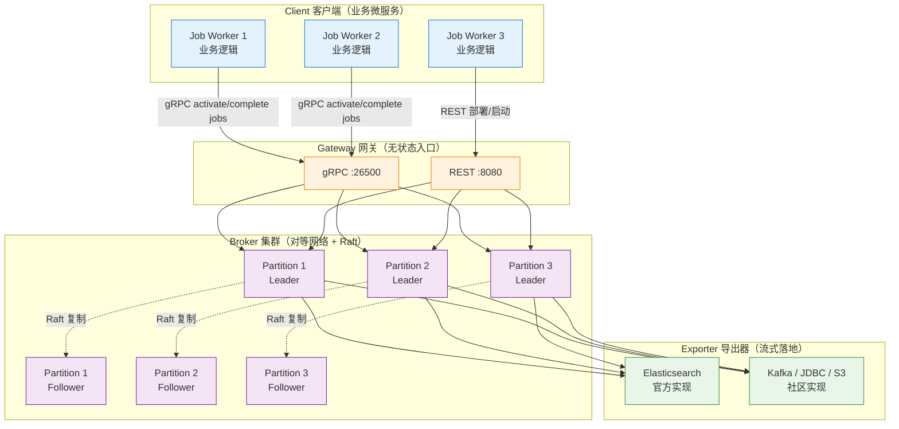

<!--
module:
  parent: workflow
  slug: workflow/zeebe
  type: article
  category: 主模块子文章
  summary: Zeebe
-->

# Zeebe

> 最后更新: 2026-06-14
> ⬅️ [返回 07 工作流](../../../README.md) | [流程引擎](../../README.md) | [Camunda 8](../README.md) | [微服务编排](../../../../../README.md) | [事件驱动](../../../../../README.md)

## 🎯 一句话定位

**Zeebe = BPMN 2.0 引擎内核 + 事件驱动架构（EDA）+ Raft 共识 + 水平扩展**——Camunda 8 的分布式流处理引擎底座，单集群 10K+ 流程实例/秒。

---
## 引言：反直觉代码

Zeebe 的关键不是语法——是**看起来对**的代码背后那些'踩坑点'。

本篇用 3 个反直觉片段切入，把面试/生产中常被问起、但一深入就漏馅的点摆出来。

---

## 📚 章节导航（6 节 + 实战代码）

| 节 | 内容 | 何时读 |
|:---|:-----|:------|
| **概述** | Zeebe 是什么 / 核心特性 | 第一次了解 |
| **一、核心特性** | 可见性 / 编排 / 容错 / 横向扩容 | 评估是否够用 |
| **二、4 大组件** | Client / Gateway / Broker / Exporter | 理解架构 |
| **三、gRPC 客户端实战** | Java 客户端代码（部署/启动/Worker）| 第一次写代码 |
| **四、集群部署** | K8s + Raft + ES 最小生产配置 | 准备生产部署 |
| **五、真实案例** | 跨境电商 10K+/秒 + Uber/Cadence 对比 | 看生产参考 |

---

## ⚡ 4 大组件速查

| 组件 | 角色 | 一句话定义 | 何时关心 |
|:-----|:-----|:----------|:---------|
| **Client** | 业务侧 | gRPC 库 + Job Worker 拉任务 | 写业务代码 / 多语言集成 |
| **Gateway** | 入口侧 | 无状态 HTTP/gRPC 反向代理 | 负载均衡 / 多网关水平扩展 |
| **Broker** | 引擎侧 | 解析 BPMN + Raft 共识 + 分区存储 | 集群部署 / 性能调优 / 故障恢复 |
| **Exporter** | 数据侧 | 流式落地到 ES / Kafka / JDBC | 历史数据 / Operate UI / 审计 |

**关键记忆点**：

- **Gateway 无状态**——任意水平扩展，客户端可负载均衡到任意一个
- **Broker 才有状态**——Raft 集群 + 追加日志，节点故障自动重新分配
- **Exporter 解耦查询**——状态写入与查询分离，ES 任意规模扩展
- **Job Worker 拉模式**——Worker 主动 `activateJobs`，背压可控

> 📌 完整架构图 + Java 客户端代码见 [§二 4 大组件](#二zeebe-架构)。

---

Zeebe 是一个用于微服务编排的开源工作流引擎。它基于 BPMN 2.0 可定义图形化工作流，可使用 Docker 和 Kubernetes 进行部署，可构建来自 Apache Kafka 和其他消息传递平台的事件的工作流，可水平扩展处理非常高的吞吐量，可以导出用于监视和分析的工作流数据，具有很好容错能力，可无缝伸缩以处理不断增长的事务量。

更简要解释和概述，Zeebe 是为在 BPMN 流程引擎基础上加入了 EDA（事件驱动架构）的特性。

## 一、Zeebe 核心特性

Zeebe 是专为微服务编排设计的免费开源的工作流引擎，它提供了：

- **可见性（Visibility）**：Zeebe 提供能力展示出企业工作流运行状态，包括当前运行中的工作流数量、平均耗时、工作流当前的故障和错误等；
- **工作流编排（Workflow Orchestration）**：基于工作流的当前状态，Zeebe 以事件的形式发布指令（command），这些指令可以被一个或多个微服务消费，确保工作流任务可以按预先的定义流转；
- **监控超时与错误处理（Monitoring for Timeouts）**：提供能力配置错误处理方式，比如有状态的重试或者升级给运维团队手动处理，确保工作流总是能按计划完成。

Zeebe 设计之初，就考虑了超大规模的微服务编排问题。为了应对超大规模，Zeebe 支持：

- **横向扩容（Horizontal Scalability）**：Zeebe 支持横向扩容并且不依赖外部的数据库，相反的，Zeebe 直接把数据写到所部署节点的文件系统里，然后在集群内分布式的计算处理，实现高吞吐；
- **容错（Fault Tolerance）**：通过简单配置化的副本机制，确保 Zeebe 能从软硬件故障中快速恢复，并且不会有数据丢失；
- **消息驱动架构（Message-Driven Architecture）**：所有工作流相关事件被写到只追加写的日志（append-only log）里；
- **发布-订阅交互模式（Publish-Subscribe Interaction Model）**：可以保证连接到 Zeebe 的微服务根据实际的处理能力，自主的消费事件执行任务，同时提供平滑流量和背压的机制；
- **BPMN 2.0 标准**：保证开发和业务能够使用相同的语言协作设计工作流；
- **语言无关的客户端模型（Language-Agnostic Client Model）**：可以使用任何编程语言构建 Zeebe 客户端。

## 二、Zeebe 架构

### 架构总览图



### 4 大组件详解

#### （一）Client 客户端

客户端向 Zeebe 发送指令：

- **发布流程**（deploy workflows）
- **执行业务逻辑**（carry out business logic）
  - 启动工作流实例（start workflow instances）
  - 发布消息（publish messages）
  - 激活作业（activate jobs）
  - 完成作业（complete jobs）
  - 失败作业（fail jobs）
- **处理运维问题**（handle operational issues）
  - 更新实例流程变量（update workflow instance variables）
  - 解决异常（resolve incidents）

客户端程序可以完全独立于 Zeebe 扩缩容，Zeebe brokers 不执行任何业务逻辑。客户端是嵌入到应用程序（执行业务逻辑的微服务）的库，用于跟 Zeebe 集群连接通信。

客户端通过 REST 和 gRPC 的混合连接到 Zeebe 网关。虽然 REST 可以通过任何 HTTP 版本提供，但 API 的 gRPC 部分需要基于 HTTP/2 的传输。Zeebe 项目包括官方支持的 Java 和 Go 客户端。社区客户端已使用其他语言创建，包括 C#、Ruby 和 JavaScript。借助 gRPC 的代码生成器和 OpenAPI 规范，可以使用多种不同的编程语言生成客户端。

**Job Workers（作业工作者）**：一个 Zeebe 客户端，它使用客户端 API 首先激活作业，并在完成后完成或失败该作业。

#### （二）Gateway 网关

网关作为 Zeebe 集群的单一入口点，并将请求转发给代理。网关是无状态和无会话的，并且可以根据需要添加网关以实现负载平衡和高可用性。

#### （三）Broker 代理

Zeebe 代理是跟踪活动流程实例状态的分布式工作流引擎。Brokers 可以进行分区以实现水平扩展，并进行复制以实现容错。Zeebe 部署通常由多个代理组成。

需要注意的是，代理中不存在任何应用程序业务逻辑。它的唯一职责是：

- 处理客户端发送的命令
- 存储和管理活动流程实例的状态
- 分配工作给 Job workers

Brokers 构成一个对等网络（peer-to-peer），这样集群不会有单点故障。集群中所有节点都承担相同的职责，所以一个节点不可用后，节点的任务会被透明的重新分配到网络中其他节点。

#### （四）Exporter 导出器

Exporter 系统提供 Zeebe 内状态变化的事件流。这些事件流数据有很多潜在用处，包括但不限于：

- 监控正在运行的流程实例的当前状态
- 分析历史过程数据以供审计、BI 等使用
- 跟踪 Zeebe 抛出的异常（incident）

Exporter 提供了简洁的 API，可以流式导出数据到任何存储系统。Zeebe 官方提供开箱即用的 Elasticsearch exporter，社区也提供了其他 Exporters。

---

## 三、gRPC 客户端实战（Java）

### 3.1 部署 + 启动流程

```java
// 1. 创建 Zeebe Client
ZeebeClient client = ZeebeClient.newClientBuilder()
    .gatewayAddress("zeebe-gateway:26500")
    .usePlaintext()  // 生产环境用 TLS
    .build();

// 2. 部署 BPMN 模型（一次）
DeploymentEvent deployment = client.newDeployCommand()
    .addResourceFromClasspath("order-approval.bpmn")
    .send()
    .join();
long processDefinitionKey = deployment.getProcesses().get(0).getProcessDefinitionKey();

// 3. 启动流程实例
ProcessInstanceEvent instance = client.newCreateInstanceCommand()
    .processDefinitionKey(processDefinitionKey)
    .variables(Map.of(
        "orderId", "ORD-20260614-001",
        "amount", 15000.0,
        "customer", "张三"
    ))
    .send()
    .join();
long instanceKey = instance.getProcessInstanceKey();
```

### 3.2 Job Worker 拉模式

```java
// 监听 Service Task "validate-order"，最长处理 60s
client.newWorker()
    .jobType("validate-order")
    .handler((client1, job) -> {
        // 业务逻辑
        Map<String, Object> vars = job.getVariablesAsMap();
        String orderId = (String) vars.get("orderId");
        boolean valid = orderService.validate(orderId);

        // 完成 Job 并回传结果
        client1.newCompleteCommand(job.getKey())
            .variables(Map.of("validationPassed", valid))
            .send();
    })
    .timeout(Duration.ofSeconds(60))
    .open();
```

### 3.3 AI Worker（包装 LLM/Agent）

```java
client.newWorker()
    .jobType("ai-classify-complaint")
    .handler((client1, job) -> {
        Map<String, Object> vars = job.getVariablesAsMap();
        String text = (String) vars.get("complaintText");

        // 调 Dify Workflow 或 LangGraph Agent
        String result = difyClient.runWorkflow("complaint-classify",
            Map.of("text", text));

        Map<String, Object> parsed = parseJson(result);
        client1.newCompleteCommand(job.getKey())
            .variables(Map.of(
                "category", parsed.get("category"),
                "priority", parsed.get("priority")
            ))
            .send();
    })
    .open();
```

> 📌 完整 Zeebe AI Worker 模式见 [BPMN+AI 融合 §模式 B](../../../../../11.ai/04-architecture/bpmn-ai-integration.md#22-模式-b自研-zeebe-ai-worker)。

---

## 四、K8s 集群部署（最小生产配置）

### 4.1 部署清单

| 组件 | 副本数 | 资源 | 用途 |
|:-----|:-----|:-----|:-----|
| **Gateway** | 3 | 1C 2G | 无状态入口，水平扩展 |
| **Broker** | 3-5 | 4C 8G + 100G SSD | 状态节点，Raft 集群 |
| **Elasticsearch** | 3 | 8C 16G + 200G SSD | Operate / Tasklist / Optimize 后端 |
| **Operate** | 2 | 2C 4G | 运维面板（流程实例监控）|
| **Tasklist** | 2 | 2C 4G | 人工待办 Web UI |
| **Optimize** | 2 | 2C 4G | 流程分析（可选）|

### 4.2 Helm 快速部署

```bash
# Camunda 8 Self-Managed
helm repo add camunda https://helm.camunda.io
helm install camunda-platform camunda/camunda-platform \
  --set zeebe.clusterSize=3 \
  --set zeebe.partitionCount=3 \
  --set elasticsearch.masterReplicas=3
```

### 4.3 关键调优参数

```yaml
# zeebe-cluster.yaml
zeebe:
  clusterSize: 3
  partitionCount: 3          # 等于 clusterSize 起步
  replicationFactor: 3       # Raft 副本数（生产必须 3）
  logSegmentSize: 512MB
  logIndexDensity: 100
  exporters:
    elasticsearch:
      className: io.camunda.zeebe.exporter.ElasticsearchExporter
      args:
        url: http://elasticsearch:9200
        bulk:
          delay: 5            # 批量延迟 5s（吞吐 ↑ 延迟 ↑）
          size: 1000          # 批量大小
```

**容量规划（参考）**：

- 单 Broker 节点：~2K-3K 实例/秒（取决于流程复杂度）
- 3 Broker 集群：~10K+ 实例/秒（生产验证）
- 100K+/秒：10+ Broker + ES 分片扩展

---

## 五、真实案例

### 案例 1：某东南亚跨境电商订单履约

| 维度 | 数据 |
|------|------|
| **业务** | 6 国跨境电商履约 |
| **规模** | 订单峰值 10K+/秒 |
| **技术栈** | K8s + Camunda 8.5 (Zeebe) + ES + Kafka + 8 个微服务 |
| **流程** | 8.5+ AI Agent Sub-process 解析多语言地址 + 商品类目 |
| **效果** | 单集群 10K+ 并发，吞吐 8 倍于 Camunda 7 上一代 |

**关键设计**：

- 8 个微服务（订单 / 支付 / 履约 / 物流 / 海关 / 库存 / 价格 / 风控）订阅 Zeebe Job
- 失败时 AI Agent 自动重试 3 次 + 人工兜底
- Exporter 数据流入 ES 供 Operate 实时监控 + Optimize 流程挖掘

### 案例 2：与 Uber Cadence / Temporal 对比

| 引擎 | **Zeebe** | **Cadence / Temporal** |
|------|----------|----------------------|
| **使用方** | Camunda / 跨境电商 | **Uber（Cadence）/ 字节 / 阿里（Temporal）** |
| **DSL** | BPMN 2.0（业务可读）| 代码 DSL（开发者友好）|
| **流量** | 10K+ 实例/秒 | **PB 级（Uber 7 年验证）** |
| **学习曲线** | 中（需懂 BPMN）| 中（需理解 async/await）|

**选型口诀**：**业务可读 + 合规** 选 Zeebe；**工程灵活 + 极致吞吐** 选 Temporal。

---

## 🤔 思考

1. **为什么 Zeebe 不用传统关系型 DB？** Raft + 追加日志 + 分区是云原生的最优解——单写入器避免锁竞争，分区支持水平扩展，ES 通过 Exporter 解耦查询。这与 Kafka 的设计哲学一脉相承。
2. **Gateway 是不是单点？** 不是。Gateway 是无状态 + 无会话的，可以任意水平扩展，客户端可负载均衡到任意一个 Gateway；背后所有 Broker 节点都是对等的。
3. **Job Worker 拉模式 vs 推模式？** Zeebe 用**拉模式**（Worker 调用 `activateJobs` 拉任务）——好处是 Worker 背压可控（不超负载），且任何语言都能实现。代价是短轮询延迟。
4. **为什么官方只支持 Java 和 Go 客户端？** gRPC + Protocol Buffers 自动生成 100+ 语言客户端；官方只维护最常用的两个，其余交给社区（参考 [awesome-zeebe](https://github.com/zeebe-io/awesome-zeebe)）。
5. **Zeebe 与 Temporal/Cadence 的关系？** 都是分布式工作流引擎；Zeebe 走 BPMN 2.0 标准路线（业务可读），Temporal/Cadence 走代码 DSL 路线（开发者友好）。详见 [微服务编排](../../../../../README.md)。
6. **Zeebe 单 Broker 性能瓶颈在哪？** 主要在**磁盘 IO**（追加日志）+ **Raft 复制延迟**。生产建议：① 用 NVMe SSD ② replicationFactor=3 起步 ③ 监控 `zeebe_log_appender_latency` 指标。

---

## 相关章节

- ⬅️ [返回 07 工作流](../../../README.md)
- [工作流定义](../../../../../README.md) — BPMN 三要素
- [流程引擎](../../README.md) — Zeebe 在主流引擎中的定位
- [Camunda 8](../README.md) — Zeebe 是 Camunda 8 的内核
- [Camunda 7 实战](../../../../../README.md) — 上一代 Java 嵌入式引擎
- [微服务编排](../../../../../README.md) — Zeebe/Temporal/Cadence 三大编排引擎对比
- [事件驱动与 Serverless Workflow](../../../../../README.md) — 事件驱动作为工作流的神经系统
