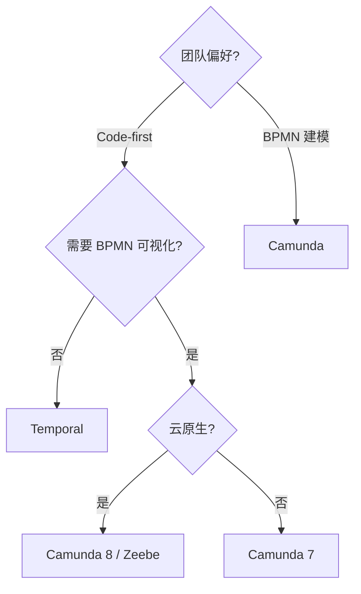

<!--
module:
  parent: workflow
  slug: workflow/temporal
  type: article
  category: 主模块子文章
  summary: Temporal.io Durable Execution 引擎——Workflow / Activity / Saga 与生产部署实践
-->

# Temporal.io

> 一句话定位：**Durable Execution 引擎——让分布式应用像写单线程代码一样简单，崩溃后从断点恢复**

Temporal 由 Uber 的 Cadence 团队创建，2026 年已是 CNCF 热门项目。它的核心理念是 **Durable Execution**：应用状态自动持久化，进程崩溃、网络中断、服务重启后从断点恢复，开发者只需写"正常代码"而不必关心容错逻辑。

---

## 📚 核心内容

| 主题 | 内容 | 关键点 |
|------|------|--------|
| 一、Durable Execution | 核心概念与设计哲学 | 状态自动持久化 + 确定性重放 |
| 二、核心原语 | Workflow / Activity / Signal / Query | 4 大构建块 |
| 三、引擎对比 | Temporal vs Camunda/Zeebe | 编程模型 vs 建模模型 |
| 四、重试与超时 | 重试策略 / 超时控制 / 心跳 | 弹性设计 |
| 五、Saga 模式 | 长事务补偿实现 | 分布式事务替代方案 |
| 六、生产部署 | Temporal Cloud vs Self-hosted | 运维选型 |
| 七、适用场景 | 长事务 / 编排 / cron 替代 | 典型用例 |

---

## 一、Durable Execution 核心概念

### 什么是 Durable Execution？

```text
传统分布式应用：
  开发者手动处理 → 重试、超时、状态持久化、故障恢复
  代码中 80% 是"胶水逻辑"

Temporal Durable Execution：
  框架自动处理 → 状态持久化、重试、超时、故障恢复
  开发者只写"业务逻辑"
```

### 核心设计原则

| 原则 | 说明 |
|------|------|
| **确定性** | Workflow 代码必须是确定性的（不直接调时间、随机数、外部 API） |
| **持久化** | 每次状态变更自动写入 Event Sourcing 日志 |
| **重放** | 崩溃后通过重放历史事件恢复到断点位置 |
| **隔离** | Workflow 只能通过 Activity 或 Signal 与外部交互 |

```go
// Go 示例：一个看起来"普通"的函数，实际上是 Durable Workflow
func OrderWorkflow(ctx workflow.Context, order Order) error {
    // 这些步骤崩溃后会自动从断点恢复
    var paymentResult PaymentResult
    err := workflow.ExecuteActivity(ctx, ProcessPayment, order).Get(ctx, &paymentResult)
    if err != nil {
        return err
    }

    var shipResult ShipResult
    err = workflow.ExecuteActivity(ctx, ShipOrder, order).Get(ctx, &shipResult)
    if err != nil {
        // 补偿：退款
        workflow.ExecuteActivity(ctx, RefundPayment, paymentResult.TransactionID).Get(ctx, nil)
        return err
    }

    return nil
}
```

---

## 二、Workflow / Activity / Signal / Query

### 四大核心原语

| 原语 | 运行位置 | 特征 | 用途 |
|------|---------|------|------|
| **Workflow** | Temporal Server | 确定性、可重放、长久运行 | 编排逻辑 |
| **Activity** | Worker 进程 | 非确定性、副作用、可能失败 | 实际业务操作 |
| **Signal** | 外部 → Workflow | 异步发送、Workflow 被动接收 | 人工审批、状态变更 |
| **Query** | 外部 ← Workflow | 同步读取、不改变状态 | 查询进度、当前状态 |

### Activity 示例

```go
// Activity：执行实际的外部操作（可以调 API、写数据库、发邮件）
func ProcessPayment(ctx context.Context, order Order) (*PaymentResult, error) {
    // 这里的代码可以是非确定性的
    txID := uuid.New().String()
    result, err := paymentGateway.Charge(order.Amount, txID)
    if err != nil {
        return nil, err
    }
    return &PaymentResult{TransactionID: txID, Status: "charged"}, nil
}
```

### Signal 与 Query

```go
// Workflow 中接收 Signal
func ApprovalWorkflow(ctx workflow.Context) error {
    approved := false

    // 等待外部 Signal
    signalCh := workflow.GetSignalChannel(ctx, "approval")
    signalCh.Receive(ctx, &approved)

    if approved {
        return workflow.ExecuteActivity(ctx, ProcessOrder, nil).Get(ctx, nil)
    }
    return errors.New("order rejected")
}

// 外部发送 Signal
client.SignalWorkflow(ctx, workflowID, "", "approval", true)
```

---

## 三、与 Camunda/Zeebe 对比

| 维度 | Temporal | Camunda 8 / Zeebe | Camunda 7 |
|------|---------|-------------------|-----------|
| **编程模型** | Code-first（Go/Java/TS/Python） | BPMN 2.0 + Job Worker | BPMN 2.0 嵌入式 |
| **流程定义** | 代码即流程 | XML（BPMN 图） | XML（BPMN 图） |
| **状态存储** | Event Sourcing（Cassandra/MySQL/PG） | 内置分布式日志（Raft） | RDBMS |
| **吞吐量** | 高（数万 WF/秒） | 极高（10K+ 实例/秒） | 中（千级/秒） |
| **学习曲线** | 中（需理解确定性约束） | 高（BPMN + Zeebe 概念） | 中（BPMN + Spring） |
| **可视化** | Temporal Web UI（执行视图） | Modeler + Operate（建模+监控） | Cockpit（监控） |
| **版本管理** | 代码级 Git | BPMN 版本部署 | BPMN 版本部署 |
| **适用团队** | 工程师主导 | 工程师 + 业务分析师 | Java/Spring 团队 |
| **语言生态** | Go / Java / TypeScript / Python | Java / Go / .NET（Job Worker） | Java（嵌入式） |
| **Saga 支持** | 原生（代码级补偿） | BPMN Compensation Event | BPMN Compensation Event |

### 选型决策



---

## 四、重试策略与超时控制

### Activity 重试策略

```go
// Go 重试配置
ao := workflow.ActivityOptions{
    StartToCloseTimeout: 30 * time.Second,     // 单次执行超时
    ScheduleToCloseTimeout: 5 * time.Minute,    // 总调度超时
    HeartbeatTimeout: 10 * time.Second,         // 心跳超时
    RetryPolicy: &temporal.RetryPolicy{
        InitialInterval:    time.Second,         // 首次重试间隔
        BackoffCoefficient: 2.0,                 // 退避系数
        MaximumInterval:    time.Minute,         // 最大间隔
        MaximumAttempts:    5,                   // 最大重试次数
        NonRetryableErrorTypes: []string{        // 不可重试的错误
            "InvalidInput",
            "InsufficientFunds",
        },
    },
}
ctx = workflow.WithActivityOptions(ctx, ao)
```

### 超时层次

```text
Schedule-to-Start  ─── Worker 拉取 Activity 的最大等待
Start-to-Close     ─── Activity 单次执行的最大时间
Schedule-to-Close  ─── Activity 从调度到完成的最大时间（含重试）
Heartbeat          ─── 长任务定期上报进度
```

### 心跳与长任务

```go
func LongRunningActivity(ctx context.Context) error {
    for i := 0; i < 100; i++ {
        // 检查是否被取消
        if err := ctx.Err(); err != nil {
            return err
        }

        // 处理一批数据
        processBatch(i)

        // 上报进度（也用于检测 Worker 存活）
        activity.RecordHeartbeat(ctx, i)
    }
    return nil
}
```

---

## 五、Saga 模式实现

Temporal 实现 Saga 模式极为自然——Workflow 本身就是编排器，补偿逻辑直接在代码中表达。

```go
func OrderSaga(ctx workflow.Context, order Order) error {
    var compensations []func() error

    // 1. 扣减库存
    err := workflow.ExecuteActivity(ctx, ReserveInventory, order).Get(ctx, nil)
    if err != nil {
        return runCompensations(compensations)
    }
    compensations = append(compensations, func() error {
        return releaseInventory(order)
    })

    // 2. 处理支付
    var payment PaymentResult
    err = workflow.ExecuteActivity(ctx, ChargePayment, order).Get(ctx, &payment)
    if err != nil {
        return runCompensations(compensations)
    }
    compensations = append(compensations, func() error {
        return refundPayment(payment.TransactionID)
    })

    // 3. 安排发货
    err = workflow.ExecuteActivity(ctx, ScheduleShipping, order).Get(ctx, nil)
    if err != nil {
        return runCompensations(compensations)
    }

    // 全部成功
    return nil
}
```

### Saga vs 2PC vs TCC

| 模式 | 一致性 | 性能 | 实现复杂度 | Temporal 适配 |
|------|--------|------|-----------|-------------|
| **Saga** | 最终一致 | 高 | 中 | ✅ 原生支持 |
| **2PC** | 强一致 | 低（锁资源） | 低 | ❌ 不适合 |
| **TCC** | 最终一致 | 中 | 高（3 个接口） | ✅ 可实现 |

---

## 六、生产部署

### Temporal Cloud vs Self-hosted

| 维度 | Temporal Cloud | Self-hosted |
|------|---------------|-------------|
| **运维** | 零运维（SaaS） | 需运维 Cassandra/MySQL + Server + Worker |
| **成本** | 按 Actions 计费 | 基础设施 + 人力成本 |
| **数据主权** | 数据在 Temporal 云 | 数据完全自控 |
| **SLA** | 99.99% | 取决于自建架构 |
| **适用** | 中小团队 / 快速启动 | 大型企业 / 合规要求 |
| **多租户** | Namespace 隔离 | 自建 Namespace + RBAC |

### Self-hosted 架构

```text
┌────────────┐     ┌────────────┐     ┌────────────┐
│   Worker   │     │   Worker   │     │   Worker   │
│  (Activity)│     │ (Workflow) │     │  (Activity)│
└─────┬──────┘     └─────┬──────┘     └─────┬──────┘
      │                   │                   │
      └───────────────────┼───────────────────┘
                          │ gRPC
                   ┌──────┴──────┐
                   │   Frontend  │ ← 负载均衡
                   │   Service   │
                   └──────┬──────┘
                          │
              ┌───────────┼───────────┐
              │           │           │
        ┌─────┴──┐  ┌────┴────┐ ┌───┴─────┐
        │History │  │Matching │ │Worker   │
        │Service │  │Service  │ │Internal │
        └────┬───┘  └─────────┘ └─────────┘
             │
      ┌──────┴──────┐
      │  Cassandra  │ ← 持久化存储
      │  / MySQL    │
      └─────────────┘
```

### 生产建议

| 配置项 | 建议值 | 说明 |
|--------|--------|------|
| Worker 数 | 按 CPU 核心数 × 2 | Activity Worker 可水平扩展 |
| Task Queue | 按业务域划分 | 避免热点 |
| 持久化 | Cassandra 3 节点+ / MySQL 主从 | 生产不用 SQLite |
| 监控 | Prometheus + Grafana | Temporal 暴露 metrics endpoint |
| 版本 | Workflow 版本化部署 | 使用 `GetVersion` API 做蓝绿 |

---

## 七、适用场景

| 场景 | Temporal 优势 | 示例 |
|------|-------------|------|
| **长事务** | 状态持久化，可运行数天/数月 | 订单履约、保险理赔 |
| **分布式编排** | 多服务协调 + 自动重试 | 微服务调用链编排 |
| **Cron 替代** | 可靠性 + 可观测性 | 定时报表、数据同步 |
| **数据管道** | 步骤间依赖 + 容错 | ETL / 数据迁移 |
| **基础设施管理** | 长生命周期 + 状态跟踪 | 云资源 Provisioning |
| **人工审批流** | Signal 等待 + 超时 | 采购审批、内容审核 |

### 不适用场景

| 场景 | 原因 | 替代方案 |
|------|------|---------|
| 简单 CRUD | 杀鸡用牛刀 | 直接 HTTP API |
| 实时流处理 | 非流式架构 | Kafka Streams / Flink |
| 高频交易 | 延迟不达标 | 内存计算 + 专线 |
| 纯 BPMN 建模 | 需要业务人员参与建模 | Camunda |

---

## 🔗 相关章节

- **流程引擎**：[process-engine](../process-engine/README.md) — Camunda / Zeebe / Flowable 对比
- **微服务编排**：[workflow-and-microservice-orchestration](../workflow-and-microservice-orchestration/README.md) — 编舞 vs 编排
- **事件驱动**：[apache-eventmesh](../apache-eventmesh/README.md) — 事件驱动编排基础设施
- **分布式事务**：[06.spring/03-data/transaction/distributed](../../06.spring/03-data/transaction/distributed/) — Saga / TCC 理论

---

## 📖 开源参考

| 项目 | 说明 | 链接 |
|------|------|------|
| Temporal | Durable Execution 引擎 | [github.com/temporalio/temporal](https://github.com/temporalio/temporal) |
| Temporal Go SDK | Go 语言 SDK | [github.com/temporalio/sdk-go](https://github.com/temporalio/sdk-go) |
| Temporal Java SDK | Java 语言 SDK | [github.com/temporalio/sdk-java](https://github.com/temporalio/sdk-java) |
| Temporal TypeScript SDK | TS/Node SDK | [github.com/temporalio/sdk-typescript](https://github.com/temporalio/sdk-typescript) |

---

← [返回: 工作流](../README.md)
