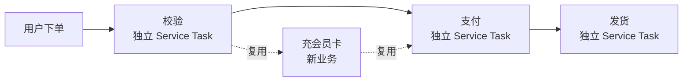
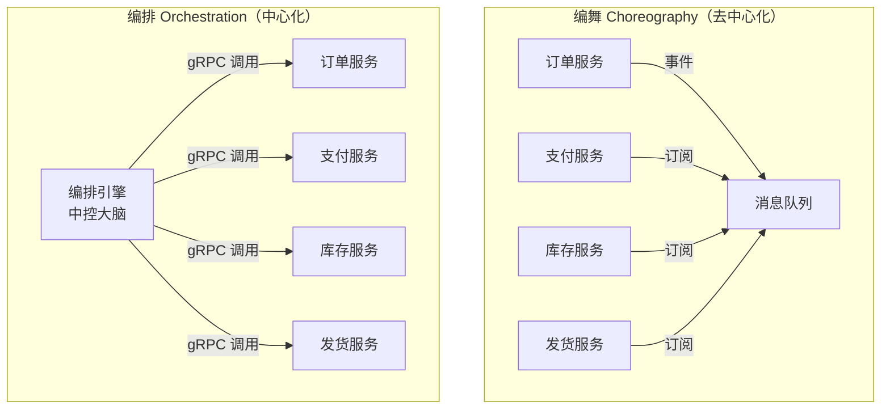
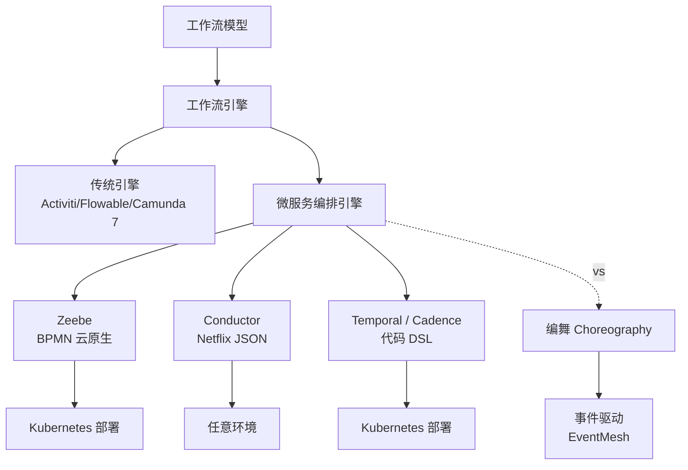

# 工作流引擎与微服务编排

> 最后更新: 2026-06-14
> ⬅️ [返回 07 工作流](../README.md) | [流程引擎](../process-engine/README.md) | [Zeebe](../process-engine/camunda/camunda-8/zeebe/README.md) | [事件驱动](../apache-eventmesh/README.md) | [工作流定义](../define/README.md)

## 🎯 一句话定位

**工作流引擎 = 微服务时代的"中控大脑"**——从 OA 审批到电商订单，传统流程引擎用 BPMN 管"人 + 系统"长流程；微服务编排引擎（Zeebe / Conductor / Cadence）专为"高并发、分布式、可观测"而生。

---

## 📚 章节导航（6 节 + 3 案例）

| 节 | 内容 | 何时读 |
|:---|:-----|:------|
| **一、从工作流到引擎** | 无工作流痛点 → 应用工作流模型 → 工作流引擎诞生 | 理解引擎的必要性 |
| **二、微服务时代挑战** | 传统引擎 4 大局限（同步/jar 嵌入/DB 单点/扩展性）| 评估为什么传统引擎不够 |
| **三、编舞 vs 编排** | 2 大模式对比 + 决策建议（中小流量 vs 大流量）| 第一次架构选型 |
| **四、3 大编排引擎对比** | Zeebe / Conductor / Cadence-Temporal 9 维 | 选择编排引擎 |
| **五、真实落地案例** | Netflix Conductor / Uber Cadence / 阿里 OpenSergo | 看工业级生产案例 |
| **六、2025-2026 进展** | Temporal 1.x GA + AI Agent SDK + Zeebe 8.7+ | 跟进最新技术 |

> 💡 **阅读路径**：入门 → 1 → 2 → 3；选型 → 4 → 6；案例参考 → 5。

---

## ⚡ 3 引擎 + 2 模式速查

### 3 大编排引擎

| 引擎 | DSL | 一句话定义 | 何时选 |
|:-----|:-----|:----------|:------|
| **Zeebe（Camunda 8）** | BPMN 2.0 | 业务可读的分布式编排引擎 | 业务人员参与 / 跨团队沟通 |
| **Conductor（Netflix）** | JSON | 简单灵活的微服务编排 | 中等规模 SaaS / 喜欢 JSON |
| **Cadence / Temporal** | 代码 DSL | 工程师友好的 async/await 编排 | 复杂异步 / 长期状态 / AI Agent |

### 2 大模式

| 模式 | 拓扑 | 一句话定义 | 何时选 |
|:-----|:-----|:----------|:------|
| **编舞 Choreography** | 去中心化 | 服务间通过事件消息协作 | 中小流量 / 团队自治 |
| **编排 Orchestration** | 中心化引擎 | 中控引擎协调所有服务 | 大流量 / 强一致 / 合规 |

**关键记忆点**：

- **编舞灵活难调试**——事件散落 MQ，排查要 grep
- **编排可控单点重**——引擎是单点（但可集群）
- **混合**= 核心交易编排 + 辅助链路编舞（12306 模式）

> 📌 详细对比见 [§四 3 大编排引擎对比](#四三大微服务编排引擎对比)。

---

## 一、从工作流到工作流引擎

### 1.1 没有工作流时的协作：以"用户购买"为例


```mermaid
flowchart LR
    A[用户下单] --> B[校验]
    B --> C[支付]
    C --> D[发货]
```

校验、支付、发货一气呵成，看似流畅。**但产品加新需求时**——"新搞个充会员卡业务，步骤是 校验 → 推荐 → 支付 → 充值"——你不得不**改已有代码**，违反开闭原则。

### 1.2 应用工作流模型后

工作流模型 = **任务实现**（原子逻辑）+ **任务协作关系**（流程图）分离：


```mermaid
flowchart LR
    A[用户下单] --> B[校验<br/>独立 Service Task]
    B --> C[支付<br/>独立 Service Task]
    C --> D[发货<br/>独立 Service Task]
    B -.复用.-> E[充会员卡<br/>新业务]
    E -.复用.-> C
```

**新业务复用旧节点**——只需调整流程图，**不修改任何已有代码**。

### 1.3 工作流引擎 = 维护协作关系的程序

将任务实现与协作关系分离后，诞生了**专门维护任务协作关系的程序**——工作流引擎（也叫流程引擎）。代表产品：Activiti → 衍生出 Flowable / Camunda。

---

## 二、微服务时代的挑战

### 2.1 传统工作流引擎的局限

| 维度 | **传统工作流引擎（Camunda 7）** | **微服务编排引擎（Zeebe）** |
|------|------------------------------|--------------------------|
| **任务类型** | 人工审批为主（OA/审批流）| 程序化自动任务（API 调用）|
| **吞吐** | 单点架构、同步响应，< 100 实例/秒 | 分布式、事件驱动，10K+ 实例/秒 |
| **集成方式** | jar 嵌入业务程序，本地方法调用 | 独立部署 + gRPC + 拉模式 Job Worker |
| **状态存储** | 强依赖关系型 DB（锁竞争）| 追加日志 + Raft + ES（无锁）|
| **跨服务** | 难寻址多实例 + 容易压垮后端 | Worker 拉任务 + 背压机制 |
| **代表** | Activiti / Flowable / Camunda 7 | Zeebe / Conductor / Cadence |

### 2.2 为什么传统引擎撑不住微服务？

1. **同步调用瓶颈**：传统引擎主动 push 任务到 Worker，后端慢 → 引擎阻塞
2. **jar 嵌入难扩展**：单服务多实例部署时，引擎如何寻址？
3. **DB 单点**：所有状态写同一 DB，并发受限于 DB 锁

---

## 三、微服务编舞 vs 编排

### 3.1 两种模式


```mermaid
graph TB
    subgraph "编舞 Choreography（去中心化）"
        A1[订单服务] -->|事件| MQ[消息队列]
        B1[支付服务] -->|订阅| MQ
        C1[库存服务] -->|订阅| MQ
        D1[发货服务] -->|订阅| MQ
    end

    subgraph "编排 Orchestration（中心化）"
        Engine[编排引擎<br/>中控大脑] -->|gRPC 调用| A2[订单服务]
        Engine -->|gRPC 调用| B2[支付服务]
        Engine -->|gRPC 调用| C2[库存服务]
        Engine -->|gRPC 调用| D2[发货服务]
    end
```

| 维度 | **编舞 Choreography** | **编排 Orchestration** |
|------|----------------------|----------------------|
| **拓扑** | 去中心化 | 中心化引擎 |
| **通信** | 事件消息（MQ）| gRPC / REST 直接调用 |
| **可观测** | ❌ 难（事件散落）| ✅ 引擎统一面板 |
| **失败处理** | 各服务自治 | 引擎统一重试 / 升级 |
| **适用** | 简单业务流、团队成熟 | 长流程、合规要求高 |
| **代表** | 事件驱动 + 微服务 | Zeebe / Conductor / Camunda 8 |

### 3.2 决策建议

- **中小流量 + 团队自治** → 编舞（事件驱动）
- **大流量 / 强一致 / 合规** → 编排（中控引擎）
- **混合**：Camunda 8 + 事件驱动 = 骨架 + 神经

---

## 四、三大微服务编排引擎对比

| 引擎 | **Zeebe** | **Conductor** | **Cadence / Temporal** |
|------|-----------|--------------|----------------------|
| **厂商** | Camunda | Netflix | Uber（Cadence）/ Temporal（商业化）|
| **架构** | Raft + 追加日志 + ES | DynamoDB / MySQL / Postgres | Cassandra / MySQL + Visibility |
| **DSL** | BPMN 2.0（图形化）| 自研 JSON DSL | 代码 DSL（Java/Go/Python）|
| **吞吐** | 10K+ 实例/秒 | 中等 | 极高（Uber 生产验证）|
| **学习曲线** | 中（需懂 BPMN）| 低（JSON 易上手）| 中（需理解异步编程）|
| **云原生** | ✅ K8s 原生 | ⚠️ 需自部署 | ✅ K8s 原生 |
| **运维成本** | 中 | 中-高 | 中 |
| **使用案例** | 跨境电商、银行业 | Netflix、媒体 | Uber、阿里、字节 |
| **开源协议** | Zeebe Community License | Apache 2.0 | MIT（Cadence）/ 商业（Temporal）|

**选型建议**：

- 团队熟悉 BPMN / 需要业务可读的图 → **Zeebe**（详见 [Zeebe 内核](../process-engine/camunda/camunda-8/zeebe/README.md)）
- 团队 Netflix 背景 / 喜欢 JSON DSL → **Conductor**
- 团队 Go/Node 强 / 复杂异步编程 → **Temporal**（Cadence 商业化版）

---

## 五、完整图谱


```mermaid
graph TB
    WF[工作流模型]
    WF --> WFE[工作流引擎]
    WFE --> OLD[传统引擎<br/>Activiti/Flowable/Camunda 7]
    WFE --> NEW[微服务编排引擎]
    NEW --> Z[Zeebe<br/>BPMN 云原生]
    NEW --> C[Conductor<br/>Netflix JSON]
    NEW --> T[Temporal / Cadence<br/>代码 DSL]

    Z --> K8S1[Kubernetes 部署]
    C --> K8S2[任意环境]
    T --> K8S3[Kubernetes 部署]

    NEW -.vs.-> CHO[编舞 Choreography]
    CHO --> ED[事件驱动<br/>EventMesh]
```

---

## 五、真实落地案例

### 案例 1：Netflix Conductor（编排引擎代表）

| 维度 | 数据 |
|------|------|
| **业务** | Netflix 全球视频编转码 + 内容审核 + 计费 |
| **规模** | **日均 100 万+ 工作流实例** |
| **DSL** | JSON（自研）|
| **存储** | DynamoDB（主）+ MySQL / Postgres（可选）|
| **关键能力** | **子工作流嵌套** + **任务队列** + **Select 任务（动态分支）** + **HTTP / Lambda / Event 任务** |
| **效果** | 替代旧的 Step Workflow 引擎，处理量提升 10 倍，运维成本 ↓ 60% |

**Conductor 特色**：

- **任务系统**（Task Domain）：可自定义 worker 类型
- **Select 任务**：运行时根据条件选下一步（类似 BPMN 排他网关）
- **Do-While 循环**：直到条件满足才退出
- **HTTP Task**：原生支持调外部 API（无需写 worker）

### 案例 2：Uber Cadence（→ Temporal 商业化）

| 维度 | 数据 |
|------|------|
| **业务** | Uber 全球出行订单履约 + 派单 + 支付 |
| **规模** | **PB 级流量**（单工作流 7 年 + 数万 RPS）|
| **DSL** | 代码 DSL（Go / Java）|
| **存储** | Cassandra（主）+ MySQL + Visibility（ES）|
| **关键能力** | **async/await 风格** + **确定性重放** + **Saga 模式** + **无限时长**（执行可跨年）|
| **效果** | 替代基于消息队列 + 定时器的"自制编排"，开发者效率 ↑ 5 倍，bug 率 ↓ 80% |

**Cadence → Temporal 演进**：

- 2020：Cadence 核心开发者创立 **Temporal Technologies**
- 2024-Q3：Temporal 1.x **GA**（API 稳定，云托管服务 Temporal Cloud 商用）
- 2025-2026：**Temporal 成为云原生编排引擎的事实标准之一**（与 Zeebe 抗衡）

### 案例 3：阿里巴巴 阿里巴巴 OpenSergo（编排 + 服务治理融合）

| 维度 | 数据 |
|------|------|
| **业务** | 阿里电商大促（双11 / 618）的服务编排 + 限流降级 |
| **规模** | **百万级 QPS**（秒杀 + 支付）|
| **关键能力** | **Sentinel 限流** + **OpenSergo 编排** + **Seata 分布式事务** 一体化 |
| **效果** | 大促峰值系统可用性 99.99%，限流策略 5 分钟内全集群生效 |

**国内选型观察**：

- 大厂（阿里/字节/美团）：自研 + 借鉴 Cadence 思想
- 中型互联网：**Camunda 8 / Zeebe**（业务可读 + 跨团队沟通）
- 企业级 SaaS：**Conductor**（JSON 简单 + 上手快）
- 复杂 Agent 编排：**Temporal**（async/await 灵活）

---

## 六、2025-2026 三大引擎新进展

| 引擎 | 最新动态 | 实战影响 |
|------|---------|---------|
| **Zeebe** | Camunda 8.7+ 加 Tasklist 表单生成器 + 多区域灾备 | 业务可自助配置 + 跨国企业可上 |
| **Conductor** | v3.x 引入 **Async Saga** + **Schema Registry** | 微服务事务支持更强 |
| **Temporal** | 1.x GA（2024）+ **AI Agent SDK（2025）** | AI 工作流编排入场 |

**Temporal AI Agent SDK（2025 新发布）**：

```python
from temporalio import workflow
from temporalio.contrib import openai_agents

@workflow.defn
class ResearchAgent:
    @workflow.run
    async def run(self, query: str) -> str:
        # 用 OpenAI Agents SDK 跑多步推理，自动持久化 + 断点恢复
        result = await workflow.execute_activity(
            run_agent,
            query,
            start_to_close_timeout=timedelta(minutes=10)
        )
        return result
```

**Temporal 的核心竞争力**：

- **持久化执行**：工作流可跨机器故障自动恢复
- **版本化**：工作流代码可版本化管理，旧的执行流按旧版走
- **生态**：Python / Go / Java / TypeScript / .NET 多语言 SDK 一致

**对 Zeebe 的影响**：Zeebe 强在 **BPMN 业务可读**；Temporal 强在 **AI Agent 编排灵活**。两者将长期共存，分别占据"流程治理"和"AI 原生"两大赛道。

---

## 🤔 思考

1. **为什么 OA 时代的 Camunda 7 不适合微服务？** jar 嵌入 + 同步调用 + 集中 DB 三个局限。Camunda 7 设计目标是"流程协作 + 审计"，不是"高并发服务编排"——**用错场景了**。
2. **编舞 vs 编排的最大差异？** **可观测性**——编舞事件散落 MQ，出了问题要 grep 日志；编排引擎一图掌握全部状态。但**编舞更灵活**（服务可独立演进）。
3. **Temporal 比 Zeebe 强在哪？** Temporal 的 async/await 模型对工程师更友好（写代码像写同步程序），且 Cadence 在 Uber 跑了 7 年验证过 PB 级流量。代价是**没有 BPMN 业务可读性**。
4. **微服务编排 = 工作流引擎 v2？** 本质相同（任务 + 协作），但**运行环境从单体变分布式**——并发模型从"线程池 + DB 锁"变"Raft + 追加日志"。
5. **BPMN 引擎 vs 代码 DSL（如 Temporal）？** BPMN 强在**业务可读 + 跨团队沟通**（业务人员可参与流程图设计）；代码 DSL 强在**灵活性 + 复杂逻辑表达**。大型组织选 BPMN，初创公司选代码 DSL。
6. **Conductor 是否过时？** 没有。Netflix 内部仍在用且持续迭代（v3.x 引入 Saga）。Conductor 的 **JSON DSL** 优势仍在——比 BPMN 简单，比 Temporal 代码灵活。**中等规模 SaaS 的最佳平衡点**。

---

## 相关章节

- ⬅️ [返回 07 工作流](../README.md)
- [工作流定义](../define/README.md) — BPMN 三要素（编排引擎执行的"图纸"）
- [流程引擎](../process-engine/README.md) — 传统流程引擎的能力与局限
- [Zeebe 内核](../process-engine/camunda/camunda-8/zeebe/README.md) — 主流微服务编排引擎之一
- [Camunda 8 / 云原生](../process-engine/camunda/camunda-8/README.md) — 编排 + AI 集成
- [事件驱动与 Serverless Workflow](../apache-eventmesh/README.md) — 事件驱动的另一种微服务协作方式
