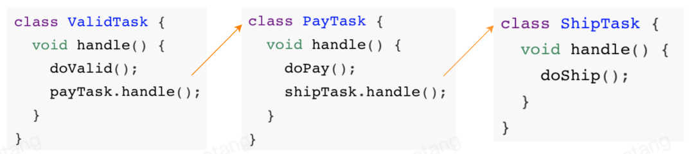
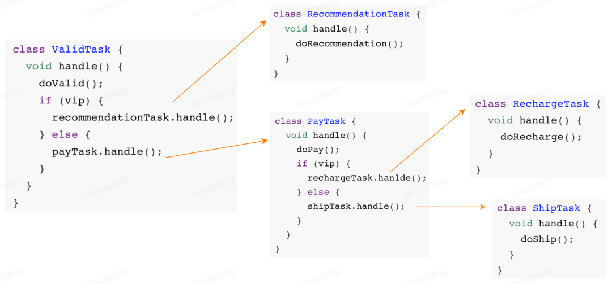
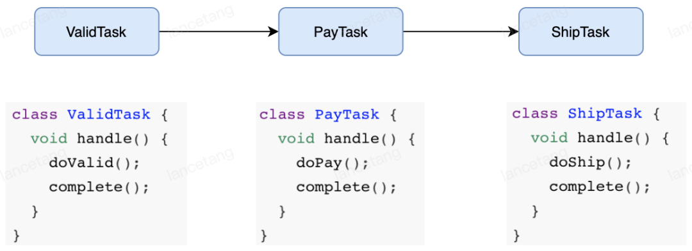
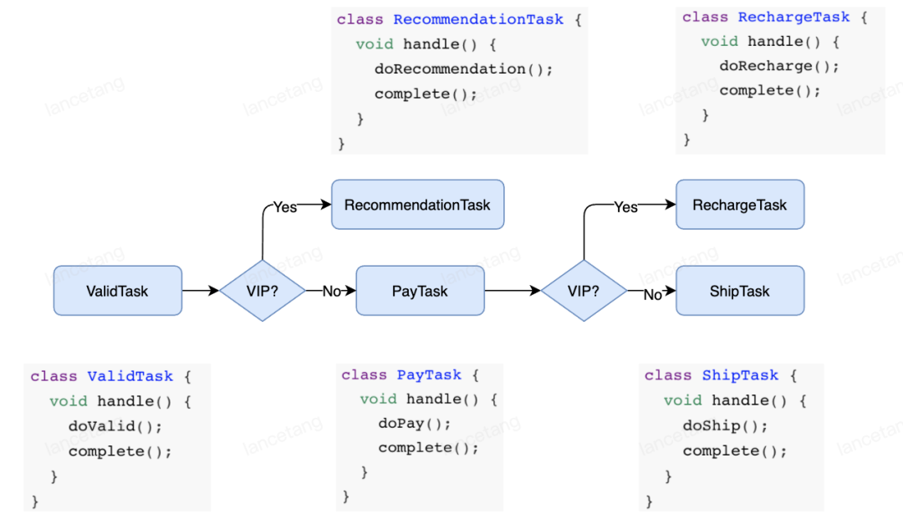
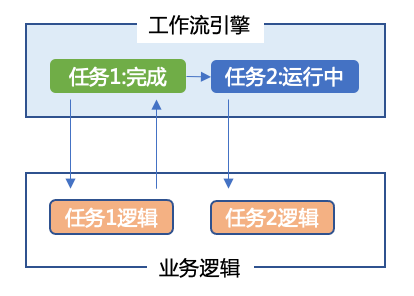
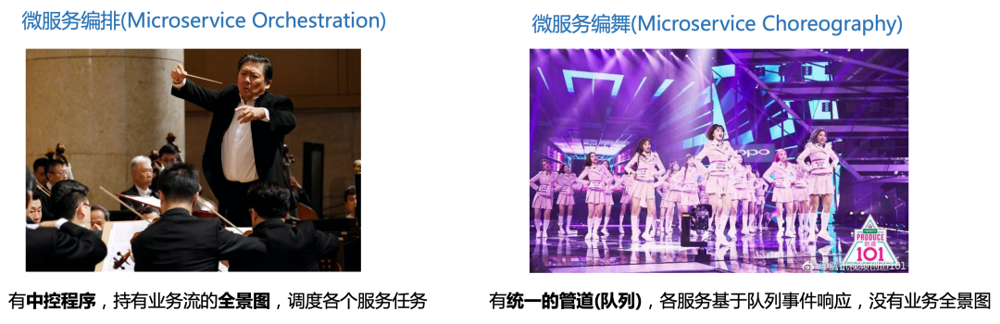
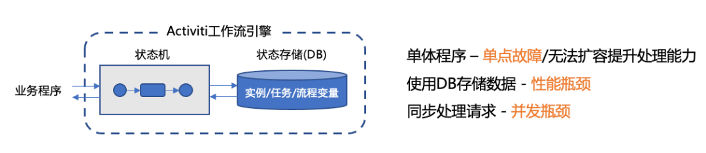
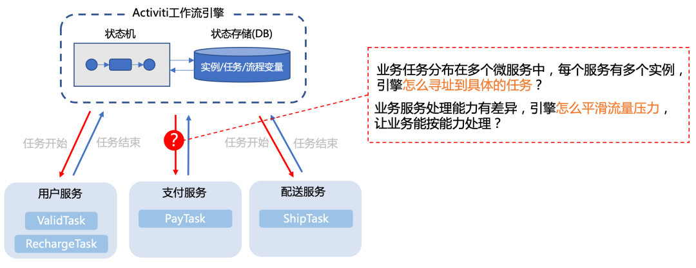

# 工作流引擎与微服务编排

## 工作流
提到工作流，印象里都是 OA 系统各种请假审批流。事实上，广义上的工作流是对工作流程及其各操作步骤之间业务规则的抽象、概括、描述。简单理解，我们为了实现某个业务目标，抽象拆解出来的一系列步骤及这些步骤之间的协作关系，就是工作流。例如订单发货流、程序构建流等。业界通常用 BPMN 流程图来描述一个工作流。

### 没有工作流时的任务协作
以实现一个用户购买逻辑为例，如果不应用工作流模型，我们串联多个任务(步骤)一般是通过显示的代码调用：  

校验、支付、发货一气呵成，流畅自然。正喝着枸杞红枣，产品一脸笑意跑过来：“我们新搞个充会员卡的业务，大概步骤就校验 -> 推荐 -> 支付 -> 充值。校验和支付前面都做过了，应该很快实现吧？”

精通 if-else 的你，听完的瞬间就已经构思好了代码：  

一通写下来，总感觉哪里不对，“为什么加新的任务节点，要改已有的代码呢？这不符合开闭原则啊！”。

### 应用工作流模型的任务协作
工作流模型正是为了解决这类问题而生：分离任务的实现和任务的协作关系。上面同样的用户购物逻辑，有了工作流模型，各个任务只实现自己原子的逻辑，任务协作关系使用流程图来表达。

当新的逻辑需要复用已有任务节点时，只需要调整流程图，无需修改已有代码。

## 工作流引擎
将任务实现与任务协作关系分离之后，就诞生了专门维护任务协作关系的程序 - 工作流引擎(也常称作流程引擎)。

其中最具有代表性的就非 Activiti 莫属，其又衍生出flowable和camunda流程引擎

## 微服务编排
微服务架构的一大核心是把大的复杂的业务系统拆分成高内聚的微服务，每个服务负责相对独立的逻辑。例如一个电商系统，可能会拆分出支付微服务、订单微服务、仓储微服务、物流微服务等。服务拆分的好处无需赘述，但是要实现业务价值，不是看单个服务的能力，而是要协调所有服务保证企业端到端业务流的成功。

那么，哪个服务来负责端到端业务流的成功呢？答案是没有。事实上，在公司内，端到端的业务流可能都没有正式的文档说明，从一个微服务到另一个微服务的事件流转都是在代码里隐式表达的。

很多微服务架构依赖一种相对纯粹的编舞模式(choreography pattern)来解决这个问题。在这种模式下，微服务通过向一个消息队列发送和接收事件来相互协作。编舞模式给开发者提供了很高的灵活度，但是编舞模式仍不能解决：
- **可见性**：多少端到端业务流正在运行中，它们的状态是什么样子。过去 24 小时，有多少业务流实例没有成功结束？为什么这些业务流实例没有成功结束？一个业务流或者某个任务完成的平均时间是多少？
- **可异常处理**：如果业务流里有一个微服务失败，谁负责处理这个异常？业务流的重试逻辑是怎么样的？如果需要人工介入，问题的升级处理规则是怎么样的？

于是便诞生了一种更严格的编排模式(orchestration pattern)，用于协调各个微服务。在这种模式下，会有一个中控的引擎：
- 按照业务逻辑的蓝图，编排各个微服务的调用关系；
- 监控整个业务流的状态；
- 提供自动化的机制处理单个服务的失败，保证整个业务流的成功。

可以借用下面的图，来进一步理解微服务编排和微服务编舞模式的区别：

按照前面对工作流模型的阐述，工作流引擎很适合作为中控引擎，来编排调度微服务。那为微服务编排又是如何诞生的呢？

主要原因是传统工作流引擎的架构无法适应当下微服务的场景：
- 传统的工作流引擎，编排的大部分是人工审批任务，意味着任务流转效率低，系统吞吐低。而当下微服务大部分是程序化的自动任务，意味着任务高效流转，系统吞吐高。单点架构、同步响应、高度依赖 DB 的 工作流引擎，显然支撑不了这样的场景。  

- 传统的工作流引擎通常都以 jar 包的形式，嵌入到业务程序中，直接通过调用本地方法的方式调度起业务 TaskHandler。在单体架构下，这种集成方式简单易用。但是在微服务架构下，工作流的任务往往是分布在多个服务的，而且同一个服务往往还会根据负载情况部署不同数量的实例。如果还是采用引擎主动调用的方式，怎么寻址到具体的 TaskHandler？当后端业务服务处理能力本身是瓶颈的时候，如果引擎还是不断的调用，只会进一步压垮服务。  

而微服务编排的设计设计之初，就考虑到了这些问题。
目前主流的微服务编排引擎有zeebe-io/zeebe, netflix/conductor, uber/cadence。