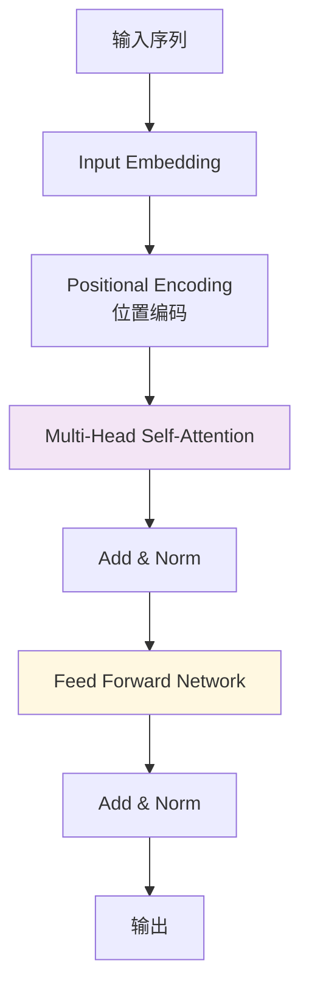
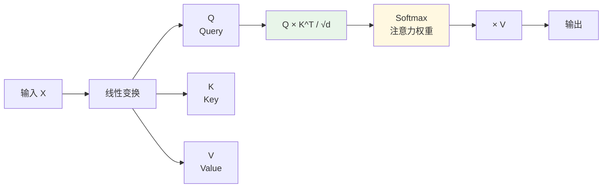
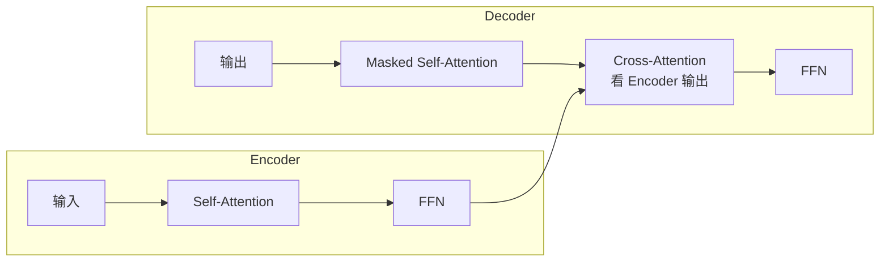

<!--
module:
  parent: 08.ai-foundations/03-transformer
  slug: 08.ai-foundations/03-transformer/transformer-architecture
  type: article
  category: 主模块子文章
  summary: Transformer 架构核心：Self-Attention + QKV + Multi-Head。
-->

# Transformer 架构核心

> **一句话定位**：现代大模型的基石——Self-Attention + Multi-Head + 位置编码三件套，抛弃 RNN 实现并行训练与长距离建模，是 GPT/BERT/Claude/LLaMA 的共同源头。

← 返回 [基础概念](../README.md)

> Transformer 是 2017 年 Google 论文 *"Attention is All You Need"* 提出的架构，抛弃 RNN，完全基于注意力机制，是 GPT / BERT / Claude / LLaMA 等所有现代大模型的基石。

---
## 引言：Transformer 架构核心 的关键决策

本篇是「Transformer 架构核心」的核心章节，聚焦该主题在实际落地时**5 个 trade-off 的取舍与决策轴**。

## 一、Transformer 解决了什么问题

**RNN/LSTM 的痛点**：
- 顺序处理，无法并行（训练慢）
- 长距离依赖问题（信息丢失）

**Transformer（2017，Google "Attention is All You Need"）**：
- **完全基于注意力机制**，抛弃 RNN
- **并行计算**（训练快 N 倍）
- **长距离依赖直接建模**

---

## 二、核心架构



**核心组件**：
1. **Embedding 层**：Token → 向量
2. **Positional Encoding**：给每个 token 加位置信息
3. **Multi-Head Self-Attention**：核心创新
4. **Feed Forward Network**：逐位置处理
5. **Add & Norm**：残差连接 + 层归一化

---

## 三、Self-Attention（自注意力）

### 核心思想

每个 token **关注序列中的所有其他 token**，计算"注意力权重"。

### QKV 矩阵运算



**公式**：
```text
Attention(Q, K, V) = softmax(Q × K^T / √d) × V
```

- **Q（Query）**：我要找什么
- **K（Key）**：我有什么
- **V（Value）**：实际内容
- **√d**：缩放因子（防止点积过大）

**直观理解**：
- 每个 token 用 Q 去"查询"其他 token 的 K
- 匹配度高 → 注意力权重大 → 从 V 取更多特征

### 代码示例（PyTorch）

```python
import torch
import torch.nn.functional as F

def self_attention(Q, K, V):
    d_k = Q.size(-1)
    scores = torch.matmul(Q, K.transpose(-2, -1)) / (d_k ** 0.5)
    attn = F.softmax(scores, dim=-1)
    return torch.matmul(attn, V)
```

---

## 四、Multi-Head Attention

**思想**：多个注意力头并行，每个头学习不同的"关注模式"。

```python
class MultiHeadAttention(nn.Module):
    def __init__(self, d_model, n_heads):
        super().__init__()
        self.n_heads = n_heads
        self.d_k = d_model // n_heads
        
        self.W_q = nn.Linear(d_model, d_model)
        self.W_k = nn.Linear(d_model, d_model)
        self.W_v = nn.Linear(d_model, d_model)
        self.W_o = nn.Linear(d_model, d_model)
    
    def forward(self, x):
        B, L, D = x.shape
        
        # 线性变换
        Q = self.W_q(x).view(B, L, self.n_heads, self.d_k).transpose(1, 2)
        K = self.W_k(x).view(B, L, self.n_heads, self.d_k).transpose(1, 2)
        V = self.W_v(x).view(B, L, self.n_heads, self.d_k).transpose(1, 2)
        
        # 多头注意力
        attn = torch.matmul(Q, K.transpose(-2, -1)) / (self.d_k ** 0.5)
        attn = F.softmax(attn, dim=-1)
        out = torch.matmul(attn, V)
        
        # 拼接所有头
        out = out.transpose(1, 2).contiguous().view(B, L, D)
        return self.W_o(out)
```

**为什么多头？**
- 头 1 可能学习"主语-谓语"关系
- 头 2 可能学习"形容词-名词"关系
- 头 3 可能学习"指代消解"
- ...

---

## 五、Positional Encoding

Transformer 没有"顺序"概念（并行计算），必须**显式注入位置信息**。

```python
def positional_encoding(max_len, d_model):
    pe = torch.zeros(max_len, d_model)
    position = torch.arange(0, max_len).unsqueeze(1)
    div_term = torch.exp(torch.arange(0, d_model, 2) * -(math.log(10000.0) / d_model))
    
    pe[:, 0::2] = torch.sin(position * div_term)  # 偶数维度
    pe[:, 1::2] = torch.cos(position * div_term)  # 奇数维度
    
    return pe
```

**为什么用 sin/cos？**
- 相对位置可以表示为线性组合
- 外推到更长序列（训练时未见过的长度）

---

## 六、Encoder-Decoder 架构



**不同模型的选择**：
| 模型类型 | 架构 | 例子 |
|---------|------|------|
| **仅 Encoder** | BERT | 理解类任务（分类、NER） |
| **仅 Decoder** | GPT / LLaMA / Claude | 生成类任务（对话、写作） |
| **Encoder + Decoder** | T5 / BART | 翻译、摘要 |

---

## 七、面试陷阱速览

> 完整陷阱 + 反直觉 + 30 秒话术见 [`12.interview/11.ai/transformer`](../../12.interview/11.ai/transformer/)

---

## 相关章节

- 上游：[LLM 基础](../04-llm/README.md) — 大语言模型概述
- 关联：[Token 与计费](../../09.ai-applications/llm-inference/token-billing/) — LLM 推理成本
- 应用：[RAG](../../09.ai-applications/rag/) — Transformer 的核心应用场景


- single-epoch-and-config-evidence

## 📚 参考来源

1. **Transformer 原始论文（奠基）**：Ashish Vaswani, Noam Shazeer, Niki Parmar, Jakob Uszkoreit, Llion Jones, Aidan N. Gomez, Łukasz Kaiser, Illia Polosukhin. *Attention Is All You Need*. NeurIPS 2017. https://arxiv.org/abs/1706.03762
2. **GPT-1（首次证明 Transformer 生成式预训练）**：Alec Radford, Karthik Narasimhan, Tim Salimans, Ilya Sutskever. *Improving Language Understanding by Generative Pre-Training*. OpenAI Blog 2018. [OpenAI Blog 2018]
3. **BERT（双向 Transformer 编码器）**：Jacob Devlin, Ming-Wei Chang, Kenton Lee, Kristina Toutanova. *BERT: Pre-Training of Deep Bidirectional Transformers for Language Understanding*. NAACL 2019. https://arxiv.org/abs/1810.04805
4. **GPT-2（零样本多任务生成）**：Alec Radford, Jeffrey Wu, Rewon Child, David Luan, Dario Amodei, Ilya Sutskever. *Language Models are Unsupervised Multitask Learners*. OpenAI Tech Report 2019. [OpenAI Tech Report]
5. **RoPE（旋转位置编码，LLaMA 等使用）**：Jianlin Su, Yu Lu, Shengfeng Pan, Bo Wen, Yunfeng Liu. *RoFormer: Enhanced Transformer with Rotary Position Embedding*. Neurocomputing 2024 (arXiv 2021). https://arxiv.org/abs/2104.09864
6. **RMSNorm（替代 LayerNorm，LLaMA 使用）**：Biao Zhang, Rico Sennrich. *Root Mean Square Layer Normalization*. NeurIPS 2019. https://arxiv.org/abs/1910.07467

← [返回: L1 基础概念](../README.md)
