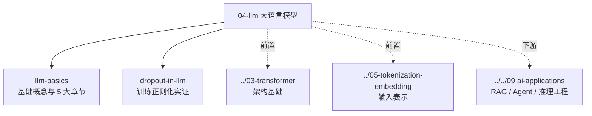

<!--module:
  parent: 08.ai-foundations
  slug: 08.ai-foundations/04-llm
  type: index
  category: AI 基础子模块
  summary: 大语言模型基础——语言模型演进、预训练、对齐与 Agent 能力的全景速查。
  depth: ⭐⭐
-->

# 04. 大语言模型

> **定位**：大语言模型基础——从语言模型演进、Transformer 架构到预训练、对齐与 Agent 能力。
> **继承规范**：[../SPEC.md](../SPEC.md)

## 知识地图

## 学习目标

- **建立概念底盘**：从 n-gram → 神经语言模型 → GPT 生成式范式的演进脉络（[llm-basics](./llm-basics.md)）
- **理解训练细节**：预训练目标、Dropout 等正则化手段在 LLM 中的实证行为（[dropout-in-llm](./dropout-in-llm/)）
- **衔接架构层**：先读 [03-transformer](../03-transformer/README.md) 建立注意力机制认知，再回看本章效率更高

## 文章清单

| 标题 | 路径 | 摘要 |
|------|------|------|
| LLM 基础 | [llm-basics.md](./llm-basics.md) | 5 大章节 / 关键概念速查 |
| Dropout in LLM | [dropout-in-llm/](./dropout-in-llm/) | 训练随机失活设置、影响与单 epoch 实证 |

> 📝 待扩展：pre-training（预训练目标 / 数据配比）· alignment（SFT / RLHF / DPO）· reasoning（思维链 / 推理扩展）——按体检轮次沉淀。

## 🔗 相关章节

- 前置：[`03-transformer`](../03-transformer/README.md) — 架构基础（注意力 / KV Cache / Flash Attention）
- 前置：[`05-tokenization-embedding`](../05-tokenization-embedding/README.md) — 输入表示
- 面试题：[`12.interview/11.ai`](../../12.interview/11.ai/README.md) — LLM 高频面试题（陷阱 + 话术版）
- 下游应用：[`09.ai-applications`](../../09.ai-applications/README.md) — RAG / Agent / Prompt / 推理工程

---

← [返回 08.ai-foundations](../README.md)
