<!--
module:
  parent: ai-foundations
  slug: 08.ai-foundations
  type: module
  category: AI 基础理论
  summary: AI 基础理论全景：ML 传统算法 → 深度学习 → Transformer 架构 → LLM → Tokenization
-->

# 08. AI Foundations

> AI 基础理论全景——从经典 ML 算法到深度学习框架，从 Transformer 架构到大语言模型，再到 Tokenization / Embedding；构建"理论 → 工程 → 架构 → 应用"的 5 层渐进式认知体系。
>
> **继承规范**：[SPEC.md](./SPEC.md)

---

## 📍 一句话定位

**AI 基础 = 5 层渐进**——传统 ML（监督/无监督/强化）→ 深度学习（PyTorch/TensorFlow/MindSpore/PaddlePaddle）→ Transformer 架构（Self-Attention / Multi-Head / KV Cache）→ LLM 基础（预训练 / 对齐 / Dropout）→ Tokenization + Embedding（文本切分 / 向量表示）。

本模块是 `note/` 知识体系中**最贴近 AI 一线**的主模块，下接 [`09.ai-applications`](../09.ai-applications/)（RAG / Agent / Prompt / Fine-tuning），横接 [`12.interview/11.ai`](../12.interview/11.ai/)（高频面试题）。

---

## 🗺️ 知识地图

```mermaid
graph TB
    AI["AI Foundations<br/>5 层渐进金字塔"]
    AI --> L1["L1 · 传统机器学习<br/>01-ml"]
    AI --> L2["L2 · 深度学习框架<br/>02-deep-learning"]
    AI --> L3["L3 · Transformer 架构<br/>03-transformer"]
    AI --> L4["L4 · 大语言模型<br/>04-llm"]
    AI --> L5["L5 · Tokenization & Embedding<br/>05-tokenization-embedding"]

    L1 --> L1a["监督学习<br/>KNN / 决策树 / SVM"]
    L1 --> L1b["无监督学习<br/>K-means / PCA / GMM"]
    L1 --> L1c["强化学习<br/>DQN / PPO / SAC"]

    L2 --> L2a["框架选型<br/>PyTorch / TF / MindSpore / Paddle"]
    L2 --> L2b["训练范式<br/>AMP / 分布式 / AdamW"]
    L2 --> L2c["推理部署<br/>量化 / TensorRT / vLLM"]

    L3 --> L3a["注意力机制<br/>Self / Cross / Multi-Head / MQA-GQA"]
    L3 --> L3b["位置编码<br/>Sinusoidal / RoPE / ALiBi"]
    L3 --> L3c["推理优化<br/>KV Cache / FlashAttention"]

    L4 --> L4a["语言模型演进<br/>RNN → LSTM → Transformer → GPT"]
    L4 --> L4b["预训练与对齐<br/>SFT / RLHF / DPO"]
    L4 --> L4c["LLM 工程<br/>Dropout / 单 epoch 实证"]

    L5 --> L5a["Tokenization<br/>BPE / WordPiece / SentencePiece"]
    L5 --> L5b["Embedding<br/>Word2Vec / 流形假说"]
    L5 --> L5c["语义空间<br/>相似度 / 检索 / RAG"]
```

---

## 🗂️ 文章清单

### 01-ml · 传统机器学习（基座）

| 标题 | 路径 | 状态 | 摘要 |
|------|------|------|------|
| 监督学习 → 强化学习 | [01-ml/ml-to-rl.md](./01-ml/ml-to-rl.md) | ✅ 已完成（152 行） | 以自动驾驶为例，梳理监督学习 → 无监督学习 → 强化学习的演进、融合架构与安全探索。 |

### 02-deep-learning · 深度学习框架（工程工具链）

| 标题 | 路径 | 状态 | 摘要 |
|------|------|------|------|
| 深度学习框架 | [02-deep-learning/deep-learning-frameworks.md](./02-deep-learning/deep-learning-frameworks.md) | ✅ 已完成（76 行） | 对比 MindSpore / PyTorch / TensorFlow / PaddlePaddle 定位与选型。 |

### 03-transformer · Transformer 架构（核心组件）

| 标题 | 路径 | 状态 | 摘要 |
|------|------|------|------|
| 注意力机制 | [03-transformer/attention-mechanism.md](./03-transformer/attention-mechanism.md) | ✅ 已完成（69 行） | Self / Cross / Multi-Head / Sparse / Linear / MQA / GQA 七大变体。 |
| Transformer 架构 | [03-transformer/transformer-architecture.md](./03-transformer/transformer-architecture.md) | ✅ 已完成（212 行） | 架构详解 + Self-Attention 代码 + 5 个核心 trade-off。 |

### 04-llm · 大语言模型（应用对象）

| 标题 | 路径 | 状态 | 摘要 |
|------|------|------|------|
| LLM 基础 | [04-llm/llm-basics.md](./04-llm/llm-basics.md) | ✅ 已完成（98 行） | 语言模型演进 / 预训练 / 对齐 / Agent 能力速查。 |
| Dropout in LLM | [04-llm/dropout-in-llm/README.md](./04-llm/dropout-in-llm/README.md) | ✅ 已完成（26 行） | LLM 训练中 Dropout 设置 / 影响 / 单 epoch 实证。 |
| ↳ 单 epoch 配置实证 | [04-llm/dropout-in-llm/single-epoch-and-config-evidence.md](./04-llm/dropout-in-llm/single-epoch-and-config-evidence.md) | ✅ 已完成（276 行） | 单 epoch 训练下 Dropout 配置的实证对比。 |

### 05-tokenization-embedding · Tokenization 与 Embedding（语义基石）

| 标题 | 路径 | 状态 | 摘要 |
|------|------|------|------|
| 嵌入 vs 向量化 | [05-tokenization-embedding/embedding.md](./05-tokenization-embedding/embedding.md) | ✅ 已完成（51 行） | 区分向量化与嵌入、流形假说、深度学习中的语义表示。 |

> **覆盖说明**：本模块当前 **8 篇 leaf 文章** 已沉淀（5 个子模块均已开篇），覆盖监督 → 强化学习演进、四框架对比、Transformer 架构核心与注意力机制、LLM 基础与 Dropout、嵌入语义。剩余 8 篇为面试高频或工业级核心专题（KNN / 决策树 / KV Cache / FlashAttention 等），建议按学习路径逐步补齐。

---

## 🔗 关联主题

### 跨模块横向互链

- **下游应用**：[`09.ai-applications`](../09.ai-applications/) — RAG / Agent / Prompt / Fine-tuning / Eval 六大应用主题（基于本模块的 Transformer + LLM 基础）
- **AI 工程实战**：[`11.ai/llm-inference`](../11.ai/llm-inference/) — LLM 推理优化实战（KV Cache / 量化 / 推理引擎），承接 `03-transformer/kv-cache-optimization` 的理论
- **AI 工程实战**：[`11.ai/llm-training`](../11.ai/llm-training/) — LLM 预训练与微调实践，承接 `02-deep-learning/distributed-training` 的工程框架
- **AI 应用案例**：[`11.ai/automotive`](../11.ai/automotive/) — 自动驾驶 ML 实战案例，承接 `01-ml/ml-to-rl.md` 的范式演进
- **高频面试题**：[`12.interview/11.ai/transformer`](../12.interview/11.ai/transformer/) — Transformer 架构面试题（10+ 篇），与 `03-transformer/` 强互补
- **高频面试题**：[`12.interview/11.ai/kv-cache-mqa-gqa-mla`](../12.interview/11.ai/kv-cache-mqa-gqa-mla/) — KV Cache / MQA / GQA / MLA 面试专题（与 `03-transformer/` 待补章节对应）
- **高频面试题**：[`12.interview/11.ai/dropout-in-llm`](../12.interview/11.ai/dropout-in-llm/) — LLM Dropout 面试题（与 `04-llm/dropout-in-llm/` 对应）

---

## 📚 学习路径

按"**数学基础 → 传统 ML → 深度学习 → Transformer → LLM**"五阶段渐进，建议 8-12 周完成首轮通读。

### 阶段 1 · 数学基础（1-2 周，先修）

- 线性代数：向量、矩阵、特征值分解（Transformer 的 Attention 计算本质是矩阵乘法）
- 概率统计：条件概率、贝叶斯公式、信息熵（理解 Softmax / Cross-Entropy）
- 微积分：链式求导、梯度下降（理解 Backpropagation）
- 推荐：[3Blue1Brown 线性代数](https://www.3blue1brown.com/topics/linear-algebra) + [StatQuest 统计学](https://statquest.org/)

### 阶段 2 · 传统 ML（2-3 周，地基）

1. 阅读 [`01-ml/ml-to-rl.md`](./01-ml/ml-to-rl.md)——建立"监督 → 无监督 → 强化"三范式演进认知
2. 经典算法原理 (knn / 决策树剪枝) 待补占位
3. 配套 [`12.interview/19.ml-algorithms`](../12.interview/19.ml-algorithms/) 面试刷题

### 阶段 3 · 深度学习工程（2-3 周，工具链）

1. 阅读 [`02-deep-learning/deep-learning-frameworks.md`](./02-deep-learning/deep-learning-frameworks.md)——四框架对比与选型
2. 学习 PyTorch 官方教程（[pytorch.org/tutorials](https://pytorch.org/tutorials/)）——动手实现 MLP / CNN / RNN
3. Transformer 训练 + 分布式训练 待补占位

### 阶段 4 · Transformer 架构（2-3 周，核心）

1. 阅读 [`03-transformer/transformer-architecture.md`](./03-transformer/transformer-architecture.md)——理解 5 大组件（Embedding / PE / MHA / FFN / Add&Norm）
2. 阅读 [`03-transformer/attention-mechanism.md`](./03-transformer/attention-mechanism.md)——掌握 7 大注意力变体
3. 推理优化（KV Cache / MQA-GQA-MLA / FlashAttention）待补占位
4. 配套 [`12.interview/11.ai/transformer`](../12.interview/11.ai/transformer/) 面试刷题

### 阶段 5 · LLM 应用与拓展（2-3 周，进阶）

1. 阅读 [`04-llm/llm-basics.md`](./04-llm/llm-basics.md) 与 [`05-tokenization-embedding/embedding.md`](./05-tokenization-embedding/embedding.md)——LLM 全景认知
2. 阅读 [`04-llm/dropout-in-llm/`](./04-llm/dropout-in-llm/)——训练工程实证
3. 跳转 [`09.ai-applications`](../09.ai-applications/)——RAG / Agent / Prompt / Fine-tuning 六大应用主题

---

## 📊 本节统计

| 统计维度 | 数值 | 口径 |
|----------|------|------|
| 子模块数 | 5 | 01-ml / 02-deep-learning / 03-transformer / 04-llm / 05-tokenization-embedding |
| 总 .md 文件 | 15 | 含 1 顶层 README + 1 SPEC.md + 5 子模块 README + 1 leaf README + 7 leaf .md |
| 顶层 README 数 | 1 | 本文件 |
| 子模块 README 数 | 5 | 每个子模块 1 个索引 README |
| Leaf README 数（depth ≥ 2） | 1 | 仅 `04-llm/dropout-in-llm/README.md`（嵌套子模块） |
| Leaf .md 文章数（不含 README） | 7 | ml-to-rl / deep-learning-frameworks / attention-mechanism / transformer-architecture / llm-basics / embedding / single-epoch-and-config-evidence |
| 已完成 leaf | 7 / 8 | 7 篇正文 + 1 篇嵌套 README 索引；其余 8 篇为占位 |
| frontmatter 覆盖 | 7 / 7 | 100% 覆盖（顶层 + 5 子模块 + 1 嵌套 README） |

> **统计时间戳**：2026-08-20（Phase 1 试点填实完成；本 README 由 30 行占位重写为完整主模块 README）

---

## 🆕 2024-2026 演进

AI 基础领域最近 2 年的 5 大关键趋势——**面试必问 / 工程必追**：

### 趋势 1 · 多模态原生架构（Multimodal-Native）

- **标志事件**：GPT-4V（2023-09）→ GPT-4o（2024-05 原生多模态）→ Claude 3.5 Sonnet（2024-10）→ Gemini 2.0（2024-12）
- **核心变化**：从"文本 LLM + 视觉 Encoder"的拼接架构 → **原生统一 tokenizer**（图像/音频/视频同 token 流）
- **对基础层的影响**：Transformer 的位置编码从 1D 扩展到 2D / 3D；Embedding 层从单模态 → 跨模态对齐
- **面试考点**：多模态融合策略（早期融合 vs 晚期融合 vs 跨注意力）

### 趋势 2 · Agent 能力跃迁（Tool-Use & Reasoning）

- **标志事件**：Function Calling（2023-06）→ ReAct（2022-10 论文，2023 爆发）→ AutoGPT / BabyAGI（2023-04）→ Claude Computer Use（2024-10）→ Agentic Workflow（2024-2025）
- **核心变化**：LLM 从"单轮问答" → **多轮工具调用 + 规划 + 反思**；涌现出 MCP（Model Context Protocol，2024-11）等标准化协议
- **对基础层的影响**：Transformer 的 Context Window 从 4K → 1M+（Gemini 1.5 Pro）；KV Cache 优化从"能跑" → "必选"
- **面试考点**：ReAct vs DAG、Agent Memory 分类、Tool-Use 错误处理

### 趋势 3 · 推理能力突破（Reasoning / Test-Time Compute）

- **标志事件**：Chain-of-Thought（2022-01）→ o1-preview（2024-09）→ DeepSeek-R1（2025-01）→ o3（2024-12 公布）
- **核心变化**：从"直接生成答案" → **思考链推理**（Chain-of-Thought / Tree-of-Thought / Self-Consistency）；**测试时计算（Test-Time Compute）** 成为新范式
- **对基础层的影响**：模型训练从"预训练 + SFT" → "预训练 + SFT + RL（RLHF/DPO）"；推理时算力开销显著增加
- **面试考点**：CoT 与 Self-Consistency 的 trade-off、RLHF vs DPO 的差异

### 趋势 4 · 超长上下文（Long Context）

- **标志事件**：Claude 100K（2023-05）→ Gemini 1.5 1M（2024-02）→ Claude 200K → Qwen2.5 1M（2025-01）
- **核心变化**：Context Window 从 4K → 128K → 1M+；**位置编码必须外推**（RoPE 缩放 / YaRN / LongRoPE）；**KV Cache 显存爆炸**催生 MQA / GQA / MLA / Sliding Window / Ring Attention
- **对基础层的影响**：RoPE / ALiBi 选型成为架构决策点；KV Cache 优化从工程技巧 → 必备能力
- **面试考点**：RoPE 外推公式、KV Cache 显存计算、FlashAttention IO 复杂度

### 趋势 5 · 高效训练与推理（Efficient Training & Inference）

- **标志事件**：DeepSeek-V3（2024-12，2.7 万亿 token 训练，成本 558 万美元）→ Llama 3.1 405B（2024-07）→ FlashAttention v3（2024）
- **核心变化**：MoE（Mixture of Experts）成为超大规模模型标配；FP8 训练普及；DeepSpeed / Megatron / FSDP 三足鼎立；vLLM / TensorRT-LLM 成为推理引擎事实标准
- **对基础层的影响**：训练范式从"数据并行" → "3D 并行（DP+TP+PP）"；推理从"单卡" → "PagedAttention / Continuous Batching"
- **面试考点**：MoE 路由算法、ZeRO 优化器阶段、vLLM PagedAttention 原理

---

## 🛠️ 推荐工具

### 数学与数值计算

| 工具 | 定位 | 关键特性 | 链接 |
|------|------|----------|------|
| **NumPy** | Python 数值计算基石 | 多维数组 / 广播 / 向量化 | [numpy.org](https://numpy.org/) |
| **SciPy** | 科学计算库 | 优化 / 积分 / 信号处理 / 稀疏矩阵 | [scipy.org](https://scipy.org/) |
| **SymPy** | 符号数学 | 公式推导 / 微积分 / 线性代数 | [sympy.org](https://www.sympy.org/) |
| **Matplotlib** | 数据可视化 | 2D 绘图 / 与 NumPy 无缝衔接 | [matplotlib.org](https://matplotlib.org/) |

### 深度学习框架

| 框架 | 维护方 | 定位 | 选型建议 |
|------|--------|------|----------|
| **PyTorch** | Meta | 学术首选、动态图、生态最丰富 | 学术研究 / 快速原型 / LLM 微调（首选） |
| **TensorFlow** | Google | 工业部署首选、静态图 + TF Lite / TF.js | 大规模生产部署 / 移动端 / 边缘 |
| **JAX** | Google | 函数式编程、自动微分 + XLA 编译 | 高性能数值计算 / TPU 优化 / 研究 |
| **MindSpore** | 华为 | 国产化首选、端边云协同 | 国产化栈 / 昇腾 NPU 部署 |
| **PaddlePaddle** | 百度 | 产业首选、大模型套件丰富 | 国内产业落地 / 文心系列生态 |

### 训练与微调工具

| 工具 | 定位 | 关键能力 |
|------|------|----------|
| **Hugging Face Transformers** | 预训练模型中心 | 10万+ 模型 / Trainer API / Pipeline |
| **Hugging Face PEFT** | 参数高效微调 | LoRA / QLoRA / Adapter / Prefix Tuning |
| **DeepSpeed** | Microsoft 分布式训练 | ZeRO（1/2/3）/ 3D 并行 / FP16/BF16 |
| **Megatron-LM** | NVIDIA 大模型训练 | Tensor Parallel / Pipeline Parallel |
| **FSDP** | PyTorch 原生分布式 | Fully Sharded Data Parallel |
| **TRL** | Hugging Face RLHF 库 | SFT / Reward Modeling / PPO / DPO |
| **Accelerate** | Hugging Face 分布式 | 统一多卡 / 多机 / TPU 启动 |
| **vLLM** | 高吞吐推理引擎 | PagedAttention / Continuous Batching |
| **TensorRT-LLM** | NVIDIA 推理优化 | Kernel 融合 / 量化 / 编译优化 |

---

## 📚 参考资料

### 经典教材

- **《机器学习》** — 周志华（西瓜书），国内 ML 入门经典，覆盖监督 / 无监督 / 强化学习全谱系
- **《统计学习方法》** — 李航，数学推导严谨，适合面试理论准备
- **《Deep Learning》** — Ian Goodfellow / Yoshua Bengio / Aaron Courville（[deeplearningbook.org](https://www.deeplearningbook.org/)），深度学习"圣经"
- **《动手学深度学习》（D2L）** — 李沐，[d2l.ai](https://d2l.ai/) ，PyTorch / TF / MXNet 多框架实现 + 可交互 Jupyter
- **《神经网络与深度学习》** — 邱锡鹏，[nndl.github.io](https://nndl.github.io/) ，中文社区最系统的深度学习教材

### 在线课程

- **CS229** — Andrew Ng 斯坦福机器学习经典课（[cs229.stanford.edu](https://cs229.stanford.edu/)），数学推导扎实
- **CS231n** — Stanford 卷积神经网络与视觉（[cs231n.github.io](https://cs231n.github.io/)），CV 方向必看
- **CS224n** — Stanford 自然语言处理与深度学习（[web.stanford.edu/class/cs224n](https://web.stanford.edu/class/cs224n/)），NLP / Transformer 必看
- **CS25** — Stanford Transformers United（[web.stanford.edu/class/cs25](https://web.stanford.edu/class/cs25/)），Transformer 专题前沿
- **Fast.ai** — [course.fast.ai](https://course.fast.ai/) ，实战导向的深度学习课程

### 视频与可视化

- **3Blue1Brown** — [3blue1brown.com](https://www.3blue1brown.com/) ，线性代数 / 微积分 / 神经网络可视化天花板
- **StatQuest** — [statquest.org](https://statquest.org/) ，统计学 / 机器学习原理拆解（适合面试刷题）
- **Andrej Karpathy** — [youtube.com/@AndrejKarpathy](https://www.youtube.com/@AndrejKarpathy) ，GPT 从零实现 / Neural Networks: Zero to Hero 系列

### 前沿论文与博客

- **Attention Is All You Need** — Vaswani et al., 2017（Transformer 原始论文，必读）
- **The Illustrated Transformer** — Jay Alammar（[jalammar.github.io/illustrated-transformer](https://jalammar.github.io/illustrated-transformer/)），图解版最佳入门
- **Hugging Face Blog** — [huggingface.co/blog](https://huggingface.co/blog) ，工业界 LLM 实战深度文章

---

## 反向链

<!-- 沉淀主题时，父模块 / 子模块 / 嵌套 leaf / 跨模块应用都会引用本 README -->

- [`01-ml/README.md`](./01-ml/README.md) — 传统机器学习索引
- [`02-deep-learning/README.md`](./02-deep-learning/README.md) — 深度学习框架索引
- [`03-transformer/README.md`](./03-transformer/README.md) — Transformer 架构索引
- [`04-llm/README.md`](./04-llm/README.md) — 大语言模型索引
- [`05-tokenization-embedding/README.md`](./05-tokenization-embedding/README.md) — Tokenization & Embedding 索引
- [`04-llm/dropout-in-llm/README.md`](./04-llm/dropout-in-llm/README.md) — LLM Dropout 嵌套子模块

← [返回 note 总目录](../README.md)