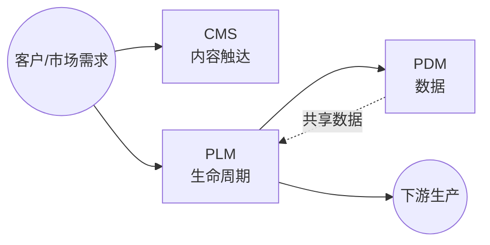

<!--
module:
  parent: application-systems
  slug: application-systems/01-rd-innovation
  type: index
  category: 主模块子文章
  summary: 研发创新环节（PLM · PDM · CMS）—— 从产品创意到上市阶段所需的能力与系统，管理产品主数据。
-->

# 01 研发创新

> 本章关注"从产品创意到上市"阶段所需的能力与系统。研发是价值链的源头，决定了后续生产、供应链、销售的全部基础数据（BOM、图纸、工艺）。

## 📌 全景图

## 🔑 核心系统详讲

### PLM（产品生命周期管理）

- **核心定位**：管理产品从概念到退役的全生命周期数据与流程
- **关键能力**：BOM 中央仓库 / 工程变更 / 项目管理 / CAD 集成
- **典型场景**：汽车新车型研发、电子产品多代演进、工程变更追溯
- **上下游**：上接 CRM/CMS，下接 ERP/MES
- 📚 详见 [PLM 深读](./plm/) — 历史脉络 / 常见陷阱 / 代表案例

### PDM（Product Data Management 产品数据管理）

- **核心定位**：PLM 的核心子集，专注于产品数据本身（文档、图纸、零部件）的管理与组织
- **关键能力**：版本管理 / 零部件库 / CAD 集成 / 检索与权限 / 变更管理 / 生命周期状态
- **典型场景**：纯研发数据管理需求、PDM 起步阶段、中小制造业（CAD 文件 1 万-10 万）
- **上下游**：上接 CAD/CAE/CAPP，下接 ERP/MES，是 PLM 的数据底层
- 📚 详见 [PDM 深读](./pdm/) — 历史脉络 / 选型指南 / 代表案例

## 📋 其他系统速览

### CMS（Content Management System 内容管理系统）

管理网站、博客、营销内容等的创建、编辑、发布。**适用场景**：产品官网、帮助文档、营销活动页。

## 💡 本章小结

研发创新环节的核心是 PLM/PDM（管产品数据），CMS（管内容触达）是辅助。本章输出"产品主数据"流向下一章"生产制造"。

## 📑 本组系统导航

| 系统 | 一句话定位 | 深读链接 |
|------|-----------|---------|
| PLM | 产品生命周期管理 | [PLM 深读](./plm/) |
| PDM | 产品数据管理（PLM 核心子集） | [PDM 深读](./pdm/) |
| CMS | 内容管理系统 | [CMS 深读](./cms/) |

← [返回: 业务应用系统](../README.md)
