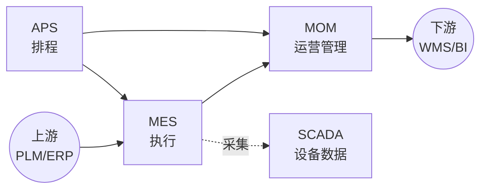

<!--
module:
  parent: application-systems
  slug: application-systems/02-production
  type: index
  category: 主模块子文章
  summary: 生产制造环节（MES · MOM · APS · SCADA）—— 把研发设计的产品制造出来，决定交付能力、成本与质量。
-->

# 02 生产制造

> 本章关注"把研发设计的产品制造出来"阶段所需的能力与系统。生产环节是制造型企业价值链的核心，决定交付能力、成本与质量。

## 📌 全景图

## 🔑 核心系统详讲

### MES（Manufacturing Execution System 制造执行系统）

- **核心定位**：把 ERP 的生产计划落地为车间工单并实时跟踪执行的执行层系统，是连接计划层与控制层的"执行中枢"
- **关键能力**：工单调度 / 设备数据采集 / 质量管理 / 批次追溯 / OEE 看板 / SOP 电子化
- **典型场景**：离散制造（汽车/电子）、流程制造（化工/食品）、半导体、医疗器械、航空
- **上下游**：上接 ERP/PLM，下接 SCADA/WMS/QMS，与 APS/SCADA 横向集成
- 📚 详见 [MES 深读](./mes/) — 历史脉络 / 选型指南 / 常见陷阱 / 代表案例

## 📋 其他系统速览

### MOM（Manufacturing Operation Management 制造运营管理）

MOM 是 MES 的上位概念，覆盖制造运营全过程（生产、质量、维护、库存），MES 实际是 MOM 的执行子集。**适用场景**：集团级制造运营管控、MES + 周边系统一体化平台。

### APS（Advanced Planning and Scheduling 高级计划与排程）

在 MRP 基础上做精细化排程（资源约束、工序顺序、换线时间），输出可执行的工时级计划。**适用场景**：多品种小批量、产能受限、订单优先级频繁调整。

### SCADA（Supervisory Control And Data Acquisition 监督控制与数据采集）

监控和控制工业设备（PLC/DCS）并采集实时数据，是 MES 采集现场数据的"耳目"。**适用场景**：工业自动化产线、远程设备监控。

## 💡 本章小结

生产制造的核心是 MES（执行），MOM 是上位管理框架，APS 解决排程，SCADA 解决数据采集。本章输出"完工入库"事件给下游供应链。

## 📑 本组系统导航

| 系统 | 一句话定位 | 深读链接 |
|------|-----------|---------|
| MES | 制造执行系统（执行中枢） | [MES 深读](./mes/) |
| MOM | 制造运营管理（上位框架） | [MOM 深读](./mom/) |
| APS | 高级计划与排程 | [APS 深读](./aps/) |
| SCADA | 设备监控与数据采集 | [SCADA 深读](./scada/) |

← [返回: 业务应用系统](../README.md)
