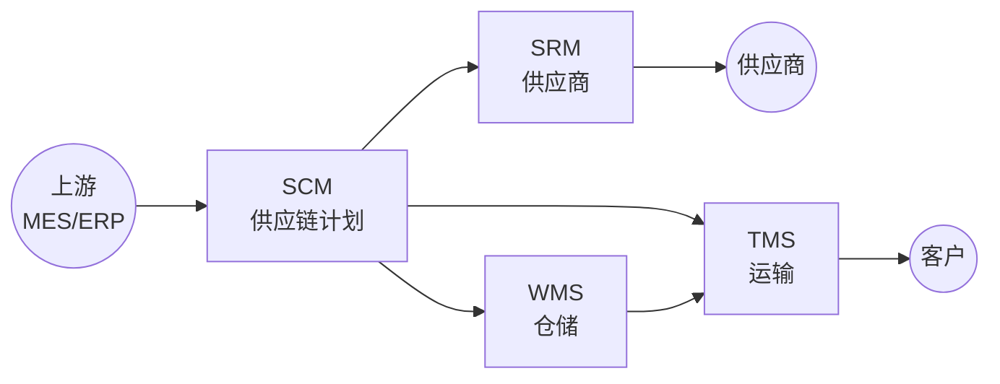

<!--
module:
  parent: application-systems
  slug: application-systems/03-supply-chain
  type: index
  category: 主模块子文章
  summary: 供应链环节（SCM · SRM · WMS · TMS）—— 把产品送到客户手中的全链路，决定订单履约时效与成本。
-->

# 03 供应链

> 本章关注"把产品送到客户手中"的全链路（计划→采购→仓储→运输）。供应链能力决定订单履约时效与成本。

## 📌 全景图

## 🔑 核心系统详讲

### WMS（Warehouse Management System 仓储管理系统）

- **核心定位**：管理仓库作业全流程（入库 → 上架 → 拣选 → 出库 → 盘点）的精细化系统，是仓储数字化的"调度中枢"
- **关键能力**：库位/批次/序列号/效期管理 + 拣选策略（波次/边拣边分/灯光拣选）+ 设备集成（RF/AGV/堆垛机/电子标签）+ 退货与差异处理
- **典型场景**：电商履约中心（日发百万单）、制造业线边仓（JIT 配送）、冷链/危险品（合规追溯）、跨境保税仓（三单对碰）、医药 GSP/医疗器械 UDI、汽车售后备件多级 DC
- **上下游**：上接 ERP/MES（出入库指令），下接 TMS（待发运）+ AGV/AMR（设备调度），横向对接海关（保税仓）/财务（库存估值）
- **关键考量**：库位编码是 WMS 的"灵魂"（无编码 = 高级进销存）；硬件投资是软件 5-10 倍（软硬一体预算）；批次/序列号/效期是医药/食品合规前提
- 📚 详见 [WMS 深读](./wms/) — 上下游 / 选型指南 / 常见陷阱

## 📋 其他系统速览

### SCM（Supply Chain Management 供应链管理）

覆盖从供应商到客户的端到端供应链计划（需求/供应/分销计划），与 ERP 共享物料和库存信息。**适用场景**：多级供应链协同、需求预测优化。

### SRM（Supplier Relationship Management 供应商关系管理）

管理供应商全生命周期（寻源/资质/绩效/协同），与 ERP 互补，专注"供应商侧"深度管理。**适用场景**：供应商数量多、采购品类复杂的企业。

### TMS（Transportation Management System 运输管理系统）

管理运输全过程（运力调度/路径规划/在途跟踪/签收回单），与 WMS 衔接发货环节。**适用场景**：自有车队、3PL 管理、多式联运。

## 💡 本章小结

供应链的核心是 WMS（仓储执行），SCM 管计划、SRM 管供应商、TMS 管运输，四者协同完成"原料入厂→成品送达客户"的全链路。

## 📑 本组系统导航

| 系统 | 一句话定位 | 深读链接 |
|------|-----------|---------|
| SCM | 端到端供应链计划 | [SCM 深读](./scm/) |
| SRM | 供应商全生命周期管理 | [SRM 深读](./srm/) |
| WMS | 仓储管理系统（调度中枢） | [WMS 深读](./wms/) |
| TMS | 运输全过程管理 | [TMS 深读](./tms/) |

← [返回: 业务应用系统](../README.md)
