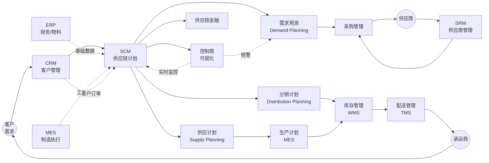
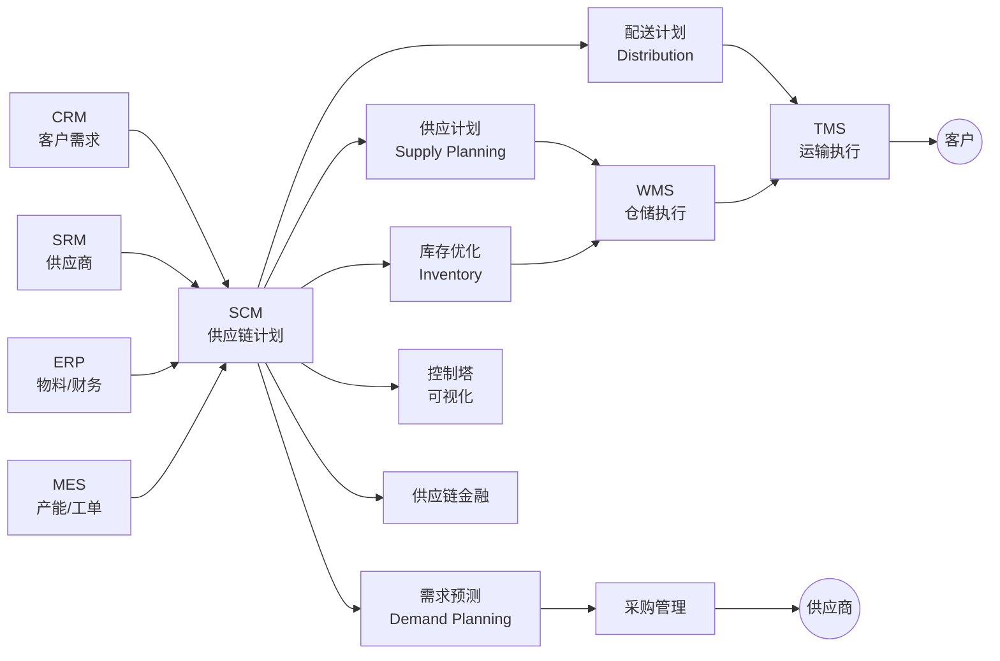

<!--
module:
  parent: application-systems
  slug: application-systems/03-supply-chain/scm
  type: article
  category: 主模块子文章
  summary: 一份按业务场景梳理的 SCM 速查手册：从供应商到客户的"端到端"链条管理。
-->

# SCM · 供应链管理系统

> 一份按业务场景梳理的 SCM 速查手册：从供应商到客户的"端到端"链条管理。

---

## 一、一句话定位

**SCM（Supply Chain Management，供应链管理系统）**：打通"供应商 → 工厂 → 仓库 → 分销商 → 客户"的端到端链条，实现"用最低成本、最快速度满足客户需求"。

---

## 📌 全景图



SCM 位于企业 IT 架构"计划层"的中枢——上游接 CRM（客户需求）、SRM（供应商能力）、ERP（财务/物料主数据）、MES（生产工单）；下游驱动 WMS（库存执行）、TMS（运输执行）；横向覆盖供应链金融与控制塔可视化。Gartner 将 SCM 归为"供应链计划（SCP, Supply Chain Planning）"市场，与"供应链执行（SCE, Supply Chain Execution，包含 WMS/TMS）"形成上下游镜像——SCM 算"该不该进出多少 / 何时何处"，WMS/TMS 落地"怎么进出 / 怎么运"。

---

## 二、SCM vs SRM vs ERP 的关系

```text
┌─────────────────────────────────────────────────────────┐
│  SCM（供应链管理）—— "宏观视图"                              │
│  ┌─────────────┐  ┌──────────┐  ┌──────────┐            │
│  │  SRM（供应商）│  │ERP（资源）│  │CRM（客户）│            │
│  └─────────────┘  └──────────┘  └──────────┘            │
└─────────────────────────────────────────────────────────┘
```

| 系统 | 关注点 |
|------|--------|
| **SCM** | 整链协同 / 网络优化 / 风险控制 |
| **SRM** | 供应商管理（评估/合同/绩效） |
| **ERP** | 内部资源（订单/库存/财务） |
| **WMS** | 仓库执行（出入库） |
| **TMS** | 运输执行（配送路线） |

**关系**：SCM 是"链主"，SRM/ERP/WMS/TMS 是"链节"。

**SCM 与各系统的边界详解**（2025-2026 高频混淆点）：

- **vs ERP**：ERP 管"内部资源计划"（财务/物料/订单），SCM 管"跨组织协同"（供应商/工厂/仓库/客户）。**ERP 是 SCM 的数据底座**（物料主数据/BOM/库存/财务科目由 ERP 维护），**SCM 是 ERP 的延伸**（需求预测/供应计划跨多组织）。**2025 高频误解**："SCM = ERP 的供应链模块"——SCM 远不止 ERP 模块，需跨多组织（多工厂/多仓库/多供应商）的协同
- **vs SRM**：SRM 管"供应商全生命周期"（寻源/准入/合同/绩效），SCM 管"端到端供应"。**SRM 是 SCM 的"前端模块"**（供应商数据由 SRM 维护，SCM 在做供应计划时调用）。**SRM 深度管理单家供应商，SCM 优化整链供应商组合**
- **vs WMS**：WMS 管"仓库作业执行"（入库/上架/拣选/出库/盘点），SCM 管"库存优化策略"（多仓调拨/安全库存/补货策略）。**WMS 是 SCM 的"执行模块"**（SCM 下发补货/调拨指令，WMS 落地执行）
- **vs TMS**：TMS 管"运输执行"（运力调度/路径规划/签收），SCM 管"配送网络设计"（DC 选址/路由规则/多式联运）。**TMS 是 SCM 的"执行模块"**（SCM 生成配送计划，TMS 调度运力）
- **vs MES**：MES 管"车间作业执行"（工单/工序/质量），SCM 管"主生产计划"（MPS/MRP）。**MES 是 SCM 的"执行模块"**（SCM 下发主生产计划，MES 拆解到工位执行）
- **vs CRM**：CRM 管"客户全生命周期"（线索/商机/客户），SCM 管"客户需求到履约"。**CRM 是 SCM 的"需求源头"**（CRM 的客户订单/预测驱动 SCM 的需求计划）

**SCM 不擅长的领域**：仓库作业（WMS）、运输调度（TMS）、车间执行（MES）、供应商日常协同（SRM）、财务核算（ERP）、客户运营（CRM）。

---

## 三、核心功能（5 大模块）

| 模块 | 功能 | 价值 |
|------|------|------|
| **需求预测** | 历史数据 + AI 预测需求 | 减少缺货 30% / 过剩 25% |
| **采购管理** | 采购订单、供应商选择 | 节省采购成本 5-15% |
| **生产计划** | 主生产计划（MPS）+ MRP | 缩短交期 15-25% |
| **物流配送** | 配送网络优化、路线规划 | 节省物流成本 10-20% |
| **供应链可视化** | 端到端跟踪 + 风险预警 | 异常响应从 24h → 1h |

---

## 四、典型行业应用

| 行业 | 重点 |
|------|------|
| **零售/电商** | 全渠道库存 + 最后一公里配送 |
| **制造** | JIT 准时制 + VMI 供应商管理库存 |
| **医药** | GSP 合规 + 冷链全程追溯 |
| **食品** | 保质期管理 + FEFO 先进先出 |
| **汽车** | 零部件配送 + 看板管理 |

---

## 五、主流厂商/产品对比

| 类型 | 代表产品 | 适用规模 |
|------|---------|---------|
| **国际大厂** | SAP IBP / Oracle SCM / Blue Yonder | 大型集团 |
| **专业 SCM** | Manhattan Associates / Kinaxis | 中大型 |
| **国内主流** | 用友 NC / 金蝶 / 京东 SCM | 中大型 |
| **云 SCM** | SAP Ariba / Coupa / 甄云 | 中小 |

---

## 六、选型建议

| 场景 | 推荐 |
|------|------|
| 大型集团（年营收 10 亿+）| SAP IBP / Blue Yonder |
| 中型企业（1-10 亿）| 用友 / 金蝶 / Kinaxis |
| 小企业 | 京东 SCM / 甄云 SaaS |
| 零售/电商 | 京东 SCM / 阿里供应链 |
| 制造业 | SAP IBP / 用友 NC |

---

## 七、实施关键点

1. **数据治理**：供应商主数据、物料编码必须统一
2. **流程优化**：先做流程梳理（BPMN），再上系统
3. **试点先行**：选 1-2 条产品线做试点
4. **生态协同**：让供应商/客户都用同一系统（EDI/Portal）
5. **AI 增强**：需求预测、智能补货、风险预警

---

## 八、SCM 与上下游系统集成模式

SCM 作为"链主"，需要与多个子系统深度集成才能实现端到端协同：

| 集成对象 | 集成方向 | 数据流 | 集成模式 |
|---------|---------|--------|---------|
| **SRM**（供应商管理）| SCM ← SRM | 供应商资质、绩效评分、合同条款 | SRM 提供供应商主数据，SCM 在寻源时调用 |
| **WMS**（仓储管理）| SCM ↔ WMS | 库存水位、出入库记录、库位状态 | WMS 实时回传库存，SCM 下发补货指令 |
| **TMS**（运输管理）| SCM → TMS | 配送计划、路线优化、运输状态 | SCM 生成配送计划后推送 TMS 执行 |
| **ERP**（企业资源）| SCM ↔ ERP | 采购订单、财务数据、生产计划 | ERP 提供资金与物料视图，SCM 提供需求预测 |

**集成架构选型**：
- **ESB/API 网关模式**：适合已有大量系统的企业，通过中间件解耦（如 MuleSoft / Kong）
- **事件驱动模式**：适合实时性要求高的场景（如库存低于阈值自动触发补货），基于 Kafka / RabbitMQ
- **点对点模式**：适合系统少于 3 个的小企业，简单但难维护

---

## 九、关联系统导航

| 系统 | 定位 | 与 SCM 的关系 |
|------|------|-------------|
| [SRM · 供应商关系管理](../srm/README.md) | 供应商全生命周期管理 | SCM 的"前端模块"——供应商数据由 SRM 维护 |
| [WMS · 仓储管理系统](../wms/README.md) | 仓库执行层 | SCM 的"执行模块"——库存实时同步 |
| [TMS · 运输管理系统](../tms/README.md) | 运输执行层 | SCM 的"执行模块"——配送计划下发 |
| [ERP · 企业资源计划](../../05-operations/erp/README.md) | 内部资源管理 | SCM 的"数据底座"——物料/财务/订单主数据 |
| [MES · 制造执行系统](../../02-production/mes/README.md) | 车间执行层 | SCM 的"执行模块"——主生产计划落地 |
| [CRM · 客户关系管理](../../04-sales-service/crm/README.md) | 客户全生命周期 | SCM 的"需求源头"——客户订单驱动需求计划 |

---

## 🔧 核心能力详解

### 1. 需求预测（Demand Planning / Demand Sensing）

需求预测是 SCM 的"起点"——预测准确率决定整链成本：

- **统计预测模型**：移动平均（MA）/ 指数平滑（ES）/ Holt-Winters 季节性模型 / ARIMA 自回归移动平均
- **机器学习模型**：Prophet（Facebook 开源）/ XGBoost / LSTM 时序预测 / Transformer 时序模型
- **预测维度**：SKU × 客户 × 渠道 × 时间（天/周/月）× 区域；多维度预测矩阵
- **预测层级**：基础预测（统计基线）+ 协同预测（与客户/供应商协同调整）+ 共识预测（CPFR Collaborative Planning Forecasting and Replenishment）
- **预测准确率度量**：MAPE（平均绝对百分比误差）/ WAPE（加权绝对百分比误差）/ Bias（偏差）；行业基线 MAPE 30-50%（消费品 20-30% / 工业品 40-50%）
- **Demand Sensing**：通过 IoT/订单/搜索/社交数据"实时感知需求变化"，在统计预测基础上做短期调整（7-14 天）
- **典型价值**：预测准确率每提升 10%，库存周转提升 5-8%，缺货率下降 10-15%（Gartner 经验值）

### 2. 采购管理（Procurement / Sourcing）

采购管理是 SCM 的"输入端"——决定 50-70% 的供应链成本：

- **寻源（Sourcing）**：RFx（Request For Information/Proposal/Quotation）/ 招标 / 反向拍卖（Reverse Auction）/ 询比价
- **合同管理**：合同模板 / 价格协议 / 条款管理 / 电子签章（与电子签系统集成）
- **订单协同**：PO 下达 / 确认 / ASN（Advanced Shipping Notice 提前发货通知）/ VMI（Vendor Managed Inventory 供应商管理库存）
- **供应商管理**：绩效评估（QCDS Quality/Cost/Delivery/Service）/ 风险评级 / 资质审核
- **采购策略**：集中采购 / 分散采购 / JIT 采购 / 战略采购 / 杠杆采购 / 瓶颈采购（Kraljic 采购矩阵）
- **典型价值**：采购成本下降 5-15%（Gartner/Forrester 行业研究）；合同合规率 99%+；供应商绩效可视化

### 3. 生产计划（Production Planning）

生产计划是 SCM 的"中枢调度"——连接需求与供应：

- **主生产计划（MPS, Master Production Schedule）**：确定"生产什么 / 多少 / 何时"，平衡需求与产能
- **物料需求计划（MRP, Material Requirements Planning）**：根据 MPS + BOM 倒推物料需求，生成采购计划
- **能力需求计划（CRP, Capacity Requirements Planning）**：评估产能是否满足 MPS；产能瓶颈识别
- **高级计划与排程（APS, Advanced Planning and Scheduling）**：有限产能排程，考虑物料/设备/人员的约束优化
- **车间执行（MES）**：APS 下发工单 → MES 落地执行；MES 回传工单进度 → APS 动态调整
- **典型价值**：交期缩短 15-25%；产能利用率提升 10-20%；库存周转提升 20-30%

### 4. 库存管理（Inventory Optimization）

库存管理是 SCM 的"蓄水池"——平衡供需、降低持有成本：

- **库存策略**：连续盘点（Continuous Review）/ 定期盘点（Periodic Review）/ (s, S) 策略 / (R, S) 策略 / (s, Q) 策略
- **安全库存计算**：基于需求波动 + 供应周期波动 + 服务水平（95% / 99% / 99.5%）的目标
- **多级库存优化**：考虑上下游库存联动（牛鞭效应 Buffer / Position Stock / Pipeline Stock）
- **ABC-XYZ 分类**：按销售额分 ABC + 按需求波动性分 XYZ；A+X（高价值稳定需求）严格控制，C+Z（低价值波动需求）宽松
- **库存指标**：库存周转率（ITO Inventory Turnover）/ DIO（Days Inventory Outstanding）/ 呆滞库存占比 / 缺货率
- **典型价值**：库存周转提升 20-30%；呆滞库存下降 30-50%；缺货率从 5% 降到 1%

### 5. 配送管理（Distribution / Logistics）

配送管理是 SCM 的"输出端"——把货送到客户手中：

- **配送网络设计**：DC（Distribution Center 配送中心）选址 / 路由规则 / 多级配送网络（中央 DC → 区域 RDC → 末端配送）
- **订单分配（Order Allocation）**：按库存位置/运输成本/服务水平分配订单到具体 DC/门店
- **调拨管理（Stock Transfer）**：多仓调拨（库存平衡）/ 在途库存可视 / 调拨审批流
- **最后一公里配送**：与 TMS/快递公司/同城配送深度集成
- **典型价值**：物流成本下降 10-20%；订单履约时效提升 30-50%；配送网络利用率提升 15-25%

### 6. 订单履约（Order Fulfillment / OTC）

订单履约是 SCM 的"客户交付"——从订单到送达的完整链路：

- **订单管理（Order Management）**：订单接收 / 拆分 / 合并 / 优先级排序
- **订单到现金（OTC, Order-to-Cash）**：订单 → 拣货 → 配送 → 签收 → 收款；端到端可视化
- **全渠道订单（Omnichannel Order）**：B2B 订单 + B2C 订单 + 门店订单 + 跨境订单统一管理
- **典型价值**：订单履约率 99%+；订单到送达时效缩短 30-50%；客户满意度 NPS 提升 10-20

### 7. 供应链可视化（Supply Chain Visibility / Control Tower）

供应链可视化是 SCM 的"神经中枢"——实时感知与预警：

- **订单可视化**：订单全链路状态（已下单 / 已拣货 / 已发货 / 在途 / 已签收）
- **库存可视化**：多仓库存实时查询；安全库存预警
- **物流可视化**：在途货物 GPS + IoT（温湿度/震动）；异常预警（延误/货损/偏离路线）
- **风险预警**：供应商风险（财务/合规/地缘政治）/ 自然灾害 / 疫情 / 港口拥堵
- **数字孪生（Digital Twin）**：供应链网络数字孪生，仿真/模拟/预测
- **典型价值**：异常响应时间从 24h 缩短到 1h；客户问询响应提升 5 倍；供应链中断损失降低 50%+

### 8. 供应链金融（Supply Chain Finance）

供应链金融是 SCM 的"金融延伸"——解决上下游资金问题：

- **核心模式**：应收账款融资（Factoring 保理）/ 动产质押融资 / 预付款融资 / 存货融资
- **技术基础**：核心企业信用穿透 + 区块链（不可篡改贸易背景）+ IoT（动产监管）+ 电子签（合同合规）
- **典型场景**：上游供应商融资（应收账款贴现）/ 下游经销商融资（存货质押）/ 跨境贸易融资（信用证 + 区块链）
- **典型价值**：中小企业融资成本降低 2-5 个百分点；应收账款周转提升 30-50%

按企业关注度排序，SCM 最常被列为「核心采购理由」的前 5 项是：**库存优化**（降低持有成本 20-30%）、**需求预测**（缺货率下降 30-50%）、**物流优化**（物流成本下降 10-20%）、**供应商协同**（采购成本下降 5-15%）、**端到端可视化**（异常响应从 24h 到 1h）。

---

## 📊 关键模块详解

### 需求预测模块（Demand Planning）

需求预测是 SCM 的"大脑前额叶"——决定整链资源调配：

- **预测方法论**：
  - **统计预测**：MA（移动平均）/ ES（指数平滑）/ Holt-Winters（季节性模型）/ ARIMA（自回归积分滑动平均）；适用历史数据充足 + 需求稳定的场景
  - **因果预测**：回归分析 / 计量经济模型；考虑价格/促销/天气等外生变量
  - **机器学习预测**：Prophet（Facebook）/ XGBoost / LSTM（长短期记忆网络）/ Transformer / 时序大模型（TimeGPT）
  - **集成预测（Ensemble）**：多种模型加权融合，取长补短
- **预测层级**：
  - **基础预测（Base Forecast）**：统计模型预测的"基线"
  - **市场预测（Market Forecast）**：叠加市场活动（促销/新品/活动）
  - **协同预测（Collaborative Forecast）**：与客户/供应商协同调整（CPFR）
  - **共识预测（Consensus Forecast）**：销售/市场/供应链达成共识的预测
- **预测准确率度量**：
  - **MAPE（Mean Absolute Percentage Error）**：平均绝对百分比误差；行业基线 30-50%
  - **WAPE（Weighted Absolute Percentage Error）**：加权绝对百分比误差；适合 SKU 加权
  - **Bias**：偏差（高估/低估）；用于判断系统性误差
  - **Tracking Signal**：追踪信号，监控预测偏差累积
- **Demand Sensing（需求感知）**：
  - 通过 IoT / POS / 订单 / 搜索 / 社交数据"实时感知需求"
  - 在统计预测基础上做短期调整（7-14 天）
  - Blue Yonder / SAP IBP / o9 都有 Demand Sensing 模块
- **典型案例**：
  - **宝洁（P&G）**：CPFR 协同预测，与沃尔玛协同调整，缺货率下降 30%，库存周转提升 20%
  - **联合利华**：集成预测模型（Prophet + XGBoost），预测准确率提升 15%
  - **沃尔玛**：Demand Sensing + IoT（货架传感器），生鲜缺货率从 5% 降到 1%
- **核心难点**：促销/新品/突发事件（如疫情）的预测准确率低；跨品类协同预测；预测与执行对齐（Sales & Operations Planning 销售与运营规划）

### 采购管理模块（Procurement）

采购管理是 SCM 的"上游阀门"——决定 50-70% 的供应链成本：

- **Kraljic 采购矩阵**（经典分类框架）：
  - **战略采购（Strategic）**：高价值 + 高风险（如芯片/关键设备）；长期合作 + 战略联盟
  - **杠杆采购（Leverage）**：高价值 + 低风险（如标准件）；竞争性招标 + 价格优化
  - **瓶颈采购（Bottleneck）**：低价值 + 高风险（如特殊物料）；安全库存 + 多供应商
  - **常规采购（Non-critical）**：低价值 + 低风险（如办公用品）；流程自动化 + 标准化
- **寻源策略**：
  - **RFx（Request For x）**：RFI（信息请求）/ RFP（方案请求）/ RFQ（报价请求）
  - **招标**：公开招标 / 邀请招标 / 框架协议招标
  - **反向拍卖（Reverse Auction）**：供应商实时竞价，采购成本下降 8-15%
  - **询比价**：简单比价，适用小额采购
- **合同管理**：
  - **合同类型**：单价合同 / 总价合同 / 框架协议 / 一揽子合同
  - **合同条款**：价格 / 数量 / 交期 / 质量 / 付款条件 / 违约责任
  - **合同电子化**：与电子签系统集成（e签宝 / 法大大），合同签署效率提升 10 倍
- **订单协同**：
  - **PO（Purchase Order 采购订单）**：订单下达 / 供应商确认 / 发货通知 / 收货确认
  - **ASN（Advanced Shipping Notice）**：供应商发货前通知（品规/数量/批次/到达时间）
  - **VMI（Vendor Managed Inventory）**：供应商管理库存；供应商根据库存水位自动补货
  - **JIT（Just In Time）准时制**：按需配送，减少库存；丰田生产方式核心
  - **CPFR（Collaborative Planning Forecasting and Replenishment）**：协同规划预测补货
- **典型案例**：
  - **苹果（Apple）**：与全球 800+ 供应商深度协同（EDI + Portal），新产品 NPI 周期缩短 30%
  - **丰田（Toyota）**：JIT + 看板管理 + VMI，库存周转 12+ 次/年（行业平均 4-6 次）
  - **沃尔玛（Walmart）**：与宝洁（P&G）CPFR 协同，缺货率下降 30%
- **核心难点**：跨组织数据共享（EDI/Portal 推广）；VMI 的信任与责任划分；多供应商管理复杂度

### 生产计划模块（Production Planning）

生产计划是 SCM 的"调度大脑"——连接需求与执行：

- **主生产计划（MPS, Master Production Schedule）**：
  - 确定"生产什么 / 多少 / 何时"
  - 平衡需求预测 + 客户订单 + 库存水平 + 产能约束
  - 输出：成品级生产计划（按周/日）
- **物料需求计划（MRP, Material Requirements Planning）**：
  - 输入：MPS + BOM（Bill of Materials 物料清单）+ 库存 + 在途 + 采购提前期
  - 计算：净需求 = 毛需求 - 库存 - 在途
  - 输出：采购计划（PR Purchase Requisition 采购申请）+ 车间作业计划
- **能力需求计划（CRP, Capacity Requirements Planning）**：
  - 评估产能（设备/人力/工时）是否满足 MPS
  - 产能瓶颈识别（哪些工序/设备产能不足）
  - 产能平衡（加班/外协/调整 MPS）
- **高级计划与排程（APS, Advanced Planning and Scheduling）**：
  - **有限产能排程**：考虑物料/设备/人员的实际约束
  - **优化目标**：交期优先 / 产能利用率 / 成本最低 / 库存最低（多目标优化）
  - **算法**：约束理论（TOC Theory of Constraints）/ 数学规划（LP/MILP）/ 启发式算法 / 遗传算法
- **产销协同（S&OP, Sales & Operations Planning）**：
  - 月度/季度产销协同会议（销售/市场/生产/财务/采购）
  - 平衡需求与供应，达成共识计划
  - 输出：共识 MPS + 财务预测 + KPI 目标
- **典型案例**：
  - **华为（Huawei）**：APS + MES 深度集成，订单到交付周期从 30 天缩短到 14 天
  - **富士康（Foxconn）**：APS 排程 + 自动化产线，产能利用率 90%+（行业平均 60-70%）
  - **特斯拉（Tesla）**：垂直一体化生产计划 + 实时数据驱动，库存周转 8+ 次/年
- **核心难点**：多工厂协同 / 产能与物料约束 / 插单与变更管理 / 跨组织产销协同

### 库存管理模块（Inventory Management）

库存管理是 SCM 的"蓄水池"——平衡供需 + 降低持有成本：

- **库存分类**：
  - **原材料库存（Raw Material）**：生产前物料
  - **在制品库存（WIP, Work In Process）**：生产中物料
  - **成品库存（Finished Goods）**：可销售成品
  - **在途库存（In-Transit / Pipeline）**：运输中物料
  - **安全库存（Safety Stock）**：应对需求波动 + 供应波动
  - **缓冲库存（Buffer Stock）**：战略储备（如芯片/关键物料）
- **库存策略**：
  - **连续盘点（Continuous Review, Q,s）**：每次库存变化检查，达到 s 触发补货 Q
  - **定期盘点（Periodic Review, R,S）**：每隔 R 时间检查，补到目标水位 S
  - **(s, S) 混合策略**：连续检查，达到 s 检查是否补到 S
  - **JIT（Just In Time）**：零库存/极低库存，按需配送
  - **VMI（Vendor Managed Inventory）**：供应商管理库存
- **多级库存优化**：
  - **牛鞭效应（Bullwhip Effect）**：需求信息从下游到上游逐级放大，导致上游库存积压
  - **位置库存（Position Stock）**：不同节点的库存；多级网络优化
  - **批量化效应（Batch Effect）**：订货批量导致的库存波动
- **ABC-XYZ 分类**：
  - **ABC（按销售额）**：A 类（高，占 20% 数量 / 80% 价值）/ B 类（中）/ C 类（低）
  - **XYZ（按需求波动）**：X 类（稳定）/ Y 类（中等波动）/ Z 类（强波动）
  - **组合策略**：A+X 严格控制（高频盘点 / 安全库存高）；C+Z 宽松（低频盘点 / 安全库存低）
- **库存指标**：
  - **库存周转率（ITO）** = 年销售成本 / 平均库存；行业基线 4-12 次
  - **DIO（Days Inventory Outstanding）** = 365 / 库存周转率；行业基线 30-90 天
  - **缺货率（Stockout Rate）** = 缺货次数 / 总订单次数；行业基线 < 5%
  - **呆滞库存占比（Slow-Moving Ratio）** = 呆滞库存金额 / 总库存金额；行业基线 < 10%
- **核心难点**：多级库存平衡 / 牛鞭效应缓解 / 呆滞库存清理 / 库存准确性（账实一致率）

### 配送管理模块（Distribution Management）

配送管理是 SCM 的"输出动脉"——把货送到客户手中：

- **配送网络设计**：
  - **网络层级**：中央 DC（CDC）→ 区域 RDC（Regional DC）→ 末端配送（Last Mile）
  - **DC 选址**：重心法（Gravity Method）/ 数学规划 / 仿真（Discrete Event Simulation）；考虑客户分布 / 运输成本 / 仓储成本 / 服务水平
  - **网络类型**：单级网络 / 多级网络 / 混合网络（自营 + 3PL）
- **订单分配（Order Allocation）**：
  - 按库存位置分配（就近原则）
  - 按运输成本分配（最低成本原则）
  - 按服务水平分配（最近交付时间）
  - **算法**：库存可见性 + 约束优化（CP-SAT / MILP）
- **调拨管理（Stock Transfer）**：
  - 库存平衡调拨（高库存仓 → 低库存仓）
  - 在途库存可视（运输中库存纳入全局可用量）
  - 调拨审批流（金额阈值 / 业务部门审批）
  - **VMI/Hub-and-Spoke**：中心仓辐射周边仓
- **最后一公里配送（Last Mile Delivery）**：
  - **自营配送**：自有车队 + 司机（京东物流 / 顺丰）
  - **第三方配送**：通达系（申通/圆通/中通/韵达）/ 顺丰 / EMS / 极兔
  - **众包配送**：美团 / 饿了么 / 达达（社会化运力）
  - **即时配送**：30-60 分钟达（前置仓 + 众包）
- **典型案例**：
  - **京东物流**：自营 + 3PL + 众包混合模式，93% 自营订单 24h 达
  - **沃尔玛（Walmart）**：Hub-and-Spoke 网络，从 110 个 DC 优化到 25 个，物流成本下降 25%
  - **亚马逊（Amazon）**：预测性调拨（Anticipatory Shipping），在客户下单前把货调到前置仓
- **核心难点**：多 DC 网络复杂度 / 在途库存可视 / 最后一公里成本 / 跨境配送合规

### 退货管理模块（Returns Management / RMA）

退货管理是 SCM 的"逆向链路"——容易被低估但成本极高：

- **退货流程**：
  - 客户申请 → 退货审核 → 退货标签 → 退回运输 → 验收 → 退款 / 换货 → 复检入库
  - **退货率**：电商行业平均 15-30%（服装 30%+ / 3C 10-15% / 食品 < 5%）
- **退货分类**：
  - **可销售退货（A 级）**：未拆封/原包装 → 重新入库销售
  - **可折价退货（B 级）**：已拆封/轻微瑕疵 → 折价销售/Outlet
  - **不可销售退货（C 级）**：损坏/过期 → 报废/回收/翻新
- **退货成本**：
  - 直接成本：退货运输 + 退款 + 复检人工
  - 间接成本：库存占用 + 二次销售折扣 + 客户流失
  - 行业经验：退货成本占退货商品价值的 30-60%（电商）
- **逆向物流网络**：
  - **集中退货中心**：所有退货集中处理（规模效应）
  - **分布式退货**：门店/前置仓就近处理（时效优先）
  - **第三方退货处理商**：如 Optoro / Returnly
- **典型案例**：
  - **Zara**：中央退货中心 + 自动化复检，退货到再上架 7 天
  - **亚马逊**：FBA Returns + Amazon Second Chance，退货商品二次销售
  - **Costco**：宽松退货政策（无理由退货）→ 退货成本 5%+，但客户忠诚度极高
- **核心难点**：退货成本控制 / 退货商品质量分级 / 退款时效 / 防止恶意退货

### 供应链网络设计（Supply Chain Network Design）

供应链网络设计是 SCM 的"战略层"——长期规划：

- **网络设计内容**：
  - **设施选址**：工厂 / DC / 仓库 / 门店的选址与数量
  - **产能分配**：各工厂的产能与产品线分配
  - **运输模式**：自营 vs 3PL / 多式联运 / 跨境运输
  - **库存策略**：集中库存 vs 分布式库存 / 安全库存水位
- **网络设计方法**：
  - **重心法（Gravity Method）**：根据需求/供应点位置 + 运输成本计算最优位置
  - **数学规划（Mathematical Programming）**：MILP（Mixed Integer Linear Programming）/ 网络流模型
  - **仿真（Simulation）**：离散事件仿真 / 蒙特卡洛仿真
  - **数字孪生（Digital Twin）**：供应链数字孪生，仿真/模拟/优化
- **典型案例**：
  - **宝洁（P&G）**：全球网络优化，从 50+ 工厂优化到 30+ 工厂，物流成本下降 20%
  - **福特（Ford）**：北美工厂网络优化，从 30+ 工厂优化到 15+ 工厂
  - **海尔（Haier）**：COSMOPlat 平台驱动的网络设计，订单交付周期缩短 50%
- **核心难点**：多目标优化（成本 vs 服务 vs 风险）/ 数据准确性 / 长期 vs 短期平衡 / 不确定性建模

### 控制塔（Control Tower）

控制塔是 SCM 的"神经中枢"——端到端实时可视化：

- **核心能力**：
  - **端到端可视化**：从供应商到客户的全程可视化
  - **实时监控**：订单状态 / 库存水位 / 在途位置 / 异常事件
  - **预警与响应**：需求异常 / 供应中断 / 物流延误 / 质量异常
  - **决策支持**：补货建议 / 调拨建议 / 应急方案
- **技术架构**：
  - **数据采集**：IoT 传感器 / GPS / EDI / API / 区块链
  - **数据集成**：数据湖 / 流处理（Kafka / Flink）/ 消息队列
  - **可视化平台**：BI / 大屏 / 移动端 / AI 助手
  - **决策引擎**：规则引擎 / 优化算法 / 机器学习
- **典型案例**：
  - **DHL 供应链**：全球控制塔，覆盖 50+ 国家，可视化 200+ 仓库
  - **亚马逊**：供应链控制塔 + 预测性调度（Anticipatory Shipping）
  - **华为**：全球供应链控制塔 + GTS（Global Trade Services）合规
- **核心难点**：数据集成（多源异构）/ 实时性（秒级响应）/ 跨组织协同 / 投资回报（ROI 不易量化）

---

## 🏆 选型决策

### 国际六巨头 vs 国内六虎

| 厂商 | 总部 | 定位 | 优势 | 劣势 | 适用规模 |
|------|------|------|------|------|---------|
| **SAP IBP（Integrated Business Planning）** | 德国（沃尔多夫） | 全球 SCM 龙头 | **SAP S/4HANA 原生集成**（物料/BOM/财务数据无缝对接）/ 全球 8000+ 客户 / 完整覆盖需求/供应/产销协同 / S&OP 行业最佳实践 | **贵**（License 千万级）/ 实施周期长（18-36 个月）/ 中国本土化弱（不熟悉国内电商/物流场景） | 大型跨国集团 / 制造 / 快消 / 零售 |
| **Oracle SCM Cloud** | 美国（奥斯汀） | 强 SCM 计划 + 执行 | **全球第二大 SCM 厂商**（Oracle ERP 原生集成）/ 制造/物流深度能力强 / 公有云原生（订阅式） | 中国本土化弱（不熟悉国内电商）/ 集成 Oracle ERP 才有优势 | 大型跨国集团 / 已有 Oracle ERP 的企业 |
| **Blue Yonder（前 JDA）** | 美国（亚利桑那） | 全球 SCM 计划 + 执行 | **前 JDA 深厚积累**（40+ 年）/ 供应链计划 + 执行一体化 / Luminate 平台 AI 能力强 / 全球 3000+ 客户 | 中国本土化弱 / 实施复杂（高度定制化）/ 价格高 | 大型跨国集团 / 零售 / 制造 / 物流 |
| **Kinaxis Maestro** | 加拿大（渥太华） | 强 SCM 计划（S&OP 行业标杆） | **并发计划引擎**（Concurrent Planning 行业首创）/ S&OP / IBP 行业最佳实践 / 高可视性 / 中大型企业首选 | 中国本土化无 / 中国客户少 / 实施周期长 | 中大型跨国集团 / 高科技 / 制造 / 医药 |
| **o9 Solutions** | 美国（达拉斯） | 新一代 AI SCM 平台 | **AI 驱动**（需求预测 / 智能补货 / 网络优化）/ 知识图谱 + 图计算 / 增长最快（年增 50%+） | 客户基数小 / 中国本土化弱 / 实施周期长 | 中大型集团 / 零售 / 制造 |
| **Manhattan Associates** | 美国（亚特兰大） | SCM + WMS + TMS 一体化 | **SCALE 平台一体化**（计划 + 执行）/ WMS / TMS 行业领先 / 零售 / 3PL 行业深 | 中国本土化弱 / 客户基数小 / 实施成本高 | 中大型跨国集团 / 零售 / 3PL / 制造 |
| **用友 NC / YonBIP** | 中国（北京） | 国内 ERP + SCM 龙头 | **国内市场份额前列** / 与用友 ERP 原生集成 / 制造 / 央国企案例深 / 本地化服务强 | AI / 需求预测能力弱于国际厂商 / SaaS 化进度慢 | 国内大型集团 / 央国企 / 制造 |
| **金蝶云·星空 / EAS** | 中国（深圳） | 国内 ERP + SCM 第二 | **金蝶 ERP 原生集成** / 中型企业市场领先 / SaaS 化领先 / 移动端体验好 | SCM 能力弱于用友 / AI 能力弱 | 国内中型企业 / 中型制造 |
| **浪潮（Inspur）** | 中国（济南） | 国央企 SCM + ERP | **国央企案例深** / 国产化适配（信创）/ 政策合规 | SaaS 化进度慢 / AI 能力弱 | 国央企 / 政府 / 大型集团 |
| **京东 SCM / 京喜通** | 中国（北京） | 电商 SCM 行业标杆 | **京东自营验证**（10+ 年实践）/ 智能补货 / 需求预测 AI 强 / 全渠道库存 / 电商行业 Know-how 深 | 仅适合电商场景 / 不适合制造业 | 电商企业 / 零售 / 全渠道 |
| **阿里供应链 / 菜鸟** | 中国（杭州） | 电商 + 物流 SCM | **阿里生态整合**（淘宝/天猫/菜鸟/盒马）/ 全渠道库存 / 智能预测 / 物流网络 | 仅适合阿里生态 / 不开放 | 阿里生态商家 / 电商 |
| **甄云科技 / 商越 / 携客互联** | 中国（上海/北京/深圳） | 国内 SaaS SCM 新势力 | **SaaS 化快速上线**（3-6 个月）/ 性价比高 / 移动端友好 / 中小企业友好 | 复杂场景能力弱 / 不适合大型集团 | 中小企业 / 制造业 / 零售 |

### 自研 vs 商用 vs SaaS

| 维度 | 自研 SCM | 商用 SCM（本地） | SaaS SCM |
|------|---------|----------------|---------|
| 适用规模 | 央国企/军工/互联网巨头（数据/算法敏感） | 中大型企业（数据本地化要求） | 中小企业 / 通用场景 |
| 优势 | 100% 自主可控 / 深度定制 / 算法自主 | 数据本地化 / 行业方案成熟 / 合规保障 | 快速上线（3-6 个月）/ 成本低 / 免运维 |
| 劣势 | 投入大（5000 万-1 亿）/ 周期长（3-5 年）/ 需自建算法/AI 团队 | 投入中等（500-2000 万）/ 运维成本高 / 升级痛苦 | 数据在 SaaS 厂商 / 定制受限 / 不适合复杂场景 |
| 典型代表 | 华为 / 京东 / 阿里 / 字节自研 | SAP IBP 本地 / Oracle SCM Cloud / 用友 NC | SAP IBP Cloud / Blue Yonder Luminate / 京东 SCM / 甄云 SaaS |
| 决策阈值 | 特殊合规 + 算法领先 + 数据强敏感 → 自研；否则 → 商用/SaaS | 数据本地化 + 中等规模 + 行业定制 → 商用本地 | 通用场景 + 快速上线 + 中小规模 → SaaS |

### 选型决策树（5 层）

1. **先看业务复杂度**：跨国 + 多工厂 + 多级 DC + 复杂行业（医药/汽车）→ SAP IBP / Blue Yonder；纯国内 + 中等复杂度 → 用友 NC / 金蝶；纯电商 / 零售 → 京东 SCM / 阿里供应链
2. **再看 ERP 兼容性**：已有 SAP ERP → SAP IBP；已有 Oracle ERP → Oracle SCM Cloud；已用友/金蝶 → 用友/金蝶 SCM；无 ERP → 自由选型
3. **再看行业 Know-how**：制造 / 汽车 → SAP IBP / 用友 NC；零售 / 快消 → Blue Yonder / Manhattan；医药 → SAP IBP / Kinaxis；电商 → 京东 SCM / 阿里供应链
4. **再看部署模式**：央国企 / 金融 → 私有化（SAP IBP / Oracle SCM 本地）；互联网 / 中小 → SaaS（Blue Yonder Luminate / 京东 SCM / 甄云）
5. **最后看 AI / 控制塔能力**：需要 AI 驱动 → o9 Solutions / Blue Yonder Luminate；需要控制塔可视化 → Manhattan / DHL Supply Chain

### 按企业类型的典型选型

| 企业类型 | 推荐 | 理由 |
|---------|------|------|
| 跨国集团（万人+）| SAP IBP / Oracle SCM Cloud + 京东 SCM（双轨） | SAP 跨境合规 + 京东中国电商场景 |
| 大型集团（5000+）| SAP IBP / Blue Yonder（私有化） | 数据本地化 + 全球案例 + 行业最佳实践 |
| 中型企业（500-5000）| 用友 NC / 金蝶 / Kinaxis | 性价比 + 行业模板 + 中国本土化 |
| 制造业（汽车/电子）| SAP IBP / 用友 NC | 复杂 BOM + 多工厂 + APS 强需求 |
| 零售 / 快消 | Blue Yonder / Manhattan / 京东 SCM | 多渠道 + 需求预测 + 全渠道库存 |
| 电商企业 | 京东 SCM / 阿里供应链 / 甄云 SaaS | 电商场景 + 智能补货 + 全渠道 |
| 医药 | SAP IBP / Kinaxis | 合规 + 批次追溯 + 冷链管理 |
| 央国企 / 政府 | 浪潮 / 用友 NC | 信创适配 + 本土化 + 国资委合规 |
| 中小企业（< 500）| 甄云 SaaS / 商越 / 携客互联 | 快速上线 + 成本低 + SaaS |

---

## 🚨 实施陷阱 / 反模式

### 1. 牛鞭效应陷阱

**现象**：需求信息从下游到上游逐级放大——下游看到需求增长 10%，上游订单增长 30%，导致上游库存积压严重。

**根因**：
- 需求预测基于订单而非实际需求
- 订货批量（MOQ）导致订单波动放大
- 短缺博弈（Shortage Gaming）——下游超额下单抢库存
- 价格波动（促销）导致提前购买

**规避**：
- **CPFR（Collaborative Planning Forecasting and Replenishment）协同预测补货**：与客户/供应商共享预测数据，达成共识预测（宝洁 + 沃尔玛案例）
- **VMI（Vendor Managed Inventory）供应商管理库存**：让供应商管理库存水位，避免下游订单波动
- **缩短订货提前期**：小批量多频次订货，减少 MOQ 影响
- **订单平滑（Order Smoothing）**：上游对订单做平滑处理，避免峰值
- **去除价格促销波动**：促销预测纳入基础预测，避免促销后订单崩溃

**典型案例**：
- **宝洁 + 沃尔玛 CPFR**：协同预测，缺货率下降 30%，库存周转提升 20%
- **HP 打印机**：实施 CPFR 后牛鞭效应减少 50%，库存成本下降 15%

### 2. 数据孤岛陷阱

**现象**：SCM 上线后与 ERP/WMS/TMS/SRM 数据不通——库存数据不一致、订单状态不同步、供应商数据重复维护。

**根因**：
- 各系统独立建设，缺乏统一数据标准
- 主数据（物料/供应商/客户）分散管理，各系统编码不一致
- 缺乏统一的数据交换平台（ESB/中间库）
- 接口开发"点对点"模式，难以维护

**规避**：
- **主数据治理先行**：物料编码 / 供应商编码 / 客户编码统一（MDM Master Data Management 主数据管理）
- **统一数据交换平台**：ESB（Enterprise Service Bus 企业服务总线）/ iPaaS（Kong / MuleSoft / 京东云iPaaS）
- **标准化接口规范**：REST API + 消息队列（Kafka / RabbitMQ）+ 事件驱动
- **数据质量监控**：主数据完整度 / 一致性 / 及时性监控（每日巡检）
- **避免"系统孤岛"到"接口孤岛"**：避免点对点接口泛滥，建立"星形架构"（以 SCM 为中心）

### 3. 需求预测失准陷阱

**现象**：需求预测准确率低（MAPE > 50%），导致计划与执行脱节——计划下达后销售/采购抱怨预测不准，执行又推翻计划。

**根因**：
- 单一预测模型（只用统计模型 / 只用经验判断）
- 历史数据质量问题（缺失/异常/口径不一致）
- 未考虑外生变量（促销/天气/竞争/经济周期）
- 未做协同预测（销售/市场/供应链各做各的）
- 预测准确率未度量（不知道准不准）

**规避**：
- **集成预测（Ensemble）**：统计模型 + 机器学习 + 经验判断加权融合
- **多层级预测**：基础预测（统计）+ 调整预测（促销/活动）+ 共识预测（S&OP 会议）
- **外生变量纳入**：促销日历 / 天气数据 / 经济指标 / 社交舆情
- **协同预测（CPFR）**：与客户/供应商共享预测数据
- **预测准确率度量**：MAPE / WAPE / Bias / Tracking Signal，定期复盘
- **预测 vs 实际复盘**：每月做预测准确率分析，识别系统偏差

**典型案例**：联合利华引入集成预测模型（Prophet + XGBoost + 经验判断），预测准确率从 55% 提升到 75%（MAPE 从 45% 降到 25%）。

### 4. 库存积压陷阱

**现象**：上线 SCM 后库存不降反升——"计划层说要降库存，执行层说为了不缺货拼命备货"，最终库存周转下降。

**根因**：
- KPI 设计不当（销售看缺货率 / 采购看采购成本 / 仓库看库容）
- 安全库存设置过高（过度保守）
- 预测准确率低，导致过量备货
- 缺乏呆滞库存清理机制（一年以上不动库存占 30%+）
- 跨部门目标不一致（销售要销售 / 供应链要库存）

**规避**：
- **统一 KPI**：从"销售最大化"转向"利润最大化 / 库存周转 / 现金流"（如 DTC 指标体系）
- **合理安全库存**：基于需求波动 + 供应周期 + 服务水平目标（不是越高越好）
- **预测准确率提升**：从源头降低不确定性（参考陷阱 3）
- **呆滞库存清理机制**：90 天 / 180 天 / 360 天分级预警 + 强制清理（促销 / 调拨 / 报废）
- **S&OP 协同会议**：月度销售/采购/生产/财务对齐，统一目标
- **库存可视化**：实时监控库存水位 / 呆滞占比 / 周转率，KPI 上墙

**典型案例**：某快消品企业上线 SCM 后库存反而上升 20%，根因是销售/采购 KPI 错位（销售只看订单达成率）；后改为 DTC 考核（Delivery / Turnover / Cost），库存周转从 4 次提升到 8 次。

### 5. 与 ERP 边界混乱陷阱

**现象**：SCM 与 ERP 大量功能重叠——SCM 也有"采购订单 / 库存管理 / 财务核算"，ERP 也有"需求计划 / MRP"——重复维护、流程混乱。

**根因**：
- ERP 和 SCM 同时管"库存数量"——ERP 管总账库存，SCM 管可用库存（ATP Available To Promise）
- ERP 和 SCM 同时管"采购订单"——ERP 管财务 PO，SCM 管供应 PO
- ERP 的 MRP 和 SCM 的供应计划职责不清

**规避**：
- **明确职责边界**：
  - **ERP 管**：物料主数据 / BOM / 财务库存 / 总账 / 财务 PO / 应付应收
  - **SCM 管**：需求预测 / 供应计划 / 可用库存（ATP）/ 配送计划 / 供应商协同
- **避免功能重叠**：选型时明确 ERP 与 SCM 的边界，**不要选"什么都有"的厂商**（ERP+SCM 一体化产品有优势也有陷阱）
- **数据单一来源**：物料库存只在一个系统（推荐 ERP / 财务视角），SCM 引用；避免双向维护
- **流程分离**：MRP 由 ERP 跑（短期物料需求），SCM 做长期供应计划（考虑产能/物流）
- **关键决策：是否需要独立 SCM**：如果 ERP 已满足需求 + 业务简单 → 不必上 SCM；如果业务复杂（多工厂/跨国/多级供应链）→ 上 SCM

### 6. 跨组织协同失败陷阱

**现象**：SCM 项目失败的最大原因之一——跨组织（销售/采购/生产/财务）协同失败，销售不按计划卖、采购不按计划买、生产不按计划产。

**根因**：
- 缺乏 S&OP（Sales & Operations Planning 销售与运营规划）机制
- 部门 KPI 各自为政（销售看订单 / 采购看成本 / 生产看产能 / 财务看利润）
- 高层不重视（把 SCM 当 IT 项目而非管理变革）
- 流程未梳理就上系统（BPMN 缺失）

**规避**：
- **S&OP 月度会议**：销售/市场/采购/生产/财务/供应链 月度对齐会议；输出：共识需求计划 + 共识供应计划 + 财务预测 + KPI 目标
- **统一 KPI 体系**：DTC（Delivery / Turnover / Cost）或 SCOR（Plan / Source / Make / Deliver / Return）指标
- **高层推动（Top-down）**：SCM 是"一把手工程"，CEO/CFO 亲自推动
- **流程先行（BPMN）**：先梳理流程（VSM 价值流图 + BPMN 业务流程模型），再上系统
- **变革管理（Change Management）**：组织变革 + 培训 + 激励，避免"系统上线 = 流程不变"

### 7. AI 模型不可解释陷阱

**现象**：AI 需求预测模型上线后，预测准确率提升了，但销售/采购不信——"AI 给的预测我不知道为什么这么准/不准"，结果没人用。

**根因**：
- AI 模型是"黑盒"（深度学习），输出预测值但无法解释原因
- 业务人员不信任"不可解释"的预测
- 缺乏 AI 决策审计（监管/合规要求）

**规避**：
- **可解释 AI（XAI, Explainable AI）**：SHAP / LIME 等可解释技术，让 AI 输出预测 + 原因
- **人机协同**：AI 给出基础预测 + 业务人员调整（避免"AI 替代人"）
- **AI 模型简单化**：从线性回归/决策树等简单模型开始，逐步引入深度学习
- **AI 预测准确率度量**：定期评估 AI 模型 vs 人工预测准确率，建立信任
- **监管合规（GDPR / 欧盟 AI 法案）**：欧盟 AI 法案要求高风险 AI 系统必须可解释

### 8. 供应链中断应对陷阱

**现象**：黑天鹅事件（疫情/战争/港口拥堵）导致供应链中断，SCM 系统无法应对——没有备用供应商、没有安全库存、风险预警缺失。

**根因**：
- 过度追求成本最优（JIT / 单源采购），忽略供应链韧性
- 没有供应商风险评估（财务/合规/地缘）
- 没有 BCP（Business Continuity Planning 业务连续性计划）
- 控制塔缺失（异常发现晚）

**规避**：
- **供应链韧性 > 效率**：建立"双源采购" + "战略库存" + "多元化供应商"
- **供应商风险评估**：财务健康度 / 合规记录 / 地缘政治 / 自然灾害风险评级
- **BCP 业务连续性计划**：关键物料至少 2 个供应商 + 安全库存 30-60 天
- **控制塔 + 实时预警**：IoT / GPS / EDI 实时数据，异常秒级预警
- **仿真 / 数字孪生**：定期仿真供应链中断场景，验证应对能力
- **地缘政治监测**：贸易战 / 制裁 / 关税 / 港口拥堵实时跟踪

**典型案例**：2020 年新冠疫情 + 2021 年苏伊士运河拥堵 + 2022 年芯片短缺，多家全球化企业（汽车/电子）供应链中断数月；教训是"过度 JIT 不可持续"，需要"韧性 + 效率"平衡。

### 陷阱共性规律

行业研究统计 SCM 项目失败率约 **30-50%**（远高于 ERP 的 20-30%），失败原因中：
- 约 **30%** 源自「跨组织协同失败 + KPI 不统一」（组织陷阱）
- 约 **25%** 源自「数据孤岛 + 主数据不统一」（数据陷阱）
- 约 **20%** 源自「需求预测失准 + 库存积压」（预测陷阱）
- 约 **15%** 源自「与 ERP 边界混乱 + 选型错误」（边界陷阱）
- 约 **10%** 源自「牛鞭效应 + 供应链中断」（运营陷阱）

规避核心：「**S&OP 机制 + 主数据治理 + 集成预测 + 合理安全库存 + ERP/SCM 边界明确 + 控制塔实时预警**」是 SCM 成功的 **6 大前置条件**。

---

## 🛤️ 学习路线

### 入门（0-3 个月，建立基础认知）

1. **第 1-2 周**：阅读 **ASCM SCOR 模型**（Supply Chain Operations Reference 供应链运作参考模型）—— Plan / Source / Make / Deliver / Return 5 大流程 + 4 层（流程 / 指标 / 最佳实践 / 人员技能）
2. **第 3-4 周**：阅读 **Gartner SCM Magic Quadrant 2024** + **Forrester Wave SCM 2024**——了解全球 SCM 厂商格局（SAP / Oracle / Blue Yonder / Kinaxis / o9 / Manhattan）
3. **第 5-8 周**：学习 **需求预测**（统计预测 + 机器学习 + CPFR）+ **库存优化**（安全库存 / 多级库存 / ABC-XYZ）
4. **第 9-12 周**：试用 1 个 SaaS SCM 平台（SAP IBP 免费试用 / 京东 SCM 商家版）+ 阅读 2-3 个行业案例（宝洁 CPFR / 沃尔玛 Hub-and-Spoke / 丰田 JIT）

### 进阶（3-12 个月，深度技能）

1. **3-6 个月**：选择一个细分模块（需求预测 / 供应计划 / 库存优化 / 配送优化）做深度研究——算法 + 工具 + 行业应用
2. **6-9 个月**：参与 1 个 SCM 实施项目，从需求调研 → 选型 → 主数据治理 → 集成 → 培训 → 上线全流程
3. **9-12 个月**：学习 **APS（高级计划与排程）** + **控制塔** + **数字孪生**——了解 SCM 前沿趋势

### 精通（12 个月以上，专家级）

1. **12-24 个月**：主导 1 个企业级 SCM 实施（≥ 5 个工厂 / 10+ 仓库 / 100+ 供应商），覆盖需求/供应/产销协同
2. **24-36 个月**：建立 SCM 选型方法论（决策树 / RFP 模板 / POC 脚本 / 集成方案），成为公司 SCM 选型的"内部顾问"
3. **36 个月+**：横向扩展到"**供应链生态**"——SCM + SRM + WMS + TMS + 供应链金融 + 控制塔 + 区块链；主导企业"供应链数字化"战略

### 学习资源

- **行业标准**：**ASCM SCOR 模型**（供应链运作参考）/ **ASCM CSCMP 供应链管理认证**（全球供应链管理专业人士认证）/ **ISO 28000 供应链安全管理**
- **研究报告**：**Gartner SCM Magic Quadrant 2024** / **Forrester Wave Supply Chain Planning 2024** / **Gartner Supply Chain Top 25**（全球供应链 25 强榜单）
- **书籍**：《供应链管理：战略、规划与运作》（苏尼尔·乔普拉）/ 《供应链的三道防线》（施云）/《目标》（高德拉特，TOC 约束理论小说）
- **平台**：SAP IBP Learning / Oracle SCM Cloud Learning / Blue Yonder Luminate Academy / 用友 BIP 学习中心
- **社区**：ASCM（美国供应链管理协会）/ CSCMP（美国供应链管理专业人士协会）/ 中国物流与采购联合会 / 京东供应链研究院 / 菜鸟供应链研究院
- **认证**：**ASCM CSCMP SCOR-P**（供应链运作参考认证）/ **ASCM CSCMP CLTD**（物流、运输和配送认证）/ **SAP IBP 认证** / **Oracle SCM Cloud 认证**

---

## 🔗 上下游关系



- **上游数据**：CRM（客户订单/需求）/ SRM（供应商能力/绩效）/ ERP（物料/财务主数据）/ MES（产能/工单）
- **计划层**：需求预测 / 供应计划 / 库存优化 / 配送计划
- **下游执行**：WMS（库存执行）/ TMS（运输执行）/ 采购管理（供应商）
- **横向能力**：控制塔（可视化）/ 供应链金融（资金）/ 风险预警
- **终端**：客户（履约）/ 供应商（采购）

**集成要点**：

- **SCM ↔ CRM**：CRM 客户订单/预测 → SCM 需求计划；SCM 履约状态 → CRM 客户可见。**深度集成点**：客户字段 → 预测维度（行业/区域/客户等级）
- **SCM ↔ SRM**：SRM 供应商资质/绩效 → SCM 寻源决策；SCM 采购计划 → SRM 订单协同。**深度集成点**：供应商绩效 → 采购份额分配
- **SCM ↔ ERP**：ERP 物料/BOM/财务 → SCM 基础数据；SCM 计划 → ERP 财务 PO/库存。**深度集成点**：物料主数据 → 库存策略
- **SCM ↔ MES**：MES 产能/工单 → SCM 主生产计划；SCM MPS → MES 工单拆解。**深度集成点**：实时产能 → 动态排程
- **SCM ↔ WMS**：WMS 库存数据 → SCM 库存优化；SCM 补货/调拨 → WMS 执行。**深度集成点**：实时库存 → 动态补货策略
- **SCM ↔ TMS**：TMS 在途数据 → SCM 配送计划；SCM 配送计划 → TMS 运力调度。**深度集成点**：在途库存 → 全局库存可视
- **SCM ↔ 控制塔**：SCM 计划数据 + WMS/TMS/MES 执行数据 → 控制塔可视化；控制塔预警 → SCM 异常响应

**集成模式选择**：
- **API 集成（同步）**：业务系统调用 SCM REST API（计划查询/订单提交）；适合实时性要求高的场景
- **消息队列集成（异步）**：业务系统通过 Kafka/RabbitMQ 推送"业务事件"（订单创建/库存变化）；适合高并发、解耦场景
- **事件驱动（Webhook）**：SCM 计划变更 → 主动推送业务系统（计划下发/补货触发）；适合状态同步场景
- **中间库（Staging Table）**：SCM 与 ERP 通过中间数据库同步（适合大量数据批处理）
- **ETL + 数据湖**：SCM 与 BI/数据湖通过 ETL 同步（适合离线分析场景）

---

## ⚖️ 关键考量

- **业务复杂度决定 SCM 形态**：简单业务（单工厂/单仓/少供应商）→ ERP 即可；中等业务（多仓/多供应商）→ 独立 SCM；复杂业务（跨国/多级供应链）→ 高级 SCM（SAP IBP / Blue Yonder）
- **计划与执行分离**：SCM 做"计划"（该不该进出多少），WMS/TMS/MES 做"执行"（怎么进出最有效率）
- **数据治理先行**：主数据（物料/供应商/客户）治理是 SCM 成功的前置条件
- **S&OP 是 SCM 的灵魂**：没有 S&OP（销售与运营规划）机制，SCM 沦为"计划计算器"
- **需求预测是 SCM 的起点**：预测准确率决定整链效率；MAPE < 30% 是良好基线
- **库存优化是 SCM 的核心**：周转率提升 1 次 = 释放 8-15% 营运资金
- **控制塔是 SCM 的可视化中枢**：没有控制塔，SCM 数据无法转化为决策
- **AI + 控制塔是 2025 趋势**：AI 预测 + 数字孪生 + 实时控制塔是新一代 SCM 的标志
- **供应链韧性 > 效率**：JIT 极致效率 vs 韧性库存（30-60 天）；2020+ 疫情教会企业平衡
- **跨国 SCM 注意合规**：关税 / 制裁 / GDPR / ESG 报告 / 出口管制；不能只看成本

---

## 🎯 选型指南

| 企业类型 | 推荐 | 理由 |
|---------|------|------|
| 跨国集团（万人+）| SAP IBP / Oracle SCM Cloud + 京东 SCM | SAP 跨境合规 + 京东中国电商场景 |
| 大型集团（5000+）| SAP IBP / Blue Yonder（私有化）| 数据本地化 + 全球案例 + 行业最佳实践 |
| 中型企业（500-5000）| 用友 NC / 金蝶 / Kinaxis | 性价比 + 行业模板 + 中国本土化 |
| 制造业（汽车/电子）| SAP IBP / 用友 NC | 复杂 BOM + 多工厂 + APS 强需求 |
| 零售 / 快消 | Blue Yonder / Manhattan / 京东 SCM | 多渠道 + 需求预测 + 全渠道库存 |
| 电商企业 | 京东 SCM / 阿里供应链 / 甄云 SaaS | 电商场景 + 智能补货 + 全渠道 |
| 医药 | SAP IBP / Kinaxis | 合规 + 批次追溯 + 冷链管理 |
| 央国企 / 政府 | 浪潮 / 用友 NC | 信创适配 + 本土化 + 国资委合规 |
| 中小企业（< 500）| 甄云 SaaS / 商越 / 携客互联 | 快速上线 + 成本低 + SaaS |

**自检维度**：
1. 同行业案例（5 个以上）
2. 与 ERP / WMS / TMS / SRM 的集成能力
3. 需求预测 / 库存优化 / APS 算法深度
4. 控制塔 / 可视化能力
5. 多组织 / 多工厂 / 多 DC 支持
6. 云 vs 本地部署？
7. AI / 机器学习能力
8. 行业 Know-how（CPFR / VMI / JIT / S&OP）

**红线**：
- 无同行业案例 = 慎选
- 不支持 S&OP / IBP = 慎选（高级计划必备）
- 不能与 ERP/WMS/TMS 集成 = 慎选（执行层断链）
- 预测准确率无法度量 = 慎选（黑盒）
- 缺乏控制塔 / 可视化 = 落后一代
- 无 AI / 机器学习能力 = 落后一代
- 实施商无大型项目经验 = 慎选（5 亿+ 项目）

**RFP 模板要点**：建议 RFP 覆盖 **6 大类 40+ 评分项**：
- **功能类（25%）**：需求预测 / 供应计划 / 库存优化 / 配送计划 / 产销协同（S&OP）/ 采购管理 / 退货管理 / 控制塔
- **算法类（20%）**：预测准确率（MAPE/WAPE）/ 优化算法（CP-SAT/MILP/启发式）/ 仿真能力 / AI/机器学习
- **集成类（20%）**：ERP/WMS/TMS/SRM/CRM/MES 标准接口 / REST API / EDI / 消息队列 / iPaaS
- **行业类（15%）**：同行业案例数（制造/零售/医药/电商 ≥ 5 个）/ 行业模板 / 行业最佳实践（CPFR/VMI/JIT）
- **部署类（10%）**：SaaS / 私有化 / 混合云 / 国密合规 / 等保三级
- **服务类（10%）**：实施商能力 / 顾问稳定性 / SLA 承诺 / 升级策略 / 培训体系

**TCO 估算要点**（1000 人企业 5 年 TCO）：
- **SAP IBP（私有化）**：2000-5000 万（License 40% + 实施 30% + 集成 20% + 运维 10%）
- **SAP IBP Cloud**：500-1500 万
- **Oracle SCM Cloud**：500-1500 万
- **Blue Yonder**：1500-4000 万
- **用友 NC**：500-1500 万（License 30% + 实施 40% + 集成 20% + 运维 10%）
- **金蝶云·星空**：300-800 万
- **京东 SCM SaaS**：100-500 万
- **甄云 SaaS**：100-300 万
- **自研 SCM**：5000 万-1 亿 + 500 万/年级运维

---

## ⚠️ 常见陷阱

- **「SCM = ERP 的供应链模块」**：错——SCM 远超 ERP 模块；SCM 跨多组织（多工厂/多仓库/多供应商）协同，ERP 是 SCM 的数据底座
- **「SCM = 高级进销存 + 报表」**：错——SCM 是"计划 + 优化 + 协同"系统，不是"库存数据统计"
- **「上了 SCM 就能降库存」**：错——SCM 只是工具，库存下降需要 S&OP + KPI 统一 + 跨部门协同
- **「SCM 准确率提升不需要 AI」**：错——传统统计模型（MA/ARIMA）MAPE 难做到 < 30%，AI（XGBoost/LSTM/集成学习）才能做到 < 25%
- **「SCM 替代 ERP」**：错——SCM 依赖 ERP 的物料/财务数据；SCM 是 ERP 的延伸，不是替代
- **「SCM 替代 SRM / WMS / TMS」**：错——SCM 是"计划层"，SRM/WMS/TMS 是"执行层"；SCM 算"该不该进出多少"，SRM/WMS/TMS 落地"怎么进出"
- **「JIT 零库存 = 最优」**：错——JIT 极致效率但牺牲韧性；2020 疫情 + 2021 苏伊士运河 + 2022 芯片短缺教训："韧性 + 效率"平衡
- **「国际 SCM 不适合中国」**：半对半错——SAP IBP / Blue Yonder 跨境合规强但中国本土化弱；选型时注意是否熟悉中国电商/物流场景
- **「SaaS SCM 不安全」**：错——主流 SaaS SCM 厂商（SAP / Oracle / Blue Yonder）安全等级 ≥ 等保三级；私有化部署与 SaaS 安全等价
- **「SCM 项目可以 IT 主导」**：错——SCM 是"管理变革"，必须业务主导（销售/采购/生产/财务）+ IT 实施；IT 主导的 SCM 项目失败率 > 70%

---

## 📚 参考来源

- **Gartner Supply Chain Management Magic Quadrant 2024**：Gartner, "Magic Quadrant for Supply Chain Planning Solutions 2024"，全球 SCM 计划市场权威参考，SAP / Oracle / Blue Yonder / Kinaxis / o9 Solutions 头部厂商（https://www.gartner.com）
- **Forrester Wave™ Supply Chain Planning 2024**：Forrester, "The Forrester Wave™ for Supply Chain Planning, Q4 2024"，从战略 / 当前产品 / 市场表现等维度评估 SCM 计划厂商（https://www.forrester.com）
- **ASCM SCOR 模型**：ASCM（Association for Supply Chain Management，美国供应链管理协会），"Supply Chain Operations Reference (SCOR) Model Version 14.0"，SCOR 是全球供应链管理的事实标准（https://www.ascm.org）
- **Gartner Supply Chain Top 25 2024**：Gartner 年度全球供应链 25 强榜单（思科 / 苹果 / 沃尔玛 / 宝洁 / 麦当劳 / 亚马逊 / 微软 / 丰田 / 特斯拉 / 强生 等）（https://www.gartner.com）
- **SAP SCM 官方文档**：SAP Integrated Business Planning (IBP) for Supply Chain，官方产品文档 + 行业方案（https://www.sap.com/products/scm.html）
- **Blue Yonder Luminate Platform**：Blue Yonder（前 JDA），Luminate SCM Platform 官方文档（https://www.blueyonder.com）
- **京东供应链开放平台**：京东 SCM（京喜通 / 京东供应链云）官方文档，电商 SCM 行业标杆（https://cloud.jd.com）
- **ASCM CSCMP 供应链管理认证**：ASCM + CSCMP 全球供应链管理专业人士认证，SCOR-P / CSCP / CLTD / CPSM 系列认证（https://www.ascm.org/certification）
- **中国物流与采购联合会（CFLP）**：中国物流与采购联合会，中国供应链管理研究报告 + 行业标准（http://www.cflp.org.cn）
- **宝洁 CPFR 案例研究**：宝洁 + 沃尔玛 CPFR 协同预测补货实施案例（VICS Voluntary Interindustry Commerce Solutions Association 1998-2004），CPFR 是供应链协同的标杆案例
- **丰田生产方式（TPS, Toyota Production System）**：大野耐一，JIT + 看板管理 + 自働化，SCM 准时制的源头

---

← [返回: 业务应用系统](../../README.md)

## 📊 本节统计

- **核心模块**：8 大模块（需求预测 / 采购管理 / 生产计划 / 库存管理 / 配送管理 / 订单履约 / 供应链可视化 / 供应链金融）
- **SCM 成熟度分级**：5 级（L1 基础 / L2 标准 / L3 高级 / L4 卓越 / L5 智能化）
- **典型行业**：5 类（零售电商 / 制造 / 医药 / 食品 / 汽车）
- **厂商分类**：国际六巨头（SAP IBP / Oracle / Blue Yonder / Kinaxis / o9 / Manhattan）+ 国内六虎（用友 / 金蝶 / 浪潮 / 京东 / 阿里 / 甄云）
- **典型收益**：缺货 -30% / 过剩 -25% / 采购成本 -5-15% / 物流成本 -10-20% / 库存周转 +20-30%
- **核心算法**：需求预测（统计 + ML + 集成学习）/ 库存优化（s,S / 多级库存）/ APS（TOC + MILP）/ 路径优化（VRP / TSP）
- **国际标准**：ASCM SCOR / CSCMP / ISO 28000
- **行业基准**：Gartner SCM MQ 2024 / Forrester Wave 2024 / Gartner Top 25
- **上下游集成**：6 类（SCM ↔ CRM / SRM / ERP / MES / WMS / TMS）+ 横向控制塔 / 供应链金融
- **集成模式**：5 类（API / 消息队列 / 事件驱动 / 中间库 / ETL）
- **关键考量**：10 维度（业务复杂度 / 计划与执行分离 / 数据治理 / S&OP / 需求预测 / 库存优化 / 控制塔 / AI / 韧性 / 合规）
- **选型自检维度**：8 项（同行业案例 / 集成能力 / 算法深度 / 控制塔 / 多组织 / 部署模式 / AI 能力 / 实施能力）
- **RFP 评分项**：6 大类 40+ 项（功能 25% / 算法 20% / 集成 20% / 行业 15% / 部署 10% / 服务 10%）
- **TCO 估算**（1000 人 5 年）：SAP IBP 2000-5000 万 / Oracle SCM 500-1500 万 / 用友 NC 500-1500 万 / 京东 SCM 100-500 万 / 自研 5000 万-1 亿
- **常见陷阱**：10 类（SCM=ERP 模块 / SCM=进销存 / 上 SCM 必降库存 / 不需要 AI / SCM 替代 ERP / SCM 替代 SRM/WMS/TMS / JIT 零库存最优 / 国际 SCM 不适合中国 / SaaS 不安全 / IT 主导）
- **陷阱统计**：SCM 项目失败率 30-50%（30% 组织 / 25% 数据 / 20% 预测 / 15% 边界 / 10% 运营）
- **所属价值链**：03 供应链
- 关联系统：[SRM 深读](../srm/README.md) / [WMS 深读](../wms/README.md) / [TMS 深读](../tms/README.md) / [ERP 深读](../../05-operations/erp/README.md) / [MES 深读](../../02-production/mes/README.md) / [CRM 深读](../../04-sales-service/crm/README.md)