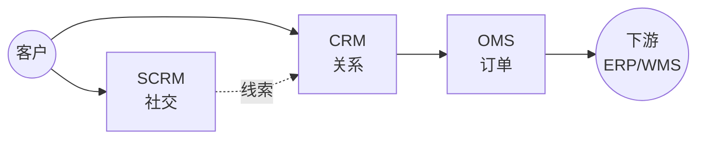

<!--
module:
  parent: application-systems
  slug: application-systems/04-sales-service
  type: index
  category: 主模块子文章
  summary: 销售服务环节（CRM · SCRM · OMS）—— 接触客户、达成交易、订单履约，CRM 是客户主数据源，OMS 是订单履约协调器。
-->

# 04 销售服务

> 本章关注"接触客户、达成交易、订单履约"阶段的系统。CRM 是客户主数据源，OMS 是订单履约协调器，SCRM 是社交化延伸。

## 📌 全景图

## 🔑 核心系统详讲

### CRM（Customer Relationship Management 客户关系管理）

- **核心定位**：以客户全生命周期为主线的管理与运营平台，是企业对外经营的主入口
- **关键能力**：客户主数据 / 销售自动化 SFA（L→O→Q→C→O 漏斗）/ 市场自动化 / 客服工单 / 客户成功
- **典型场景**：B2B 大客户 / B2C 零售 / SaaS 订阅 / 经销商网络 / 金融保险代理人
- **上下游**：上接市场自动化 / SCRM / CDP，下接 ERP / OMS；横向与客服系统闭环
- **关键考量**：销售流程标准化是前提；数据质量决定价值；移动端体验关键
- 📚 详见 [CRM 深读](./crm/) — 上下游 / 选型指南 / 常见陷阱

## 📋 其他系统速览

### SCRM（Social Customer Relationship Management 社交化客户关系管理）

CRM 的社交化延伸，集成微信/小红书/抖音等社交触点，把"粉丝"转化为可运营客户。**适用场景**：消费品零售、网红营销、私域运营。

### OMS（Order Management System 订单管理系统）

订单全生命周期管理（创建/拆分/合并/路由/状态），是连接 CRM 与 ERP/WMS/TMS 的中枢。**适用场景**：多渠道订单（电商+门店+经销商）统一管理。

## 💡 本章小结

销售服务的核心是 CRM（客户主数据），OMS 协调订单履约，SCRM 是社交化补充。本章输出"客户+订单"信息给运营管理章节的 ERP。

## 📑 本组系统导航

| 系统 | 一句话定位 | 深读链接 |
|------|-----------|---------|
| CRM | 客户关系管理（客户主数据源） | [CRM 深读](./crm/) |
| SCRM | 社交化客户关系管理 | [SCRM 深读](./scrm/) |
| OMS | 订单管理系统（履约协调器） | [OMS 深读](./oms/) |

← [返回: 业务应用系统](../README.md)
