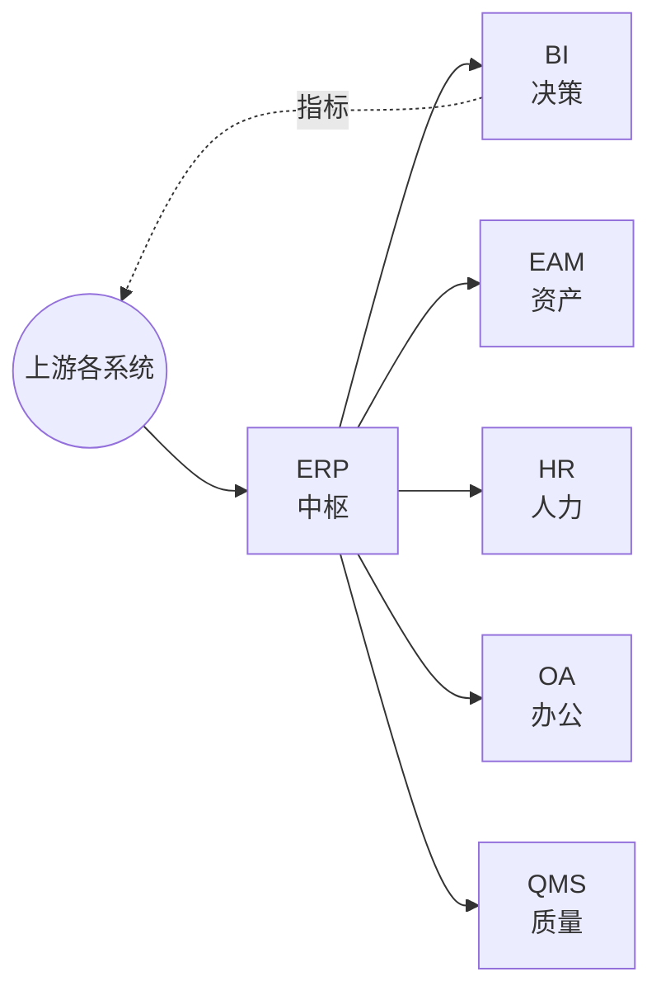

<!--
module:
  parent: application-systems
  slug: application-systems/05-operations
  type: index
  category: 主模块子文章
  summary: 运营管理环节（ERP · BI · EAM · HR · OA · QMS）—— 企业经营管理的核心系统，ERP 是中枢，BI 提供决策支持。
-->

# 05 运营管理

> 本章关注"企业经营管理的核心系统"。ERP 是企业数字化的"中枢"，BI 提供决策支持，HR/EAM/OA/QMS 是周边支撑。

## 📌 全景图

```mermaid
flowchart LR
    A((上游各系统)) --> B[ERP<br/>中枢]
    B --> C[BI<br/>决策]
    B --> D[EAM<br/>资产]
    B --> E[HR<br/>人力]
    B --> F[OA<br/>办公]
    B --> G[QMS<br/>质量]
    C -.指标.-> A
```

## 🔑 核心系统详讲

### ERP（Enterprise Resource Planning 企业资源计划）

- **核心定位**：整合企业核心业务流程（财务、采购、库存、销售、生产）于一体，是企业数字化的"中枢系统"
- **关键能力**：财务（总账/应收应付/固定资产/成本）/采购 PO+GR+IR 三单匹配/库存批次序列号/MRP 运算/多组织合并
- **典型场景**：大型集团（SAP/Oracle）、中型制造（用友 U9/金蝶云·星空）、小型（金蝶云·星辰）、零售/项目型
- **上下游**：上接 CRM/PLM，下接 MES/WMS/SCM，横向与 HR/财务/BI 双向同步
- **关键考量**：行业 Know-how 比品牌重要；实施周期 1-3 年；数据迁移占成本 30-40%；主数据治理必须先行
- 📚 详见 [ERP 深读](./erp/) — 上下游 / 选型指南 / 常见陷阱 / 代表案例

### HR / HCM（Human Capital Management 人力资本管理）

- **核心定位**：以员工全生命周期为主线的人力资本管理平台，是企业把人当成"资本"经营的核心系统
- **关键能力**：组织架构/人事/招聘/考勤/薪酬/绩效/培训/人才管理/People Analytics/全球合规
- **典型场景**：跨国集团（Workday/SuccessFactors）、大型集团（SAP/Oracle）、中型（北森/薪人薪事）、小型（钉钉智能人事）
- **上下游**：上接招聘平台（ATS），下接 ERP（薪资成本）/OA（审批流）/ITSM（账号权限）/财务（薪资发放）
- **关键考量**：合规优先于功能；组织架构治理先行；绩效是 CEO 工程；员工体验决定使用率；数据迁移占成本 25-35%
- 📚 详见 [HR 深读](./hr/) — 上下游 / 选型指南 / 常见陷阱 / 学习路线

## 📋 其他系统速览

- **BI**（商业智能）：数据分析、报表、可视化；**适用场景**：管理驾驶舱、自助分析
- **EAM**（企业资产管理）：物理资产全生命周期 + 维护（预防性维护、检修工单）；**适用场景**：资产密集行业（电力、轨交、物业）
- **HR / HCM**（人力资本管理）：员工全生命周期管理（组织/招聘/考勤/薪酬/绩效/培训）；**适用场景**：全员人事管理、人力成本管控、跨国合规
- **OA**（办公自动化）：行政办公流程（审批、文档、协同），国内代表有泛微/致远/钉钉/企业微信；**适用场景**：企业内部流程审批、文档协作
- **QMS**（质量管理系统）：产品质量（来料/过程/成品检验、不良品处理、质量分析）；**适用场景**：制造业（IATF 16949）、食品医药（GMP）

## 💡 本章小结

运营管理的核心是 ERP（中枢），BI 给决策者看数据，HR/EAM/OA/QMS 是企业运营不同侧面的支撑。本章把整条价值链的数据汇聚成可衡量、可管控的经营指标。

## 📑 本组系统导航

| 系统 | 一句话定位 | 深读链接 |
|------|-----------|---------|
| ERP | 企业资源计划（核心中枢） | [ERP 深读](./erp/) |
| BI | 商业智能 / 数据分析 | [BI 深读](./bi/) |
| EAM | 企业资产管理 | [EAM 深读](./eam/) |
| HR | 人力资本管理 | [HR 深读](./hr/) |
| OA | 办公自动化 | [OA 深读](./oa/) |
| QMS | 质量管理系统 | [QMS 深读](./qms/) |

← [返回: 业务应用系统](../README.md)
