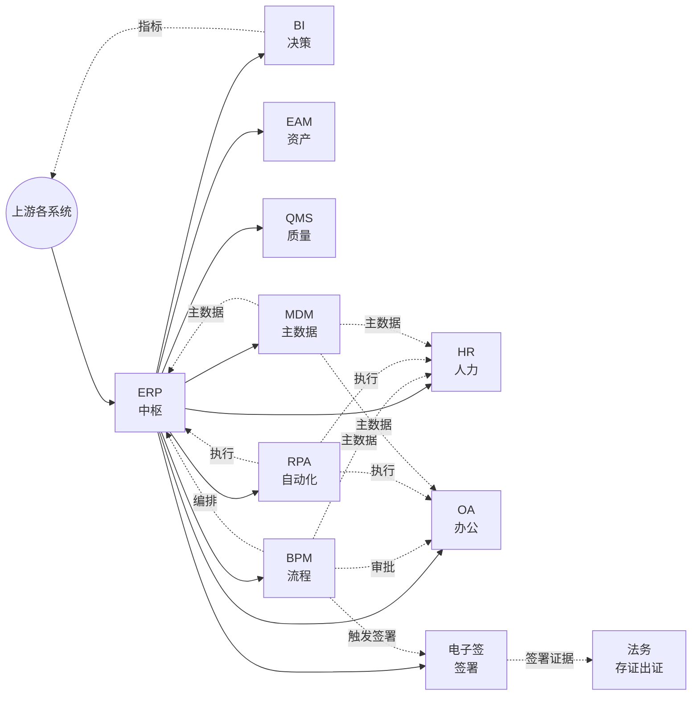

<!--
module:
  parent: application-systems
  slug: application-systems/05-operations
  type: index
  category: 主模块子文章
  summary: 运营管理环节（ERP · BI · EAM · HR · OA · QMS · RPA · BPM · MDM · 电子签）—— 企业经营管理的核心系统，ERP 是中枢，BI 提供决策支持，RPA 是跨系统自动化的最后一公里，电子签为合同/单据提供法律效力保障，MDM 是主数据单一可信源的核心基础设施。
-->

# 05 运营管理

> 本章关注"企业经营管理的核心系统"。ERP 是企业数字化的"中枢"，BI 提供决策支持，HR/EAM/OA/QMS 是周边支撑。BPM 把跨系统、跨部门的流程串成"运行中资产"，RPA 在不动老系统的前提下做"最后一公里自动化"，电子签为合同/单据/凭证提供**法律效力**的签署闭环，MDM 把跨系统主数据（客户/物料/供应商/组织）收敛为"单一可信源"。

## 📌 全景图

```mermaid
flowchart LR
    A((上游各系统)) --> B[ERP<br/>中枢]
    B --> C[BI<br/>决策]
    B --> D[EAM<br/>资产]
    B --> E[HR<br/>人力]
    B --> F[OA<br/>办公]
    B --> G[QMS<br/>质量]
    B --> H[BPM<br/>流程]
    B --> I[RPA<br/>自动化]
    B --> J[MDM<br/>主数据]
    B --> K[电子签<br/>签署]
    C -.指标.-> A
    H -.编排.-> B
    H -.审批.-> F
    H -.主数据.-> E
    H -.触发签署.-> K
    I -.执行.-> B
    I -.执行.-> F
    I -.执行.-> E
    J -.主数据.-> B
    J -.主数据.-> E
    J -.主数据.-> F
    K -.签署证据.-> L[法务<br/>存证出证]
```

## 🔑 核心系统详讲

### ERP（Enterprise Resource Planning 企业资源计划）

- **核心定位**：整合企业核心业务流程（财务、采购、库存、销售、生产）于一体，是企业数字化的"中枢系统"
- **关键能力**：财务（总账/应收应付/固定资产/成本）/采购 PO+GR+IR 三单匹配/库存批次序列号/MRP 运算/多组织合并
- **典型场景**：大型集团（SAP/Oracle）、中型制造（用友 U9/金蝶云·星空）、小型（金蝶云·星辰）、零售/项目型
- **上下游**：上接 CRM/PLM，下接 MES/WMS/SCM，横向与 HR/财务/BI 双向同步
- **关键考量**：行业 Know-how 比品牌重要；实施周期 1-3 年；数据迁移占成本 30-40%；主数据治理必须先行
- 📚 详见 [ERP 深读](./erp/) — 上下游 / 选型指南 / 常见陷阱 / 代表案例

### HR / HCM（Human Capital Management 人力资本管理）

- **核心定位**：以员工全生命周期为主线的人力资本管理平台，是企业把人当成"资本"经营的核心系统
- **关键能力**：组织架构/人事/招聘/考勤/薪酬/绩效/培训/人才管理/People Analytics/全球合规
- **典型场景**：跨国集团（Workday/SuccessFactors）、大型集团（SAP/Oracle）、中型（北森/薪人薪事）、小型（钉钉智能人事）
- **上下游**：上接招聘平台（ATS），下接 ERP（薪资成本）/OA（审批流）/ITSM（账号权限）/财务（薪资发放）
- **关键考量**：合规优先于功能；组织架构治理先行；绩效是 CEO 工程；员工体验决定使用率；数据迁移占成本 25-35%
- 📚 详见 [HR 深读](./hr/) — 上下游 / 选型指南 / 常见陷阱 / 学习路线

### BPM（Business Process Management 业务流程管理）

- **核心定位**：通过可视化流程设计器 + 规则引擎 + 表单引擎 + 集成能力，把企业跨系统、跨部门、跨角色的业务流程升级为可建模、可监控、可优化的"运行中资产"
- **关键能力**：流程设计器（BPMN 2.0）/规则引擎（DMN）/表单引擎/集成能力/流程监控/流程挖掘（Process Mining）/案例管理（CMMN）/版本管理/API 与 AI 增强
- **典型场景**：跨国集团（Pega/Appian/Camunda 8）、大型（Camunda/Flowable/泛微/致远）、中型（Camunda/Flowable/钉钉宜搭）、小型（钉钉宜搭/简道云）
- **上下游**：上接 OA（行政流）/ERP/HR（业务事件），下接 RPA（自动化执行）/API 网关（编排），横向与流程挖掘/低代码互补
- **关键考量**：场景复杂度决定一切（简单审批用 OA/低代码，深度业务流用专业 BPM）；流程治理先于技术；与 OA/RPA/低代码边界清晰；SLA 监控不可缺
- 📚 详见 [BPM 深读](./bpm/) — 上下游 / 选型指南 / 常见陷阱 / 学习路线

### RPA（Robotic Process Automation 机器人流程自动化）

- **核心定位**：用"软件机器人"模拟人在电脑上的重复操作（点击 / 输入 / 复制 / 粘贴 / 跨系统搬运），不改老系统、不写接口、不动数据库，是企业"异构系统集成的最后一公里"
- **关键能力**：流程录制 / 可视化设计 / 机器人执行（有人值守 + 无人值守）/Orchestrator 调度 / 凭证管理 / 审计日志 / AI 增强（OCR + NLP + ML）/ 跨系统操作 / 平民开发
- **典型场景**：跨国集团（UiPath / Automation Anywhere / Blue Prism）、国内大型（来也 / UiPath）、中型（来也 / 影刀 / 实在智能）、电商（影刀）、金融（Blue Prism / 弘玑）
- **上下游**：上接 ERP / CRM / OA / HR / 财税 / 银行 / 电商 / 邮件 / AI Agent（决策），下接 Orchestrator / BI（ROI 看板）/ 业务 Owner
- **关键考量**：流程选择决定 80% 成功（4 维度评分）；CoE 治理必须先行；异常处理零容忍；维护成本 15-25% / 年；凭证管理集中化；AI Agent 做大脑、RPA 做四肢
- 📚 详见 [RPA 深读](./rpa/) — 上下游 / 选型指南 / 常见陷阱 / 学习路线

### 电子签 / E-Signature（Electronic Signature 电子签名）

- **核心定位**：以《电子签名法》/ eIDAS / ESIGN Act + PKI/CA 数字证书 + 时间戳 + 区块链存证为底座，把"合同 / 单据 / 凭证"在数字世界实现**法律效力**的签署系统，是企业"无纸化、合规化、可证据化"的最后一公里
- **关键能力**：CA 数字证书 / 数字签名 / 实名认证（KYC）/ 时间戳 / 防篡改 / 合同模板 / 在线签署 / 流程审批 / 存证服务 / 出证服务 / 司法对接 / 移动签署 / 电子签章 / 合同审查（AI）/ API & SDK
- **典型场景**：跨国集团（DocuSign + e签宝双部署）、大型集团（e签宝/法大大私有化）、中型企业（e签宝/法大大 SaaS）、金融/互金（法大大金融级）、政府/央国企（契约锁/e签宝 国密备案）、跨境电商（DocuSign 国际合规）
- **上下游**：上接 CRM/OA/BPM/HR/ERP/法务（待签文件流），横向接 CA/时间戳/区块链（合规基础设施），下接互联网法院/仲裁委（司法举证）+ 业务系统（签署证据回写）
- **关键考量**：法律效力是底线（《电子签名法》第十三条 4 条件必须满足）；CA 选型决定合规上限；实名认证三重（四要素+人脸+银行卡/对公账户）；时间戳必接权威 TSA；区块链必存（重大合同）；与 ERP/OA/CRM 深度集成；电子签 ≠ 电子印章（电子印章只是控件之一）；DocuSign 在中国本地化弱（无国密/无中国司法链）
- 📚 详见 [电子签 深读](./e-signature/) — 上下游 / 选型指南 / 常见陷阱 / 学习路线

### MDM（Master Data Management 主数据管理）

- **核心定位**：把企业"主数据"（客户 / 物料 / 供应商 / 组织 / 账户 / 员工 / 项目）从"散落在 ERP/CRM/SRM/SCM/MES 各业务系统"的状态，收敛到**统一建模 + 单一可信源（Single Source of Truth）+ 分发同步 + 治理闭环**的系统，是数据治理体系的核心抓手，也是 ERP / CRM / SRM / MES 各业务系统之间"数据口径统一"的唯一基础设施
- **关键能力**：主数据建模（多域 MDM：客户 / 物料 / 供应商 / 组织 / 账户）/ 数据标准 / 数据采集 / 数据清洗 / 数据质量（6 维度：准确性 / 完整性 / 一致性 / 时效性 / 唯一性 / 有效性）/ 主数据分发 / 主数据治理（数据 Owner + 数据 Steward）/ 元数据 / 黄金记录（Golden Record）/ Match & Merge 去重 / API 服务化 / AI 增强
- **典型场景**：跨国集团（Informatica / SAP MDG / IBM InfoSphere）、大型集团（SAP MDG / Oracle MDM / 华为 DataArts）、中型（阿里云数据治理 / 滴普 DIMP / 数澜）、互联网 / 创新（Reltio / Ataccama）、政企 / 国企 / 信创（华为 DataArts / 阿里云）
- **上下游**：上接 ERP / CRM / SRM / HR / PLM / 财务（主数据源头），下接 ERP / CRM / SRM / MES / WMS / HR / 财务 / BI（主数据消费者），横向与数据质量 / 元数据 / 数据治理 / 数据中台 / AI Agent 协同
- **关键考量**：MDM 是治理体系不是 IT 系统（数据 Owner 矩阵 + 治理委员会）；MDM 是单一可信源不是多系统副本（ERP 不能再独立维护主数据）；Match & Merge 必须 AI + 人工双轨；数据质量是持续运营不是一次性项目；数据治理 vs MDM vs 数据中台 职责清晰
- 📚 详见 [MDM 深读](./mdm/) — 上下游 / 选型指南 / 常见陷阱 / 学习路线

### 数据中台（Data Middle Platform / Data Mesh / OneData）

- **核心定位**：把企业分散在 ERP / CRM / MES / 业务系统中的"数据资产"沉淀为可复用、可治理、可服务化的中台能力，让"同口径、同指标、同标签"的数据可被 BI / 营销 / 风控 / 算法等多种业务复用，是企业从"数据烟囱"走向"数据要素资产化"的核心基础设施
- **关键能力**：OneData（指标统一）+ OneID（实体识别）+ OneService（统一服务）+ 数据采集（CDC / ETL）+ 湖仓一体存储（Iceberg / Hudi / Delta）+ 流批一体计算（Flink + Spark）+ 数据治理（元数据 / 血缘 / 质量 / 安全）+ 资产化运营
- **典型场景**：政企（华为 DataArts / 阿里 DataWorks 私有化）、大型商业（阿里云 DataWorks / 网易数帆）、互联网（滴普 / 网易）、金融（华为 / 神策）、AI 创新（Databricks Lakehouse + Milvus）
- **上下游**：上接 ERP / CRM / MES / HR / SCM / 业务日志 / IoT / 外部数据 / MDM，下接 BI / 算法 / 风控 / 营销 / 运营 / 大模型 RAG / 数据治理
- **关键考量**：业务驱动 + 一把手工程；OneData 指标 + OneID 实体先行；湖仓一体是 2024-2026 主流；批流一体替代"实时 + 离线"双架构；治理与建设同步；数据安全零容忍（GDPR / PIPL / 数据安全法）
- 📚 详见 [数据中台 深读](./data-mesh/) — 上下游 / 选型指南 / 常见陷阱 / 学习路线

## 📋 其他系统速览

- **BI**（商业智能）：数据分析、报表、可视化；**适用场景**：管理驾驶舱、自助分析
- **EAM**（企业资产管理）：物理资产全生命周期 + 维护（预防性维护、检修工单）；**适用场景**：资产密集行业（电力、轨交、物业）
- **HR / HCM**（人力资本管理）：员工全生命周期管理（组织/招聘/考勤/薪酬/绩效/培训）；**适用场景**：全员人事管理、人力成本管控、跨国合规
- **OA**（办公自动化）：行政办公流程（审批、文档、协同），国内代表有泛微/致远/钉钉/企业微信；**适用场景**：企业内部流程审批、文档协作
- **BPM**（业务流程管理）：跨系统业务流程建模（BPMN）+ 规则引擎（DMN）+ 表单 + 集成 + 监控；**适用场景**：销售合同/采购审批/信贷审批/保险理赔等跨部门业务流
- **RPA**（机器人流程自动化）：用"软件机器人"模拟人在电脑上的重复操作，不改老系统、不写接口；**适用场景**：跨系统数据搬运（订单同步 / 银企对账 / 发票认证 / 税务申报 / 银行回单下载）
- **MDM**（主数据管理）：客户 / 物料 / 供应商 / 组织 等核心实体的统一建模 + 单一可信源 + 分发同步 + 治理闭环；**适用场景**：ERP / CRM / SRM 主数据统一治理、客户 / 物料合并、跨法人主数据治理、数据资产入表
- **数据中台**（Data Middle Platform / OneData）：把分散的数据资产沉淀为可复用的指标 / 标签 / API，含 OneData + OneID + OneService；**适用场景**：跨域数据打通（指标统一 / 标签建设 / 实时大屏 / AI 训练数据底座 / 大模型 RAG 数据）
- **QMS**（质量管理系统）：产品质量（来料/过程/成品检验、不良品处理、质量分析）；**适用场景**：制造业（IATF 16949）、食品医药（GMP）

## 💡 本章小结

运营管理的核心是 ERP（中枢），BI 给决策者看数据，HR/EAM/OA/QMS/BPM/RPA 是企业运营不同侧面的支撑，**MDM 把跨系统主数据（客户/物料/供应商/组织）收敛为"单一可信源"**——是 ERP / CRM / SRM / MES 各业务系统之间"数据口径统一"的唯一基础设施。本章把整条价值链的数据汇聚成可衡量、可管控的经营指标，并用 RPA 把跨系统自动化"最后一公里"打通。

## 📑 本组系统导航

| 系统 | 一句话定位 | 深读链接 |
|------|-----------|---------|
| ERP | 企业资源计划（核心中枢） | [ERP 深读](./erp/) |
| BI | 商业智能 / 数据分析 | [BI 深读](./bi/) |
| EAM | 企业资产管理 | [EAM 深读](./eam/) |
| HR | 人力资本管理 | [HR 深读](./hr/) |
| OA | 办公自动化 | [OA 深读](./oa/) |
| BPM | 业务流程管理（流程编排中枢） | [BPM 深读](./bpm/) |
| RPA | 机器人流程自动化（最后一公里自动化） | [RPA 深读](./rpa/) |
| MDM | 主数据管理（跨系统单一可信源） | [MDM 深读](./mdm/) |
| 数据中台 | 数据要素资产化（OneData + OneID + OneService） | [数据中台 深读](./data-mesh/) |
| QMS | 质量管理系统 | [QMS 深读](./qms/) |

← [返回: 业务应用系统](../README.md)
