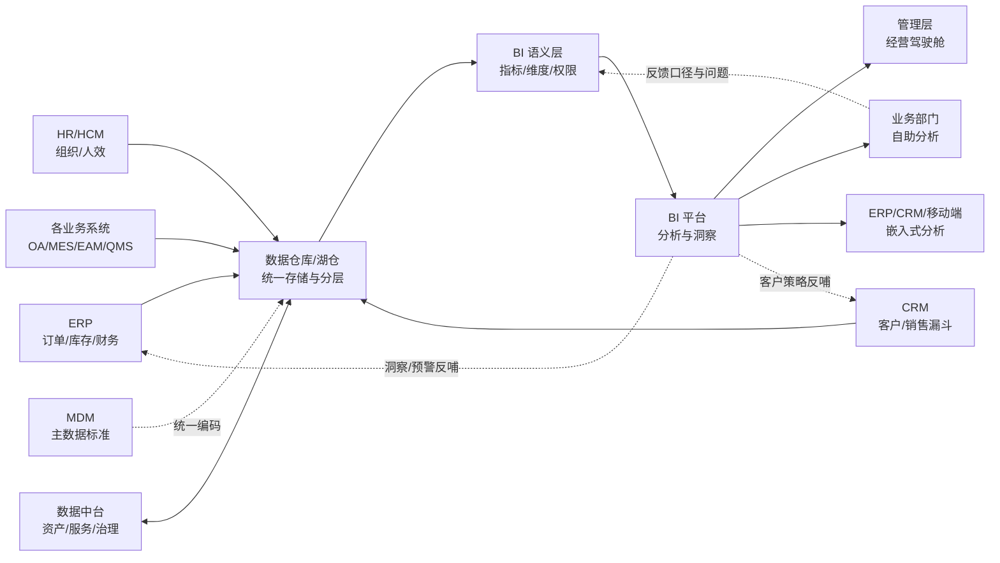
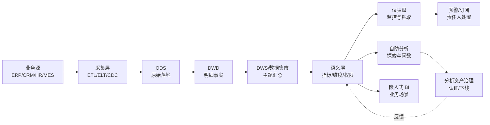

<!--
module:
  parent: application-systems
  slug: application-systems/05-operations/bi
  type: article
  category: 主模块子文章
  summary: 一份按业务场景梳理的 BI 速查手册：从"看报表"到"用数据驱动决策"。
-->

# BI · 商业智能系统

> 一份按业务场景梳理的 BI 速查手册：从"看报表"到"用数据驱动决策"。

---

## 📌 全景图



BI 在企业数据架构中扮演「**洞察消费层 + 决策交互层**」角色：上游由 ERP、CRM、HR、MES、OA 等业务系统产生事实数据，数据仓库/湖仓完成汇聚与加工，数据中台负责资产化与复用，BI 再通过语义层把技术字段翻译为业务可理解的指标、维度和权限模型。BI 可以把洞察嵌回 ERP/CRM，但不应反向承担交易处理、主数据维护或原始数据长期存储。

---

## 一、一句话定位
**BI（Business Intelligence，商业智能系统）**：把企业各类业务数据（ERP/CRM/财务/生产）汇集、清洗、分析、可视化，让管理层"用数据说话"。

---

## 二、BI 系统的 4 大模块

```text
数据源 ─→ 数据仓库 ─→ 数据分析 ─→ 数据可视化
 ERP         ODS          OLAP         报表
 CRM         DWD          数据挖掘      大屏
 财务        DWS          AI 模型       移动 BI
```

| 模块 | 功能 | 工具 |
|------|------|------|
| **数据采集** | ETL / CDC / 实时同步 | DataX / Flink CDC |
| **数据存储** | 数据仓库 / 数据湖 / 湖仓一体 | Hive / Iceberg / Doris |
| **数据分析** | OLAP / 数据挖掘 / ML | ClickHouse / Spark |
| **数据可视化** | 报表 / 大屏 / 自助分析 | Tableau / Power BI / FineBI |

## 🔧 核心能力
- **数据连接（Connectivity）**：连接关系型数据库、文件、SaaS、API、数据仓库、数据湖和流式平台；支持直连查询、抽取缓存、网关代理与定时刷新
- **数据建模（Modeling）**：定义事实表、维度表、星型模型、表关系、计算字段和行级权限，把物理表转换为可复用业务模型
- **数据可视化（Visualization）**：用趋势、比较、构成、分布、地理和明细等视觉形式表达业务问题，并提供筛选、联动、钻取与解释
- **自助分析（Self-Service Analytics）**：授权业务用户拖拽字段、创建个人分析和共享主题，同时由数据团队治理认证数据集、指标和权限
- **移动 BI（Mobile BI）**：在手机和平板上查看关键指标、接收预警、批注协作；强调响应式布局、离线策略、设备安全和移动端最小展示
- **嵌入式分析（Embedded Analytics）**：通过 iframe、JavaScript SDK、REST API 或原生组件，把图表和洞察嵌入 ERP、CRM、OA、客户门户及 SaaS 产品
- **智能 BI（Augmented / AI BI）**：自然语言问数、NL2SQL、异常检测、自动归因、预测分析、图表推荐与洞察摘要；输出必须经过权限和指标语义层约束
**「连接 → 建模 → 分析 → 行动」四段式闭环**：

1. **连接**：确认数据源 Owner、刷新频率、全量/增量方式、源系统限流与数据延迟 SLA；生产分析优先读数仓或只读副本，不直接压交易库
2. **建模**：围绕业务过程设计事实表与一致性维度；日期、组织、客户、产品等公共维度统一复用；指标公式不散落在工作簿中
3. **分析**：先回答业务问题再选图表，支持从集团 → 区域 → 门店 → 订单的层级钻取，并保留筛选上下文和数据更新时间
4. **行动**：把阈值预警、订阅、评论和处置链接嵌回业务流程；没有 Owner、阈值和处置动作的告警只是“自动制造噪声”

**数据连接的三种查询模式**：

| 模式 | 原理 | 优势 | 代价与适用 |
|------|------|------|-----------|
| **Import / Extract** | 数据抽取到 BI 缓存或专用引擎 | 查询快、减轻源库压力、离线可用 | 有刷新延迟；适合日/小时级经营分析 |
| **Direct Query / Live** | 查询实时下推到数仓或数据库 | 数据新鲜、无需复制大数据集 | 性能受源端影响；适合分钟级运营监控 |
| **Composite / Hybrid** | 热数据直连、历史数据导入 | 平衡时效、成本和性能 | 模型复杂、缓存一致性难；适合大规模企业 |
**语义层是现代 BI 的核心资产**：连接器和图表都容易替换，真正难迁移的是“什么叫收入、活跃客户、库存周转、毛利率”的业务定义。企业级语义层至少包含：
- **指标（Measure）**：名称、公式、粒度、单位、时间口径、适用范围、负责人、版本和认证状态
- **维度（Dimension）**：日期、组织、地区、渠道、客户、产品等分析切片，以及层级和成员映射
- **关系（Relationship）**：事实表与维度表的主外键、基数、过滤方向，避免多对多关系导致重复汇总
- **权限（Security）**：对象级、列级、行级权限；例如区域经理只能看本区域，薪资列仅 HR 可见
- **血缘（Lineage）**：指标 → 语义模型 → 数据集市 → 数仓表 → 源系统字段，可定位“这个数字从哪里来”
- **认证（Certification）**：官方认证数据集和个人沙箱并存；管理层看板只能引用认证指标

**BI 成熟度分级**（用于规划，不是厂商排名）：
- **L1 报表化**：Excel/固定报表替代手工汇总，回答“发生了什么”
- **L2 可视化**：统一仪表盘、钻取联动、移动查看，回答“在哪里发生”
- **L3 自助化**：认证数据集 + 受控沙箱，业务人员回答“为什么发生”
- **L4 智能化**：异常检测、归因、预测、自然语言问数，回答“接下来可能发生什么”
- **L5 行动化**：洞察嵌入 ERP/CRM/BPM，告警触发责任人和流程，回答“现在应该做什么”

按企业实践，BI 平台的价值不应只用“报表数量”衡量，更应关注：认证指标覆盖率、月活跃分析用户、查询性能、刷新 SLA、看板使用率、告警闭环率，以及决策周期缩短程度。

---

## 三、典型用户与场景

| 角色 | 诉求 | 工具 |
|------|------|------|
| **CEO / 决策层** | 战略仪表盘、KPI 跟踪 | 移动 BI |
| **业务部门** | 销售分析 / 运营分析 | 自助 BI |
| **数据分析师** | 深度分析、报表开发 | 复杂 BI 工具 |
| **数据科学家** | ML/AI 建模 | Python + Jupyter |

## 📊 关键模块详解
### 数据源管理（Data Source Management）

数据源管理决定 BI 能否“稳定拿到可信数据”，不能只看连接器数量：
- **连接器覆盖**：MySQL/PostgreSQL/Oracle/SQL Server、SAP、Excel、对象存储、SaaS API、Kafka 等
- **连接治理**：连接凭证集中托管、开发/测试/生产隔离、证书轮换、最小权限只读账号
- **刷新策略**：全量、时间戳增量、CDC 变更捕获；按日报、小时、分钟分别定义数据时效 SLA
- **Schema 演进**：源字段新增、改名、类型变化必须预警，避免刷新成功但字段语义已变
- **源端保护**：限制并发、查询超时、错峰刷新；高频分析通过数仓/只读副本而非生产交易库
- **质量闸门**：刷新后检查行数波动、主键重复、空值、金额平衡与业务规则，异常批次禁止发布
### ETL / ELT 与数据准备

ETL/ELT 把多源原始数据加工成可分析数据。BI 自带数据准备适合轻量场景，企业级复杂链路应沉淀到统一数据工程平台：
- **ETL**：Extract → Transform → Load，装载前转换；适合强规范、传统数仓和敏感字段脱敏
- **ELT**：Extract → Load → Transform，先落湖仓再利用计算引擎转换；适合云数仓、海量数据和敏捷迭代
- **CDC**：读取数据库日志捕获增删改，减少全表扫描；需处理乱序、重复、删除和断点续传
- **数据准备**：字段拆分、类型转换、缺失值处理、去重、维表关联、编码映射、宽表构建
- **调度依赖**：源表完成 → 明细层 → 汇总层 → 语义模型 → 看板刷新；必须可重跑、可补数、可回滚
- **可观测性**：监控新鲜度、完整性、分布漂移和任务耗时；失败通知到数据 Owner，而非只通知平台运维
**边界原则**：Power Query/Tableau Prep/FineBI 数据准备可以做“最后一公里”，但不要把数百条关键口径藏进个人工作簿。跨报表复用、需要审计或计算成本高的转换，应下沉至数据仓库/数据中台。
### OLAP 引擎（Online Analytical Processing）

OLAP 引擎负责在大数据量上完成聚合、切片、钻取，是“看板秒开”背后的核心：
- **MOLAP**：预计算多维立方体，查询快但构建和存储成本高，适合维度稳定、查询模式明确
- **ROLAP**：在关系/列式引擎上动态 SQL 聚合，扩展性强但依赖 SQL 优化，适合明细量大和灵活分析
- **HOLAP**：汇总预计算、明细实时查，平衡性能与灵活性，但架构和一致性更复杂
- **现代列式 OLAP**：ClickHouse、Doris、StarRocks、Druid 等通过列存、向量化、分区和物化视图加速聚合
- **语义计算引擎**：Power BI VertiPaq/DAX、Tableau Hyper、Qlik Associative Engine 等在产品层提供压缩、计算和关联探索
**性能设计顺序**：先控制明细粒度与无用字段 → 设计星型模型和分区 → 使用聚合表/物化视图 → 开启增量刷新与缓存 → 最后再加计算资源。单纯“加机器”只能暂时掩盖错误模型。
### 可视化看板（Dashboard）

看板不是“把所有图表塞在一页”，而是围绕一个决策场景组织信息：
- **第一屏**：5-8 个核心 KPI + 同比/环比 + 目标达成，明确数据更新时间和异常状态
- **第二层**：趋势、结构、区域/渠道/产品对比，回答变化来自哪里
- **第三层**：钻取到客户、订单、设备或人员明细，支持导出和跳转业务系统处置
- **交互设计**：全局筛选、图表联动、层级下钻、返回路径、书签/快照，避免用户迷失上下文
- **图表选择**：比较用条形图、趋势用折线、分布用直方/箱线、关系用散点；少用 3D、仪表盘和过多饼图
- **可访问性**：颜色不是唯一编码，保证文字对比度，提供表格明细、键盘操作和替代文本
### 自助报表（Self-Service Reporting）

自助分析的目标是缩短问题到答案的时间，而不是把数据工程责任甩给业务：
- **认证区**：公司级指标、公共维度、权威数据集，只能由数据团队或域 Owner 发布
- **部门区**：部门数据管理员维护主题模型，允许有限扩展，需记录 Owner 和有效期
- **个人沙箱**：允许上传 Excel、临时关联和探索，但默认不进入管理驾驶舱，也不承诺长期 SLA
- **发布流程**：个人分析 → 部门复核 → 指标校验 → 权限检查 → 认证发布 → 使用监控 → 定期下线
- **能力分层**：Viewer 只看、Explorer 可探索、Creator 可建模；License 和权限随角色配置
- **资产治理**：名称规范、标签、描述、血缘、收藏、认证标识、最近使用时间和重复报表检测
### 指标体系（Metrics Layer）

指标体系解决“同一个词为什么有多个数字”。每个核心指标都应拥有一张可审计的指标卡：

| 字段 | 示例：销售收入 |
|------|--------------|
| **业务定义** | 已确认收入的含税/不含税销售额，明确是否含退款、运费和内部交易 |
| **计算公式** | `有效订单行金额 - 已确认退款金额`，以财务确认日期归属期间 |
| **统计粒度** | 订单行 / 日；汇总可到门店、区域、产品、渠道 |
| **时间口径** | 自然日、财务月；同比按可比日历处理闰年和春节错位 |
| **数据来源** | ERP 销售订单 + 财务凭证，字段及关联键可追溯 |
| **责任人** | 业务 Owner：销售运营；数据 Owner：数据平台主管 |
| **质量与版本** | 每日 07:00 前完成，完整率 ≥ 99.9%；公式变更生成新版本 |

指标按用途可分为：
- **原子指标**：销售额、订单数、客户数等不可再拆的度量
- **派生指标**：客单价、转化率、库存周转率等由原子指标计算
- **复合指标**：经营健康度、客户价值评分等多指标加权结果
- **过程指标 vs 结果指标**：线索跟进率属于过程，收入属于结果；驾驶舱需要两者配对
- **领先指标 vs 滞后指标**：询价量可能领先收入，财务利润是滞后确认；预测必须标注假设
### 数据预警（Alerting）

数据预警把“人找数据”升级为“异常找人”，但必须有闭环：
- **阈值预警**：库存低于安全库存、毛利率低于红线；简单透明，适合强业务规则
- **同比/环比预警**：销售额较基线下降超过阈值；需要处理节假日和季节性
- **统计异常检测**：依据历史分布或时序模型识别异常点；必须给出置信度和解释
- **组合条件**：金额异常 + 连续三天 + 重点区域，减少单条件噪声
- **路由升级**：按组织/产品路由到责任人，未确认则升级；高敏数据禁止通过明文短信泄露
- **闭环记录**：告警产生 → 确认 → 分析 → 处置 → 复盘；统计命中率、误报率、平均确认和关闭时间
**预警红线**：没有业务 Owner 不上线；没有处置动作不推送；连续误报必须降级或停用；AI 生成的异常解释只能作为线索，不能替代财务、合规或经营判断。

---

## 四、主流厂商/产品对比

| 类型 | 代表产品 | 适用场景 |
|------|---------|---------|
| **国际传统** | Tableau / Power BI / Qlik | 大型企业 |
| **国际云原生** | Looker / Sigma / Mode | 云原生企业 |
| **国内主流** | 帆软 FineBI / 永洪 BI / Smartbi | 国内中大型 |
| **互联网自研** | 阿里 Quick BI / 腾讯 BI / 字节跳动 | 互联网企业 |
| **开源** | Metabase / Superset / Redash | 中小 / 自建 |

---

## 🏆 选型决策
### 自研 vs 商用 vs 开源

| 维度 | 自研 BI | 商用 BI | 开源 BI |
|------|---------|---------|---------|
| **适用前提** | BI 是产品核心能力，已有成熟数据平台、前端与可视化团队 | 希望快速上线、重视产品完整性、支持与行业方案 | 预算受限、技术团队强、需求以 SQL 看板和嵌入为主 |
| **优势** | 交互和业务流程可完全定制；可与内部权限/研发体系深度集成 | 连接、建模、可视化、移动、治理、运维一体；升级与服务明确 | License 成本低、代码可审计、部署自主、便于二次开发 |
| **劣势** | 图表只是 20%，权限、导出、调度、移动、血缘和兼容性会长期吞噬投入 | License 与实施成本高；专有语义模型和工作簿形成迁移成本 | 语义层、移动端、治理、厂商支持常需补齐；运维责任自担 |
| **典型代表** | 互联网平台/垂直 SaaS 内嵌分析 | Tableau、Power BI、Qlik、FineBI、Smartbi、永洪 | Apache Superset、Metabase、Redash |
| **决策建议** | 只自研差异化交互与嵌入层，不轻易重造完整 BI 平台 | 多数中大型企业首选，先 POC 再谈集团推广 | 先确认安全治理和长期维护人，不把“免费”误认为“零成本” |
### 主流平台对比

| 平台 | 核心定位 | 主要优势 | 主要注意项 | 更适合 |
|------|---------|---------|-----------|--------|
| **Tableau** | 可视化探索与企业分析 | 可视分析成熟、交互灵活、社区和生态广、跨数据源能力强 | License/TCO 较高；复杂治理和 Salesforce 生态需整体规划 | 重视分析师探索与高质量可视化的跨国/大型企业 |
| **Power BI** | Microsoft Fabric / M365 生态 BI | Excel 用户迁移自然、Power Query + DAX + 语义模型完整、成本入口较低 | DAX 与容量治理有学习成本；分享、容量和许可证需提前设计 | 已采用 Microsoft 365、Azure、SQL Server 的组织 |
| **Qlik Sense** | 关联式分析平台 | Associative Engine 支持非线性探索，数据集成和嵌入能力成熟 | 人才与中文生态相对小；脚本和治理需要专门能力 | 多源探索、供应链/制造分析、既有 Qlik 客户 |
| **FineBI（帆软）** | 国内自助 BI 与企业分析 | 中文体验、本地实施生态、国产数据库/信创适配、与 FineReport 协同 | 国际化和全球云生态弱于国际厂商；复杂场景需验证模型性能 | 国内中大型、制造/政企、帆软既有客户 |
| **FineReport（帆软）** | 复杂中国式报表与填报 | 像素级报表、打印、填报和复杂表格强 | 不等同于自助 BI；探索分析体验不是主战场 | 财务法定报表、固定格式、套打和填报场景 |
| **永洪 BI** | 国内一体化敏捷 BI | 本地化部署、数据处理和可视化一体、行业交付经验 | 生态与人才供给需按地区核验；集团规模需做压力 POC | 国内中大型、信创和私有化要求较高的组织 |
| **Smartbi** | 企业报表 + 自助分析 | Excel 插件、中国式报表、金融政企经验、私有化能力 | 产品模块组合和实施质量要在合同中界定 | 金融、政府、央国企及 Excel 重度用户 |
| **Apache Superset** | 开源 SQL-first 可视化平台 | 开源、数据库覆盖广、轻量嵌入、适合技术团队 | 企业语义层、移动端、报表治理和商业支持需自行补齐 | 数据团队主导、云原生、自建与嵌入式场景 |

> **命名提醒**：“帆软”是厂商品牌，FineBI 偏自助分析，FineReport 偏固定/复杂报表。选型表中同时写“FineBI / 帆软”容易把产品与厂商重复计数，RFP 应按具体产品版本、模块和 License 口径报价。
### 选型决策树（6 层）

1. **先看核心场景**：固定打印/填报 → FineReport/Smartbi；分析师探索 → Tableau/Qlik；全民自助 → Power BI/FineBI；技术团队 SQL 看板 → Superset
2. **再看既有生态**：Microsoft 365/Azure → Power BI；Salesforce → Tableau；帆软报表存量 → FineBI；全开源数据平台 → Superset
3. **再看部署与合规**：跨国 SaaS、数据驻留、等保/信创、私有化、离线环境分别列为一票否决项，不用功能分数抵消
4. **再看语义与治理**：现场验证指标复用、行列级权限、血缘、认证数据集、版本发布与审计，而非只看拖拽图表
5. **再看规模性能**：用真实模型和脱敏数据 POC，覆盖并发、首屏、复杂筛选、导出、刷新窗口和数据增长后的表现
6. **最后看 5 年 TCO**：License/容量、实施、模型开发、迁移、培训、运维、升级和云资源全部计入，避免只比较首年报价
### RFP 评分项与 POC

建议采用 **6 大类、40+ 项**，并让红线项先于加权得分：
- **业务与功能（25%）**：看板、自助、固定报表、移动、嵌入、订阅、预警、协作、导出
- **数据与语义（20%）**：连接、Import/Direct、星型模型、指标层、增量刷新、血缘、认证数据集
- **性能与稳定（15%）**：并发、首屏 P95、复杂查询 P95、刷新窗口、故障恢复、容量扩展
- **安全与治理（15%）**：SSO、RBAC、RLS/CLS、审计、脱敏、数据驻留、等保/ISO/SOC、内容生命周期
- **开放与集成（10%）**：REST API、SDK、iframe、Webhook、Git/CI/CD、多租户、ERP/CRM/IM 集成
- **服务与 TCO（15%）**：实施团队、同行业案例、培训认证、SLA、升级策略、退出与迁移条款、5 年报价
**POC 必测 5 个场景**：①10 亿级事实表的集团经营看板；②集团 → 区域 → 门店 → 订单四级钻取；③同一指标在两个看板一致；④区域经理行级权限与导出防泄露；⑤源字段变更、刷新失败和恢复演练。POC 使用真实脱敏数据、真实实施顾问和目标部署规格，结果写入合同验收标准。
### TCO 估算框架

不建议给出脱离 License 版本、用户结构、并发与部署方式的“统一价格”。可用下式比较候选方案：

`5 年 TCO = 订阅/License + 计算与存储 + 实施与迁移 + 数据模型/报表开发 + 培训推广 + 运维升级 + 安全合规 + 退出迁移`

经验上最容易漏算的是：Viewer/Creator 用户增长、云容量扩容、网关与高可用、复杂报表改造、重复数据集治理、厂商版本升级适配，以及从专有语义模型迁出时的重建成本。采购时至少做“基准 / 用户翻倍 / 数据量 3 倍”三组敏感性分析。

| 场景 | 推荐 |
|------|------|
| 大型集团（多业务线）| Tableau / 帆软 |
| 中型企业 | 帆软 FineBI / 永洪 BI |
| 互联网企业 | 阿里 Quick BI / 自研 |
| 预算有限 / 自建 | Metabase / Superset 开源 |
| 数据科学家主导 | Jupyter + Superset |

---

## 六、实施关键点

1. **数据治理先行**：数据标准、数据质量、数据血缘
2. **指标体系**：建立公司级"指标字典"，避免各部门口径不一致
3. **分层建模**：ODS（原始）→ DWD（明细）→ DWS（汇总）→ ADS（应用）
4. **自助分析**：让业务人员自助分析（降低数据团队压力）
5. **AI 增强**：自然语言查询（NL2SQL）、智能洞察

---

## 七、BI vs 大数据 vs 数据中台

| 系统/层次 | 核心职责 | 典型产物 | 不应承担 |
|-----------|---------|---------|---------|
| **BI** | 面向业务用户消费数据、分析、可视化与洞察分发 | 语义模型、指标、报表、看板、预警 | 原始数据长期存储、企业级主数据治理、交易写入 |
| **数据仓库** | 汇聚结构化数据，按主题分层建模，为分析提供稳定事实 | ODS/DWD/DWS/ADS、事实表、维度表、数据集市 | 直接替代业务前台，也不等同于完整 BI 交互体验 |
| **数据湖** | 低成本保存原始、多模态和半/非结构化数据 | 文件、对象、开放表格式、原始日志与模型特征 | 天然保证高质量指标；无治理会退化为数据沼泽 |
| **湖仓一体** | 用开放表格式与统一引擎兼顾湖的弹性和仓的治理/性能 | Iceberg/Delta/Hudi 表、统一批流处理 | 自动解决业务语义、指标口径和组织责任问题 |
| **数据中台** | 把数据加工、治理、目录、标签、指标和服务沉淀为可复用资产 | 数据资产目录、数据服务 API、标签、治理规则 | 取代所有数仓、BI 和业务系统；“中台”不是单一软件 |
| **大数据平台** | 提供海量数据存储、计算、流处理与任务调度技术能力 | Hadoop/Spark/Flink/Kafka/OLAP 基础设施 | 直接回答经营问题或自动形成统一指标口径 |
**关系**：BI 是“应用与消费层”，数据仓库/湖仓是“分析数据底座”，大数据平台是“技术能力”，数据中台是“治理、资产化与复用机制”。小企业可以“数仓 + BI”两层起步；只有多业务域、多团队复用和治理诉求真实存在时，才有必要建设数据中台。
**2025-2026 高频混淆点**：
- **有 BI 不等于有数仓**：BI 可以直连 ERP，但性能、历史快照、跨源一致性与口径复用会受限；生产级 BI 通常仍需要数仓/湖仓
- **有数仓不等于有数据中台**：数仓解决“存和算”，数据中台还要解决资产目录、标准、服务、责任和跨域复用
- **数据湖不等于廉价数仓**：湖擅长保存多样原始数据；要支撑稳定 BI，还需质量、表格式、权限、元数据与查询加速
- **语义层不应四处复制**：指标可以在数据中台集中管理，也可以在 BI 语义层落地，但必须明确唯一权威定义和版本同步机制
- **BI 不应回写交易事实**：洞察可通过预警或链接驱动 ERP/CRM 动作，交易结果仍由业务系统记录；避免 BI 成为影子业务系统
- **不要为概念而中台化**：如果只有一个数仓团队和少量看板，先把指标、质量和数据集做好，比采购“数据中台套件”更有价值

---

## 八、BI 与企业系统的深度集成

BI 不是独立存在的"看报表工具"——它的价值取决于能从多少业务系统抽取数据，以及分析结果能反哺到多少决策环节。
### 8.1 BI 与各业务系统的数据关系

| 数据源系统 | 提供给 BI 的数据 | BI 反哺的决策 |
|-----------|----------------|-------------|
| **ERP**（企业资源）| 订单、库存、财务、成本 | 经营仪表盘、利润分析、库存周转 |
| **OA**（办公自动化）| 审批流、流程效率、人力工时 | 流程瓶颈分析、组织效能 |
| **EAM**（设备管理）| 设备 OEE、故障记录、维护成本 | 设备投资 ROI、预防性维护策略 |
| **CRM**（客户管理）| 销售线索、客户画像、成交率 | 销售漏斗分析、客户分层 |
| **MES/MOM**（生产）| 产量、不良率、产能利用率 | 生产效率分析、质量趋势 |
### 8.2 BI 项目的典型失败原因与对策

| 失败原因 | 表现 | 对策 |
|---------|------|------|
| **数据质量差** | "垃圾进垃圾出" | 数据治理先行（数据标准 + 数据质量规则）|
| **指标口径不统一** | 财务和销售各自算"营收"结果不同 | 建立公司级"指标字典" |
| **业务不用** | "报表做了一堆没人看" | 从业务痛点出发（先做 3 个高频看板）|
| **技术过重** | 数据团队成"取数工具人" | 推自助 BI（让业务自己拖拽分析）|
### 8.3 AI 增强 BI 趋势

| 能力 | 技术 | 示例 |
|------|------|------|
| **自然语言查询** | NL2SQL | "上个月华东区销售额是多少？" → 自动生成 SQL + 图表 |
| **智能洞察** | 异常检测算法 | 自动发现"本周华东区销售额环比下降 15%"并推送 |
| **预测分析** | 时序预测模型 | "下个月预计销售额 2.3 亿（置信区间 ±10%）" |
| **嵌入式 BI** | iframe / SDK | 把 BI 看板嵌入 ERP/OA 页面中 |

## 🚨 实施陷阱 / 反模式
### 1. 直连生产库的性能陷阱
**现象**：月结或大促期间，BI 用户拖拽一次筛选就扫描 ERP 亿级明细，生产库 CPU 飙升，交易和报表一起变慢。
**根因**：把 BI 当作“只读就安全”，忽略分析查询的大扫描、多关联和高并发特征。
**规避**：生产分析优先使用数仓、只读副本或抽取缓存；直连查询设置并发、超时和资源组；用真实高峰数据做 P95 压测；首屏目标按场景设定，慢查询必须可追踪到工作簿和用户。
### 2. 模型失控与性能雪崩
**现象**：一个“万能宽表”塞入数百字段，或大量多对多关系、逐行计算和嵌套公式，数据量增长后刷新数小时、看板打开数十秒。
**根因**：用可视化工具掩盖数据建模问题，所有逻辑都堆在工作簿计算字段。
**规避**：优先星型模型、一致性维度、合理粒度和分区；公共重计算下沉数仓；建立数据集大小、字段数、刷新时长和查询 P95 红线；上线前检查执行计划与聚合命中。
### 3. 指标口径不一致陷阱
**现象**：销售看板“收入 1.2 亿”，财务看板“收入 1.05 亿”，两边公式都能自圆其说，管理会退化为争论数字。
**根因**：指标定义散落在 SQL、Excel、DAX 和工作簿中，没有业务 Owner、时间口径和版本。
**规避**：建立公司级指标字典与语义层；核心指标形成指标卡并走业务 + 财务联合评审；管理驾驶舱只引用认证数据集；口径变更保留版本、生效日和影响分析，禁止静默覆盖。
### 4. 自助分析失控陷阱
**现象**：业务上线半年创建数千个重复数据集和“最终版 v8”报表，敏感字段被导出，管理层不知道该信哪一份。
**根因**：把“自助”理解为“无治理”，Creator 权限全员开放，个人沙箱与官方资产没有边界。
**规避**：实行认证区 / 部门区 / 个人沙箱三级空间；按 Viewer/Explorer/Creator 分权；发布到管理层前必须经过指标、权限、性能审查；90 天无人使用的个人资产提醒 Owner 后归档。
### 5. 数据刷新“绿灯假成功”陷阱
**现象**：调度显示成功，但源表只到昨天、数据量骤降 40% 或某地区为空；用户直到会议才发现数字不完整。
**根因**：只监控任务是否结束，不监控新鲜度、完整性、分布和业务平衡。
**规避**：为每个认证数据集定义 Freshness/Volume/Schema/Business Rule 四类质量检查；异常批次不切换生产版本；看板显式展示“数据截至时间”；补数必须可重跑且避免重复入账。
### 6. 移动 BI 安全陷阱
**现象**：高管手机丢失后仍可离线查看经营数据，或把截图转发到外部群；移动推送直接暴露薪资、客户金额等敏感内容。
**根因**：只做响应式布局，未将移动设备纳入身份、终端和数据防泄露治理。
**规避**：SSO + MFA、MDM/MAM 设备合规、远程擦除、短会话和条件访问；敏感页面禁离线/禁下载/加动态水印；通知只写“指标异常，请登录查看”，不在锁屏消息展示明细。
### 7. 与数据中台边界混乱陷阱
**现象**：BI 团队自己做 ETL、主数据、指标平台和 API；数据中台团队又建一套语义层，最终双份模型、双份口径、双份调度。
**根因**：没有定义“生产、加工、治理、消费”的责任边界，按产品能力而不是组织职责分工。
**规避**：业务系统负责记录事实；数仓/湖仓负责加工；数据中台负责标准、资产和服务复用；BI 负责语义消费和交互。轻量数据准备可以在 BI 做，跨报表复用和审计关键逻辑必须下沉。
### 8. AI 问数幻觉与越权陷阱
**现象**：NL2SQL 生成错误关联导致收入翻倍，AI 自动摘要把相关性解释成因果，或普通员工通过问句获取超权限聚合结果。
**根因**：大模型直接面对物理库，缺少受控语义层、SQL 安全策略、结果校验和权限继承。
**规避**：AI 只能访问认证语义模型；生成 SQL 做只读、表/列白名单、成本限制和权限注入；展示公式、过滤条件、数据时间与置信提示；财务披露、人事和合规结论必须人工确认。
### 9. 看板数量替代业务价值陷阱
**现象**：项目验收以“上线 300 张报表”为成功，三个月后月活不足 10%，业务仍在 Excel 开会。
**根因**：从字段清单出发堆报表，没有绑定业务决策、责任人和行动频率。
**规避**：从 3-5 个高频决策场景起步；每张看板明确用户、问题、刷新频率、行动和成功指标；用月活、查询成功率、告警闭环率、决策周期而非报表数验收。
### 10. 期望管理与“一次性交付”陷阱
**现象**：管理层期待 BI 上线即“自动给答案”，项目只预算软件和首批看板，没有指标治理、培训、运营和模型迭代。
**根因**：把 BI 当装修项目而不是数据产品，忽略源数据质量和组织数据文化。
**规避**：明确 BI 不能修复所有源数据、不能替代业务判断；按“试点 → 主题域推广 → 企业治理 → 智能增强”分阶段；设 BI Product Owner 与数据 Steward；每月复盘使用、质量、性能和需求优先级。
### 陷阱共性规律

BI 项目未达预期通常不是“图表不够漂亮”，而是四类系统性问题：
- **数据问题**：源数据质量、刷新新鲜度、主数据与历史快照不足
- **语义问题**：指标无 Owner、公式散落、粒度与时间口径不一致
- **治理问题**：权限、发布、资产生命周期和移动安全缺位
- **价值问题**：没有绑定决策与行动，以报表数量和上线日期代替业务结果

规避核心是：**数仓承载 + 语义统一 + 自助受控 + 安全继承 + 性能基线 + 持续运营**。BI 成功的终点不是“看见数字”，而是“基于可信数字更快采取正确行动”。

---

## 九、关联系统导航

| 系统 | 定位 | 与 BI 的关系 |
|------|------|-------------|
| [ERP · 企业资源计划](../erp/README.md) | 企业核心交易与资源主干 | BI 的重要事实数据源（订单/财务/库存），洞察通过链接或预警反哺经营动作 |
| [CRM · 客户关系管理](../../04-sales-service/crm/README.md) | 客户与销售过程 | BI 分析销售漏斗、客户分层、复购与流失 |
| [HR/HCM · 人力资本管理](../hr/README.md) | 员工主数据与人力流程 | BI 承载 People Analytics、人效与组织诊断 |
| [BPM · 业务流程管理](../bpm/README.md) | 跨系统流程编排 | BI 分析流程 SLA；指标异常可触发 BPM 处置流程 |
| [RPA · 机器人流程自动化](../rpa/README.md) | UI 层自动执行 | BI 展示 RPA ROI/成功率；告警可驱动自动化任务 |
| [OA · 办公自动化](../oa/README.md) | 流程与协同 | BI 分析流程效率与组织协同，结果嵌入门户 |
| [EAM · 设备管理](../eam/README.md) | 设备全生命周期 | BI 分析 OEE、维护成本、故障趋势与设备 ROI |
| [QMS · 质量管理](../qms/README.md) | 质量过程与闭环 | BI 分析不良率、质量成本、供应商质量与趋势 |
| [MDM · 主数据管理](../../README.md) | 企业数据标准与编码治理 | MDM 统一客户/物料/组织等维度，避免 BI 跨系统关联失真 |
| [数据仓库](../../../10.big-data/01-data-warehouse/README.md) | 分析数据存储与分层底座 | 为 BI 提供 ODS/DWD/DWS/ADS 和稳定事实/维度模型 |
| [05 运营管理父目录](../README.md) | 同级系统导航 | 返回 BI 所在父目录 |
| [业务应用系统主目录](../../README.md) | 08 模块总览 | 查看全价值链、系统集成与开源参考 |

## 📚 参考来源
- **Gartner《Magic Quadrant for Analytics and Business Intelligence Platforms 2024》**：分析与商业智能平台市场格局、执行能力与愿景的选型参考（https://www.tableau.com/asset/gartner-magic-quadrant-2024）
- **Forrester《The Forrester Wave™: Enterprise Business Intelligence Platforms》**：从企业 BI 产品能力与战略维度评估重要供应商；报告较早，适合作为方法论和市场演进参照，不应代替当前 POC（https://www.forrester.com/report/the-forrester-wave-enterprise-business-intelligence-platforms/）
- **Tableau 官方帮助**：Tableau Desktop、Cloud、Server、Prep、Web 制作与企业部署的产品文档入口（https://www.tableau.com/zh-cn/support/help）
- **Microsoft Power BI 官方文档**：覆盖数据连接、Power Query、语义模型、DAX、可视化、服务、本地部署、移动与嵌入式分析（https://learn.microsoft.com/zh-cn/power-bi/）
- **帆软 FineBI 官方产品资料**：数据准备、数据处理、可视化分析、看板共享与管理、自助分析的国内产品参考（https://www.fanruan.com/finebi/）

---

← [返回业务系统总览](../README.md)

← [返回: 业务应用系统](../../README.md)

## 📊 本节统计
- **核心能力**：7 大类（数据连接 / 数据建模 / 数据可视化 / 自助分析 / 移动 BI / 嵌入式分析 / 智能 BI）
- **分析闭环**：4 段（连接 / 建模 / 分析 / 行动）
- **查询模式**：3 类（Import/Extract / Direct Query/Live / Composite/Hybrid）
- **核心模块**：7 类（数据源 / ETL-ELT / OLAP / 看板 / 自助报表 / 指标体系 / 数据预警）
- **BI 成熟度**：5 级（报表化 / 可视化 / 自助化 / 智能化 / 行动化）
- **厂商分类**：5 类（国际传统 / 国际云原生 / 国内主流 / 互联网自研 / 开源）
- **重点平台**：Tableau / Power BI / Qlik / FineBI-FineReport / 永洪 / Smartbi / Superset
- **选型方式**：自研 vs 商用 vs 开源 + 6 层决策树 + 6 类 40+ RFP 项 + 5 个 POC 场景
- **数据边界**：BI / 数据仓库 / 数据湖 / 湖仓一体 / 数据中台 / 大数据平台
- **实施反模式**：10 类（性能 / 模型 / 指标 / 自助治理 / 刷新 / 移动安全 / 中台边界 / AI / 价值 / 期望）
- **分层建模**：4 层（ODS / DWD / DWS / ADS）
- **所属价值链**：05 运营管理
- **关联系统**：[ERP](../erp/README.md) / [CRM](../../04-sales-service/crm/README.md) / [HR](../hr/README.md) / [BPM](../bpm/README.md) / [RPA](../rpa/README.md) / [OA](../oa/README.md) / [EAM](../eam/README.md) / [QMS](../qms/README.md) / [数据仓库](../../../10.big-data/01-data-warehouse/README.md)
