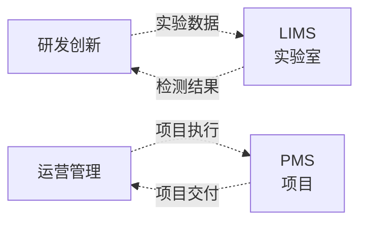

<!--
module:
  parent: application-systems
  slug: application-systems/06-specialized
  type: index
  category: 主模块子文章
  summary: 专项支持环节（LIMS · PMS）—— 通用价值链之外的专项系统，服务于特定行业或场景（实验室、项目管理）。
-->

# 06 专项支持

> 本章关注"通用价值链之外的专项系统"。这些系统服务于特定行业或场景（实验室、项目管理），不适用于所有企业，但一旦需要就不可替代。

## 📌 全景图

## 📋 专项系统速览

### LIMS（Laboratory Information Management System 实验室信息管理系统）

- **核心定位**：管理实验室样品、检测数据、报告、仪器、资源的信息系统，是实验室合规与数字化的核心
- **关键能力**：样品登记与流转 / 检测方法与结果录入 / 仪器连接与数据自动采集 / 报告生成与审核 / 合规（GLP/GMP/ISO 17025）
- **典型场景**：制药/化工研发实验室、环境监测/食品检测第三方实验室、医院/疾控临床检验
- **关键考量**：行业监管严格，合规要求决定选型

### PMS（Project Management System 项目管理系统）

- **核心定位**：管理项目全生命周期（立项、计划、执行、监控、收尾）的协作系统，是组织级项目协同的工具
- **关键能力**：任务分解（WBS）/ 甘特图 / 关键路径 / 资源分配与预算 / 风险与问题管理 / 协作（评论、@、文档）
- **典型场景**：工程类项目（土建、IT 集成、咨询）、研发项目（与 PLM 偏管理部分重叠）、营销/活动项目
- **关键考量**：与 OA/PLM 的边界需明确，避免重复录入

## 💡 本章小结

专项支持系统服务于特定场景。LIMS 偏实验室合规，PMS 偏项目协作。

## 📑 本组系统导航

| 系统 | 一句话定位 | 深读链接 |
|------|-----------|---------|
| LIMS | 实验室信息管理系统 | [LIMS 深读](./lims/) |
| PMS | 项目管理系统 | [PMS 深读](./pms/) |

← [返回: 业务应用系统](../README.md)
