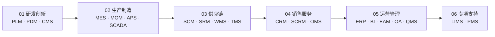
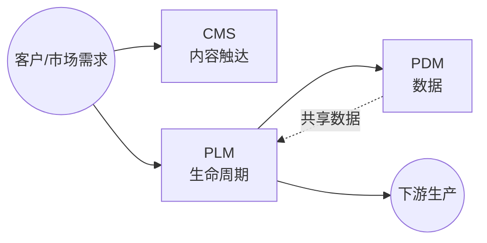
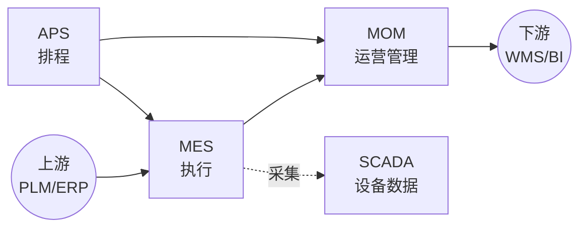
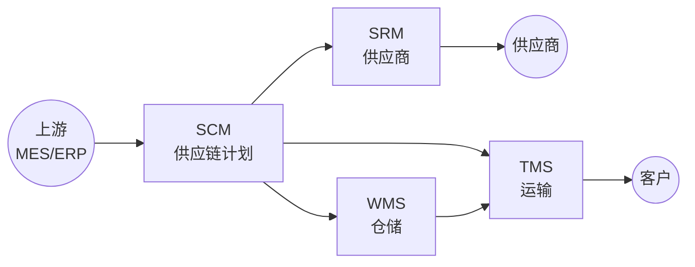
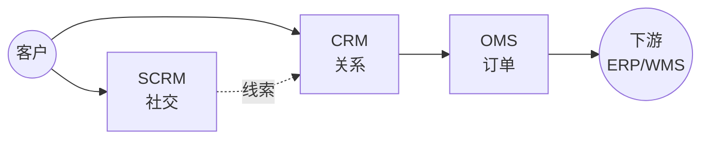

# 业务应用系统

> 一份按业务价值链梳理的业务系统速查手册，帮助业务/产品/需求人员快速建立完整的业务系统认知地图，并具备日常速查能力。
>
> 覆盖 21 个常见业务系统：MES · ERP · SCM · WMS · APS · SCADA · PLM · PDM · QMS · CRM · EAM · SRM · OMS · SCRM · OA · MOM · TMS · LIMS · CMS · BI · PMS

## 📑 目录

<!-- TODO: 由后续任务填充 -->

1. [🚀 快速入口](#-快速入口)
2. [🗺️ 业务价值链全景图](#-业务价值链全景图)
3. [01 研发创新（PLM · PDM · CMS）](#01-研发创新)
4. [02 生产制造（MES · MOM · APS · SCADA）](#02-生产制造)
5. [03 供应链（SCM · SRM · WMS · TMS）](#03-供应链)
6. [04 销售服务（CRM · SCRM · OMS）](#04-销售服务)
7. [05 运营管理（ERP · BI · EAM · OA · QMS）](#05-运营管理)
8. [06 专项支持（LIMS · PMS）](#06-专项支持)
9. [🔌 系统集成模式](#-系统集成模式)
10. [📋 系统速查表](#-系统速查表)
11. [🛤️ 学习路线](#-学习路线)

---

## 🚀 快速入口

| 你是谁 | 看什么 |
|---|---|
| 完全没接触过业务系统 | 业务价值链全景图 + [学习路线 - 入门段](#-学习路线)（5 分钟） |
| 已经听说过某系统 | [📋 系统速查表](#-系统速查表) 查到该系统所在价值链章节 |
| 想理解系统间怎么集成 | [🔌 系统集成模式](#-系统集成模式) |
| 想按业务问题查 | 按目录跳到对应价值链章节 |

---

## 🗺️ 业务价值链全景图

业务价值链从"研发创新"出发，经"生产制造 → 供应链 → 销售服务"，收敛到"运营管理"，最后挂载"专项支持"作为跨场景补充。

---

## 01 研发创新

> 本章关注"从产品创意到上市"阶段所需的能力与系统。研发是价值链的源头，决定了后续生产、供应链、销售的全部基础数据（BOM、图纸、工艺）。

### 📌 全景图

### 🔑 核心系统详讲

#### PLM（Product Lifecycle Management 产品生命周期管理）

- **定义**：管理产品从概念、设计、工艺、生产、销售到退役的全生命周期数据与流程的系统，是企业研发数字化的主干。
- **核心能力**：
  - 产品数据中央仓库（BOM、CAD 图纸、技术文档）
  - 工作流与审批（工程变更、签审流程）
  - 项目管理（项目计划、里程碑、资源）
  - 与 CAD/CAE/CAPP 工具集成
- **典型场景**：
  - 汽车/装备制造的新车型研发项目
  - 电子产品的多代产品演进管理
  - 工程变更（ECN）的全流程追溯
- **上下游关系**：
  - 上游：接 CRM（市场需求）、CMS（产品资料）
  - 下游：向 ERP 输出 BOM、向 MES 输出工艺路线
- **关键考量**：
  - 选型时关注与现有 CAD（SolidWorks/CATIA/UG）的兼容性
  - 数据治理（版本、权限、归档）是实施难点

#### PDM（Product Data Management 产品数据管理）

- **定义**：PLM 的核心子集，专注于产品数据本身（文档、图纸、零部件）的管理与组织，是 PLM 早期阶段的形态。
- **核心能力**：
  - 文档与图纸版本管理
  - 零部件库与结构管理（EBOM → MBOM）
  - 检索与权限
- **典型场景**：纯研发数据管理需求、企业 PDM 起步阶段
- **与 PLM 的关系**：PDM ⊂ PLM，PDM 管"数据"，PLM 管"数据 + 流程 + 资源"
- **历史脉络**（来自原 pdm/README.md 整合）：
  - 60-70 年代：CAD/CAM 单点工具 → 信息孤岛
  - 80 年代：与 CAD 集成的纯数据管理 PDM
  - 90 年代：加入工作流/变更/项目的过程集成 PDM
  - 90 年代末：跨企业协同 → 演化为 PLM
- **关键考量**：现代场景下单独上 PDM 较少，多作为 PLM 子模块实施

### 📋 其他系统速览

#### CMS（Content Management System 内容管理系统）

管理网站、博客、营销内容等的创建、编辑、发布。**适用场景**：产品官网、帮助文档、营销活动页。

### 💡 本章小结

研发创新环节的核心是 PLM/PDM（管产品数据），CMS（管内容触达）是辅助。本章输出"产品主数据"流向下一章"生产制造"。

---

## 02 生产制造

> 本章关注"把研发设计的产品制造出来"阶段所需的能力与系统。生产环节是制造型企业价值链的核心，决定交付能力、成本与质量。

### 📌 全景图

### 🔑 核心系统详讲

#### MES（Manufacturing Execution System 制造执行系统）

- **定义**：聚焦车间层的实时生产管理系统，把 ERP 的生产计划落地为工单并跟踪执行。
- **核心能力**：
  - 工单下达与调度
  - 生产进度实时跟踪（与 SCADA 集成）
  - 质量数据采集与追溯
  - 在制品（WIP）与设备状态
  - 物料齐套检查
- **典型场景**：
  - 离散制造（机械、电子）的车间管理
  - 流程制造（化工、食品）的批次管理
  - 多工厂、多车间的集中可视
- **上下游关系**：
  - 上游：接 ERP（工单/物料）、APS（排程）
  - 下游：向 WMS 报完工入库、向 BI 输出 OEE 数据
  - 横向：与 SCADA 集成采集设备数据
- **关键考量**：
  - 行业属性极强（离散 vs 流程 vs 混合），选型必须看行业模板
  - 与 ERP/PLM 的集成质量是实施成败关键

### 📋 其他系统速览

#### MOM（Manufacturing Operation Management 制造运营管理）

MOM 是 MES 的上位概念，覆盖制造运营全过程（生产、质量、维护、库存），MES 实际是 MOM 的执行子集。**适用场景**：集团级制造运营管控、MES + 周边系统一体化平台。

#### APS（Advanced Planning and Scheduling 高级计划与排程）

在 MRP 基础上做精细化排程（资源约束、工序顺序、换线时间），输出可执行的工时级计划。**适用场景**：多品种小批量、产能受限、订单优先级频繁调整。

#### SCADA（Supervisory Control And Data Acquisition 监督控制与数据采集）

监控和控制工业设备（PLC/DCS）并采集实时数据，是 MES 采集现场数据的"耳目"。**适用场景**：工业自动化产线、远程设备监控。

### 💡 本章小结

生产制造的核心是 MES（执行），MOM 是上位管理框架，APS 解决排程，SCADA 解决数据采集。本章输出"完工入库"事件给下游供应链。

---

## 03 供应链

> 本章关注"把产品送到客户手中"的全链路（计划→采购→仓储→运输）。供应链能力决定订单履约时效与成本。

### 📌 全景图

### 🔑 核心系统详讲

#### WMS（Warehouse Management System 仓储管理系统）

- **定义**：管理仓库作业（入库、上架、拣货、出库、盘点）的系统，是仓储数字化的核心。
- **核心能力**：
  - 库存实时准确（库位/批次/效期）
  - 作业策略（先进先出、批次管理、波次拣货）
  - 设备集成（条码枪/RFID/AGV/立体仓）
  - 盘点与差异处理
- **典型场景**：
  - 电商履约中心（日发百万单）
  - 制造业线边仓与中央仓
  - 三方物流（3PL）的多货主管理
- **上下游关系**：
  - 上游：接 ERP（入库指令）、MES（完工入库）
  - 下游：向 TMS 输出待运货物、向 BI 输出库存周转
- **关键考量**：
  - 与自动化设备（AGV/立体库）的深度集成是核心壁垒
  - 多货主/多仓/跨境场景复杂度差异大

### 📋 其他系统速览

#### SCM（Supply Chain Management 供应链管理）

覆盖从供应商到客户的端到端供应链计划（需求/供应/分销计划），与 ERP 共享物料和库存信息。**适用场景**：多级供应链协同、需求预测优化。

#### SRM（Supplier Relationship Management 供应商关系管理）

管理供应商全生命周期（寻源/资质/绩效/协同），与 ERP 互补，专注"供应商侧"深度管理。**适用场景**：供应商数量多、采购品类复杂的企业。

#### TMS（Transportation Management System 运输管理系统）

管理运输全过程（运力调度/路径规划/在途跟踪/签收回单），与 WMS 衔接发货环节。**适用场景**：自有车队、3PL 管理、多式联运。

### 💡 本章小结

供应链的核心是 WMS（仓储执行），SCM 管计划、SRM 管供应商、TMS 管运输，四者协同完成"原料入厂→成品送达客户"的全链路。

---

## 04 销售服务

> 本章关注"接触客户、达成交易、订单履约"阶段的系统。CRM 是客户主数据源，OMS 是订单履约协调器，SCRM 是社交化延伸。

### 📌 全景图

### 🔑 核心系统详讲

#### CRM（Customer Relationship Management 客户关系管理）

- **定义**：管理客户全生命周期（线索→商机→订单→服务→复购）的系统，是企业对外经营的主入口。
- **核心能力**：
  - 客户主数据（客户/联系人/账户视图）
  - 销售流程（线索、商机、报价、合同）
  - 营销自动化（活动、群发、归因）
  - 客户服务（工单、知识库）
- **典型场景**：
  - B2B 大客户销售（项目型销售过程管理）
  - B2C 零售（会员体系、营销自动化）
  - 售后服务（呼叫中心、现场服务）
- **上下游关系**：
  - 上游：接市场活动（广告投放、官网注册）
  - 下游：向 OMS 推送订单、向 ERP 同步客户主数据
- **关键考量**：
  - SaaS 化趋势明显（Salesforce/HubSpot/纷享销客）
  - 与营销工具（MA）、呼叫中心的对接是常见集成点

### 📋 其他系统速览

#### SCRM（Social Customer Relationship Management 社交化客户关系管理）

CRM 的社交化延伸，集成微信/小红书/抖音等社交触点，把"粉丝"转化为可运营客户。**适用场景**：消费品零售、网红营销、私域运营。

#### OMS（Order Management System 订单管理系统）

订单全生命周期管理（创建/拆分/合并/路由/状态），是连接 CRM 与 ERP/WMS/TMS 的中枢。**适用场景**：多渠道订单（电商+门店+经销商）统一管理。

### 💡 本章小结

销售服务的核心是 CRM（客户主数据），OMS 协调订单履约，SCRM 是社交化补充。本章输出"客户+订单"信息给运营管理章节的 ERP。

---

<!-- TODO: 由后续任务填充各章节 -->
