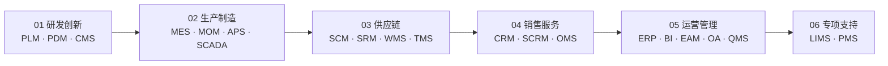

# 业务应用系统

> 一份按业务价值链梳理的业务系统速查手册，帮助业务/产品/需求人员快速建立完整的业务系统认知地图，并具备日常速查能力。
>
> 覆盖 21 个常见业务系统：MES · ERP · SCM · WMS · APS · SCADA · PLM · PDM · QMS · CRM · EAM · SRM · OMS · SCRM · OA · MOM · TMS · LIMS · CMS · BI · PMS

## 📑 目录

<!-- TODO: 由后续任务填充 -->

1. [🚀 快速入口](#-快速入口)
2. [🗺️ 业务价值链全景图](#-业务价值链全景图)
3. [01 研发创新（PLM · PDM · CMS）](#01-研发创新)
4. [02 生产制造（MES · MOM · APS · SCADA）](#02-生产制造)
5. [03 供应链（SCM · SRM · WMS · TMS）](#03-供应链)
6. [04 销售服务（CRM · SCRM · OMS）](#04-销售服务)
7. [05 运营管理（ERP · BI · EAM · OA · QMS）](#05-运营管理)
8. [06 专项支持（LIMS · PMS）](#06-专项支持)
9. [🔌 系统集成模式](#-系统集成模式)
10. [📋 系统速查表](#-系统速查表)
11. [🛤️ 学习路线](#-学习路线)

---

## 🚀 快速入口

| 你是谁 | 看什么 |
|---|---|
| 完全没接触过业务系统 | 业务价值链全景图 + [学习路线 - 入门段](#-学习路线)（5 分钟） |
| 已经听说过某系统 | [📋 系统速查表](#-系统速查表) 查到该系统所在价值链章节 |
| 想理解系统间怎么集成 | [🔌 系统集成模式](#-系统集成模式) |
| 想按业务问题查 | 按目录跳到对应价值链章节 |

---

## 🗺️ 业务价值链全景图

业务价值链从"研发创新"出发，经"生产制造 → 供应链 → 销售服务"，收敛到"运营管理"，最后挂载"专项支持"作为跨场景补充。

---

<!-- TODO: 由后续任务填充各章节 -->
