# 业务应用系统

> 一份按业务价值链梳理的业务系统速查手册，帮助业务/产品/需求人员快速建立完整的业务系统认知地图，并具备日常速查能力。
>
> 覆盖 21 个常见业务系统：MES · ERP · SCM · WMS · APS · SCADA · PLM · PDM · QMS · CRM · EAM · SRM · OMS · SCRM · OA · MOM · TMS · LIMS · CMS · BI · PMS

## 📑 目录

<!-- TODO: 由后续任务填充 -->

1. [🚀 快速入口](#-快速入口)
2. [🗺️ 业务价值链全景图](#-业务价值链全景图)
3. [01 研发创新（PLM · PDM · CMS）](#01-研发创新)
4. [02 生产制造（MES · MOM · APS · SCADA）](#02-生产制造)
5. [03 供应链（SCM · SRM · WMS · TMS）](#03-供应链)
6. [04 销售服务（CRM · SCRM · OMS）](#04-销售服务)
7. [05 运营管理（ERP · BI · EAM · OA · QMS）](#05-运营管理)
8. [06 专项支持（LIMS · PMS）](#06-专项支持)
9. [🔌 系统集成模式](#-系统集成模式)
10. [📋 系统速查表](#-系统速查表)
11. [🛤️ 学习路线](#-学习路线)

---

## 🚀 快速入口

| 你是谁 | 看什么 |
|---|---|
| 完全没接触过业务系统 | 业务价值链全景图 + [学习路线 - 入门段](#-学习路线)（5 分钟） |
| 已经听说过某系统 | [📋 系统速查表](#-系统速查表) 查到该系统所在价值链章节 |
| 想理解系统间怎么集成 | [🔌 系统集成模式](#-系统集成模式) |
| 想按业务问题查 | 按目录跳到对应价值链章节 |

---

## 🗺️ 业务价值链全景图

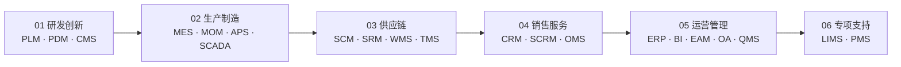

业务价值链从"研发创新"出发，经"生产制造 → 供应链 → 销售服务"，收敛到"运营管理"，最后挂载"专项支持"作为跨场景补充。

---

## 01 研发创新

> 本章关注"从产品创意到上市"阶段所需的能力与系统。研发是价值链的源头，决定了后续生产、供应链、销售的全部基础数据（BOM、图纸、工艺）。

### 📌 全景图

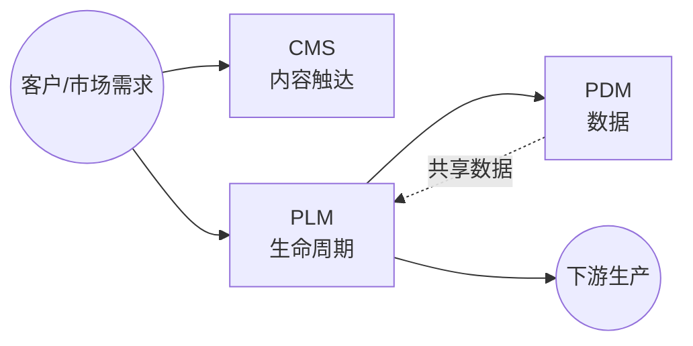

### 🔑 核心系统详讲

#### PLM（Product Lifecycle Management 产品生命周期管理）

- **定义**：管理产品从概念、设计、工艺、生产、销售到退役的全生命周期数据与流程的系统，是企业研发数字化的主干。
- **核心能力**：
  - 产品数据中央仓库（BOM、CAD 图纸、技术文档）
  - 工作流与审批（工程变更、签审流程）
  - 项目管理（项目计划、里程碑、资源）
  - 与 CAD/CAE/CAPP 工具集成
- **典型场景**：
  - 汽车/装备制造的新车型研发项目
  - 电子产品的多代产品演进管理
  - 工程变更（ECN）的全流程追溯
- **上下游关系**：
  - 上游：接 CRM（市场需求）、CMS（产品资料）
  - 下游：向 ERP 输出 BOM、向 MES 输出工艺路线
- **关键考量**：
  - 选型时关注与现有 CAD（SolidWorks/CATIA/UG）的兼容性
  - 数据治理（版本、权限、归档）是实施难点

#### PDM（Product Data Management 产品数据管理）

- **定义**：PLM 的核心子集，专注于产品数据本身（文档、图纸、零部件）的管理与组织，是 PLM 早期阶段的形态。
- **核心能力**：
  - 文档与图纸版本管理
  - 零部件库与结构管理（EBOM → MBOM）
  - 检索与权限
- **典型场景**：纯研发数据管理需求、企业 PDM 起步阶段
- **与 PLM 的关系**：PDM ⊂ PLM，PDM 管"数据"，PLM 管"数据 + 流程 + 资源"
- **历史脉络**（来自原 pdm/README.md 整合）：
  - 60-70 年代：CAD/CAM 单点工具 → 信息孤岛
  - 80 年代：与 CAD 集成的纯数据管理 PDM
  - 90 年代：加入工作流/变更/项目的过程集成 PDM
  - 90 年代末：跨企业协同 → 演化为 PLM
- **关键考量**：现代场景下单独上 PDM 较少，多作为 PLM 子模块实施

### 📋 其他系统速览

#### CMS（Content Management System 内容管理系统）

管理网站、博客、营销内容等的创建、编辑、发布。**适用场景**：产品官网、帮助文档、营销活动页。

### 💡 本章小结

研发创新环节的核心是 PLM/PDM（管产品数据），CMS（管内容触达）是辅助。本章输出"产品主数据"流向下一章"生产制造"。

---

## 02 生产制造

> 本章关注"把研发设计的产品制造出来"阶段所需的能力与系统。生产环节是制造型企业价值链的核心，决定交付能力、成本与质量。

### 📌 全景图

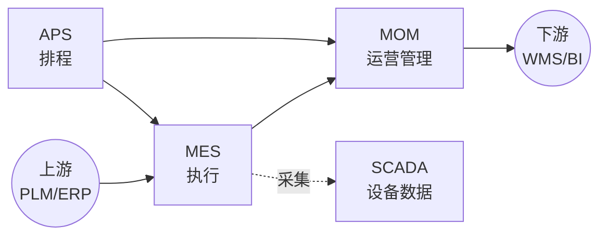

### 🔑 核心系统详讲

#### MES（Manufacturing Execution System 制造执行系统）

- **定义**：聚焦车间层的实时生产管理系统，把 ERP 的生产计划落地为工单并跟踪执行。
- **核心能力**：
  - 工单下达与调度
  - 生产进度实时跟踪（与 SCADA 集成）
  - 质量数据采集与追溯
  - 在制品（WIP）与设备状态
  - 物料齐套检查
- **典型场景**：
  - 离散制造（机械、电子）的车间管理
  - 流程制造（化工、食品）的批次管理
  - 多工厂、多车间的集中可视
- **上下游关系**：
  - 上游：接 ERP（工单/物料）、APS（排程）
  - 下游：向 WMS 报完工入库、向 BI 输出 OEE 数据
  - 横向：与 SCADA 集成采集设备数据
- **关键考量**：
  - 行业属性极强（离散 vs 流程 vs 混合），选型必须看行业模板
  - 与 ERP/PLM 的集成质量是实施成败关键

### 📋 其他系统速览

#### MOM（Manufacturing Operation Management 制造运营管理）

MOM 是 MES 的上位概念，覆盖制造运营全过程（生产、质量、维护、库存），MES 实际是 MOM 的执行子集。**适用场景**：集团级制造运营管控、MES + 周边系统一体化平台。

#### APS（Advanced Planning and Scheduling 高级计划与排程）

在 MRP 基础上做精细化排程（资源约束、工序顺序、换线时间），输出可执行的工时级计划。**适用场景**：多品种小批量、产能受限、订单优先级频繁调整。

#### SCADA（Supervisory Control And Data Acquisition 监督控制与数据采集）

监控和控制工业设备（PLC/DCS）并采集实时数据，是 MES 采集现场数据的"耳目"。**适用场景**：工业自动化产线、远程设备监控。

### 💡 本章小结

生产制造的核心是 MES（执行），MOM 是上位管理框架，APS 解决排程，SCADA 解决数据采集。本章输出"完工入库"事件给下游供应链。

---

## 03 供应链

> 本章关注"把产品送到客户手中"的全链路（计划→采购→仓储→运输）。供应链能力决定订单履约时效与成本。

### 📌 全景图

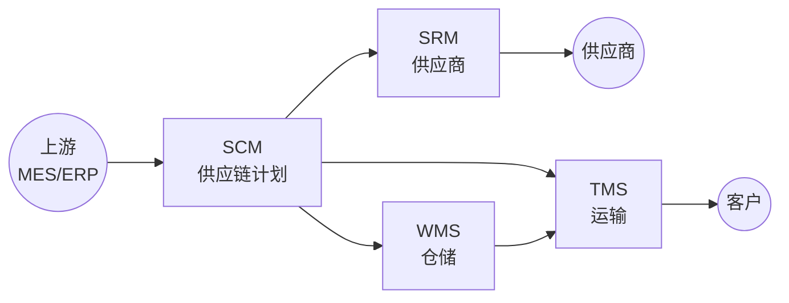

### 🔑 核心系统详讲

#### WMS（Warehouse Management System 仓储管理系统）

- **定义**：管理仓库作业（入库、上架、拣货、出库、盘点）的系统，是仓储数字化的核心。
- **核心能力**：
  - 库存实时准确（库位/批次/效期）
  - 作业策略（先进先出、批次管理、波次拣货）
  - 设备集成（条码枪/RFID/AGV/立体仓）
  - 盘点与差异处理
- **典型场景**：
  - 电商履约中心（日发百万单）
  - 制造业线边仓与中央仓
  - 三方物流（3PL）的多货主管理
- **上下游关系**：
  - 上游：接 ERP（入库指令）、MES（完工入库）
  - 下游：向 TMS 输出待运货物、向 BI 输出库存周转
- **关键考量**：
  - 与自动化设备（AGV/立体库）的深度集成是核心壁垒
  - 多货主/多仓/跨境场景复杂度差异大

### 📋 其他系统速览

#### SCM（Supply Chain Management 供应链管理）

覆盖从供应商到客户的端到端供应链计划（需求/供应/分销计划），与 ERP 共享物料和库存信息。**适用场景**：多级供应链协同、需求预测优化。

#### SRM（Supplier Relationship Management 供应商关系管理）

管理供应商全生命周期（寻源/资质/绩效/协同），与 ERP 互补，专注"供应商侧"深度管理。**适用场景**：供应商数量多、采购品类复杂的企业。

#### TMS（Transportation Management System 运输管理系统）

管理运输全过程（运力调度/路径规划/在途跟踪/签收回单），与 WMS 衔接发货环节。**适用场景**：自有车队、3PL 管理、多式联运。

### 💡 本章小结

供应链的核心是 WMS（仓储执行），SCM 管计划、SRM 管供应商、TMS 管运输，四者协同完成"原料入厂→成品送达客户"的全链路。

---

## 04 销售服务

> 本章关注"接触客户、达成交易、订单履约"阶段的系统。CRM 是客户主数据源，OMS 是订单履约协调器，SCRM 是社交化延伸。

### 📌 全景图

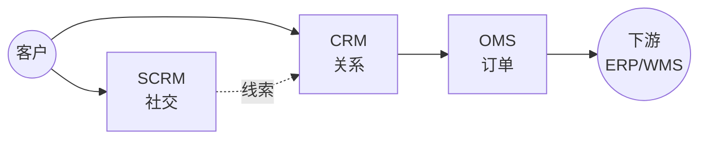

### 🔑 核心系统详讲

#### CRM（Customer Relationship Management 客户关系管理）

- **定义**：管理客户全生命周期（线索→商机→订单→服务→复购）的系统，是企业对外经营的主入口。
- **核心能力**：
  - 客户主数据（客户/联系人/账户视图）
  - 销售流程（线索、商机、报价、合同）
  - 营销自动化（活动、群发、归因）
  - 客户服务（工单、知识库）
- **典型场景**：
  - B2B 大客户销售（项目型销售过程管理）
  - B2C 零售（会员体系、营销自动化）
  - 售后服务（呼叫中心、现场服务）
- **上下游关系**：
  - 上游：接市场活动（广告投放、官网注册）
  - 下游：向 OMS 推送订单、向 ERP 同步客户主数据
- **关键考量**：
  - SaaS 化趋势明显（Salesforce/HubSpot/纷享销客）
  - 与营销工具（MA）、呼叫中心的对接是常见集成点

### 📋 其他系统速览

#### SCRM（Social Customer Relationship Management 社交化客户关系管理）

CRM 的社交化延伸，集成微信/小红书/抖音等社交触点，把"粉丝"转化为可运营客户。**适用场景**：消费品零售、网红营销、私域运营。

#### OMS（Order Management System 订单管理系统）

订单全生命周期管理（创建/拆分/合并/路由/状态），是连接 CRM 与 ERP/WMS/TMS 的中枢。**适用场景**：多渠道订单（电商+门店+经销商）统一管理。

### 💡 本章小结

销售服务的核心是 CRM（客户主数据），OMS 协调订单履约，SCRM 是社交化补充。本章输出"客户+订单"信息给运营管理章节的 ERP。

---

## 05 运营管理

> 本章关注"企业经营管理的核心系统"。ERP 是企业数字化的"中枢"，BI 提供决策支持，EAM/OA/QMS 是周边支撑。

### 📌 全景图

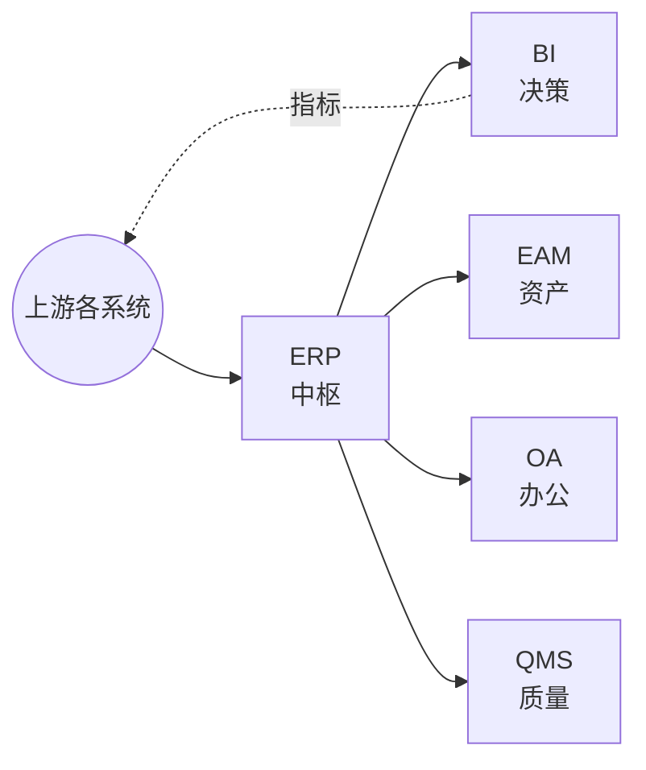

### 🔑 核心系统详讲

#### ERP（Enterprise Resource Planning 企业资源计划）

- **定义**：集成企业所有核心业务（财务、采购、库存、销售、生产）于一体的管理软件，是企业数字化的中枢。
- **核心功能模块**：
  - **财务模块**：总账、应收应付、固定资产、成本核算
  - **采购模块**：采购申请、订单、收货、发票、付款
  - **销售模块**：销售订单、发货、开票、收入确认
  - **库存模块**：入库、出库、调拨、盘点
  - **生产模块**：MRP 运算、工单、产能
  - **人力资源**：组织、薪酬、考勤（部分 ERP 含）
- **典型场景**：
  - 制造业（SAP S/4HANA、Oracle EBS、用友 U9、金蝶 EAS）
  - 商贸业（进销存 + 财务一体）
  - 服务业（项目型 ERP + 财务）
- **上下游关系**（ERP 是中枢，几乎所有系统都和 ERP 集成）：
  - 上游：接 CRM（订单）、SRM（采购订单）、MES（生产工单）
  - 下游：向 BI 输出财务/业务数据、向 BI 同步主数据
  - 横向：与 WMS/TMS/PLM/QMS 等深度集成
- **关键考量**：
  - **行业属性强**：制造业 ERP 不能简单套用到服务业
  - **实施周期长**：6-18 个月，必须有强项目管理
  - **数据迁移**：历史数据清洗是头号风险
  - **二次开发**：要警惕厂商绑定

### 📋 其他系统速览

#### BI（Business Intelligence 商业智能）

提供数据分析、报表、可视化能力，支持管理决策。**适用场景**：管理驾驶舱、自助分析、数据驱动决策。

#### EAM（Enterprise Asset Management 企业资产管理）

管理物理资产（设备、设施）的全生命周期，侧重维护（预防性维护、检修工单）。**适用场景**：资产密集行业（电力、轨交、物业）。

#### OA（Office Automation 办公自动化）

管理行政办公流程（审批、文档、协同），国内代表有泛微、致远、钉钉/企业微信。**适用场景**：企业内部流程审批、文档协作。

#### QMS（Quality Management System 质量管理系统）

管理产品质量（来料/过程/成品检验、不良品处理、质量分析），是合规与品牌保障。**适用场景**：制造业（IATF 16949）、食品医药（GMP）。

### 💡 本章小结

运营管理的核心是 ERP（中枢），BI 给决策者看数据，EAM/OA/QMS 是企业运营不同侧面的支撑。本章把整条价值链的数据汇聚成可衡量、可管控的经营指标。

---

## 06 专项支持

> 本章关注"通用价值链之外的专项系统"。这些系统服务于特定行业或场景（实验室、项目管理），不适用于所有企业，但一旦需要就不可替代。

### 📌 全景图

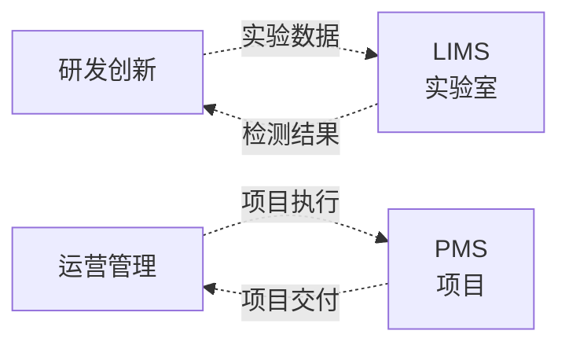

### 📋 专项系统速览

#### LIMS（Laboratory Information Management System 实验室信息管理系统）

- **定义**：管理实验室样品、检测数据、报告、仪器、资源的信息系统。
- **核心能力**：
  - 样品登记与流转（接收、分配、检测、归档）
  - 检测方法与结果录入
  - 仪器连接与数据自动采集
  - 报告生成与审核
  - 合规（GLP/GMP/ISO 17025）
- **典型场景**：
  - 制药/化工的研发实验室
  - 环境监测/食品检测的第三方实验室
  - 医院/疾控的临床检验
- **关键考量**：行业监管严格，合规要求决定选型

#### PMS（Project Management System 项目管理系统）

- **定义**：管理项目全生命周期（立项、计划、执行、监控、收尾）的协作系统。
- **核心能力**：
  - 任务分解（WBS）、甘特图、关键路径
  - 资源分配、预算、进度跟踪
  - 风险与问题管理
  - 协作（评论、@提及、文档共享）
- **典型场景**：
  - 工程类项目（土建、IT 集成、咨询）
  - 研发项目（与 PLM 部分重叠，但 PMS 偏管理、PLM 偏数据）
  - 营销/活动项目
- **关键考量**：与 OA/PLM 的边界需明确，避免重复录入

### 💡 本章小结

专项支持系统服务于特定场景。LIMS 偏实验室合规，PMS 偏项目协作。

---

## 🔌 系统集成模式

> 业务系统从来不是孤立的——它们需要"对话"。本章讲解系统间如何集成，从最底层的"通信方式"到上层的"组织模式"再到具体的"主链场景"。

### 集成方式（"怎么连"）

| 方式 | 特点 | 典型场景 |
|---|---|---|
| **API/REST** | 同步、实时、契约清晰 | 现代云原生系统、跨企业开放接口 |
| **消息队列** | 异步、解耦、削峰 | 高并发场景（Kafka/RabbitMQ）、事件驱动 |
| **中间件/ESB** | 集中路由、协议转换 | 传统企业集成（IBM Integration Bus/MuleSoft/自研） |
| **文件交换/EDI** | 跨企业、跨行业、批处理 | 供应链上下游（EDI 标准）、银企直联 |
| **数据库直连** | 应急/过渡方案 | 不推荐生产环境；老系统接口缺失时的临时方案 |

### 集成模式（"怎么组织"）

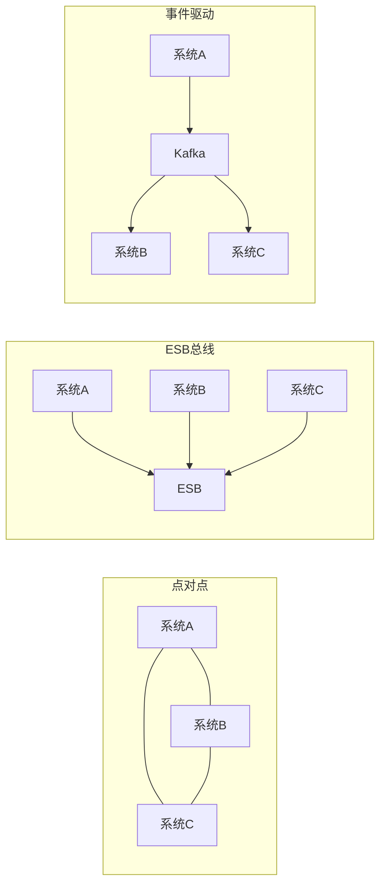

| 模式 | 优点 | 缺点 | 适用 |
|---|---|---|---|
| **点对点** | 简单直接 | 难维护、网状依赖 | 系统数量少（≤3） |
| **ESB 总线** | 集中管控、协议转换 | 单点故障、贵 | 传统大型企业 |
| **事件驱动** | 松耦合、可扩展 | 事件溯源难 | 现代微服务/云原生 |
| **主数据管理（MDM）** | 先治理数据再集成 | 实施重 | 数据标准不统一的大型企业 |

### 关键集成场景

#### 订单主链

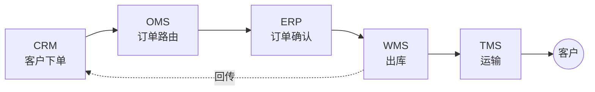

#### 供应链主链

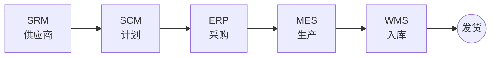

#### 数据主链（产品数据从研发到决策）

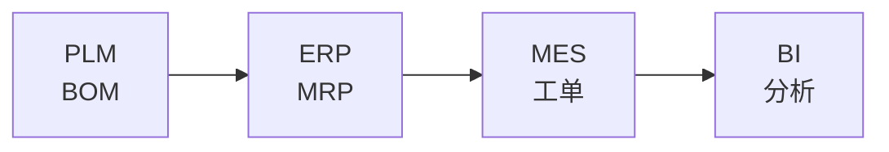

---

## 📋 系统速查表

21 个系统按缩写字母排序：

| 缩写 | 全称 | 一句话定位 | 价值链章节 |
|---|---|---|---|
| APS | Advanced Planning and Scheduling | 高级计划与排程 | 02 生产制造 |
| BI | Business Intelligence | 商业智能/数据分析 | 05 运营管理 |
| CMS | Content Management System | 内容管理 | 01 研发创新 |
| CRM | Customer Relationship Management | 客户关系管理 | 04 销售服务 |
| EAM | Enterprise Asset Management | 企业资产管理 | 05 运营管理 |
| ERP | Enterprise Resource Planning | 企业资源计划（核心） | 05 运营管理 |
| LIMS | Laboratory Information Management System | 实验室信息管理 | 06 专项支持 |
| MES | Manufacturing Execution System | 制造执行系统 | 02 生产制造 |
| MOM | Manufacturing Operation Management | 制造运营管理 | 02 生产制造 |
| OA | Office Automation | 办公自动化 | 05 运营管理 |
| OMS | Order Management System | 订单管理 | 04 销售服务 |
| PDM | Product Data Management | 产品数据管理 | 01 研发创新 |
| PLM | Product Lifecycle Management | 产品生命周期管理 | 01 研发创新 |
| PMS | Project Management System | 项目管理 | 06 专项支持 |
| QMS | Quality Management System | 质量管理 | 05 运营管理 |
| SCADA | Supervisory Control And Data Acquisition | 设备监控与数据采集 | 02 生产制造 |
| SCRM | Social Customer Relationship Management | 社交化客户关系 | 04 销售服务 |
| SCM | Supply Chain Management | 供应链管理 | 03 供应链 |
| SRM | Supplier Relationship Management | 供应商关系管理 | 03 供应链 |
| TMS | Transportation Management System | 运输管理 | 03 供应链 |
| WMS | Warehouse Management System | 仓储管理 | 03 供应链 |

---

## 🛤️ 学习路线

### 入门（1-2 天）

1. [🗺️ 业务价值链全景图](#-业务价值链全景图) — 5 分钟建立全局观
2. [ERP 详讲](#erpenterprise-resource-planning-企业资源计划) — 最核心、最容易遇到
3. [CRM 详讲](#crmcustomer-relationship-management-客户关系管理) — 最常见的需求来源

### 进阶（3-5 天）

4. [MES 详讲](#mesmanufacturing-execution-system-制造执行系统) — 制造企业的命脉
5. [PLM 详讲](#plmproduct-lifecycle-management-产品生命周期管理) — 研发数字化主干
6. [WMS 详讲](#wmswarehouse-management-system-仓储管理系统) — 物流与电商核心
7. [🔌 系统集成模式](#-系统集成模式) — 理解系统间怎么对话
8. [📋 系统速查表](#-系统速查表) — 日常查询

### 高级（专项深入）

9. MOM + SCADA — 智能制造方向
10. SRM + APS — 供应链优化方向
11. BI — 数据驱动决策方向

---
