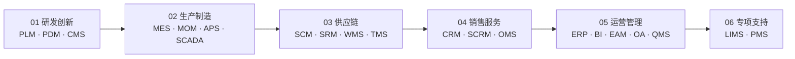
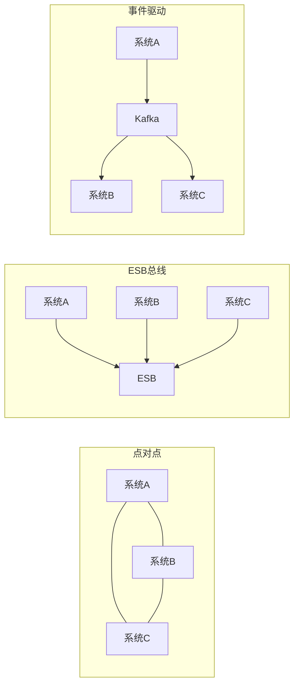
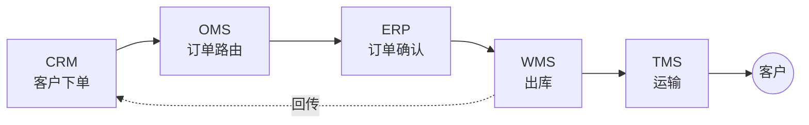
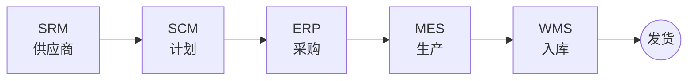
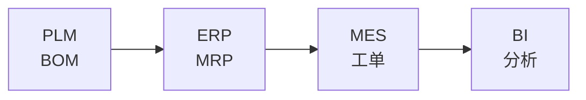

<!--
module:
  number: 08
  slug: application-systems
  topic: 业务应用系统速查
  audience: 业务 / PM / 需求
  category: 主模块
  summary: 一份按业务价值链梳理的业务系统速查手册，帮助业务/产品/需求人员快速建立完整的业务系统认知地图，并具备日常速查能力。
-->

# 业务应用系统

> 一份按业务价值链梳理的业务系统速查手册，帮助业务/产品/需求人员快速建立完整的业务系统认知地图，并具备日常速查能力。
>
> 覆盖 21 个常见业务系统：MES · ERP · SCM · WMS · APS · SCADA · PLM · PDM · QMS · CRM · EAM · SRM · OMS · SCRM · OA · MOM · TMS · LIMS · CMS · BI · PMS

## 📑 目录

1. [🚀 快速入口](#-快速入口)
2. [🗺️ 业务价值链全景图](#-业务价值链全景图)
3. [6 大价值链分组](#-6-大价值链分组)
4. [🔌 系统集成模式](#-系统集成模式)
5. [📋 系统速查表](#-系统速查表)
6. [🏆 最佳实践](#-最佳实践)
7. [🛤️ 学习路线](#-学习路线)

---

## 🚀 快速入口

| 你是谁 | 看什么 |
|---|---|
| 完全没接触过业务系统 | 业务价值链全景图 + [学习路线 - 入门段](#-学习路线)（5 分钟） |
| 已经听说过某系统 | [📋 系统速查表](#-系统速查表) 查到该系统所在价值链章节 |
| 想理解系统间怎么集成 | [🔌 系统集成模式](#-系统集成模式) |
| 想按业务问题查 | 按目录跳到对应价值链章节 |

---

## 🗺️ 业务价值链全景图

业务价值链从"研发创新"出发，经"生产制造 → 供应链 → 销售服务"，收敛到"运营管理"，最后挂载"专项支持"作为跨场景补充。

---

## 📂 6 大价值链分组

| 编号 | 分组 | 系统 | 深读链接 |
|------|------|------|---------|
| 01 | [研发创新](./01-rd-innovation/README.md) | PLM · PDM · CMS | [PLM](./01-rd-innovation/plm/) · [PDM](./01-rd-innovation/pdm/) · [CMS](./01-rd-innovation/cms/) |
| 02 | [生产制造](./02-production/README.md) | MES · MOM · APS · SCADA | [MES](./02-production/mes/) · [MOM](./02-production/mom/) · [APS](./02-production/aps/) · [SCADA](./02-production/scada/) |
| 03 | [供应链](./03-supply-chain/README.md) | SCM · SRM · WMS · TMS | [SCM](./03-supply-chain/scm/) · [SRM](./03-supply-chain/srm/) · [WMS](./03-supply-chain/wms/) · [TMS](./03-supply-chain/tms/) |
| 04 | [销售服务](./04-sales-service/README.md) | CRM · SCRM · OMS | [CRM](./04-sales-service/crm/) · [SCRM](./04-sales-service/scrm/) · [OMS](./04-sales-service/oms/) |
| 05 | [运营管理](./05-operations/README.md) | ERP · BI · EAM · OA · QMS | [ERP](./05-operations/erp/) · [BI](./05-operations/bi/) · [EAM](./05-operations/eam/) · [OA](./05-operations/oa/) · [QMS](./05-operations/qms/) |
| 06 | [专项支持](./06-specialized/README.md) | LIMS · PMS | [LIMS](./06-specialized/lims/) · [PMS](./06-specialized/pms/) |

---

## 🔌 系统集成模式

> 业务系统从来不是孤立的——它们需要"对话"。本章讲解系统间如何集成，从最底层的"通信方式"到上层的"组织模式"再到具体的"主链场景"。

### 集成方式（"怎么连"）

- **API/REST**：同步、实时、契约清晰 — 现代云原生系统、跨企业开放接口
- **消息队列**：异步、解耦、削峰 — 高并发场景（Kafka/RabbitMQ）、事件驱动
- **中间件/ESB**：集中路由、协议转换 — 传统企业集成（IBM Integration Bus/MuleSoft/自研）
- **文件交换/EDI**：跨企业、跨行业、批处理 — 供应链上下游（EDI 标准）、银企直联
- **数据库直连**：应急/过渡方案 — 不推荐生产环境（老系统接口缺失时临时用）

### 集成模式（"怎么组织"）

| 模式 | 适用 |
|---|---|
| **点对点** | 系统数量少（≤3），简单直接 |
| **ESB 总线** | 传统大型企业，集中管控/协议转换 |
| **事件驱动** | 现代微服务/云原生，松耦合可扩展 |
| **主数据管理（MDM）** | 数据标准不统一的大型企业，先治理再集成 |

### 关键集成场景

#### 订单主链

#### 供应链主链

#### 数据主链（PLM→BI）

---

## 📋 系统速查表

| 缩写 | 全称 | 一句话定位 | 价值链分组 | 📚 深读 |
|---|---|---|---|---|
| APS | Advanced Planning and Scheduling | 高级计划与排程 | 02 生产制造 | — |
| BI | Business Intelligence | 商业智能/数据分析 | 05 运营管理 | — |
| CMS | Content Management System | 内容管理 | 01 研发创新 | — |
| CRM | Customer Relationship Management | 客户关系管理 | 04 销售服务 | [深读](./04-sales-service/crm/) |
| EAM | Enterprise Asset Management | 企业资产管理 | 05 运营管理 | — |
| ERP | Enterprise Resource Planning | 企业资源计划（核心） | 05 运营管理 | [深读](./05-operations/erp/) |
| LIMS | Laboratory Information Management System | 实验室信息管理 | 06 专项支持 | — |
| MES | Manufacturing Execution System | 制造执行系统 | 02 生产制造 | [深读](./02-production/mes/) |
| MOM | Manufacturing Operation Management | 制造运营管理 | 02 生产制造 | — |
| OA | Office Automation | 办公自动化 | 05 运营管理 | — |
| OMS | Order Management System | 订单管理 | 04 销售服务 | — |
| PDM | Product Data Management | 产品数据管理 | 01 研发创新 | [深读](./01-rd-innovation/pdm/) |
| PLM | Product Lifecycle Management | 产品生命周期管理 | 01 研发创新 | [深读](./01-rd-innovation/plm/) |
| PMS | Project Management System | 项目管理 | 06 专项支持 | — |
| QMS | Quality Management System | 质量管理 | 05 运营管理 | — |
| SCADA | Supervisory Control And Data Acquisition | 设备监控与数据采集 | 02 生产制造 | — |
| SCRM | Social Customer Relationship Management | 社交化客户关系 | 04 销售服务 | — |
| SCM | Supply Chain Management | 供应链管理 | 03 供应链 | — |
| SRM | Supplier Relationship Management | 供应商关系管理 | 03 供应链 | — |
| TMS | Transportation Management System | 运输管理 | 03 供应链 | — |
| WMS | Warehouse Management System | 仓储管理 | 03 供应链 | [深读](./03-supply-chain/wms/) |

---

## 🏆 最佳实践

| 场景 | 实践要点 |
|------|---------|
| **系统选型** | 先明确业务价值链位置（研发/生产/供应链/销售/运营）；中小企业用一体化 ERP（SAP/用友/金蝶）；制造业核心抓 MES + WMS |
| **系统集成** | 优先 API 网关统一入口；异步场景用消息队列（Kafka/RabbitMQ）；跨系统数据同步用 CDC（Canal/Debezium） |
| **数据流设计** | 主数据管理（MDM）统一编码；ETL/ELT 工具（DataX/Flink CDC）分层处理；数据血缘可追溯 |
| **实施方法论** | 分阶段上线（先核心再扩展）；蓝图设计 → 配置开发 → 集成测试 → 上线切换 → 持续优化 |
| **国产化替代** | ERP → 用友/金蝶/浪潮；MES → 盘古/摩尔元山；数据库 → TiDB/OceanBase；中间件 → RocketMQ/Nacos |

---

## 🛤️ 学习路线

- **入门（1-2 天）**：[业务价值链全景图](#-业务价值链全景图) → [05 运营管理 ERP](./05-operations/erp/README.md) → [04 销售服务 CRM](./04-sales-service/crm/README.md)
- **进阶（3-5 天）**：[02 生产制造 MES](./02-production/mes/README.md) → [01 研发创新 PLM](./01-rd-innovation/plm/README.md) → [03 供应链 WMS](./03-supply-chain/wms/README.md) → [系统集成模式](#-系统集成模式) → [系统速查表](#-系统速查表)
- **高级（专项深入）**：MOM+SCADA（智能制造）/ SRM+APS（供应链优化）/ BI（数据驱动决策）

### 高级（专项深入）

9. MOM + SCADA — 智能制造方向
10. SRM + APS — 供应链优化方向
11. BI — 数据驱动决策方向

---

## 相关章节

- 技术实现：[`06.spring`](../06.spring/README.md) — 业务系统的 Java/Spring 技术栈
- 数据层：[`03.database`](../03.database/README.md) — 业务系统的数据存储、事务、缓存设计
- 架构设计：[`04.system-design`](../04.system-design/README.md) — 分布式、高可用、高性能设计模式
- 流程引擎：[`07.workflow`](../07.workflow/README.md) — BPMN 工作流（ERP/MES/CRM 中的审批流、业务流）
- 大数据：[`10.big-data`](../10.big-data/README.md) — 数据仓库、BI、数据治理（支撑 BI/ERP 数据分析）
- 前端：[`09.front-end`](../09.front-end/README.md) — 业务系统前端工程化
- 深化：[`13.split-hairs`](../13.split-hairs/README.md) — 高频面试题（系统设计、数据库等）

---

## 开源参考（21 业务系统的开源实现）

| 业务系统 | 开源参考 | 说明 |
|---------|---------|------|
| **ERP** | [odoo](https://github.com/odoo/odoo)、[ERPNext](https://github.com/frappe/erpnext) | Python 生态企业资源计划 |
| **MES / MOM** | [Apache OFBiz](https://ofbiz.apache.org) | Java 制造执行 / 制造运营 |
| **SCM** | [Apache Bloodhound](https://bloodhound.apache.org) | 缺陷追踪 / 任务管理 |
| **WMS** | [Openboxes](https://github.com/openboxes/openboxes) | 开源仓库管理 |
| **APS** | [Slickplan](https://slickplan.com) | 高级计划排程 |
| **SCADA** | [OpenSCADA](http://oscada.org) | 数据采集与监控 |
| **PLM / PDM** | [OpenPLM](https://sourceforge.net/projects/openplm) | 产品生命周期管理 |
| **QMS** | [OpenQuality](https://github.com/nicolargo/openquality) | 质量管理系统 |
| **CRM / SCRM** | [SuiteCRM](https://github.com/salesagility/SuiteCRM)、[EspoCRM](https://github.com/espocrm/espocrm) | 客户关系管理 |
| **EAM** | [OpenEAM](https://openeam.org) | 设备资产管理 |
| **OA** | [JeecgBoot](https://github.com/jeecgboot/JeecgBoot)、[RuoYi](https://github.com/yangzongzhuan/RuoYi) | 协同办公（中文主流） |
| **CMS** | [WordPress](https://wordpress.org)、[Halo](https://github.com/halo-dev/halo) | 内容管理 |
| **BI** | [Superset](https://github.com/apache/superset)、[Metabase](https://github.com/metabase/metabase) | 商业智能分析 |
| **PMS** | [OpenProject](https://www.openproject.org)、[Tuleap](https://tuleap.org) | 项目管理 |

---

← [返回笔记目录](../README.md)
