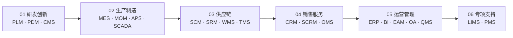
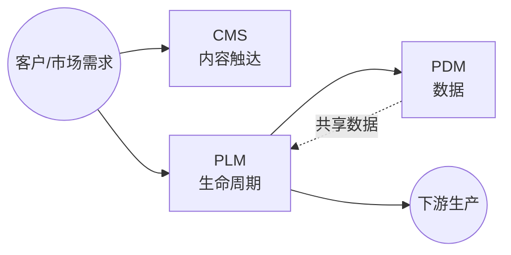

# 业务应用系统

> 一份按业务价值链梳理的业务系统速查手册，帮助业务/产品/需求人员快速建立完整的业务系统认知地图，并具备日常速查能力。
>
> 覆盖 21 个常见业务系统：MES · ERP · SCM · WMS · APS · SCADA · PLM · PDM · QMS · CRM · EAM · SRM · OMS · SCRM · OA · MOM · TMS · LIMS · CMS · BI · PMS

## 📑 目录

<!-- TODO: 由后续任务填充 -->

1. [🚀 快速入口](#-快速入口)
2. [🗺️ 业务价值链全景图](#-业务价值链全景图)
3. [01 研发创新（PLM · PDM · CMS）](#01-研发创新)
4. [02 生产制造（MES · MOM · APS · SCADA）](#02-生产制造)
5. [03 供应链（SCM · SRM · WMS · TMS）](#03-供应链)
6. [04 销售服务（CRM · SCRM · OMS）](#04-销售服务)
7. [05 运营管理（ERP · BI · EAM · OA · QMS）](#05-运营管理)
8. [06 专项支持（LIMS · PMS）](#06-专项支持)
9. [🔌 系统集成模式](#-系统集成模式)
10. [📋 系统速查表](#-系统速查表)
11. [🛤️ 学习路线](#-学习路线)

---

## 🚀 快速入口

| 你是谁 | 看什么 |
|---|---|
| 完全没接触过业务系统 | 业务价值链全景图 + [学习路线 - 入门段](#-学习路线)（5 分钟） |
| 已经听说过某系统 | [📋 系统速查表](#-系统速查表) 查到该系统所在价值链章节 |
| 想理解系统间怎么集成 | [🔌 系统集成模式](#-系统集成模式) |
| 想按业务问题查 | 按目录跳到对应价值链章节 |

---

## 🗺️ 业务价值链全景图

业务价值链从"研发创新"出发，经"生产制造 → 供应链 → 销售服务"，收敛到"运营管理"，最后挂载"专项支持"作为跨场景补充。

---

## 01 研发创新

> 本章关注"从产品创意到上市"阶段所需的能力与系统。研发是价值链的源头，决定了后续生产、供应链、销售的全部基础数据（BOM、图纸、工艺）。

### 📌 全景图

### 🔑 核心系统详讲

#### PLM（Product Lifecycle Management 产品生命周期管理）

- **定义**：管理产品从概念、设计、工艺、生产、销售到退役的全生命周期数据与流程的系统，是企业研发数字化的主干。
- **核心能力**：
  - 产品数据中央仓库（BOM、CAD 图纸、技术文档）
  - 工作流与审批（工程变更、签审流程）
  - 项目管理（项目计划、里程碑、资源）
  - 与 CAD/CAE/CAPP 工具集成
- **典型场景**：
  - 汽车/装备制造的新车型研发项目
  - 电子产品的多代产品演进管理
  - 工程变更（ECN）的全流程追溯
- **上下游关系**：
  - 上游：接 CRM（市场需求）、CMS（产品资料）
  - 下游：向 ERP 输出 BOM、向 MES 输出工艺路线
- **关键考量**：
  - 选型时关注与现有 CAD（SolidWorks/CATIA/UG）的兼容性
  - 数据治理（版本、权限、归档）是实施难点

#### PDM（Product Data Management 产品数据管理）

- **定义**：PLM 的核心子集，专注于产品数据本身（文档、图纸、零部件）的管理与组织，是 PLM 早期阶段的形态。
- **核心能力**：
  - 文档与图纸版本管理
  - 零部件库与结构管理（EBOM → MBOM）
  - 检索与权限
- **典型场景**：纯研发数据管理需求、企业 PDM 起步阶段
- **与 PLM 的关系**：PDM ⊂ PLM，PDM 管"数据"，PLM 管"数据 + 流程 + 资源"
- **历史脉络**（来自原 pdm/README.md 整合）：
  - 60-70 年代：CAD/CAM 单点工具 → 信息孤岛
  - 80 年代：与 CAD 集成的纯数据管理 PDM
  - 90 年代：加入工作流/变更/项目的过程集成 PDM
  - 90 年代末：跨企业协同 → 演化为 PLM
- **关键考量**：现代场景下单独上 PDM 较少，多作为 PLM 子模块实施

### 📋 其他系统速览

#### CMS（Content Management System 内容管理系统）

管理网站、博客、营销内容等的创建、编辑、发布。**适用场景**：产品官网、帮助文档、营销活动页。

### 💡 本章小结

研发创新环节的核心是 PLM/PDM（管产品数据），CMS（管内容触达）是辅助。本章输出"产品主数据"流向下一章"生产制造"。

---

<!-- TODO: 由后续任务填充各章节 -->
