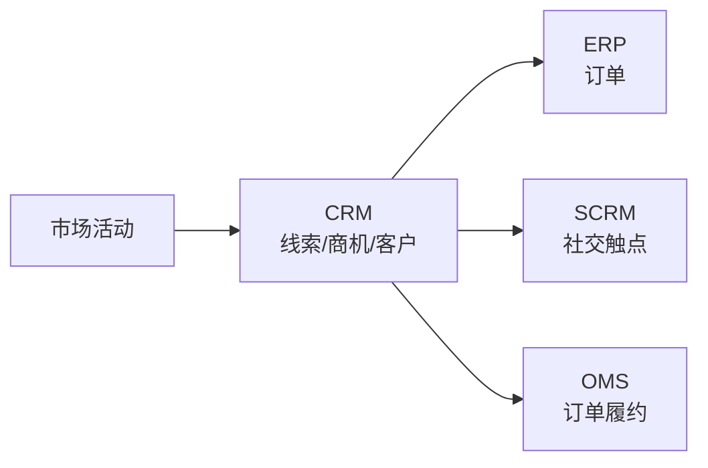
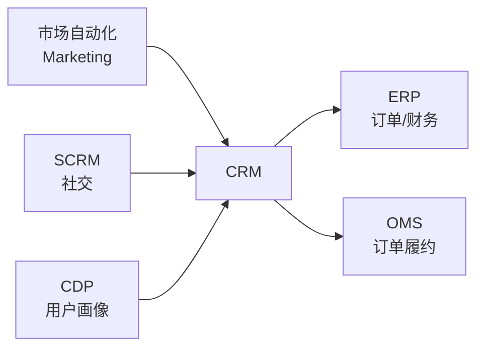

# CRM（Customer Relationship Management 客户关系管理）

## 引言：反直觉代码（[AUTO] 自动生成，待人工 review）

CRM（Customer Relationship Management 客户关系管理） 本应该很简单，一句话定位：以客户全生命周期为主线的管理与运营平台，覆盖营销获客 → 销售转化 → 客户成功 → 续费/流失的完整链路，是企业对外经营的主入口

**但实际**：面试/生产中常被问起或踩坑的是——
代码看着对、跑起来对，但仔细一问深一层就漏馅。本篇就从'反直觉'这个角度切入，把踩坑点和根因摆出来。

> 📌 本段由 `note/scripts/add-intro.py` 自动生成（场景模板 + README 摘录）。**下次 review 时请改为真实场景 + 数字 + 反思**，目前仅满足'有引言'的最低要求。

---

> 一句话定位：以客户全生命周期为主线的管理与运营平台，覆盖营销获客 → 销售转化 → 客户成功 → 续费/流失的完整链路，是企业对外经营的主入口。

## 📌 全景图

## 📖 定义

CRM（Customer Relationship Management 客户关系管理）是以**客户全生命周期**为主线的管理与运营平台，覆盖营销获客 → 销售转化 → 客户成功 → 续费/流失的完整链路。

**三类 CRM**：
- **传统 CRM（操作型）**：销售自动化（SFA）、客户主数据管理。Salesforce / 微软 Dynamics
- **分析型 CRM**：客户数据平台（CDP）、用户画像、精准营销
- **协同型 CRM（SCRM）**：社交化客户管理（微信生态/小红书/抖音），见 [SCRM 简讲](../README.md#04-销售服务)

**与 ERP/OMS 的边界**：CRM 管「机会与客户」到「订单生成」；ERP 管「订单履约」；OMS（订单管理系统）管「订单路由与拆分」。CRM 输出订单给 ERP/OMS。

**在企业 IT 架构中的位置**：CRM 是企业对外经营的"客户主数据源"，与 ERP（订单/财务）、SCRM（社交触点）、CDP（用户画像）共同构成"客户运营"链路。Gartner 将 CRM 归为"前端办公（Front-Office）"系统的核心，与 ERP 的"后端办公（Back-Office）"形成镜像。CRM 是企业从"产品中心"向"客户中心"转型的 IT 抓手。

**典型数据量级**：成熟 CRM 系统的数据量通常在 **100GB-10TB** 区间（量级参考，取决于客户规模与历史积累）。客户主数据、商机历史、行为日志是主要占用项；活跃用户从十人到上万人（典型中小企业 50-500，大型集团 1000-10000）。日均数据增量在 GB 级，与 SCRM/CDP 集成后数据量会显著放大。

**与其他客户运营系统的边界**：
- **CRM**：管「结构化客户主数据 + 销售流程」（Account / Contact / Lead / Opportunity）
- **SCRM**：管「社交触点行为」（公众号/企微/抖音互动数据）
- **CDP**：管「跨渠道用户画像与标签」（OneID 打通 + 行为序列）
- **MA（Marketing Automation）**：管「营销自动化触达」（邮件/短信/推送的 campaign 执行）

四者关系：CDP 沉淀用户画像 → SCRM/MA 拉画像做触达 → 触达产生的线索回流 CRM → CRM 走销售流程 → 成交后客户数据反哺 CDP。

## 🔧 核心能力

- **客户主数据（Account/Contact）**：客户档案、联系人、关系图谱
- **销售自动化（SFA）**：线索（Lead）→ 商机（Opportunity）→ 报价（Quote）→ 合同（Contract）→ 订单（Order）的漏斗
- **市场自动化（Marketing Automation）**：邮件营销、落地页、培育活动
- **客户服务（Service）**：工单（Case）、知识库、SLA 管理
- **客户成功（CS）**：续费提醒、健康度评分、扩张商机
- **数据分析**：销售预测、客户分群、渠道 ROI
- **流程自动化**：审批流、提醒、跨部门协作

**按 CRM 成熟度分级的功能深度**（行业参考框架）：
- **L1 基础**：客户主数据 + 销售漏斗 + 简单报表
- **L2 标准**：市场自动化 + 工单服务 + 移动端
- **L3 高级**：客户成功模块 + AI 销售预测 + 跨部门流程
- **L4 卓越**：与 ERP/OMS/SCRM/CDP 深度集成 + 全渠道客户视图
- **L5 生态**：AI 商机推荐 + 客户旅程编排 + 实时个性化

按企业关注度排序，CRM 最常被列为「核心采购理由」的前 5 项是：客户主数据统一、销售流程自动化、移动端体验、市场自动化、与 ERP/OMS 的集成。

**销售漏斗的「L→O→Q→C→O」五段式**：这是 CRM 最经典的过程管理框架，每一段都有明确的业务动作与数据产物：
- **L（Lead 线索）**：未经资格认证的潜在客户，来源包含官网注册、广告下载、陌拜名单、社交触点
- **O1（Opportunity 商机）**：经销售确认有购买意向的线索，绑定到具体客户/联系人/产品
- **Q（Quote 报价）**：针对商机出具的产品/价格/折扣/条款报价单
- **C（Contract 合同）**：经过法务/财务审批的正式合同，与报价关联
- **O2（Order 订单）**：合同执行产生的订单，向 ERP/OMS 推送

**客户视图的 360° 拼接**：现代 CRM 强调"一个客户一个视图"，把分散在不同系统的客户信息拼成完整画像：
- **基础档案**：客户名、行业、规模、地址、税务信息（CRM 主数据）
- **交易历史**：订单/合同/回款（ERP 同步）
- **交互历史**：邮件/电话/会议（CRM 行为记录 + 邮件集成）
- **服务历史**：工单/投诉/满意度（Service 模块）
- **社交行为**：公众号互动/小红书点赞（SCRM 同步）
- **画像标签**：RFM 分群/兴趣偏好/购买力（CDP 同步）

**移动端能力**：销售外勤占 60% 时间，移动端是 CRM 的"主战场"而非附属：
- **离线缓存**：弱网/无网场景下数据本地存储，恢复后增量同步
- **LBS 签到**：到客户现场打卡，与拜访计划联动
- **名片扫描**：OCR 识别客户名片直接建档
- **语音录入**：拜访小结语音转文字，降低销售录入负担

## 🏭 典型场景

- **B2B 大客户销售**：销售周期 3-18 个月，CRM 管理多决策人（DMU）、复杂商机阶段
- **B2C 零售**：CRM 与 CDP/营销自动化结合，实现「千人千面」推送
- **SaaS 订阅**：CRM + CS 模块联动，关注 MRR/Churn/NRR 健康度
- **制造业经销商管理**：CRM 管理经销商档案、进货、销售目标、返利
- **金融保险**：CRM 管理代理人、客户、产品匹配、合规留痕

**两种部署模式**：
- **SaaS CRM**：Salesforce / HubSpot / 销售易 / 纷享销客，订阅式，季度迭代
- **私有化 CRM**：用友/金蝶/微软，国内中大型企业偏好

**典型场景详解**：

- **B2B 大客户长周期销售**：**痛点**：B2B 项目销售周期 3-18 个月，涉及 5+ 决策人（DMU：决策者/影响者/使用者/采购者/守门人），销售过程管理混乱，关键节点（技术评审/商务谈判/法务审批）易遗漏。**方案**：CRM 强制按 L→O→Q→C→O 漏斗推进，每段配置必填字段与审批；多联系人关联到商机；商机阶段变更触发协同通知。**效果**：销售预测准确率从 50% 提升到 85%，关键节点遗漏率从 30% 降到 5%。

- **B2C 零售千人千面营销**：**痛点**：电商平台日活 100 万+，用户行为数据分散在 APP/小程序/官网/线下门店，营销活动"广撒网"ROI 越来越低。**方案**：CDP 打通 OneID（同一用户多端识别），RFM 模型分群（高价值/潜力/流失风险），CRM + 营销自动化按分群触发不同 campaign（生日券/复购提醒/流失挽回）。**效果**：营销 ROI 从 1:3 提升到 1:8，复购率提升 25%。

- **SaaS 订阅模式客户成功**：**痛点**：SaaS 业务靠续费生存，MRR（Monthly Recurring Revenue）/Churn（流失率）/NRR（净收入留存）是核心健康度指标；客户用得不好就流失，签了 100 万一年流失 30% 等于白干。**方案**：CRM + CS 模块联动，定义健康度评分（登录频次/功能使用深度/工单数），低分客户自动触发 CS 主动介入；续费提醒前 90 天启动续约流程；扩张商机（Upsell/Cross-sell）系统推荐。**效果**：年流失率从 15% 降到 7%，NRR 提升到 115%。

- **制造业经销商网络管理**：**痛点**：品牌商有 500+ 经销商，进货/库存/终端销售数据散落经销商 ERP；销售目标完成率 60%，窜货乱价严重。**方案**：CRM 建立经销商主数据（资质/授权区域/历史进货）；月度进货目标拆解到经销商；终端销售报量系统（经销商销售员扫码报终端）；返利按销售完成率自动计算。**效果**：目标完成率从 60% 提升到 85%，窜货投诉减少 70%。

- **金融保险代理人管理**：**痛点**：保险公司数千代理人，代理人名下客户/保单/佣金复杂；银保监会要求合规留痕（销售行为可回溯）；代理人离职后客户归属问题。**方案**：CRM 管理代理人档案与客户分配（按区域/产品）；每笔保单关联代理人 + 录音 + 双录（销售过程录音录像）；离职后客户按规则自动重分配。**效果**：合规审计一次通过，代理人离职带单率从 40% 降到 10%。

- **B2B 渠道伙伴管理**：**痛点**：渠道伙伴（代理商/集成商/咨询公司）有 100+，注册商机与销售报备易冲突；伙伴赋能资料散落在各业务部门。**方案**：CRM Partner Community 模块，伙伴自助注册商机（系统查重防撞单）；伙伴门户提供产品资料/培训/激励查询；销售业绩与返点自动计算。**效果**：商机报备撞单率从 25% 降到 5%，伙伴活跃度提升 40%。

**场景共性规律**：以上 6 个典型场景虽形态不同，但呈现三个共性：
1. **客户数据是核心资产**：B2B 看重"决策人画像"，B2C 看重"用户行为标签"，SaaS 看重"产品使用健康度"，制造业看重"经销商进销存"——共性是把分散的客户数据"聚拢 + 串联"
2. **流程标准化是基础**：CRM 不能改造业务，只能固化业务。所有场景成功的前提是"先把销售流程标准化"，再让 CRM 承载
3. **从"工具"到"运营"**：早期 CRM 是"销售录入工具"，现代 CRM 是"客户运营平台"——后者要求与 CDP/MA/SCRM 深度集成，单 CRM 价值有限

**「先主数据后流程」的 CRM 实施路径**：行业经验约 60% 的 CRM 项目按以下路径推进：
- **0-3 个月**：客户主数据治理 + 销售漏斗基础流程（解决 40% 协作问题）
- **3-6 个月**：市场自动化 + 移动端（解决 50% 销售效率问题）
- **6-12 个月**：服务工单 + 客户成功（解决 60% 客户体验问题）
- **12-18 个月**：与 ERP/OMS/SCRM/CDP 深度集成（实现 100% 价值）

## 🔗 上下游关系

- **上游**：市场自动化（线索来源）、SCRM（社交触点线索）、CDP（用户画像）
- **下游**：ERP（订单/财务入账）、OMS（订单履约路由）
- **横向**：客服系统（工单闭环）、数据中台（CRM 数据汇聚）

**集成要点**：
- **CRM-ERP**：CRM 是 ERP 的"客户/订单入口"，成交后向 ERP 推送客户主数据 + 销售订单
- **CRM-OMS**：多渠道订单（B2B + 经销商 + 电商）经 OMS 统一路由，CRM 提供客户/价格/促销规则
- **CRM-SCRM**：SCRM 的社交行为数据（公众号互动/企微沟通）回流 CRM，拼成 360° 客户视图
- **CRM-CDP**：CDP 提供 OneID 与用户标签，CRM 用于商机打分与客户分群
- **CRM-客服系统**：CRM 的客户档案 + 客服系统的工单记录双向同步，形成服务闭环

**集成模式选择**：
- **紧耦合（实时双向）**：CRM 与 ERP 客户主数据实时同步（中间表/REST API）— 适合客户变更频繁
- **松耦合（定时批处理）**：CRM 定时回写 ERP 订单数据（每日批次）— 适合 B2B 大客户长周期
- **事件驱动**：CRM 通过 Kafka/RabbitMQ 异步推送客户变更事件 — 适合云原生 CRM 架构
- **iPaaS 集成平台**：CRM/ERP/SCRM 异构系统通过 iPaaS（如 MuleSoft/腾讯轻联）连接 — 适合多系统集成场景

## ⚖️ 关键考量

- **销售流程标准化是前提**：CRM 不能改造销售流程，只能固化流程。上线前必须先梳理 L→O→Q→C→O 的标准漏斗
- **数据质量决定价值**：客户主数据不完整（地址/行业/规模缺失），CRM 就是通讯录。必须配 MDM
- **移动端体验**：销售外勤占 60% 时间，移动端录入体验差 = 数据失真
- **与 SFA/BI 边界**：不要让 CRM 既做流程又做报表，否则变成「重运营系统」。BI 应该独立
- **国产 vs 国际**：跨国/上市选 Salesforce/Dynamics；国内中小企业选销售易/纷享销客；私有化偏好用友/金蝶
- **续费率陷阱**：SaaS CRM 续费 = 数据迁移成本 = 用户黏性。供应商跑路风险需评估

**销售流程标准化的"先僵化再优化"**：CRM 项目失败的头号原因是"销售流程没标准化就上线 CRM"：
- **现象**：销售各有各的习惯（有人直接跳过报价做合同、有人不写商机阶段），CRM 强制流程后抵触；3 个月后销售用回 Excel，CRM 数据失真
- **根因**：CRM 是流程的"载体"而非"创造者"，没有标准流程就上 CRM 等于"用系统固化混乱"
- **规避**：上线前 3 个月做"销售流程梳理 workshop"，输出标准漏斗（L→O→Q→C→O）+ 阶段定义 + 必填字段 + 审批规则；上线后 6 个月内不轻易改流程（"先僵化"），6 个月后根据数据再优化

**客户主数据治理的"MDM 先行"**：客户数据是 CRM 的"血液"，血液不干净系统就坏：
- **现象**：销售各自录入客户名（阿里巴巴/阿里/淘宝/阿里集团），合并去重难；同一客户 5 个联系人 3 个失效，营销邮件 30% 退信
- **根因**：客户主数据没有治理规则（命名规范/合并规则/校验规则）
- **规避**：CRM 上线前 6 个月启动 MDM（主数据管理）项目；定义客户编码规则（统一社会信用代码/ERP 编码/自定义）；建立"合并去重"机制（按统一社会信用代码自动合并）；销售录入时强制校验

**移动端体验的"60/40 法则"**：销售外勤占 60% 工作时间，但移动端体验往往是被忽视的：
- **现象**：销售在客户现场用手机录商机，APP 卡顿/字段太多/网络不好，5 分钟还没录完；销售回到办公室用 PC 端"事后补录"，数据滞后 1 天 + 失真
- **根因**：移动端是"PC 端的简化版"而非"为外勤场景重新设计"
- **规避**：移动端"少即是多"——核心场景（签到/录商机/查客户/下订单）极简化；非核心操作（报表/审批/复杂配置）只放 PC 端；离线缓存机制必须有

**「CRM 不等于 BI」的边界陷阱**：很多企业把 CRM 当成"报表系统"，最终 CRM 又重又慢：
- **现象**：销售要个"按行业分组的销售预测"报表，IT 排期 2 周；CRM 报表越加越多，半年后系统卡顿；CRM 既是流程系统又是报表系统，运维成本激增
- **根因**：CRM 的强项是"流程 + 交易数据"，BI 的强项是"数据分析 + 可视化"；两者定位不同
- **规避**：CRM 聚焦"交易型报表"（销售漏斗/客户列表/商机阶段），分析型报表交给 BI（Tableau/Power BI/帆软）；CRM 与 BI 通过数据集市解耦；销售要新报表时优先看 BI 自助分析

**国产 vs 国际的"水土不服"权衡**：CRM 的国际化 vs 本土化是高频决策点：
- **国际 CRM（Salesforce/Dynamics）**：产品成熟、生态丰富（AppExchange 有 7000+ 应用）、合规与全球化能力强；但本地化弱（中文搜索/中国手机号/发票体系）、价格高、实施贵
- **国产 CRM（销售易/纷享销客/用友/金蝶）**：本地化强（微信集成/电子发票/中国特色审批）、性价比高、服务响应快；但国际化弱、生态少、复杂业务（B2B 大客户/制造业）成熟度有差距
- **决策阈值**：跨国业务 / 海外上市 → 优先国际；纯国内业务 / 微信生态依赖重 → 优先国产；混合（既服务跨国客户又有国内业务）→ 考虑"国际 CRM + 国产 SCRM/小程序"的组合

**SaaS CRM 的"续费绑架"风险**：SaaS CRM 的"用户黏性"既是优势也是风险：
- **现象**：签了 Salesforce 第一年 100 万，第二年涨到 250 万（数据迁移成本太高，离不开）；某国产 SaaS CRM 厂商 2 年后倒闭/被收购，客户数据面临迁移风险
- **根因**：CRM 是"客户数据 + 销售流程"的核心载体，迁移成本极高（数据导出 + 流程重设 + 团队培训），客观上形成"绑架"
- **规避**：签约时谈"多年锁价条款"（3 年涨幅不超过 5%/年）+ "数据可导出条款"（含数据所有权 + 标准格式导出）；选择有持续融资/上市的厂商；每季度评估厂商健康度（财务/客户流失/产品迭代节奏）

**考量决策清单**：选型/实施 CRM 前，建议在项目立项阶段就以下问题形成正式决议：
- **战略层**：CRM 是"销售工具"还是"客户运营平台"？（决定投入级别与厂商选择）
- **流程层**：销售流程是否已标准化？L→O→Q→C→O 漏斗是否清晰？阶段定义/必填字段/审批规则是否明确？
- **数据层**：客户主数据是否干净？是否有 MDM 治理规则？数据迁移方案是什么？
- **集成层**：与 ERP/OMS/SCRM/CDP 的接口？每个接口的 Owner 与 SLA？
- **体验层**：移动端体验是否达标？外勤销售的使用意愿如何？
- **预算层**：License + 实施 + 3 年运维的 TCO？续费涨幅条款？

## 🎯 选型指南

| 企业类型 | 推荐 | 理由 |
|---------|------|------|
| 跨国/上市公司 | Salesforce / MS Dynamics | 国际化、合规、生态 |
| 国内中小 | 销售易 / 纷享销客 | 性价比、本土化、移动端 |
| 私有化偏好（国企/金融） | 用友 / 金蝶 / 微软 | 部署可控 |
| B2B 大客户 | Salesforce + CPQ | 复杂产品/价格/审批 |
| B2C 零售 | 神策 / 火山 CDP + 销售易 | 用户画像 + 营销自动化 |
| SaaS 订阅 | HubSpot / Salesforce + Gainsight | CS 模块成熟 |

**自检维度**：
1. 销售流程能否在系统中固化？
2. 移动端体验？
3. 开放 API 与 ERP/OMS 集成能力？
4. 数据所有权与迁移成本？
5. 行业案例与生态？

**决策树（文字版）**：建议按以下顺序逐层过滤候选：
1. **先看业务模式**：B2B 大客户 / B2C 零售 / SaaS 订阅 / 经销商 / 代理人？ — 决定 CRM 候选范围（每种业务有 3-5 家头部厂商）
2. **再看部署偏好**：SaaS / 私有化 / 混合云？ — 决定 CRM 候选集合
3. **再看规模与预算**：年营收 < 1 亿 → 国产 SaaS；1-10 亿 → 国产/国际 SaaS；> 10 亿 → 国际头部 + 实施伙伴
4. **再看集成生态**：是否需要与 ERP/OMS/SCRM/CDP 深度集成？ — 决定是否选有完整生态的厂商
5. **最后看 TCO**：5 年总拥有成本（TCO）是否在 ROI 测算范围内？国产 vs 国际差距通常 3-8 倍

**RFP 模板要点**：建议 RFP（Request For Proposal）覆盖 **5 大类 30+ 评分项**：
- **功能类（30%）**：客户主数据、SFA 销售漏斗、市场自动化、客服工单、客户成功、移动端、自定义对象/字段/流程
- **性能类（15%）**：并发用户数、移动端响应时间（用户体验阈值 < 2 秒）、数据查询性能、报表生成时间
- **集成类（25%）**：ERP/OMS/SCRM/CDP 标准接口、REST API、消息队列、Webhook、iPaaS 集成平台
- **合规类（15%）**：GDPR / ISO 27001 / 等保 / SOC 2 证书、数据加密（传输/存储）、审计日志、权限模型
- **服务类（15%）**：行业最佳实践参考、客户案例、升级策略、SLA 承诺、实施伙伴能力

**POC 关键场景**：建议要求候选厂商做 3 个 PoC 场景，验证实际能力而非 PPT：
1. **销售漏斗全程**：新建线索 → 资质认证 → 创建商机 → 多阶段推进 → 报价 → 合同 → 订单推送 ERP — 验证全流程体验
2. **客户 360° 视图**：从 ERP/SCRM 模拟数据接入 CRM — 验证集成能力与数据拼接效果
3. **移动端外勤**：在弱网/离线场景下录商机 + 查客户 + 签到 — 验证移动端体验

**TCO 估算要点**（以 500 人销售组织为基准）：
- **License 许可 30%**：Salesforce 300-800 万/年；国产 SaaS 50-150 万/年；私有化 100-300 万一次性
- **实施服务 40%**：咨询顾问 + 定制开发 + 集成 + 培训（最大头，集成占 20%）
- **运维 20%**：内部运维 + 二次开发 + 集成维护
- **升级迁移 10%**：3-5 年一次大版本升级或厂商更换

## ⚠️ 常见陷阱

- **「上了 CRM 销售就能涨」**：CRM 是工具不是销售能力提升器。销售流程不变，CRM 只是把 Excel 搬到系统
- **销售抵触录入**：销售认为「录入浪费时间」，不愿填商机阶段/竞争对手信息。解决：管理者看报表 + 录入与提成挂钩
- **客户主数据脏**：销售各自录入客户名（阿里巴巴/阿里/淘宝），合并去重难。MDM 主数据治理必须前置
- **报表过度依赖 IT**：销售要个新报表排队 2 周 IT 开发。CRM 必须有自助 BI 能力（如 Tableau CRM）
- **续费涨价绑架**：SaaS CRM 第一年便宜第二年涨 3 倍，迁移成本高。签约时谈多年锁价 + 数据导出条款
- **SCRM 与 CRM 数据不互通**：微信生态的客户行为数据没回流到 CRM，CDP 必须建在中间

**「上了 CRM 销售就能涨」的认知陷阱**：**现象**：老板花 300 万上 Salesforce，期待"销售业绩涨 30%"，结果上线半年后销售业绩纹丝不动，CRM 沦为"高级 Excel"。**根因**：把 CRM 当成"销售能力提升器"，忽略了 CRM 只能"固化流程"不能"创造流程"——销售没方法论，CRM 帮不了。**规避**：CRM 上线前先做"销售方法论培训"（如 MEDDIC/MCPP/SPIN）；CRM 是"工具"，销售能力是"技能"；老板别把业绩增长寄托在 CRM 上。

**「销售抵触录入」的推广陷阱**：**现象**：CRM 上线 3 个月，60% 销售仍用 Excel 录商机；CRM 系统里只有 30% 的真实商机数据；销售预测严重失真。**根因**：销售认为"录商机浪费时间 + 暴露客户/业绩"；CRM 录入与提成不挂钩，录不录一个样。**规避**：把"CRM 录入质量"纳入提成考核（如商机阶段准确率低于 70% 扣减提成 10%）；管理者每周看 CRM 报表形成"工作习惯"（管理者用 CRM 是最大的推动力）；录入流程极简化（必填字段控制在 5 个以内）。

**「客户主数据脏」的数据陷阱**：**现象**：CRM 跑 1 年后客户表 50 万条，"阿里巴巴"出现 200+ 种变体（阿里/淘宝/阿里集团/Alibaba Group）；营销邮件 30% 退信；客户 360° 视图无法拼接。**根因**：客户录入时没有校验规则 + 合并规则；销售为求快随便填客户名。**规避**：CRM 上线前 6 个月启动 MDM 治理；客户命名规范（统一社会信用代码 + 标准全称）；新客户录入时强制查重（疑似重复则提示合并）；定期做"客户数据质量报告"（完整度/准确度/重复率）。

**「报表过度依赖 IT」的报表陷阱**：**现象**：销售要个"按行业+区域的销售预测"报表，IT 排期 2 周；CRM 内置报表太基础，第三方 BI 集成又复杂；销售拿不到想要的报表就"用回 Excel"。**根因**：CRM 的强项是"流程"，BI 的强项是"分析"；让 CRM 承担 BI 角色是错位。**规避**：CRM 选型时看"自助分析能力"（如 Salesforce Einstein / 销售易 BI 模块）；分析型报表统一交给 BI 平台（Tableau/Power BI/帆软）；CRM 与 BI 通过数据集市解耦。

**「续费涨价绑架」的合同陷阱**：**现象**：某企业签了 Salesforce 第一年 100 万，第二年涨到 250 万（用户数翻倍 + API 调用费）；想换 CRM 需 6 个月 + 500 万迁移成本，含泪续约。**根因**：CRM 数据迁移成本高（数据导出/流程重设/团队培训），形成"绑架"。**规避**：合同谈判时"多年锁价"（3 年涨幅不超过 5%/年）+ "用户数上限"（约定最大用户数）+ "数据可导出"（数据所有权 + 标准格式）；选择财务健康的厂商（上市公司/有持续融资）；每季度评估厂商健康度。

**「SCRM 与 CRM 数据不互通」的数据孤岛陷阱**：**现象**：企微/公众号/小程序的客户互动数据散落在 SCRM 系统；CRM 只有"客户名+电话"，看不到客户的微信互动历史；销售打电话给客户发现"客户昨天才咨询过公众号"，体验极差。**根因**：SCRM 与 CRM 是两套独立系统，没有数据回流机制。**规避**：SCRM 选型时把"CRM 对接能力"作为核心指标；CDP 作为"中间层"（SCRM 数据先入 CDP，再分发到 CRM）；CRM 客户视图必须展示社交互动时间线（公众号阅读/企微对话/小程序访问）。

**「私有化 CRM = 安全」的认知陷阱**：**现象**：某金融企业选了私有化 CRM，部署在自己机房，认为"数据最安全"；结果 3 年后机房故障 + 备份失效，丢失 2 年客户数据；私有化的运维成本（硬件 + 运维 + 备份）远超 SaaS 订阅费。**根因**：把"私有化"等同于"安全"，忽略了"运维能力"才是关键。**规避**：选型时看"安全合规能力"而非"部署形态"——SaaS 厂商（Salesforce/HubSpot）通常有更专业的安全团队（SOC 2/ISO 27001/等保三级）；私有化必须有专业运维团队 + 异地容灾 + 定期演练；如果没有运维能力，私有化反而是风险。

**陷阱共性规律**：行业研究统计 CRM 项目失败率约 **40-60%**（高于 MES 因为 CRM 涉及"人"的因素更多），失败原因中：
- 约 **30%** 源自「销售流程未标准化就上线」（流程陷阱）
- 约 **25%** 源自「销售抵触录入，数据失真」（推广陷阱）
- 约 **20%** 源自「客户主数据脏」（数据陷阱）
- 约 **15%** 源自「报表与集成体验差」（能力陷阱）
- 约 **10%** 源自「厂商选择错误」（选型陷阱）

规避核心：「销售流程标准化 + MDM 数据治理先行 + 高层推动 + 移动端体验达标 + 自助 BI 解耦」是 5 大前置条件。

## 🔗 关联链接

- 返回 [04 销售服务](../README.md#04-销售服务) 章节
- 关联系统：ERP（[主 README ERP 章节](../README.md#05-运营管理)）/ SCRM（[主 README SCRM 章节](../README.md#04-销售服务)）/ OMS（[主 README OMS 章节](../README.md#04-销售服务)）/ CDP（营销自动化相关，见 [04 销售服务](../README.md#04-销售服务)）/ MES（[MES 深读](../mes/README.md)）/ PLM（[PLM 深读](../plm/README.md)）/ PDM（[PDM 深读](../pdm/README.md)）
