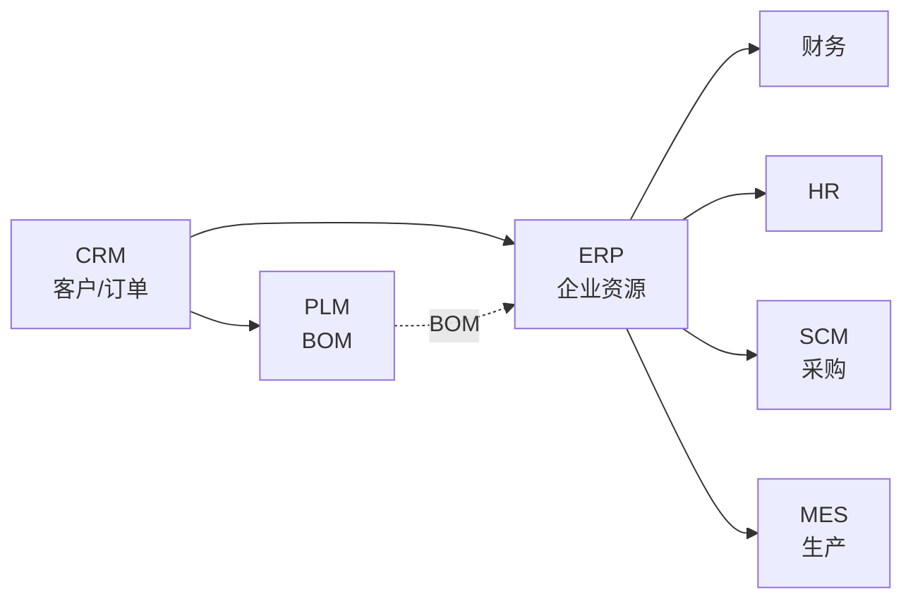
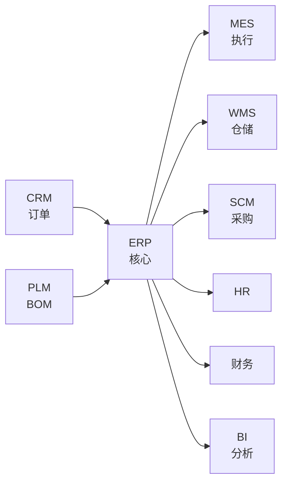

# ERP（Enterprise Resource Planning 企业资源计划）

## 引言：反直觉代码（[AUTO] 自动生成，待人工 review）

ERP（Enterprise Resource Planning 企业资源计划） 本应该很简单，一句话定位：整合企业**核心业务流程**的主干系统，覆盖财务、采购、生产、库存、销售、人事等模块，是企业数字化的"操作系统"

**但实际**：面试/生产中常被问起或踩坑的是——
代码看着对、跑起来对，但仔细一问深一层就漏馅。本篇就从'反直觉'这个角度切入，把踩坑点和根因摆出来。

> 📌 本段由 `note/scripts/add-intro.py` 自动生成（场景模板 + README 摘录）。**下次 review 时请改为真实场景 + 数字 + 反思**，目前仅满足'有引言'的最低要求。

---

> 一句话定位：整合企业**核心业务流程**的主干系统，覆盖财务、采购、生产、库存、销售、人事等模块，是企业数字化的"操作系统"。

## 📌 全景图

## 📖 定义

ERP（Enterprise Resource Planning 企业资源计划）是整合企业**核心业务流程**的主干系统，覆盖财务、采购、生产、库存、销售、人事等模块，是企业数字化的"操作系统"。

**历史**：1990 年代由 MRP/MRPII 演进而来，Gartner 1990 年首次提出 ERP 概念。SAP R/3（1992）是 ERP 时代的开端。

**与各系统的边界**：
- vs CRM：ERP 管「订单履约」，CRM 管「机会/客户」到「订单生成」
- vs MES：ERP 管「计划层」（月/周），MES 管「执行层」（日/班次）
- vs WMS：ERP 管「库存数量」，WMS 管「仓库作业」
- vs PLM：ERP 管「生产 BOM」，PLM 管「研发 BOM」
- vs 财务系统：现代 ERP 内含财务，但大型集团会单独部署专业财务系统

**ERP 不擅长**：客户体验（CRM）、车间执行（MES）、数据可视化（BI）

**在企业 IT 架构中的位置**：ERP 是企业数字化"中枢系统"，向上承接 CRM（订单）、PLM（BOM/工艺），向下指挥 MES（生产）、WMS（仓储）、SRM/SCM（采购），横向与 HR、财务、BI 双向同步。Gartner 将 ERP 归为"后端办公（Back-Office）"系统核心，与 CRM 的"前端办公"形成镜像。ERP 的"主数据"（客户/物料/供应商/BOM/组织）是企业级共享主数据，企业 80% 系统的数据源都来自 ERP 主数据。

**典型数据量级**：成熟 ERP 系统的核心业务数据通常在 **500GB-50TB** 区间（量级参考，取决于企业规模与历史积累）。主数据（物料/客户/供应商/科目）、交易数据（订单/凭证/库存流水）是主要占用项；活跃用户从百人到上万人（典型中小企业 100-500，大型集团 5000-50000）。日均单据量在 10 万-100 万级，年度凭证量在百万到千万级。ERP 主数据治理的复杂度远高于交易系统。

**核心模块结构**（按"价值链主链"划分）：财务（FI/CO）、采购（MM-PUR）、库存（MM-IM）、销售（SD）、计划（PP-PLAN）、生产执行（PP-PI）、人力资源（HR）。详细边界见下文。

**与各系统的边界详解**：

- **vs CRM**：CRM 管"机会与客户"到"订单生成"（L→O→Q→C→O 漏斗），ERP 管"订单履约"（订单确认→MRP→生产→发货→开票→回款）
- **vs MES**：ERP 是"计划层"（月/周计划、MRP 运算），MES 是"执行层"（日/班次、工序级、车间现场）
- **vs WMS**：ERP 管"库存数量"（账面库存/可用量/预占用），WMS 管"仓库作业"（库位/拣货路径/批次策略）
- **vs PLM**：ERP 用"生产 BOM"，PLM 管"研发 BOM"；PLM 通过变更管理把研发 BOM 释放到 ERP
- **vs 财务/BI/SRM**：ERP 内含财务做"账务核算"，专业财务系统做"管理分析/合并报表"；BI 通过数据仓库从 ERP 抽取数据做分析；SRM 沉淀的供应商档案同步给 ERP

**ERP 不擅长的领域**：客户体验（CRM）、车间执行（MES）、数据可视化（BI）、研发数据（PLM/PDM）、物流执行（TMS）、供应商深度协同（SRM）、客户/供应商门户（独立系统）。

## 🔧 核心能力

- **财务管理**：总账、应收应付、固定资产、成本核算、多组织合并
- **采购管理**：采购申请、询比价、采购订单、收货、退货、发票匹配（三单匹配）
- **销售管理**：销售订单、发货、开票、应收账款
- **库存管理**：入库、出库、盘点、调拨、批次/序列号
- **生产管理**：MRP 运算、生产订单、车间管理（粗放）、委外加工
- **供应链管理**：供应商评估、采购计划、供需平衡
- **人力资源**：组织架构、人事、薪资、考勤（部分 ERP 含 HR）
- **BI 报表**：预置 200+ 标准报表（销售/采购/库存/财务）

**财务管理的"三张表 + 三大核算"**：财务管理是 ERP 最核心的模块，财务 ERP 选型的"一票否决项"：
- **三张表**：资产负债表（月末/季末/年末时点快照，反映企业财务状况）、利润表（期间累计，反映经营成果）、现金流量表（现金流入流出，反映资金链）
- **三大核算**：财务核算（按会计准则记账 + 出具财务报表）、管理核算（按内部管理维度做预算/成本/利润分析）、成本核算（按产品/订单/工序归集成本，含材料/人工/制造费用）

**采购管理的"三单匹配"**：采购是 ERP 中"流程最完整"的模块，行业实践形成了"三单匹配"标准：
- **采购订单（PO）**：采购部门下达的采购单
- **收货单（GR）**：仓库根据 PO 实际收到的货物
- **发票（IR）**：供应商开来的发票
- **三单匹配逻辑**：PO 单价 × 数量 = GR 金额；GR 金额 = IR 金额；任一不匹配则冻结付款。"三单匹配"是企业应付账款自动化的基础，国内大型企业匹配率通常要求 >95%

**MRP 运算（Material Requirements Planning 物料需求计划）**：MRP 是 ERP 生产管理的"心脏"，是 ERP 区别于普通进销存的"灵魂"：
- **输入**：销售订单/预测 + 物料清单（BOM）+ 现有库存 + 在途采购 + 提前期
- **运算逻辑**：净需求 = 毛需求 - 现有库存 - 在途量 + 安全库存；按 BOM 展开到最底层原材料；按提前期倒推采购/生产开始日期
- **输出**：建议采购订单（PR）+ 建议生产订单（PLO）+ 计划订单（planned order）
- **运行时机**：通常每日凌晨自动运行；紧急插单时手动触发"MRP 重算"
- **MRP II**：在 MRP 基础上加入"产能需求计划（CRP）"+"车间作业计划"，覆盖到车间执行层

**库存管理的"批次 + 序列号 + 效期"**：现代 ERP 的库存管理已经从"数量管理"升级到"批次/序列号/效期管理"：
- **批次管理（Batch/Lot）**：同一批物料有共同属性（生产日期/供应商/批次号），用于追溯（食品/医药/化工）
- **序列号管理（Serial Number）**：每一件物料有唯一序列号，用于单品追溯（医疗器械/3C/汽车关键件）
- **效期管理（Expiration Date）**：药品/食品/化工原料有有效期，FIFO/FEFO 先进先出/先到期先出
- **库位管理（Storage Location）**：ERP 记录"账面库位"，WMS 管理"实际库位"，两者通过接口同步

**生产管理的"粗放 vs 精细"边界**：ERP 的生产管理是"粗放"的（订单级），不替代 MES：
- **ERP 管**：生产订单下达、工时定额、产能平衡（粗）、委外加工、成品入库
- **ERP 不管**：工序级调度（MES 排程）、工位级数据采集（MES/SCADA）、SOP 电子化（MES）、设备联动（SCADA）
- **判断标准**：如果工序级调度、实时追溯是核心诉求，建议 ERP + MES 协同；如果只是订单级生产跟踪，单 ERP 即可

**多组织架构（Multi-Org / Multi-Site）**：大型集团 ERP 必备能力：
- **法人架构**：多法人（独立法人/分公司/子公司）独立核算 + 合并报表
- **业务架构**：多事业部/多利润中心独立考核
- **多币种**：集团本币 + 多外币，按汇率折算
- **多语言/多税制**：跨国集团必备（中国增值税/美国销售税/欧盟 VAT）
- **多会计准则**：中国 GAAP + US GAAP + IFRS 同时出报表（上市公司）

**BI 报表的"标准报表 vs 自助分析"边界**：ERP 内置 200+ 标准报表，但**不是 BI**：
- **标准报表**：销售汇总/采购汇总/库存余额/总账余额/应收应付明细（ERP 自带）
- **管理报表**：销售毛利分析/客户获利能力/产品成本还原（ERP + 简单配置）
- **分析型报表**：多维分析/趋势预测/数据挖掘（**BI 平台做**）

**与 OA/工作流的"审批流"集成**：ERP 的"审批流"是企业流程数字化的核心，80% 审批在 ERP 内完成（贴近业务数据），20% 在 OA（行政类）。

**按 ERP 成熟度分级的功能深度**（行业参考框架）：
- **L1 基础**：财务核算 + 进销存（解决 40% 业务问题）
- **L2 标准**：MRP + 生产订单 + 多组织（解决 60% 制造问题）
- **L3 高级**：MES 集成 + 成本还原 + 预算管理（解决 75% 管理问题）
- **L4 卓越**：多组织合并 + 跨国合规 + 集团管控（解决 90% 集团问题）
- **L5 智能化**：AI 智能补货 + 智能财务核算 + 数字孪生（前沿探索）

## 🏭 典型场景

- **大型集团**：SAP S/4HANA / Oracle Cloud，多组织、多币种、多会计准则合并
- **中型制造业**：用友 U9 / 金蝶云·星空 / Sage X3，10-50 亿规模
- **小型企业**：金蝶云·星辰 / 浪潮 GS / 管家婆 / QuickBooks，几千万-几亿规模
- **零售连锁**：SAP IS-Retail / 用友 U8 + 零售模块，多门店、多业态
- **项目型（建筑/工程）**：用友 NC / 金蝶 EAS，项目 WBS、合同、进度款
- **跨国合规**：SAP / Oracle 多语言多币种多税制

**两种部署**：
- **云 ERP**：订阅式，按用户/模块付费（SaaS），季度迭代，初始成本低
- **本地 ERP**：一次性 License + 实施服务，深度定制能力强，初始成本高

**典型场景详解**：

- **大型集团多组织合并**：**痛点**：集团有 50+ 法人/30+ 币种/5+ 会计准则；月结要 15 天（财务团队 200+ 人加班）；合并报表要 Excel 拼接，差错率高；境外子公司 IFRS 报表出不来。**方案**：SAP S/4HANA 或 Oracle Cloud ERP（集团版），统一主数据（客户/供应商/物料/科目），多组织多账簿并行记账，自动按汇率折算 + 抵消分录，月结工作流固化。**效果**：财务月结从 15 天缩到 5 天，合并报表自动化率 95%+，差错率从 2% 降到 0.1%。

- **中型制造业全链路打通**：**痛点**：年营收 30 亿的电子制造企业，销售订单/生产计划/采购/仓库/财务分散在 5+ 系统（CRM/Excel/MES/WMS/财务软件），数据靠人工搬运，月度对账要 1 周；订单履约时效无法承诺给客户。**方案**：用友 U9 Cloud 或金蝶云·星空，统一主数据 + 全模块；销售订单→MRP 运算→生产订单→MES 委外→WMS 出库→财务开票全链路打通；BI 从 ERP 抽取数据做经营分析。**效果**：月度对账从 1 周缩到 1 天，订单履约准时率从 70% 提升到 95%，财务人员减少 30%。

- **小型企业轻量化上云**：**痛点**：年营收 5000 万的贸易公司，用 Excel + 单机版财务软件，老板看不到实时业务数据（库存/应收/订单），月底才知道"赚了多少钱"。**方案**：金蝶云·星辰 或 浪潮 GS（轻量化云 ERP），按月订阅（3000-10000 元/月），老板手机看仪表盘（销售/库存/应收/毛利），财务在线记账。**效果**：上线 1 个月即可使用，TCO 是传统 ERP 的 1/5，老板获得"实时经营仪表盘"。

- **零售连锁多门店多业态**：**痛点**：连锁零售集团 5000+ 门店，跨 30+ 城市，多业态（超市/便利店/专卖店）；门店要货靠电话/Excel，总部 DC 配货效率低；门店缺货/滞销无法实时掌握。**方案**：SAP IS-Retail 或 用友 U8+ 零售模块 + 自研中台，门店要货→DC 配货→门店收货全链路自动化；POS 数据实时回传 ERP；BI 看门店坪效/品类毛利/库存周转。**效果**：门店要货响应时间从 48 小时缩到 4 小时，缺货率从 15% 降到 5%，库存周转提升 30%。

- **项目型（建筑/工程）WBS + 合同 + 进度款**：**痛点**：建筑公司 100+ 项目并行，每个项目有独立 WBS（工作分解结构）/合同/进度款/成本归集；项目分散在 30+ 城市，项目经理用 Excel 管理，进度款拖欠/成本失控/项目亏损频发。**方案**：用友 NC 或 金蝶 EAS（项目型 ERP），以项目为主线：WBS 拆解到工序级、合同分阶段签订、进度款按里程碑触发、成本按项目归集、利润按项目核算。**效果**：项目成本归集准确率从 50% 提升到 95%，进度款拖欠率从 30% 降到 10%，项目利润率提升 5 个百分点。

- **跨国合规多语言多币种**：**痛点**：制造业出海，30+ 国家子公司，每个国家有不同语言/币种/税制/会计准则；总部需要统一管控但又必须满足当地合规（GDPR/本地税务报表/审计要求）。**方案**：SAP S/4HANA Cloud 或 Oracle Cloud ERP（多语言版），多账簿（本地 GAAP + 集团 GAAP）/多币种（实时汇率 + 期间汇率）/多税制（中国增值税/欧盟 VAT/美国销售税）/多语言（界面 + 报表）。**效果**：海外子公司月结时间从 20 天缩到 7 天，合规审计一次通过率 95%+，总部获得全球实时经营视图。

- **服务业项目型 ERP + 财务**：**痛点**：咨询/IT 服务行业，按项目核算成本与利润；项目工时/差旅/外购成本散落在 Excel；客户回款/项目利润月底算不清。**方案**：用友 U8+ 或 金蝶云·星空 项目模块，按项目归集收入/成本/费用，工时按项目报，差旅/外购按项目立项，月底自动出项目利润表。**效果**：项目利润核算从 1 周缩到 1 天，项目亏损预警及时（项目进行中即可看毛利）。

- **流程制造（化工/医药/食品）批次追溯**：**痛点**：化工/医药/食品行业有严格批次追溯要求（GMP/食品安全法），从原料到成品的"正反向追溯"必须 1 小时内完成；传统 ERP 只能做到"批次"粒度，无法做到"单品序列号"。**方案**：SAP S/4HANA + MES + WMS 协同，批次号贯穿采购→生产→销售全链路；序列号管理覆盖关键件（医疗器械的"UDI"唯一器械标识）；追溯时间从小时级缩到分钟级。**效果**：批次追溯时间从 4 小时缩到 15 分钟，合规审计一次通过率 100%。

**「制造业 ERP vs 商贸 ERP vs 项目 ERP」的差异**：ERP 选型首先要确定"行业版本"，不同行业 ERP 的"内核"差异巨大：
- **制造业 ERP（核心是 MRP + 生产）**：SAP/用友 U9/金蝶 EAS/Oracle，强项是 BOM/MRP/车间管理
- **商贸 ERP（核心是进销存 + 财务）**：管家婆/金蝶云·星辰/QuickBooks，强项是采购/库存/销售/财务一体化
- **项目 ERP（核心是 WBS + 合同 + 进度款）**：用友 NC/金蝶 EAS/新中大，强项是项目管理 + 财务核算
- **零售 ERP（核心是 POS + 多门店）**：SAP IS-Retail/用友 U8 零售/海鼎，强项是多门店 + 多业态 + POS 集成
- **服务 ERP（核心是项目工时 + 客户计费）**：金蝶云·星空/用友 U8+，强项是项目工时 + 客户计费

**「云 ERP vs 本地 ERP」的部署决策**：云 ERP 与本地 ERP 的差异不是"谁更好"，而是"谁更适合"：
- **云 ERP 优势**：初始成本低（订阅式）、上线快（3-6 个月）、迭代快（季度版本）、运维由厂商负责
- **云 ERP 劣势**：定制能力弱（受厂商产品限制）、数据在云端（合规风险）、长期成本高（5 年 TCO 超过本地）
- **本地 ERP 优势**：定制能力强（满足特殊业务）、数据自主（合规安全）、长期成本可控
- **本地 ERP 劣势**：初始成本高（License + 实施）、上线慢（12-18 个月）、升级痛苦（5 年一次大升级）
- **决策阈值**：标准化业务 + 预算紧 + 快速上线 → 云 ERP；深度定制 + 合规要求 + 长期使用 → 本地 ERP
- **混合模式**：核心模块（财务/采购）上云，定制模块（行业/特殊流程）本地化（"核心云 + 边缘本地"）

**场景共性规律**：以上 8 个典型场景虽形态不同，但呈现三个共性：
1. **主数据统一是基础**：无论集团/中型/小型，所有 ERP 成功的前提是"客户/物料/供应商/科目"四大主数据统一，否则就是数据沼泽
2. **流程标准化先于 ERP 上线**：ERP 是流程的"载体"而非"创造者"——业务没标准化就上 ERP = 把混乱固化到系统
3. **实施周期长 + 投入大**：ERP 是企业级项目，实施周期 6-18 个月，预算从百万到千万级；选错厂商/实施商 = 灾难

**「实施分阶段」的行业经验**：约 70% 的 ERP 项目按以下阶段推进：
- **阶段一：财务 + 进销存（0-6 个月）**：解决 40% 业务问题（管钱 + 管货）
- **阶段二：MRP + 生产（6-12 个月）**：解决 60% 制造问题（管生产）
- **阶段三：成本 + 多组织（12-18 个月）**：解决 75% 管理问题（管成本）
- **阶段四：BI + 智能分析（18-24 个月）**：解决 90% 决策问题（看数据）
- **阶段五：持续优化（24 个月+）**：行业最佳实践 + 个性化场景

ERP 不是"一次性项目"，是"持续优化的旅程"——上线只是开始，长期运营才是关键。

## 🔗 上下游关系

- **上游**：CRM（销售订单）、PLM（BOM/工艺路线）
- **下游**：MES（生产订单下发）、WMS（出入库指令）、SCM（采购指令）、HR（薪资接口）、BI（数据抽取）
- **横向**：财务（ERP 内含或独立）、银行系统（银企直联）

**集成核心**：ERP 是「数据中枢」，90% 系统都要与 ERP 双向同步主数据（客户/物料/供应商/BOM）

**上下游集成详解**：

- **ERP ↔ CRM（订单/客户主数据）**：CRM 推送"销售订单 + 客户主数据"，ERP 回传"发货/开票/回款"
- **ERP ↔ PLM（生产 BOM/工艺路线）**：PLM 通过 ECN 流程把生产 BOM + 工艺路线释放到 ERP
- **ERP ↔ MES/WMS/SCM/SRM/HR/BI/财务/银行**：ERP 下发指令/订单，接收回报/数据抽取；按业务时序与集成粒度同步

**「ERP 是数据中枢」的集成架构**：ERP 处于"数据中枢"位置——主数据中枢（90% 系统从 ERP 拉取主数据）、交易数据中枢（订单/凭证由 ERP 产生）、流程中枢（审批/业务规则/成本核算由 ERP 承载）。

**集成模式选择**：紧耦合（实时双向）/松耦合（定时批处理）/事件驱动（Kafka/RabbitMQ）/iPaaS 平台/MuleSoft/腾讯轻联/华为 ROMA/中间库（Staging Table）。

**「主数据治理」前置**：ERP 与各系统集成的"成败"不在技术接口，而在"主数据治理"（物料编码/客户/供应商/BOM/组织/科目统一）。主数据治理投入应占 ERP 项目总投入的 **15-20%**。

## ⚖️ 关键考量

- **行业 Know-how 比品牌重要**：SAP 不一定比用友好，制造业适合用友/金蝶，零售适合 SAP/Oracle
- **实施周期 1-3 年**：ERP 是企业级项目，需求调研 3 个月、蓝图设计 6 个月、上线 6-12 个月、稳定期 1 年
- **数据迁移是最大风险**：5-10 年历史数据清洗（客户/物料/库存/财务余额），占总实施成本 30-40%
- **主数据治理（MDM）必须先行**：物料编码/客户编码/供应商编码没规则就上 ERP = 数据沼泽
- **顾问能力决定成败**：再好的 ERP 产品，二流顾问实施也会失败。选型时看顾问团队而非软件本身
- **云 vs 本地**：云 ERP 迭代快但定制弱；本地 ERP 定制强但迭代慢。中大型建议核心模块上云、定制模块本地
- **二次开发边界**：ERP 二次开发越多，后期升级越痛苦。控制在 5% 以内

**「行业 Know-how 比品牌重要」的选型陷阱**：ERP 选型中最大的认知陷阱是"迷信品牌"。**现象**：某制造业老板"非 SAP 不上"，500 万预算硬上 SAP，结果 SAP 的中国本地化（税务/报表/合规）远不如用友/金蝶；3 年后无法适应业务变化。**根因**：SAP 强在国际化、用友/金蝶强在本土化。**规避**：选型前先做"行业版本调研"——同行业（5 家以上）案例最多的厂商最合适。

**「实施周期 1-3 年」的预期管理陷阱**：ERP 是企业级项目，"6 个月上线"是销售话术。**现象**：某企业"用友 U9 半年上线"承诺，签合同后发现 MRP/生产/成本还要再做 1 年。**根因**：标准周期 2-3 年（需求 3 月+蓝图 6 月+上线 6-12 月+稳定 1 年）。**规避**：合同中明确"分阶段交付 + 上线标准"。

**「数据迁移是最大风险」的迁移陷阱**：ERP 项目失败的"头号杀手"是数据迁移。**现象**：上线后 3 个月还在对账（总账差 1 元、档案 30% 重复）。**根因**：5-10 年历史数据清洗是"脏活累活"，实施商不愿做。**规避**：数据迁移占实施总成本 **30-40%**；迁移必须"零容忍"。

**「主数据治理必须先行」的 MDM 陷阱**：ERP 项目的"前置条件"是主数据治理（MDM）。**现象**：上线后 2 年还在做"物料合并"。**根因**：物料编码规则没制定就上 ERP。**规避**：上线前 6-12 个月启动 MDM 项目（物料/客户/供应商/科目规则）。

**「顾问能力决定成败」的选人陷阱**：ERP 项目"产品占 30%，实施占 70%"。**现象**：选 SAP（产品最好）+ 二流实施商（顾问都是新人），业务问题没解决。**根因**：ERP 实施是"知识密集型服务"。**规避**：选型时把"实施商"放在比"产品"更重要的位置（行业案例 + 顾问稳定性 + 资质）。

**「云 vs 本地」的部署决策陷阱**：云 ERP 与本地 ERP 不是"谁更好"，而是"谁更适合"。**现象**：某大型集团"为了上云而上云"，2 年后想加定制发现云 ERP 不支持。**根因**：云 ERP 定制能力弱，本地 ERP 定制强但迭代慢。**规避**：中大型企业建议"核心模块上云（财务/HR）+ 定制模块本地"。

**「二次开发边界」的升级陷阱**：ERP 二次开发是"双刃剑"。**现象**：二次开发占比 30%，3 年后升级时 80% 模块无法兼容。**根因**：现场改业务规则而非改流程。**规避**：二次开发占比 **<5%** 是"红线"。

**「上线 ≠ 实施完成」的运维陷阱**：ERP 项目的"实施完成"是"稳定运行 1 年"。**现象**："成功上线"庆功会后 3 个月用户退回 Excel。**根因**：上线后 6-12 个月是"系统稳定期"，很多企业投入不足。**规避**：运维占项目预算 **20-30%**。

**「自研 vs 商用」的认知陷阱**：很多企业"为了自主可控"选择自研 ERP。**现象**：某集团 5000 万自研 ERP，3 年后只完成财务 + 进销存，MRP/生产全部"烂尾"。**根因**：ERP 是"行业知识沉淀 + 长期迭代"的产物。**规避**：除非"特殊行业需求"且"10 年+10 亿+"长期投入，否则不推荐自研。

**「ERP 是数据中枢」的认知陷阱**：把 ERP 当成"业务系统"而非"数据中枢"导致集成混乱。**现象**：ERP 上了 5 年，集成接口 200+ 个。**根因**：系统两两集成。**规避**：以 ERP 为中心做"星型集成" + iPaaS/ESB 中间层。

**考量决策清单**：选型/实施 ERP 前建议在项目立项阶段就以下问题形成正式决议：
- **战略层**：ERP 是"业务流程标准化"还是"个性化定制"？
- **行业层**：同行业（5 家以上）案例？行业版本是否成熟？
- **数据层**：主数据治理是否先行？物料/客户/供应商编码规则是否定义？
- **集成层**：与 CRM/PLM/MES/WMS/SCM 的接口？主数据谁创建谁同步？
- **组织层**：关键用户 30%+ 时间投入承诺？高层推动机制？
- **预算层**：License + 实施 + 3 年运维的 TCO？数据迁移预算占 30-40%？
- **风险层**：二次开发占比 <5% 红线？上线标准定义？稳定期 1 年规划？

## 🎯 选型指南

| 企业规模 | 推荐 | 理由 |
|---------|------|------|
| 跨国集团（百亿+） | SAP S/4HANA / Oracle Cloud | 国际化、合规、生态 |
| 大型集团（10 亿+） | SAP / Oracle / 用友 NC / 金蝶 EAS | 多组织、多核算体系 |
| 中型制造（1-10 亿） | 用友 U9 / 金蝶云·星空 / Sage X3 | 性价比、行业方案 |
| 小型企业（千万-亿） | 金蝶云·星辰 / 浪潮 GS / 管家婆 | 简单易用、成本低 |
| 项目型（建筑/工程） | 用友 NC / 金蝶 EAS / 新中大 | 项目管理模块 |
| 零售连锁 | SAP IS-Retail / 用友 U8+ | 多门店、多业态 |

**自检维度**：
1. 行业案例（5 个以上同行业）
2. 实施商资质（同行业顾问数）
3. 二次开发比例承诺（<5%）
4. 数据迁移方案（工具+周期）
5. 后续升级与运维成本

**红线**：
- 无同行业案例 = 慎选
- 顾问 80% 是新人 = 慎选
- 二次开发预算占比 >20% = 慎选

**选型方法论（六步法）**：ERP 选型是企业级决策，建议按"六步法"系统推进：

1. **战略对齐（Step 1）**：明确"ERP 解决什么业务问题"——是财务合规？MRP 优化？多组织管控？全链路打通？目标不同，选型方向不同
2. **行业调研（Step 2）**：调研同行业（5 家以上）ERP 案例——同行业 ERP 的成熟度决定实施风险；优先选择"行业最佳实践沉淀深"的厂商
3. **厂商初筛（Step 3）**：根据企业规模/行业/部署偏好初筛 3-5 家候选——重点看"行业版本成熟度" + "实施商同行业案例数"
4. **RFP 招标（Step 4）**：发 RFP（Request For Proposal）——覆盖 5 大类 30+ 评分项（功能 30% + 性能 15% + 集成 25% + 合规 15% + 服务 15%）
5. **POC 验证（Step 5）**：要求候选厂商做 3 个 PoC 场景——验证实际能力而非 PPT：①财务月结 + 多组织合并 ②MRP 运算 + 委外加工 ③与 CRM/MES/WMS 集成
6. **商务谈判（Step 6）**：TCO 测算 + 实施周期 + 二次开发比例 + 续费条款 + 数据迁移方案

**RFP 模板要点**：建议 RFP 覆盖 **5 大类 30+ 评分项**：
- **功能类（30%）**：财务、采购、库存、销售、生产、多组织
- **性能类（15%）**：并发 500-5000+、单据响应 <2 秒、MRP <30 分钟、千万级凭证秒级响应
- **集成类（25%）**：REST API/WebService/IDoc、消息队列、中间库、iPaaS、银企直联
- **合规类（15%）**：金税接口、GDPR/SOC 2/ISO 27001/等保三级、审计日志、权限模型
- **服务类（15%）**：行业经验、顾问稳定性（核心 >3 年）、SLA（99.9% 可用性）

**POC 关键场景**：3 个 PoC 验证：①财务月结 + 多组织合并（2-3 天）②MRP 运算 + 委外加工（3-5 天）③与 CRM/MES/WMS 集成（2-3 天）。

**TCO 估算要点**（1000 人制造企业 5 年 TCO）：SAP S/4HANA 约 3000-5000 万（License 25% + 实施 40% + 数据迁移 10% + 运维 20% + 升级 5%）；用友 NC / 金蝶 EAS 1000-2500 万；云 ERP（金蝶云·星空/用友 YonBIP）600-1500 万；自研 ERP 2000-5000 万。**决策阈值**：TCO < 业务价值的 30% 是合理投入。

**国际 vs 国产 ERP 决策**：国际 ERP（SAP/Oracle）产品成熟、跨国合规强，但中国本土化弱、实施贵；国产 ERP（用友/金蝶）中国本土化强、性价比高，但国际化弱。**决策阈值**：跨国业务 / 海外上市 → 优先国际；纯国内业务 → 优先国产；混合业务 → "国际 ERP + 国产外围"。

**行业版本匹配**：制造业（用友 U9/金蝶 EAS/SAP）、零售业（SAP IS-Retail/海鼎）、建筑业（用友 NC/金蝶 EAS/新中大）、服务业/项目型（用友 U8+/金蝶云·星空/Oracle NetSuite）、流程制造（SAP/Oracle Process Manufacturing）、能源（SAP IS-U/Oracle Utilities）。

**POC 陷阱**：**现象**：厂商 PoC 用"明星顾问 + 简化数据"，上线后"两层皮"。**规避**：POC 必须用"实际数据 + 实际业务场景 + 实际顾问团队"；合同中约定"POC 顾问 = 实施顾问"。

## 📚 代表案例

- **某大型装备制造集团**：500 亿营收，部署 SAP S/4HANA 实现全球 50+ 法人、多币种合并报表，财务月结从 15 天缩到 5 天
- **某中型电子制造**：30 亿规模，使用用友 U9 Cloud 实现「销售订单→MRP 运算→生产订单→MES 委外→WMS 出库」全链路打通
- **某连锁零售集团**：5000+ 门店，部署 SAP IS-Retail + 自研中台，实现「门店要货→DC 配货→门店收货」自动化
- **某建筑工程公司**：使用金蝶云·星空项目模块，实现 100+ 项目并行，WBS/合同/进度款/成本归集一体化
- **某跨国制造集团（SAP + Oracle 混合）**：年营收 200 亿，30+ 国家子公司，主数据由 SAP MDG 统一治理，全球合并报表从 30 天缩到 7 天
- **某小型贸易公司（金蝶云·星辰）**：年营收 5000 万，50 人规模，云 ERP 月订阅 5000 元，老板手机看仪表盘

注：以上为公开演讲/行业报告引用的脱敏案例（行业 / 规模 / 产品名做模糊化处理）。

**代表案例详解**：

- **某大型装备制造集团（SAP S/4HANA）**：**背景**：500 亿营收的装备制造业集团，业务覆盖 30+ 国家，旗下 50+ 法人公司。**痛点**：原有 ERP 系统（Oracle EBS）老化，多组织合并报表要 Excel 拼接，差错率高；财务月结要 15 天（财务团队 200+ 人加班）；境外子公司 IFRS 报表出不来。**方案**：部署 SAP S/4HANA（Cloud Private Edition），统一主数据（客户/供应商/物料/科目），多组织多账簿并行记账（本地 GAAP + IFRS + US GAAP），按汇率折算 + 自动抵消分录，月结工作流固化。**效果**：财务月结从 15 天缩到 5 天，合并报表自动化率 95%+，差错率从 2% 降到 0.1%，IFRS/US GAAP 报表自动生成。**关键成功因素**：①高层推动（CEO 亲自挂帅）②主数据治理 12 个月（占实施总投入 25%）③SAP 顶级实施商 + 跨国顾问团队。

- **某中型电子制造（用友 U9 Cloud）**：**背景**：年营收 30 亿的电子制造企业（PCB/SMT），产品 80% 外销。**痛点**：销售订单/生产计划/采购/仓库/财务分散在 5+ 系统（CRM/Excel/MES/WMS/财务软件），数据靠人工搬运，月度对账要 1 周；订单履约时效无法承诺给客户。**方案**：用友 U9 Cloud 全模块上线 + 与 MES/WMS 集成；销售订单→MRP 运算→生产订单→MES 委外→WMS 出库→财务开票全链路打通；BI 从 ERP 抽取数据做经营分析。**效果**：月度对账从 1 周缩到 1 天，订单履约准时率从 70% 提升到 95%，财务人员减少 30%，库存周转提升 25%。**关键成功因素**：①业务流程先标准化（先僵化再优化）②关键用户 50% 时间投入 ③U9 Cloud 的电子制造行业版本成熟。

- **某连锁零售集团（SAP IS-Retail + 自研中台）**：**背景**：5000+ 门店的连锁零售集团，跨 30+ 城市，多业态（超市/便利店/专卖店/电商）。**痛点**：门店要货靠电话/Excel，总部 DC 配货效率低（48 小时响应）；门店缺货/滞销无法实时掌握；POS 数据不能实时回传 ERP。**方案**：SAP IS-Retail（ERP 后端）+ 自研中台（订单中台/库存中台/价格中台）+ 门店 POS 终端；门店要货→中台智能配货→DC 拣货→门店收货全链路自动化；POS 数据实时回传 ERP。**效果**：门店要货响应时间从 48 小时缩到 4 小时，缺货率从 15% 降到 5%，库存周转提升 30%，门店坪效提升 20%。**关键成功因素**：①自研中台解决"标准化 ERP 无法满足零售个性化需求"②POS 与 ERP 实时集成③门店主数据治理（5000+ 门店的标准化）。

- **某建筑工程公司（金蝶云·星空项目模块）**：**背景**：年营收 80 亿的建筑工程公司，100+ 项目并行（基建/房建/市政），跨 30+ 城市。**痛点**：项目分散在 30+ 城市，项目经理用 Excel 管理；WBS/合同/进度款/成本归集混乱；进度款拖欠/成本失控/项目亏损频发。**方案**：金蝶云·星空项目模块，以项目为主线：WBS 拆解到工序级、合同分阶段签订、进度款按里程碑触发、成本按项目归集、利润按项目核算。**效果**：项目成本归集准确率从 50% 提升到 95%，进度款拖欠率从 30% 降到 10%，项目利润率提升 5 个百分点，亏损项目预警及时。**关键成功因素**：①项目主数据治理（WBS 标准化）②项目经理 100% 培训覆盖③移动端审批（领导出差也能批）。

- **某跨国制造集团（SAP + Oracle 混合）**：**背景**：年营收 200 亿的跨国制造集团（汽车零部件），30+ 国家子公司，10+ 工厂。**痛点**：海外子公司用各国本地 ERP（10+ 套），集团合并报表困难；主数据不统一（同一客户/物料在不同国家不同编码）；合规风险（GDPR/各国税务）。**方案**：SAP S/4HANA（集团核心）+ 各区域外围系统（按本地合规选择 Oracle/SAP Business One/用友/金蝶），通过 SAP BPC 做合并报表；主数据由 SAP MDG 统一治理。**效果**：全球合并报表从 30 天缩到 7 天，主数据一致性从 40% 提升到 95%，合规审计一次通过率 100%。**关键成功因素**：①"核心 SAP + 外围本地化"架构 ②SAP MDG 主数据治理 ③SAP BPC 合并报表。

- **某小型贸易公司（金蝶云·星辰）**：**背景**：年营收 5000 万的贸易公司，50 人规模。**痛点**：用 Excel + 单机版财务软件，老板看不到实时业务数据（库存/应收/订单），月底才知道"赚了多少钱"。**方案**：金蝶云·星辰（轻量化云 ERP），按月订阅（5000 元/月），老板手机看仪表盘（销售/库存/应收/毛利），财务在线记账。**效果**：上线 1 个月即可使用，TCO 是传统 ERP 的 1/5，老板获得"实时经营仪表盘"。**关键成功因素**：①云 ERP 订阅模式降低初始投入②老板亲自推动（老板是项目最大推动者）③业务简单不需要定制。

**案例共性规律**：以上 6 个代表案例虽规模/行业不同，但呈现四个共性：
1. **行业版本成熟是基础**：成功案例都选了"行业版本成熟"的 ERP（SAP 装备/用友 U9 电子制造/SAP IS-Retail 零售/金蝶云·星空项目）——同行业案例 5+ 是基本门槛
2. **主数据治理是前提**：5 个案例都投入 12-18 个月做主数据治理（占总投入 20-30%）——主数据不清，ERP 必败
3. **关键用户深度参与**：5 个案例的关键用户投入都在 30%+ 时间——业务部门"挂名参与"是失败的前兆
4. **高层持续推动**：5 个案例的高层（CEO/CIO）亲自挂帅，定期 review 项目进度——ERP 是"一把手工程"

## ⚠️ 常见陷阱

- **「SAP 一定比用友好」**：错。SAP 强在国际化、流程标准化；用友/金蝶强在中国本土化（税务/报表/合规）。选错比选贵更可怕
- **实施商压价中标**：500 万的 ERP 项目压到 200 万，实施商只能「上产品不做实施」，客户买了壳没用
- **主数据治理后置**：物料编码规则等到上线才讨论，财务/库存/生产每个部门一套编码，2 年后还在对账
- **关键用户不投入**：业务部门把 ERP 项目当 IT 部门的事，关键用户 30% 时间投入以下 → 项目必败
- **报表过度定制**：每个部门提 100 个报表需求，IT 加班加点 1 年都在写报表。建议 80% 用标准报表 + 20% 自助 BI
- **二次开发泛滥**：现场改业务规则而非改流程，每次升级都要重写。建议红线：二次开发占比 <5%
- **数据迁移「差不多就行」**：余额差 1 元就导致总账不平，迁移后 3 个月对账才平衡。迁移必须「零容忍」
- **变革管理缺失**：员工培训 1 小时就上岗，使用率 30%，数据失真 → 决策失真 → 回到 Excel

**「SAP 一定比用友好」的认知陷阱**：**现象**：某民营企业老板"非 SAP 不上"，500 万预算硬上 SAP，结果 SAP 的中国本地化（税务/报表/合规）远不如用友/金蝶；3 年后无法适应业务变化，含泪二次选型。**根因**：把"品牌 = 适合"的认知混淆——SAP 强在国际化、流程标准化；用友/金蝶强在中国本土化（税务/报表/合规）；Oracle 强在大型集团多组织。**规避**：选型前先做"行业版本调研"——同行业（5 家以上）案例最多的厂商最合适，而非"品牌最大"的厂商；不要把"贵"等同于"对"。

**「实施商压价中标」的商务陷阱**：**现象**：某企业 ERP 招标，500 万的项目有 3 家竞标，最低价 200 万中标；结果实施商按 200 万只做"上产品"，定制开发/数据迁移/培训全部"偷工减料"；上线后 2 年还在补窟窿。**根因**：ERP 实施是"知识密集型服务"，合理毛利 20-30%；压价 60% 后实施商只能"上产品不做实施"——客户买了"壳"没用。**规避**：实施商选型以"行业经验 + 顾问能力"为第一标准，价格次之；合同中明确"实施范围 + 交付物 + 验收标准"，避免"压价中标"陷阱。

**「主数据治理后置」的数据陷阱**：**现象**：某企业 ERP 上线前没做主数据治理，物料编码规则等到上线才讨论；财务/库存/生产每个部门一套编码；2 年后还在做"物料合并"。**根因**：主数据治理是 ERP 的"前置条件"——物料/客户/供应商编码规则必须在 ERP 上线前 12 个月定义清楚。**规避**：ERP 上线前 12 个月启动 MDM 项目——定义物料/客户/供应商/科目/组织/银行账户的编码规则、命名规范、校验规则、合并规则；治理完成后才上 ERP。

**「关键用户不投入」的推广陷阱**：**现象**：某企业 ERP 项目，业务部门把项目当"IT 部门的事"——关键用户 20% 时间投入；上线后业务部门不会用 / 不愿用 / 用错流程；3 个月后退回 Excel，ERP 数据失真。**根因**：ERP 是"业务系统"而非"IT 系统"——业务部门是 ERP 的"主人"，IT 只是"建设者"；关键用户 30%+ 时间投入是 ERP 成功的"基本门槛"。**规避**：项目立项时就要明确"业务部门一把手 + 关键用户 30%+ 时间投入"承诺；高管定期检查关键用户投入情况；投入不达标的部门负责人要"问责"。

**「报表过度定制」的报表陷阱**：**现象**：某企业 ERP 上线后，每个部门提 100 个报表需求；IT 加班加点 1 年都在写报表；报表维护成本是 ERP License 的 2 倍；报表改一个字段要 1 周。**根因**：ERP 的强项是"标准交易型报表"（销售/采购/库存/财务汇总），不是"分析型报表"；让 ERP 承担 BI 角色是错位。**规避**：80% 业务用"标准报表"（ERP 自带 200+ 报表）+ 20% 分析型报表用"BI 平台"（Tableau/Power BI/帆软）；报表需求统一由"业务分析团队"管理，避免每个部门各自提需求。

**「二次开发泛滥」的升级陷阱**：**现象**：某企业 ERP 二次开发占比 30%（超过合理值 5% 的 6 倍），3 年后厂商大版本升级，二次开发的 80% 模块无法兼容，要重写；升级成本是初次实施的 2 倍。**根因**：现场改业务规则而非改流程——把"企业适应 ERP"变成"ERP 适应企业"，每次升级都要重做适配。**规避**：二次开发占比 <5% 是"红线"；超过 5% 要反思"是不是业务流程没梳理清楚就上 ERP"；二次开发必须由"业务 + IT 联合评审"，避免 IT 部门为满足业务部门"个性化"而随意开发。

**「数据迁移差不多就行」的迁移陷阱**：**现象**：某企业 ERP 数据迁移"差不多就行"，结果上线后 3 个月还在对账——财务总账差 1 元、客户档案 5 万条有 30% 重复、物料编码 A 系统 vs B 系统对不上。**根因**：数据迁移是"脏活累活"，实施商通常不愿意做；但如果上线前不清洗，上线后就是"数据沼泽"。**规避**：数据迁移占实施总成本 **30-40%** 是合理的；上线前必须有"数据质量报告"（完整度/准确度/重复率）；迁移必须"零容忍"（余额差 1 元也要查清楚）；上线后 3-6 个月"双系统并行"，确认数据一致后再切换。

**「变革管理缺失」的使用率陷阱**：**现象**：某企业 ERP 培训 1 小时就上岗——员工不会用 / 不愿用 / 用错流程；上线后 6 个月使用率 30%（70% 用户仍用 Excel）；数据失真 → 决策失真 → 老板"不信任 ERP 数据" → 回到 Excel。**根因**：ERP 是"全员系统"——员工使用率 <70% 就意味着 ERP 失败。**规避**：上线前 3-6 个月做"分角色培训"（关键用户深度培训 + 普通用户基础培训 + 管理者报表培训）；上线后 6 个月"陪跑辅导"（实施顾问驻场答疑）；使用率纳入 KPI（业务部门使用率 <70% 扣绩效）。

**「ERP = 全部」的认知陷阱**：**现象**：某企业老板认为"上了 ERP 一切问题都解决"，把所有业务问题都寄托在 ERP 上——客户体验差也怪 ERP、生产效率低也怪 ERP、报表慢也怪 ERP。**根因**：ERP 是"主干系统"而非"万能系统"——客户体验（CRM）、车间执行（MES）、数据分析（BI）都不在 ERP 强项范围内。**规避**：明确 ERP 的"能力边界"——ERP 解决"流程标准化 + 财务核算 + 业务记录"问题；客户体验 / 车间执行 / 数据分析 / 研发数据 / 物流执行 / 供应商协同 都有更专业的系统；ERP 是"中枢"不是"全部"。

**「快速上线 = 项目成功」的考核陷阱**：**现象**：某企业 ERP 项目"6 个月上线"开了庆功会，CEO 表扬 IT 部门"执行力强"；结果 3 个月后用户退回 Excel——流程不对、报表不准、性能慢；最终 ERP 沦为"形象工程"。**根因**：ERP 是"长期项目"——"上线"不是"完成"，"稳定运行 1 年"才是真正的成功；项目考核不能只看"上线时间"。**规避**：ERP 项目 KPI 设计——上线时间（30%）+ 业务指标达成（40%）+ 用户使用率（20%）+ 数据质量（10%）；项目验收要"上线 6 个月后"做"业务验收"，而非"上线当天"。

**「自研 ERP = 自主可控」的认知陷阱**：**现象**：某集团投资 5000 万自研 ERP，3 年后只完成财务 + 进销存；MRP/生产/成本全部"烂尾"；含泪转向 SAP。**根因**：ERP 是"行业知识沉淀 + 最佳实践 + 长期迭代"的产物——SAP 沉淀了 50 年行业经验，自研 ERP 在"行业成熟度"上无法匹敌。**规避**：除非企业有"特殊行业需求"（如军工/航天/核电）且有"自研长期投入"承诺（10 年 + 10 亿+），否则不建议自研 ERP；自研 ERP 的真实成本是商用 ERP 的 3-5 倍（人力成本 + 机会成本）。

**陷阱共性规律**：行业研究统计 ERP 项目失败率约 **40-60%**（仅次于 CRM 因为 ERP 涉及"全业务"），失败原因中：
- 约 **30%** 源自「主数据治理后置 + 数据迁移失败」（数据陷阱）
- 约 **25%** 源自「选型错误 + 实施商能力不足」（选型陷阱）
- 约 **20%** 源自「业务流程未标准化就上线」（流程陷阱）
- 约 **15%** 源自「关键用户不投入 + 变革管理缺失」（推广陷阱）
- 约 **10%** 源自「二次开发泛滥 + 报表过度定制」（能力陷阱）

规避核心：「同行业案例 + 主数据治理先行 + 关键用户深度参与 + 二次开发 <5% + 上线后 1 年陪跑」是 ERP 成功的 5 大前置条件。

## 🔗 关联链接

- 返回 [05 运营管理](../README.md#05-运营管理) 章节
- 关联系统：CRM（[CRM 深读](../crm/README.md)）/ PLM（[PLM 深读](../plm/README.md)）/ PDM（[PDM 深读](../pdm/README.md)）/ MES（[MES 深读](../mes/README.md)）/ 财务模块（[主 README 05 章节](../README.md#05-运营管理)）/ SCM（[主 README 03 章节](../README.md#03-供应链)）
